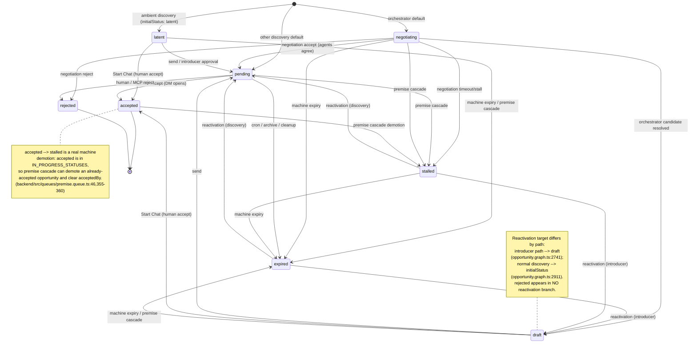
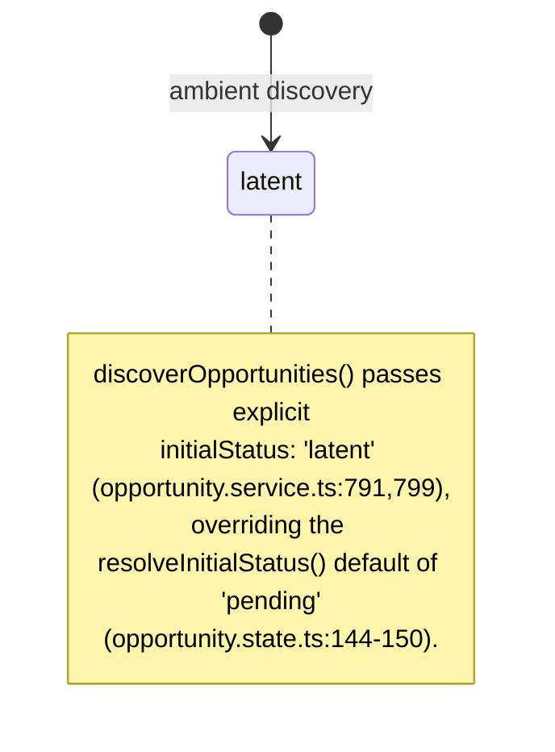
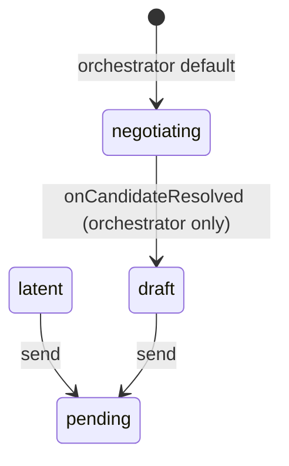
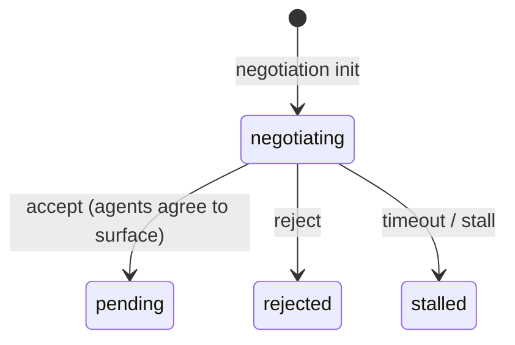
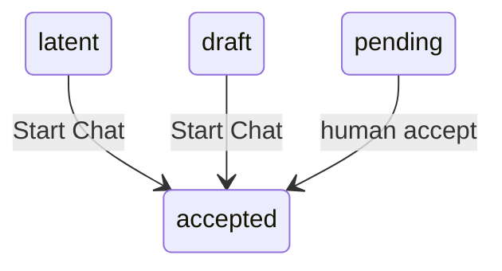
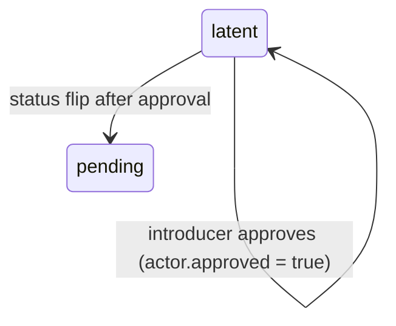
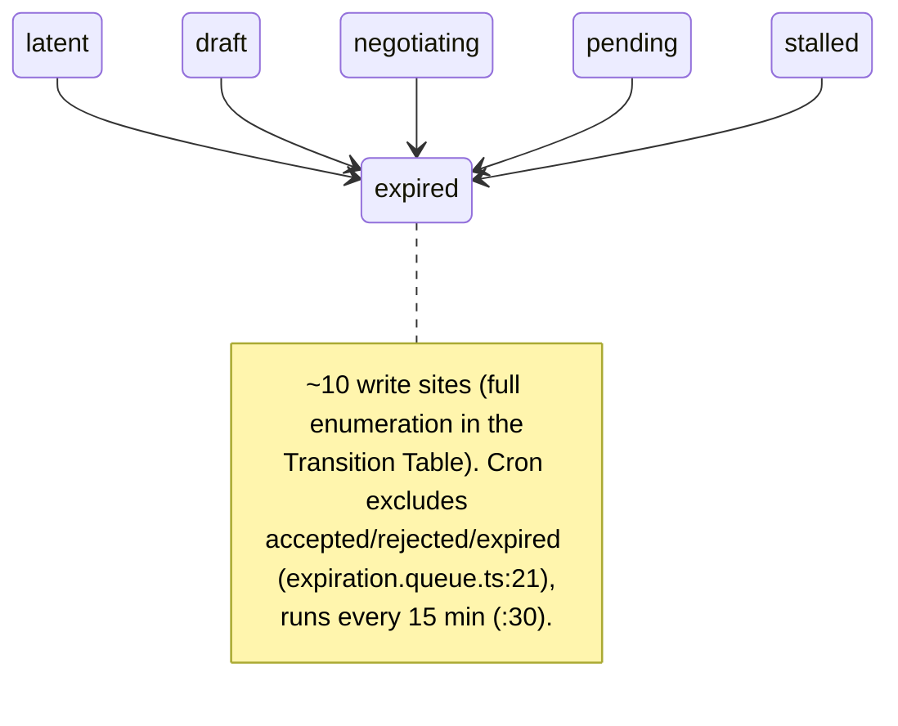
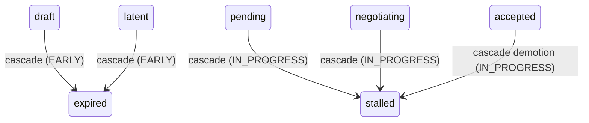

# Opportunity Status Lifecycle Reference — Implementation Plan

## Overview

Produce a single authoritative, code-traceable design reference at `docs/design/opportunity-status-lifecycle.md` documenting the *existing* opportunity status lifecycle: the 8-value status enum, the parallel per-actor JSONB state machine (`approved`, `actedAt`), the 7 distinct flows, and every status write site with `file:line` citations. The doc is rendered with Mermaid `stateDiagram-v2` (1 master + 7 focused flow diagrams) plus an exhaustive transition/write-site table, read-side projection table, and drift-risk section. This is documentation only — no code or behavior changes.

## Requirements

- Full reference: all 8 statuses (`latent | draft | negotiating | pending | stalled | accepted | rejected | expired`), including internal ones, and all 7 flows incl. machine-driven cron expiry and premise cascade.
- Lives in `docs/design/` alongside `protocol-deep-dive.md`, with matching frontmatter style.
- Mermaid `stateDiagram-v2`: one master overview + one focused diagram per flow (A–G). Reactivation annotated on the master diagram.
- Written transition table: from→to with trigger class + exact `file:line` for every write site (all ~10 `→ expired` sources plus every site for every other status).
- Isolate the **accept ambiguity**: negotiation `accept → pending` (agents surface) vs human `accept → accepted` (DM opens) vs the negotiation trace string `"accepted"`.
- Document the parallel actor JSONB axis (`approved`, `actedAt`) as separate from the enum.
- Annotate the counterintuitive edges: `accepted → stalled` premise demotion (⚠️) and the two reactivation targets (introducer → `draft`, discovery → `initialStatus`).
- Document read-side projections (the canonical 8 narrowed per surface) and the confirmed drift/inconsistency risks.
- Cross-link the reference from `protocol-deep-dive.md` and `CLAUDE.md`.

## Current State Analysis

The lifecycle exists fully in code but has no consolidated visual + written reference. Logic is split across five layers (backend service, protocol opportunity graph, protocol negotiation graph, BullMQ queues, read filters), each writing or interpreting status — the "split-brain" topology that makes this reference worth maintaining.

### Key Discoveries

- Status enum (8 values): `backend/src/schemas/database.schema.ts:11`; protocol mirror `packages/protocol/src/shared/interfaces/database.interface.ts:482`. Verified at commit `bc94ae699a`.
- Actor JSONB shape (`approved` introducer-only, `actedAt` commit stamp): `backend/src/schemas/database.schema.ts:402-418`; `opportunities` table (`actors`, `status` default `pending`, `acceptedBy`): `:442-447`.
- `resolveInitialStatus()` (`packages/protocol/src/opportunity/opportunity.state.ts:144-150`): explicit wins; else `orchestrator → negotiating`, else `pending`. Verified.
- Premise cascade `accepted → stalled` real edge (`accepted ∈ IN_PROGRESS_STATUSES`): `backend/src/queues/premise.queue.ts:45,355-360`. Verified `EARLY_STATUSES → expired`, else `stalled`.
- Negotiation finalize mapping (`accept→pending / reject→rejected / else→stalled`): `packages/protocol/src/negotiation/negotiation.graph.ts:365-369`; trace string `"accepted"` `:375-383`. Verified.
- Adapter write-site classification table (which method touches status / actors / acceptedBy): research §"Adapter write classification", `backend/src/adapters/database.adapter.ts`.
- No existing Mermaid in `docs/` — this doc introduces it; sibling format is `docs/design/protocol-deep-dive.md` (frontmatter `title/type/tags/created/updated`, fenced blocks).
- Cross-link anchors: `docs/design/protocol-deep-dive.md:167` (`### 3.4 Opportunity Graph`, Purpose line at `:170`); `CLAUDE.md:192` (`docs/design/` bullet under `### Documentation Directories`).

Constraints: the doc is a faithful description of existing behavior, not a redesign. Citations must resolve at commit `bc94ae699a` (current `dev` HEAD).

## Desired End State

A reader (teammate or AI agent) opening `docs/design/opportunity-status-lifecycle.md` can:

1. See the whole lifecycle at a glance in the master diagram, with the odd edges flagged.
2. Drill into any of the 7 flows via a focused diagram + prose + citations.
3. Look up the exact `file:line` for any status write in the transition table.
4. Understand the actor JSONB axis as distinct from the enum.
5. Detect drift (frontend/CLI unions narrower than the enum; `accepted → stalled`; terminology collision on "accepted").

The doc is discoverable via pointers in `protocol-deep-dive.md` and `CLAUDE.md`.

## What We're NOT Doing

- No code or behavior changes. The frontend status-union mismatch (`frontend/src/services/opportunities.ts:24,87`) and the `accepted → stalled` premise demotion are documented as drift/as-is, **not** resolved.
- Not adding new diagrams beyond 1 master + 7 flow (no separate reactivation diagram — reactivation is annotated on master + covered in prose/table).
- Not touching `docs/domain/`, `docs/specs/`, or CLI/API docs — this is a `docs/design/` reference only.
- Not editing the research/FRD artifacts.

## Decisions

### Diagram granularity
**Decision**: 1 master overview diagram + 7 focused flow diagrams (A Ambient, B Chat/orchestrator draft+send, C Negotiation, D Human accept, E Introducer approval, F Expiry/archive, G Premise cascade). Reactivation is annotated on the master diagram and covered in a prose subsection + the transition table — no dedicated reactivation diagram. Grounded in research §Flows A–G and the FRD's "one master + one per flow" decision.

### Cross-linking
**Decision**: Add a discovery pointer in `docs/design/protocol-deep-dive.md` §3.4 Opportunity Graph (after the Purpose line, `:170`) and a one-line mention on the `docs/design/` bullet in `CLAUDE.md` §Documentation Directories (`:192`). Both are small, additive edits.

### Frontmatter / style
**Decision**: Match the sibling `docs/design/protocol-deep-dive.md` convention — `title/type/tags/created/updated` frontmatter, prose + fenced Mermaid blocks. Keeps `docs/design/` internally consistent.

### Scope of transition table
**Decision** (inherited from research Developer Context): document **every** write site — all ~10 `→ expired` sources plus every site for every other status — with `file:line`. Diagrams stay at the 7-flow level; exhaustive machine/cleanup sites live in the table + a "machine/cleanup expiry" subsection.

### Annotation of odd edges
**Decision** (inherited): show all edges in the master diagram and annotate the counterintuitive ones — `accepted → stalled` as a ⚠️ machine demotion, and reactivation target differing by path (introducer → `draft`, discovery → `initialStatus`).

## Phase 1: Foundation — skeleton + canonical model + master diagram

### Overview
Creates the new doc with frontmatter, Overview, the "Two parallel state machines" canonical-model section (status enum + actor JSONB axis), and the master `stateDiagram-v2` covering all 8 statuses and all edges with the odd edges annotated. Foundation phase — no dependencies; all later phases append to this file.

### Changes Required:

#### 1. docs/design/opportunity-status-lifecycle.md

**File**: `docs/design/opportunity-status-lifecycle.md`
**Changes**: NEW — frontmatter + Overview + canonical data-model section + master diagram

`````markdown
---
title: "Opportunity Status Lifecycle"
type: design
tags: [opportunity, status, lifecycle, negotiation, premise-cascade, expiry, reactivation, mermaid]
created: 2026-06-13
updated: 2026-06-13
---

# Opportunity Status Lifecycle

This is an authoritative, code-traceable reference for the *existing* opportunity status lifecycle in Index Network. It documents the 8-value status enum, the parallel per-actor JSONB state machine, the 7 distinct flows, and every status write site with `file:line` citations. It describes behavior as it exists in code — it is a reference, not a redesign.

> Citations resolve at commit `bc94ae699a` (`dev`). Lifecycle logic is **split across five layers** — backend service, protocol opportunity graph, protocol negotiation graph, BullMQ queues, and read filters — each of which writes or interprets status. That split-brain topology is the dominant drift risk and the reason this reference is worth maintaining.

## 1. Two parallel state machines

The lifecycle is **not the enum alone**. Two independent state machines run in parallel.

### 1.1 The status enum (global lifecycle)

`opportunityStatusEnum` (`backend/src/schemas/database.schema.ts:11`) defines the only DB-level allowed values:

```
latent | draft | negotiating | pending | stalled | accepted | rejected | expired
```

The protocol-side type mirror is `OpportunityStatus` (`packages/protocol/src/shared/interfaces/database.interface.ts:482`). The `opportunities` table stores it in the `status` column, which **defaults to `pending`** (`backend/src/schemas/database.schema.ts:446`).

### 1.2 The actor JSONB axis (per-participant lifecycle)

`opportunities.actors` is a JSONB array of `OpportunityActor` (`backend/src/schemas/database.schema.ts:402-418`). Two of its fields are **per-participant lifecycle markers — not statuses**:

| Field | Meaning | Notes |
|---|---|---|
| `approved?: boolean` | Introducer-only approval gate | `false` until explicit approval, `true` after (`:409-410`) |
| `actedAt?: string` | ISO stamp set the first time an actor advances state | Used to block that same actor from a later `accept` — the self-accept guard (`:411-418`) |

A third column, `acceptedBy` (nullable user ref, `:447`), is set **only** on a human accept (`backend/src/adapters/database.adapter.ts:5181-5182`) and cleared to null on non-`accepted` writes that pass through `updateOpportunityStatus()` / `stampOpportunityActorAction()` (`:5183-5184`); the bulk-expiry helpers leave it untouched (see the §4.2 caveat).

**Why this matters:** approval and "having acted" are actor-local. They gate visibility/actionability and enforce the self-accept guard **independently of `opportunities.status`** — some transitions stage through actor-local JSONB before/alongside the status change (introducer approval, send, accept). Treat this axis as a separate state machine from the enum.

## 2. Master diagram

All 8 statuses and every transition. Odd edges are annotated — see the notes below the diagram.



**Reading the diagram:**

- **Three creation entry points** map to `resolveInitialStatus()` (`packages/protocol/src/opportunity/opportunity.state.ts:144-150`): explicit `initialStatus` wins (ambient discovery forces `latent`), else `orchestrator → negotiating`, else `pending`.
- **The accept ambiguity** (detailed in Flow C and Flow D): negotiation `accept` writes status `pending` — *not* `accepted`. Only a human opening a DM writes `accepted`.
- **`rejected` is terminal in practice** — MCP-blocked as a source and absent from every reactivation branch. (Caveat: the REST `PATCH /opportunities/:id/status` endpoint applies no source-status guard — `backend/src/controllers/opportunity.controller.ts:222-231`, `backend/src/services/opportunity.service.ts:459-508` — so it is an unguarded escape hatch; see §7.)
- **`expired` / `stalled` look terminal but are reactivatable** by discovery dedup. The reactivation target depends on the path (see the `draft` note): introducer → `draft`, discovery → `initialStatus`.
- **Machine paths are the hidden surface:** cron, premise cascade, intent archival, member removal, and enrichment replacement all write `expired`/`stalled` without going through the service/graph "flow" entry points. The full set of write sites is enumerated in the Transition Table.
`````

### Success Criteria:

#### Automated Verification:
- [x] File exists: `test -f docs/design/opportunity-status-lifecycle.md`
- [x] Master diagram is a `stateDiagram-v2`: `grep -q 'stateDiagram-v2' docs/design/opportunity-status-lifecycle.md`
- [x] All 8 statuses appear: `for s in latent draft negotiating pending stalled accepted rejected expired; do grep -q "$s" docs/design/opportunity-status-lifecycle.md || echo "MISSING $s"; done` prints nothing
- [x] Corrected premise.queue citation present (not the off-by-one `:45`): `grep -q 'premise.queue.ts:46' docs/design/opportunity-status-lifecycle.md`

#### Manual Verification:
- [ ] Master diagram renders in a Mermaid viewer with no syntax errors; every transition references a declared state
- [ ] Frontmatter matches `protocol-deep-dive.md` style (`title/type/tags/created/updated`)
- [ ] §1.2 clearly frames the actor JSONB axis (`approved`/`actedAt`/`acceptedBy`) as separate from the enum

## Phase 2: Flow diagrams A–D

### Overview
Appends the first four focused flow diagrams + prose + citations: A Ambient/background discovery, B Chat/orchestrator draft+send, C Negotiation (the accept ambiguity), D Human accept (compound DM transition). Depends on Phase 1.

### Changes Required:

#### 1. docs/design/opportunity-status-lifecycle.md

**File**: `docs/design/opportunity-status-lifecycle.md`
**Changes**: MODIFY — append "## Flows" parent section + Flow A–D subsections

`````markdown
## 3. Flows

Each flow is a focused view of the master diagram with the precise triggers and write sites. Flows A–D are below; E–G and Reactivation follow.

### 3.A Ambient / background discovery — creates `latent`



Background discovery forces `latent`. `OpportunityService.discoverOpportunities()` sets explicit `initialStatus: 'latent'` (`backend/src/services/opportunity.service.ts:789-799`, at `:791` and `:799`), so `resolveInitialStatus()` yields `latent` instead of the ambient default `pending`. The persist node resolves status (`packages/protocol/src/opportunity/opportunity.graph.ts:2565`) and inserts via the adapter (`backend/src/adapters/database.adapter.ts:5001-5010`).

### 3.B Chat / orchestrator draft + send



The orchestrator default is `negotiating` (`opportunity.state.ts:149`). The hook `onCandidateResolved` flips accepted candidates `negotiating → draft` (`opportunity.graph.ts:2092-2120`, write at `:2120`), only for `trigger === 'orchestrator'`; the frontend keys cards off `status === 'draft'`, so the flip happens before the draft-ready card is emitted. **Send is a separate mutation** — MCP `update_opportunity({status:'pending'})` routes to `sendNode` (`opportunity.graph.ts:3360-3402`), which allows **only** `latent | draft` (`:3376`) and stamps `pending` via `stampOpportunityActorAction()` (`:3399-3402`). Allowed sender roles: `introducer`, `peer`, and `patient`/`party` only when there is no introducer (`:3387-3391`).

### 3.C Negotiation — the accept ambiguity



Init writes `negotiating` (`negotiation.graph.ts:102-105`). Finalize maps the last turn (`negotiation.graph.ts:364-369`): `accept → pending`, `reject → rejected`, anything else → `stalled`. The agent polling path repeats the identical mapping (`backend/src/services/negotiation-polling.service.ts:400-402`), as do two background timeout workers that finalize a timed-out negotiation (`backend/src/queues/negotiations/timeout.queue.ts:254` and `claim-timeout.queue.ts:294`).

> **The word "accepted" has three distinct meanings — do not conflate them:**
>
> 1. The negotiation **`accept` action** writes status **`pending`** (`negotiation.graph.ts:364-369`) — *not* `accepted`.
> 2. The negotiation **trace outcome string** is the literal `"accepted"` (`negotiation.graph.ts:374-383`; polling `negotiation-polling.service.ts:394-396`).
> 3. The **status `accepted`** is written only by a human opening a DM (Flow D).
>
> Negotiation accept means "agents agree this is worth surfacing"; a human still has to accept it.

### 3.D Human accept (`→ accepted`) — creates/resolves a DM



Every `accepted` write is a **compound transition** (order matters): self-accept guard → resolve/create DM → write `accepted` + set `acceptedBy` → sibling-accept + contact upserts. Three code paths all write status `accepted` after resolving a DM first:

- **REST** `updateOpportunityStatus()` (`backend/src/services/opportunity.service.ts:459-508`): self-accept guard (`:477-480`), DM resolve before flip (`:489`), accepted write (`:501-504`), sibling accept + contact upserts (`:517-540`).
- **`startChat()`** (`opportunity.service.ts:632-732`): already-accepted idempotent branch (`:644-674`), allowed source `pending | draft | latent` (`:676-682`), self-accept guard (`:691-693`), DM resolve (`:705-714`), accepted write (`:728-732`).
- **Graph `updateNode()`** (`opportunity.graph.ts:3239-3312`): allows only `accepted | rejected | expired` (`:3251-3252`), self-accept guard (`:3269-3277`), DM resolve (`:3280-3285`), accepted write (`:3287-3293`); `rejected`/`expired` use plain `updateOpportunityStatus()` (`:3294-3300`).

The **self-accept guard** (an actor cannot accept an opportunity it has already acted on — enforced via `actor.actedAt`) is duplicated across all three sites; the adapter `stampOpportunityActorAction()` itself trusts the caller, so any new accept path that calls the adapter directly bypasses the guard.
`````

### Success Criteria:

#### Automated Verification:
- [x] §3 Flows section present with A–D subheadings: `for h in '3.A' '3.B' '3.C' '3.D'; do grep -q "### $h" docs/design/opportunity-status-lifecycle.md || echo "MISSING $h"; done` prints nothing
- [x] Four new `stateDiagram-v2` blocks added (≥5 total incl. master): `grep -c 'stateDiagram-v2' docs/design/opportunity-status-lifecycle.md` returns >= 5
- [x] Corrected polling-mapping citation present (not `:401-403`): `grep -q 'negotiation-polling.service.ts:400-402' docs/design/opportunity-status-lifecycle.md`

#### Manual Verification:
- [ ] The three-meanings callout clearly separates negotiation `accept`→`pending`, trace string `"accepted"`, and human `accepted`
- [ ] Flow D prose presents `accepted` as a compound (DM-first) transition with all three paths cited
- [ ] All four flow diagrams render without Mermaid syntax errors

## Phase 3: Flow diagrams E–G + reactivation

### Overview
Appends flows E Introducer approval, F Expiry/archive, G Premise cascade (each a focused diagram + prose + citations), plus the Reactivation subsection covering the two targets. Depends on Phase 2.

### Changes Required:

#### 1. docs/design/opportunity-status-lifecycle.md

**File**: `docs/design/opportunity-status-lifecycle.md`
**Changes**: MODIFY — append Flow E–G subsections + Reactivation subsection

`````markdown
### 3.E Introducer approval — actor state, then status



`approveIntroduction()` (`backend/src/services/opportunity.service.ts:563-604`) requires the caller be the `introducer` actor, flips `approved` via `updateOpportunityActorApproval(..., true)` (`:587`) — **status stays `latent`** during this write (the adapter touches only `actors` + `updatedAt`, `backend/src/adapters/database.adapter.ts:5211-5213`) — then calls `updateOpportunityStatus(id, 'pending', userId)` (`:594`). Visibility/actionability live in `packages/protocol/src/opportunity/opportunity.utils.ts`: `canUserSeeOpportunity()` (`:123-143`) is a role+status ACL that does **not** read `approved`; `isActionableForViewer()` (`:164-192`) reads `introducer.approved` (`:174`) — the introducer is actionable only while `latent && !approved`, non-introducers on `latent` when there is no introducer or it is approved, and on `pending`. **`negotiating` (and the other internal/terminal statuses) is never actionable** here — Rule 5 of `isActionableForViewer` (`:188-191`; the doc-comment at `:156` lists `negotiating` among the non-actionable) — and it is excluded from the home feed default (`feed.graph.ts:57`). This was a historical drift point (precedent `3acc3d7db3`, "allow actions on negotiating status").

### 3.F Expiry / archive (→ `expired`)



`→ expired` is written from ~10 sites: graph `deleteNode()` (`opportunity.graph.ts:3320-3347`, write `:3341`); service terminal flip (`opportunity.service.ts:507-508`); cron `expireStale()` (`backend/src/queues/opportunity/expiration.queue.ts:12`, excludes `accepted/rejected/expired` `:21`, every 15 min `:30`); adapter `expireStaleOpportunities()` (`database.adapter.ts:5440-5450`); atomic enrichment replacement `createOpportunityAndExpireIds()` (`database.adapter.ts:5298-5303`); premise cascade early-stage (`premise.queue.ts:357-358`); intent archival `expireOpportunitiesByIntent()` (`database.adapter.ts:5406-5423`) plus the legacy `expireOpportunitiesByIntentActor()` (`database.adapter.ts:354-361`, write `:355-356`); network member removal (`database.adapter.ts:5426-5438`); and the manual CLI script (`backend/src/cli/expire-opportunities.ts:18-36`, write `:22`). Cron-expirable source statuses: `latent, draft, negotiating, pending, stalled`. The exhaustive per-site table is in the Transition Table section below.

### 3.G Premise cascade — machine demotion (incl. `accepted → stalled`)



`IN_PROGRESS_STATUSES = ['pending','negotiating','accepted']` (`backend/src/queues/premise.queue.ts:46`); `EARLY_STATUSES = ['draft','latent']` (`:49`); the union is typed (misleadingly) `NonTerminalStatus` (`:53`). `handlePremiseCascade()` (`:338-360`) fetches those five statuses (`defaultGetUserOpportunities()` `:295-308`) and maps `EARLY → expired` (`:357-358`), everything else → `stalled` (`:359`), writing via the adapter (`:318` → `database.adapter.ts:5172-5188`, which clears `acceptedBy`). Because `accepted ∈ IN_PROGRESS_STATUSES`, an already-accepted opportunity is demoted to `stalled` — a real, counterintuitive edge (⚠️ on the master diagram).

### Reactivation — two different targets

_Shown as annotations on the master diagram (no dedicated diagram); documented here in prose and in the Transition Table._

`expired`/`stalled` opportunities are **reactivatable** by discovery dedup, to two different targets. Dedup skips only `draft` (`DEDUP_SKIP_STATUSES`, `opportunity.graph.ts:2588-2591`). On the **introducer path**, `expired|stalled → draft` (`:2735-2741`, write `:2741`; `expired` requires the same introducer, `stalled` reactivates regardless of age), plus a stale `latent → draft` upgrade (`:2785`). On the **normal discovery path**, `expired|stalled → initialStatus` (`:2907-2911`, write `:2911`), plus a `latent → initialStatus` upgrade when `initialStatus !== 'latent'` (`:2956-2958`). `rejected` appears in **no** reactivation branch — it is terminal at the dedup layer too.
`````

### Success Criteria:

#### Automated Verification:
- [x] §3.E–G subheadings present: `for h in '3.E' '3.F' '3.G' 'Reactivation'; do grep -q "$h" docs/design/opportunity-status-lifecycle.md || echo "MISSING $h"; done` prints nothing
- [x] Exactly 8 `stateDiagram-v2` blocks total (master + 7 flows; no reactivation diagram): `grep -c 'stateDiagram-v2' docs/design/opportunity-status-lifecycle.md` returns 8
- [x] Legacy expire site cited: `grep -q 'database.adapter.ts:354-361' docs/design/opportunity-status-lifecycle.md`

#### Manual Verification:
- [ ] §3.E makes clear that approval is an actor-level write that leaves `status` at `latent` until the explicit `pending` flip
- [ ] §3.F lists all ~10 `→ expired` write sites; Reactivation is prose-only (no 9th diagram)
- [ ] §3.G flags `accepted → stalled` as a real demotion that clears `acceptedBy`
- [ ] §3.E documents that `negotiating` is non-actionable (Rule 5, `:188-191`) — the historical actionability exception

## Phase 4: Transition/write-site table + projections + drift risks

### Overview
Appends the exhaustive transition table (every write site, from→to + trigger class + `file:line`), the machine/cleanup expiry subsection, the read-side projection table (canonical 8 narrowed per surface), and the Inconsistencies & Drift Risks section. Depends on Phase 3.

### Changes Required:

#### 1. docs/design/opportunity-status-lifecycle.md

**File**: `docs/design/opportunity-status-lifecycle.md`
**Changes**: MODIFY — append Transition Table, Adapter write classification, Read-side Projections, Drift Risks sections

````markdown
## 4. Transition / write-site table

Every status write. Trigger flow letters map to §3. "Actor JSONB" rows are the parallel axis (§1.2), not status writes.

### 4.1 Status transitions

| From | To | Trigger / flow | Write site (`file:line`) |
|---|---|---|---|
| _(new)_ | `latent` | Ambient discovery (A) | `opportunity.service.ts:791,799` → persist `opportunity.graph.ts:2565` → `database.adapter.ts:5001-5010` |
| _(new)_ | `negotiating` | Orchestrator default (B) | `opportunity.state.ts:149` → persist insert `database.adapter.ts:5001-5010` |
| _(pre-negotiation)_ | `negotiating` | Negotiation init (C) | `negotiation.graph.ts:102-105` (write `:103`, via `updateOpportunityStatus`) |
| _(new)_ | `pending` | Discovery default; DB column default | `opportunity.state.ts:149`; `database.schema.ts:446` / adapter fallback `:5010` |
| `negotiating` | `draft` | Orchestrator candidate resolved (B) | `opportunity.graph.ts:2120` |
| `negotiating` | `pending` | Negotiation **accept** — agents agree (C) | `negotiation.graph.ts:364-369`; polling `negotiation-polling.service.ts:400-402` |
| `negotiating` | `rejected` | Negotiation reject (C) | `negotiation.graph.ts:364-369`; polling `:400-402` |
| `negotiating` | `stalled` | Negotiation timeout/stall (C) | `negotiation.graph.ts:364-369`; polling `:400-402` |
| `negotiating` | `pending` / `rejected` / `stalled` | Negotiation **timeout** finalize (C) | `backend/src/queues/negotiations/timeout.queue.ts:254`; `backend/src/queues/negotiations/claim-timeout.queue.ts:294` |
| `latent` / `draft` | `pending` | Send (B) | `opportunity.graph.ts:3399-3402` |
| `latent` | `pending` | Introducer approval (E) | `opportunity.service.ts:594` |
| `latent` / `draft` / `pending` | `accepted` | Human **accept** / Start Chat (D) | REST `opportunity.service.ts:501-504`; `startChat :728-732`; `updateNode opportunity.graph.ts:3287-3293` |
| `pending` | `rejected` | Human / MCP reject (D) | `updateNode opportunity.graph.ts:3294-3300`; service terminal `opportunity.service.ts:507-508` |
| `draft` / `latent` | `expired` | Premise cascade — EARLY (G) | `premise.queue.ts:357-358` → `database.adapter.ts:5172-5188` |
| `pending` / `negotiating` | `stalled` | Premise cascade — IN_PROGRESS (G) | `premise.queue.ts:359` |
| `accepted` | `stalled` ⚠️ | Premise cascade — IN_PROGRESS (G); **clears `acceptedBy`** (writes via `updateOpportunityStatus`) | `premise.queue.ts:359` → `database.adapter.ts:5172-5188` |
| any non-terminal | `expired` | Graph delete (F) | `opportunity.graph.ts:3341` |
| any | `expired` | Service terminal flip (F) | `opportunity.service.ts:507-508` |
| `latent`/`draft`/`negotiating`/`pending`/`stalled` | `expired` | Cron `expireStale` — excl. accepted/rejected/expired (F) | `expiration.queue.ts:12,21,30` → `database.adapter.ts:5440-5450` |
| _(replaced ids)_ | `expired` | Enrichment replacement (F) | `database.adapter.ts:5298-5303` (`opportunity.persist.ts:68-72,78-80`) |
| _(intent archived)_ | `expired` | Intent archival (F) | `database.adapter.ts:5406-5423`; legacy `:354-361` (write `:355-356`) |
| _(member removed)_ | `expired` | Network member removal (F) | `database.adapter.ts:5426-5438` |
| _(manual)_ | `expired` | CLI script (F) | `expire-opportunities.ts:22` |
| `expired` / `stalled` | `draft` | Reactivation — introducer (same introducer for `expired`) | `opportunity.graph.ts:2741` |
| `negotiating` | `draft` | Reactivation — stale/orphaned introducer | `opportunity.graph.ts:2773` |
| `latent` | `draft` | Reactivation — introducer upgrade | `opportunity.graph.ts:2785` |
| `expired` / `stalled` | `initialStatus` | Reactivation — discovery | `opportunity.graph.ts:2911` |
| `negotiating` | `initialStatus` | Reactivation — stale/orphaned discovery | `opportunity.graph.ts:2946` |
| `latent` | `initialStatus` | Reactivation — discovery upgrade (`initialStatus !== 'latent'`) | `opportunity.graph.ts:2956-2958` |

### 4.2 Actor JSONB axis (parallel; not status)

| Field | Transition | Trigger | Write site (`file:line`) |
|---|---|---|---|
| `approved` | `false → true` | Introducer approval | `updateOpportunityActorApproval` `database.adapter.ts:5194-5213` |
| `actedAt` | unset → ISO | First actor action (send/accept) | `stampOpportunityActorAction` `database.adapter.ts:5224-5258` |
| `acceptedBy` | `null → userId` | Human accept | `database.adapter.ts:5181-5182` |
| `acceptedBy` | `→ null` | Non-`accepted` write **via `updateOpportunityStatus()` / `stampOpportunityActorAction()`** | `database.adapter.ts:5183-5184` |

> **`acceptedBy` caveat:** the **bulk expiry helpers** (`expireStaleOpportunities`, `expireOpportunitiesByIntent`, `expireOpportunitiesForRemovedMember`, `createOpportunityAndExpireIds`, and legacy `expireOpportunitiesByIntentActor`) set only `status` + `updatedAt` — they do **not** clear `acceptedBy`. So an `accepted` opportunity later expired via member removal or intent archival keeps a dangling `acceptedBy`. Only `updateOpportunityStatus()` / `stampOpportunityActorAction()` clear it (`:5183-5184`).

## 5. Adapter write classification

Which adapter method touches `status`, the `actors` JSONB, and `acceptedBy`.

| Adapter method | `file:line` | status | actors | acceptedBy |
|---|---|---|---|---|
| `createOpportunity()` | `database.adapter.ts:5001-5010` | sets (`?? 'pending'`) | sets | no |
| `updateOpportunityStatus()` | `:5172-5188` | sets | no | set on `accepted`, else null |
| `updateOpportunityActorApproval()` | `:5194-5213` | **no** (status unchanged) | sets `approved` | no |
| `stampOpportunityActorAction()` | `:5224-5258` | sets | sets `actedAt` if absent | set on `accepted`, else null |
| `createOpportunityAndExpireIds()` | `:5265-5305` | inserts + `expired` on ids | sets on insert | untouched |
| `expireStaleOpportunities()` | `:5440-5450` | `expired` | no | untouched |
| `expireOpportunitiesByIntent()` | `:5406-5423` | `expired` | no | untouched |
| `expireOpportunitiesByIntentActor()` (legacy) | `:354-361` | `expired` | no | untouched |
| `expireOpportunitiesForRemovedMember()` | `:5426-5438` | `expired` | no | untouched |

## 6. Read-side projections — the canonical 8 narrowed per surface

| Surface | Coverage | Shown / hidden | `file:line` |
|---|---|---|---|
| Protocol `OpportunityStatus` | 8/8 | canonical | `packages/protocol/src/shared/interfaces/database.interface.ts:482` |
| MCP `update_opportunity` target | 4/8 | target `pending/accepted/rejected/expired`; blocks source `accepted/rejected/expired/negotiating` | `opportunity.tools.ts:2047-2048`, `186-191`, guard `:2075` |
| MCP `list_opportunities` | 3/8 | `draft/pending/latent` (`latent` introducer-only) | `opportunity.tools.ts:1472,1518` |
| Backend user default list | 5/8 | `latent/negotiating/pending/stalled/accepted`; hides `draft/rejected/expired` | `opportunity.service.ts:31` |
| Backend network default list | 4/8 | `negotiating/pending/stalled/accepted`; hides `latent/draft/rejected/expired` | `opportunity.service.ts:41` |
| Home feed | 2/8 + filters | `latent/pending` then ACL/actionability | `feed.graph.ts:57,194` |
| Frontend `OpportunityListItem.status` | 6/8 | omits `negotiating/stalled` | `frontend/src/services/opportunities.ts:24` |
| Frontend `OpportunityStatus` | 5/8 | omits `draft/negotiating/stalled` | `frontend/src/services/opportunities.ts:87` |
| CLI documented filters | 4/8 | documents/colors `pending/accepted/rejected/expired` only | `packages/cli/src/output/formatters.ts:405` |

## 7. Inconsistencies & drift risks

1. **Frontend unions disagree with the enum and each other.** `OpportunityListItem.status` (`frontend/src/services/opportunities.ts:24`, 6/8) omits `negotiating/stalled`; `OpportunityStatus` (`:87`, 5/8) also drops `draft`. A backend response carrying `negotiating`/`stalled` matches neither type.
2. **CLI documents/colors 4 of 8.** `statusColor()` (`packages/cli/src/output/formatters.ts:405`) colors only `pending/accepted/rejected/expired`; `latent/draft/negotiating/stalled` render uncolored and undocumented.
3. **"accepted" has three meanings.** Status `accepted` (human DM), the negotiation **trace string** `"accepted"` (`negotiation.graph.ts:374-383`), and the negotiation **`accept` action** that actually writes `pending` (`:364-369`).
4. **`accepted → stalled` premise demotion.** `accepted ∈ IN_PROGRESS_STATUSES` (`premise.queue.ts:46`) → demoted to `stalled` with `acceptedBy` cleared (`:359` → `database.adapter.ts:5183-5184`). Documented as a real edge; flagged as possibly-undesired.
5. **Misleading `NonTerminalStatus`.** The premise union (`premise.queue.ts:53`) includes `accepted`, which is treated as terminal nearly everywhere else (MCP source-block, cron exclusion, no reactivation).
6. **Reactivation target differs by path.** Introducer → `draft` (`opportunity.graph.ts:2741`) vs discovery → `initialStatus` (`:2911`); `expired` requires the same introducer on the introducer path but not on discovery — an asymmetric guard.
7. **MCP target/source asymmetry; REST has no source guard.** `update_opportunity` accepts `expired/rejected` as a *target* (`opportunity.tools.ts:2047-2048`) but blocks them as a *source* (`:186-191`, guard `:2075`) — a one-way valve. The REST `PATCH /opportunities/:id/status` endpoint, by contrast, applies **no** source-status guard (`opportunity.controller.ts:222-231`, `opportunity.service.ts:459-508` — only a self-accept check), so `rejected`/`expired` are **not** truly terminal at the REST layer.
8. **Self-accept guard duplicated across 3 sites; adapter trusts caller.** `updateNode` (`opportunity.graph.ts:3269-3277`) + service (`opportunity.service.ts:477-480,691-693`); `stampOpportunityActorAction()` does not enforce it, so a new accept path calling the adapter directly bypasses the guard.
9. **DB column default `pending` is mostly dead.** `database.schema.ts:446` / adapter fallback `:5010`; `resolveInitialStatus()` almost always supplies an explicit status, so the default only applies on a raw insert with no status — a latent footgun.
````

### Success Criteria:

#### Automated Verification:
- [x] §4–§7 headings present: `for h in '## 4. Transition' '## 5. Adapter' '## 6. Read-side' '## 7. Inconsistencies'; do grep -q "$h" docs/design/opportunity-status-lifecycle.md || echo "MISSING $h"; done` prints nothing
- [x] Negotiation-init write site recorded: `grep -q 'negotiation.graph.ts:102-105' docs/design/opportunity-status-lifecycle.md`
- [x] Corrected `acceptedBy` caveat present (bulk-expiry helpers do not clear): `grep -q 'do \*\*not\*\* clear `acceptedBy`' docs/design/opportunity-status-lifecycle.md || grep -q 'untouched' docs/design/opportunity-status-lifecycle.md`
- [x] Read-side projection table has 9 surface rows: `grep -c '/8' docs/design/opportunity-status-lifecycle.md` returns >= 8

#### Manual Verification:
- [ ] Transition table covers every write site enumerated in §3 (creation, forward, negotiation init, premise demotion, all ~10 expiry sites, reactivation)
- [ ] §5 acceptedBy column says "untouched" for the bulk-expiry helpers and "set on accepted, else null" only for `updateOpportunityStatus`/`stampOpportunityActorAction`
- [ ] §7 lists all 9 drift risks with citations

## Phase 5: Cross-links

### Overview
Adds discovery pointers to the new reference from the two sibling docs. Depends on Phase 1 (the target file must exist). Can run after Phase 1 independently of Phases 2–4.

### Changes Required:

#### 1. docs/design/protocol-deep-dive.md:170

**File**: `docs/design/protocol-deep-dive.md`
**Changes**: MODIFY — add a "See also" pointer under §3.4 Opportunity Graph

Insert the `**See also:**` line immediately after the existing `**Purpose:**` line (`:170`), before `**Nodes:**` (`:171`). Additive — no other lines change.

````markdown
**Purpose:** End-to-end opportunity discovery and lifecycle management: scoping, HyDE generation, vector search, evaluation, ranking, deduplication, negotiation, persistence, plus CRUD read/update/delete and `send` operations, and introducer-path validation/evaluation for contact-driven introductions.
**See also:** [`opportunity-status-lifecycle.md`](./opportunity-status-lifecycle.md) — the authoritative status state machine (8 statuses, 7 flows, exhaustive transition/write-site table).
````

#### 2. CLAUDE.md:192

**File**: `CLAUDE.md`
**Changes**: MODIFY — extend the `docs/design/` bullet with a pointer to the lifecycle reference

Append the trailing sentence to the existing `docs/design/` bullet (`:192`). Additive — the rest of the bullet and adjacent bullets are unchanged.

````markdown
- `docs/design/` — Architecture and deep-dive docs. Describes how the system is built: layering, data flow, agent graphs, key subsystems. Update when architecture changes. See `docs/design/opportunity-status-lifecycle.md` for the opportunity status lifecycle (state machine, flows, transition table).
````

### Success Criteria:

#### Automated Verification:
- [x] See-also pointer added to protocol-deep-dive: `grep -q 'opportunity-status-lifecycle.md' docs/design/protocol-deep-dive.md`
- [x] CLAUDE.md docs/design bullet points to the reference: `grep -q 'opportunity-status-lifecycle.md' CLAUDE.md`
- [x] No structural breakage — §3.4 still has Purpose+Nodes+State: `grep -q '\*\*Nodes:\*\*' docs/design/protocol-deep-dive.md`

#### Manual Verification:
- [ ] The relative link `./opportunity-status-lifecycle.md` resolves from `docs/design/protocol-deep-dive.md`
- [ ] Both pointers read naturally in context; no duplicated or orphaned bullets

## Ordering Constraints

- Phase 1 must come first (creates the file; defines master diagram + canonical model).
- Phases 2 → 3 → 4 are sequential appends to the same file (each builds on prior sections and shared terminology).
- Phase 5 depends only on Phase 1 (the file must exist to link to); it can run any time after Phase 1, in parallel with Phases 2–4.

## Verification Notes

- Every `file:line` citation in the doc must resolve at commit `bc94ae699a`. Spot-check the high-value ones: enum `database.schema.ts:11`, `resolveInitialStatus` `opportunity.state.ts:144-150`, premise cascade `premise.queue.ts:355-360`, negotiation finalize `negotiation.graph.ts:365-369`. (All four verified during planning.)
- Mermaid blocks must be valid `stateDiagram-v2`: every transition references a declared state; the master diagram covers all 8 enum values.
- The accept ambiguity must be explicit: negotiation `accept → pending`, human `accept → accepted`, trace string `"accepted"` — three distinct concepts, none conflated.
- The transition table must include all ~10 `→ expired` write sites enumerated in research §Flow F, not just the "archive" path.
- Read-side projection table must match research counts (default user list 5/8, network 4/8, MCP list 3/8, home feed 2/8, frontend unions 6/8 and 5/8, CLI 4/8).
- Cross-link edits must not break existing Markdown structure in the two target files.

## Performance Considerations

None — documentation only.

## Migration Notes

None — no schema or data changes. New file + two additive doc edits; trivially reversible by deleting the file and the two pointer lines.

## Pattern References

- `docs/design/protocol-deep-dive.md:1-7` — frontmatter convention (`title/type/tags/created/updated`) and overall design-doc prose/section style to mirror.
- `docs/design/protocol-deep-dive.md:167-176` — §3.4 Opportunity Graph: the section the cross-link pointer attaches to; also a style reference for citing files/nodes.
- Research artifact §"Adapter write classification", §"Flow A–G", §"Reactivation", §"Read-side projections", §"Inconsistencies & Drift Risks" — direct source content for the doc body.

## Developer Context

**Q (Diagram count): How many diagrams should the reference carry?**
A: Master + 7 flow diagrams (A–G); reactivation annotated on the master diagram. 8 diagrams total.

**Q (Cross-links): Should the new reference be cross-linked from existing docs, or stand alone?**
A: Link from `docs/design/protocol-deep-dive.md` (§3.4, `:170`) + `CLAUDE.md` (§Documentation Directories, `:192`).

**Q (Frontmatter): Which frontmatter/style should the doc use?**
A: Match `protocol-deep-dive.md` (`title/type/tags/created/updated`).

Inherited from research Developer Context (not re-asked): full reference completeness; `docs/design/` location; Mermaid `stateDiagram-v2`; master + per-flow layout; written transition table with citations; document every `→ expired` write site; annotate `accepted → stalled` and dual reactivation targets.

## Plan Review (Step 8)

_Independent post-finalization review by artifact-code-reviewer and artifact-coverage-reviewer subagents. Findings triaged at Step 9._

| source | plan-loc | codebase-loc | severity | dimension | finding | recommendation | resolution |
|---|---|---|---|---|---|---|---|
| coverage | Precedents & Lessons §1 (negotiating actionability) | `opportunity.utils.ts:188-191` | blocker | verification-coverage | Precedent lesson "call out the `negotiating` actionability exception" is uncovered; doc is silent on how `negotiating` is treated for actionability | Add doc note + Phase-3/4 criterion: `negotiating` is NOT actionable in `isActionableForViewer` (Rule 5, `:188-191`; comment `:156`) and is excluded from the home feed default | applied: added §3.E note (Rule 5 `:188-191`, comment `:156`, feed exclusion `:57`, precedent `3acc3d7db3`) + Phase 3 manual criterion |
| code | §1.2 / master reading note | `database.adapter.ts:5301`,`5416`,`5429`,`5445`,`356` | concern | codebase-fit | §1.2 says `acceptedBy` is "cleared to null on every other status write" — overbroad; bulk-expiry helpers set only `status`+`updatedAt` (already corrected in §4.2, but §1.2 still has the broad claim) | Narrow §1.2 to `updateOpportunityStatus()`/`stampOpportunityActorAction()` and point to the §4.2 caveat | applied: §1.2 narrowed to the two stamping methods + points to §4.2 caveat |
| code | §2 master reading note ("rejected terminal everywhere") | `opportunity.controller.ts:222-231`, `opportunity.service.ts:459-508` | concern | codebase-fit | REST `PATCH /opportunities/:id/status` allows all 8 statuses as targets and the service has no source-status guard (only self-accept) — so `rejected` is not terminal at the REST layer | Add a caveat: `rejected` is terminal via MCP + reactivation, but the REST PATCH endpoint is an unguarded escape hatch | applied: §2 reading note reworded to "terminal in practice" + caveat; §7 item 7 extended with the REST no-source-guard note |
| code | §4.1 transition table (negotiation rows) | `backend/src/queues/negotiations/timeout.queue.ts:254` | concern | codebase-fit | Exhaustive table omits the negotiation timeout worker write site (accept→pending/reject→rejected/else→stalled via `updateOpportunityStatus`) | Add a `→ pending/rejected/stalled | Negotiation timeout (C)` row citing `timeout.queue.ts:254` | applied: added a combined timeout-finalize row to §4.1 (`timeout.queue.ts:254` + `claim-timeout.queue.ts:294`) + §3.C prose mention |
| code | §4.1 transition table (negotiation rows) | `backend/src/queues/negotiations/claim-timeout.queue.ts:294` | concern | codebase-fit | Exhaustive table omits the claim-timeout worker write site (same mapping) | Add a row citing `claim-timeout.queue.ts:294` | applied: covered by the same combined §4.1 timeout-finalize row + §3.C mention |

## Plan History

- Phase 1: Foundation — skeleton + canonical model + master diagram — approved as generated (citations corrected vs research: premise.queue.ts :45→:46, acceptedBy :5181-5184)
- Phase 2: Flow diagrams A–D — approved as generated (citations corrected: send roles :3387-3391, send stamp :3399-3402, updateNode allowed :3251-3252 / write :3287-3293, polling mapping :400-402 / trace :394-396)
- Phase 3: Flow diagrams E–G + reactivation — approved as generated (removed a stray 9th reactivation diagram to honor the 8-diagram decision; added legacy expire site database.adapter.ts:354-361; cron citations corrected :12/:21/:30)
- Phase 4: Transition/write-site table + projections + drift risks — approved as generated (verifier caught 2 facts vs research: added negotiation-init write negotiation.graph.ts:102-105; corrected acceptedBy — bulk-expiry helpers leave it untouched, only updateOpportunityStatus/stampOpportunityActorAction clear it)
- Phase 5: Cross-links — approved as generated (additive pointers in protocol-deep-dive.md §3.4 + CLAUDE.md docs/design bullet; both anchors verified verbatim)
- Step 8 review: 1 blocker + 4 concerns; all 4 triage decisions applied at Step 9 (negotiating-actionability note §3.E; §1.2 acceptedBy narrowed; rejected/REST escape-hatch caveat §2/§7; two negotiation timeout write sites added §4.1/§3.C). Status → ready.

## References

- Research: `.rpiv/artifacts/research/2026-06-13_13-07-32_opportunity-status-lifecycle.md`
- FRD: `.rpiv/artifacts/discover/2026-06-13_12-59-43_opportunity-status-lifecycle.md`
- Sibling design doc: `docs/design/protocol-deep-dive.md`
- Adjacent audits: `.rpiv/artifacts/research/2026-06-13-daily-digest-card-quality-audit.md`, `.rpiv/artifacts/research/2026-06-13-memory-cron-opportunity-impact-audit.md`
