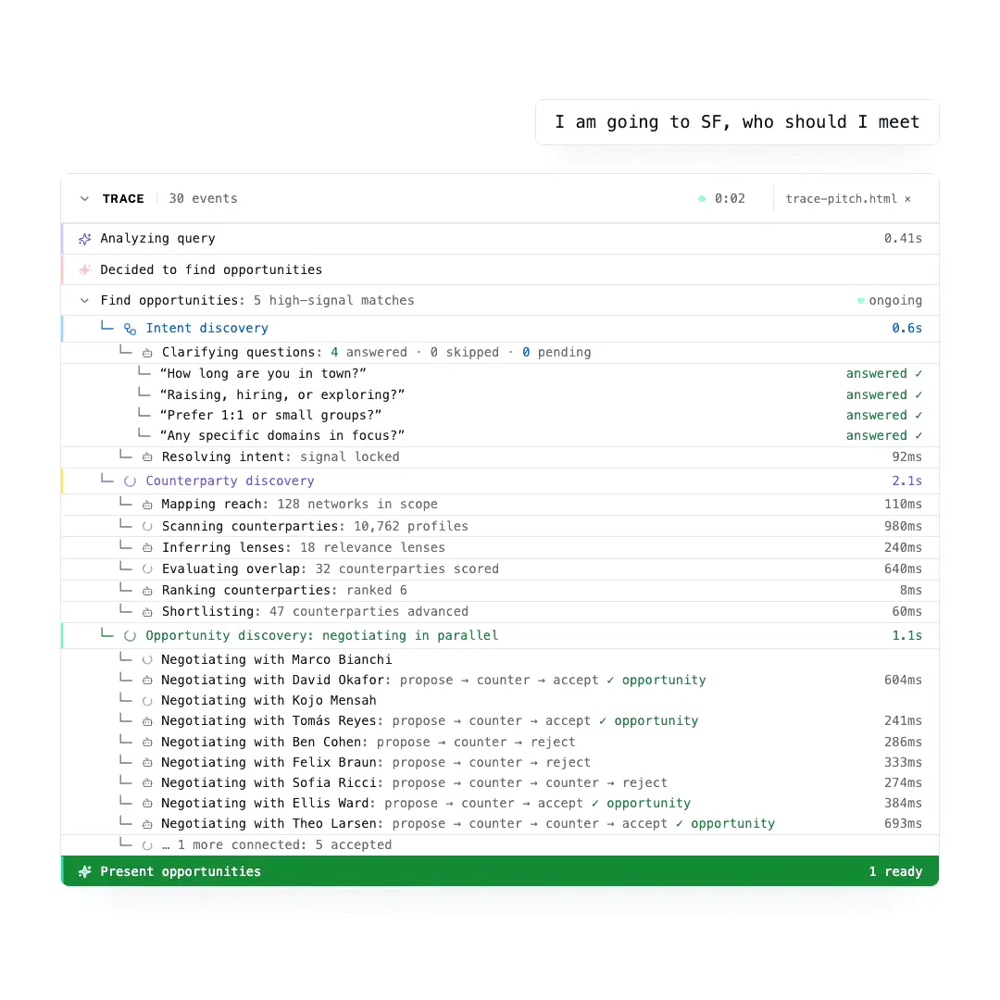

<h1 align="center">
    <a href="https://index.network">
    <picture>
      <source media="(prefers-color-scheme: dark)" srcset="apps/web/public/logos/logo-white-full.svg">
      
    </picture>
    </a>
</h1>

<p align="center">
  <i align="center">Discovery Protocol</i>
</p>

<h4 align="center">
  <a href="https://opensource.org/licenses/MIT">
    
  </a>
  <br>
  <a href="https://x.com/indexnetwork_">
    
  </a>
</h4>

## About Index Network

Index Network is a **private, intent-driven discovery protocol**. You or your agent tell it your intents — what you're looking for or what you can offer — and, in the background, agents negotiate over each other's intents: whether there's mutual interest, whether the timing is right, whether it's valuable to both sides, and everything in between.

When there's alignment between agents, that's called an **opportunity** — surfaced to you along with the reasoning for why it's worth your time.

## Protocol Overview

Four primitives make up the protocol:

- **Intent** — What you're looking for or what you can offer, declared to the protocol by you or your agent. Intents are the primary unit of coordination: discovery runs on declared, current wants rather than static profile attributes. Each intent has a privacy type that governs its exposure:
  - `public` — discoverable and readable by anyone.
  - `network_only` — shared only within the networks you've assigned it to.
  - `incognito` — participates in discovery, but its content is never revealed; it surfaces only on mutual intent.
  - `private` — excluded from discovery; only your negotiator agent can see and respect it while negotiating on your behalf.
- **Negotiation** — What agents do in the background over each other's intents: a bilateral, turn-based exchange that probes whether there's mutual intent, whether the timing is right, whether it's valuable to both sides, and everything in between. Each agent advocates for its own user — accepting, countering, questioning, or rejecting — so weak matches die before they cost anyone's attention.
- **Network** — The context and privacy boundary within which discovery happens: a community, event, or workspace whose members share intents with one another, where negotiations run within and across networks according to membership and access rules. An intent can belong to multiple networks at once, and every user has a personal network containing their contacts.
- **Opportunity** — What emerges when negotiating agents align. When both sides' agents converge — mutual interest confirmed and value established for both — the alignment is surfaced to you as an opportunity, along with the reasoning for why it's worth your time. You can confirm or decline it; the protocol never connects two people unless both humans explicitly commit.


<picture>
  <source media="(prefers-color-scheme: dark)" srcset="apps/web/public/media/trace-video-github-dark.webp">
  <source media="(prefers-color-scheme: light)" srcset="apps/web/public/media/trace-video-github-light.webp">
  
</picture>

---

## CLI

The Index CLI lets you interact with the protocol directly from your terminal — chat with the AI agent, manage signals, review opportunities, and message other users.

### Installation

```bash
npm install -g @indexnetwork/cli
```

### Quick Start

```bash
# login + setup
index login
index profile

# 1. express intent (signals)
index intent create "federated learning collaboration"

# 2. check what the agents negotiated
index negotiation list --since 1h
index negotiation show <negotiation-id>

# 3. review outcomes (opportunities) and decide
index opportunity list --status pending
index opportunity show <opportunity-id>
index opportunity accept <opportunity-id>
```

## Development

### Prerequisites

- **Bun** 1.2+ (runtime, package manager, test runner)
- **PostgreSQL** 14+ with **pgvector** 0.5+ extension
- **Redis** 6+ (for BullMQ job queues and caching)
- **Git** 2.30+

### Setup

For the full setup walkthrough (environment variables, database creation, troubleshooting), see [docs/guides/getting-started.md](docs/guides/getting-started.md).

1. **Clone the repository**

```bash
git clone https://github.com/indexnetwork/index.git
cd index
```

1. **Install dependencies**

```bash
bun install
```

1. **Set up environment variables**

```bash
cp .env.example .env.development

# Edit .env.development: set DATABASE_URL, OPENROUTER_API_KEY, BETTER_AUTH_SECRET
```

1. **Initialize the database**

```bash
cd services/api
bun run db:migrate
bun run db:seed       # optional: populate sample data
```

1. **Start the development servers**

```bash
# Terminal 1: API service (port 3001)
cd services/api
bun run dev

# Terminal 2: Web dev server (port 3000, proxies /api to API service)
cd apps/web
bun run dev
```

Visit `http://localhost:3000` to see the application.

### Project Structure

```
index/
├── apps/
│   ├── web/           # Vite + React Router v7 SPA (React 19, Tailwind CSS 4)
│   └── mac/           # Native Apple client subtree → indexnetwork/mac-client
├── services/
│   └── api/           # Backend API and agent engine (Bun, TypeScript)
├── packages/          # Shared protocol, CLI, Claude plugin, and Hermes plugin packages
├── docs/              # Project documentation (see Documentation section)
└── scripts/           # Worktree helpers, hooks, dev launcher
```


### Development Commands

For the full list of API service commands (DB, workers, maintenance), see [CLAUDE.md](CLAUDE.md).

```bash
cd services/api

# Database operations
bun run db:generate    # Generate migrations after schema changes
bun run db:studio      # Open Drizzle Studio (DB GUI)

# Code quality
bun run lint           # Run ESLint
```


## Documentation

Detailed documentation lives in the `docs/` directory:

### Guides

- **[Getting Started](docs/guides/getting-started.md)** -- Full setup walkthrough with prerequisites, environment config, database setup, and troubleshooting

### Design

- **[Architecture Overview](docs/design/architecture-overview.md)** -- Monorepo structure, protocol layering, agent system, data flow diagrams
- **[Protocol Deep Dive](docs/design/protocol-deep-dive.md)** -- Detailed graph, agent, and tool documentation with sequence diagrams

### Domain

- **[Intents](docs/domain/intents.md)** -- Intent lifecycle, semantic governance, speech act validation
- **[Opportunities](docs/domain/opportunities.md)** -- Opportunity detection, evaluation, and persistence
- **[Negotiation](docs/domain/negotiation.md)** -- Bilateral agent-to-agent negotiation protocol
- **[Identity and Context](docs/domain/identity-and-context.md)** -- User identity, synthesized context, enrichment, and HyDE document embeddings
- **[Networks](docs/domain/networks.md)** -- Community structure, membership, and access control
- **[HyDE](docs/domain/hyde.md)** -- Hypothetical Document Embedding strategies for semantic search
- **[Feed and Maintenance](docs/domain/feed-and-maintenance.md)** -- Home feed curation and periodic maintenance


### Specs

- **[API Reference](docs/specs/api-reference.md)** -- REST API endpoints, authentication, request/response formats
- **[CLI Reference](packages/cli/cli-output-reference.html)** -- Full rendered output reference for every CLI command
- **[CLI Reference Spec](docs/specs/cli-reference.md)** -- Complete CLI command behavior specification
- **[CLI npm Distribution](docs/specs/cli-npm-publish.md)** -- Platform-specific binary distribution via npm


## Contributing

We welcome contributions! Before submitting a Pull Request:

1. **Get Assigned**: Comment on an existing issue or create a new one
2. **Fork & Branch**: Create a feature branch from `dev` (not `main`)
3. **Use Worktrees**: Work in a git worktree to keep `dev` stable
4. **Test**: Ensure all tests pass and add tests for new features
5. **Document**: Update relevant documentation
6. **Submit**: Open a PR targeting `dev` with a clear description


### Development Setup

```bash
# Clone your fork
git clone https://github.com/YOUR_USERNAME/index.git
cd index

# Create a worktree for your feature
git worktree add .worktrees/feat-your-feature dev
bun run worktree:setup feat-your-feature

# Start dev servers from the worktree
bun run worktree:dev feat-your-feature

# Make changes and test
cd services/api && bun test path/to/affected.spec.ts

# Submit PR targeting dev
gh pr create --base dev --title "feat: your feature" --body "..."
```


## Resources

- **[index.network](https://index.network)** - Production application
- **[GitHub](https://github.com/indexnetwork/index)** - Source code and issue tracking
- **[Twitter](https://x.com/indexnetwork_)** - Latest updates and announcements
- **[Blog](https://blog.index.network)** - Latest insights and updates
- **[Book a Call](https://calendly.com/d/2vj-8d8-skt/call-with-seren-and-seref)** - Chat with founders


## License

Index Network is licensed under the MIT License. See [LICENSE](LICENSE) for details.