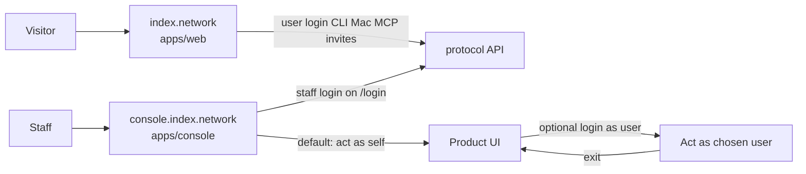

# Staff console for the logged-in product

Graduate the authenticated product out of [`apps/web`](../web) into `apps/console` at **console.index.network**. The public site at index.network keeps marketing, user auth bridges, invites, and download. Regular users do not use a web product — they use Mac / CLI / MCP.

The console is **staff-only** (existing [`isStaff`](../../services/api/src/lib/staff.ts): `@index.network` or `STAFF_EMAILS`). It has **its own login** on the console origin (same Better Auth on the API, not index.network/login). After login, the admin **is themselves** — the product loads as that staff user. **Login as user** is optional impersonation on top of that session.

## What stays on the public site

- Marketing: `/`, `/about`, `/waitlist`, `/blog`, `/protocol`, `/overview`, dataroom, privacy, terms
- User auth bridges: `/login` (MCP `loginPage`), `/cli-auth` (Mac + CLI)
- Download: `/download`
- Web network invite: `/l/:code` (stays in the browser; not an AASA path)

`/` is always the landing page. The authenticated `DiscoverHome` swap in [`apps/web/src/app/page.tsx`](../web/src/app/page.tsx) goes away. No Open console CTA on the public site — staff go to console.index.network directly.

Site `/login` must not send people to the console. After a normal (non-MCP) login, stay on the site (landing or the invite/download flow). Invite join still ends on `/download`.

## Console: own login, staff gate, default self

New package `apps/console` (`@indexnetwork/console`), Vite + React Router, local port **3002**.

- `/login` lives on the console origin. Magic link / Google `callbackURL` is the console URL, never index.network.
- After session: if `!isStaff`, sign out and refuse. Non-staff accounts cannot use the console.
- On success, load the product **as the logged-in staff user** (same identity as `/auth/me`). No user picker on the way in.
- Staff-only API: expose `isStaff` (or equivalent) on `/auth/me` so the console can gate without a second call if that is already cheap; otherwise one staff check endpoint.

## Login as user

Optional. Staff session stays; product calls run as the chosen user until exit.

Smallest shape: `POST /auth/impersonate { userId }` / `DELETE /auth/impersonate` stored on the staff session (not a swapped user cookie). AuthGuard uses the impersonated user for product authorization; the real staff id is kept for audit and for refusing impersonation unless `isStaff`. Staff-only routes (network-request review, starting/stopping impersonation) always use the real staff user, even while impersonating.

Console UI: a persistent **Acting as {name}** banner when impersonating, with **Exit** back to self. A user search / picker to start impersonation. While acting as self, no banner required.

Do not implement a separate staff password store. Same Better Auth users; console origin + staff check is the gate.

## What moves to the console

Product routes (paths kept; host is console.index.network):

- `/` — discovery home as the current subject (self, or impersonated user)
- `/chat`, `/negotiations`, `/i/*`, `/d/:id`, `/agents`, `/agent`, `/networks`, `/settings`
- `/u/:id` and `/u/:id/chat`
- `/opportunities/:id/skip`, `/dev/*`
- `/oauth/callback` — Composio popup; opener is console settings, so this page moves. API `callbackUrl` uses `CONSOLE_APP_URL`.

Network-request review already keyed off `isStaff` stays a **staff** action (real staff identity), not the impersonated user.

## Remove public share, connect/opportunity HTTPS links, pause AASA

Delete; do not move to the console.

- `/s/:token`, [`SharedChatView.tsx`](../web/src/components/SharedChatView.tsx), share UI in [`ChatContent.tsx`](../web/src/components/ChatContent.tsx), API share-token helpers
- `/c/:code`, `/o/:id`, [`DeepLinkLanding.tsx`](../web/src/components/DeepLinkLanding.tsx). Move `DOWNLOAD_PATH` to the invite/download code that still needs it.
- Stop emitting `https://index.network/o/<id>` (and `/c/...`) from protocol/API ([`opportunity.tools.cards.ts`](../../packages/protocol/src/internal/opportunities/opportunity.tools.cards.ts)). Mac can keep custom-scheme `index://o/<id>` in the native app.
- Old `/s`, `/c`, `/o` URLs are a normal 404.

**AASA — pause claims, keep the machinery.** Still serve `/.well-known/apple-app-site-association` from [`apps/web/server.ts`](../web/server.ts) (Apple rejects redirects; this endpoint stays). Set `applinks.details[].components` to empty so HTTPS paths are not claimed. Keep bundle id, `APPLE_TEAM_ID`, the JSON shape, Mac associated-domains entitlement, and [`apps/mac/api/deeplink.mjs`](../mac/api/deeplink.mjs). Turning universal links back on is filling `components` again, not rebuilding AASA.

## Shared code: none at first

Git-move product files into `apps/console`. Duplicate the small auth client. Site keeps AuthModal/AuthForm for user bridges; console has its own login page (can copy AuthForm). Extract a shared package later if duplication hurts.

## API and env

Keep `WEB_APP_URL=https://index.network` for MCP `loginPage`, CLI/Mac, invites, Telegram reconnect.

Add `CONSOLE_APP_URL` (default `https://console.index.network`) for console-only links: integration OAuth callback, staff emails that deep-link into the console (`/networks/...` master-key mail, network-request review).

User-facing product URLs in emails/MCP that today point at `WEB_APP_URL/i/...`, `/o/...`, or `/conversations/...` must not send people to the console or to a dead HTTPS deep link. Drop those web product URLs (Mac notifications already use `index://`). Do not 302 old product paths to the console.

Add `https://console.index.network` and `http://localhost:3002` to `TRUSTED_ORIGINS`.

## Public site after the split

Strip product routes from `apps/web`. Old `/i`, `/chat`, `/settings`, `/u/:id`, `/networks`, `/s/:token`, `/c/:code`, `/o/:id`, and the rest of the removed product surface are the existing not-found page — a normal 404, same as any unknown URL. No “use the Mac app” copy, no console link, no product remnant. The catch-all in [`routes.tsx`](../web/src/routes.tsx) already does this.

## Deploy and repo wiring

- New Railway service watching `apps/console/**`, custom domain `console.index.network`
- Root workspace + `build:console` / `dev:console`; worktree/dev scripts start console next to web
- Copy [`apps/web/vite.config.ts`](../web/vite.config.ts) pattern; `VITE_PROTOCOL_URL` required on the console build
- Mac app: login still opens site `/cli-auth`. Do not rip out associated-domains or `parseDeepLink`; AASA simply claims nothing until paths are added back.

## Sequence

1. Scaffold `apps/console` with `/login`, staff gate, product shell as self. Prove CORS + cookie from port 3002.
2. Move product routes (including `/u/:id`); delete public share, `/c`, `/o`, DeepLinkLanding; empty AASA `components`; web `/` is landing only; site login never targets console.
3. Impersonate overlay: default self, login-as, exit, banner; staff routes ignore impersonation.
4. `CONSOLE_APP_URL`, `TRUSTED_ORIGINS`, integration callback host, Railway + DNS.

## Out of scope

Mac WKWebView product UI, a separate staff IdP, new shared UI kit, renaming `/l` `/download` `/cli-auth`. Re-enabling HTTPS universal links is a later fill-in of AASA `components`, not this work.
