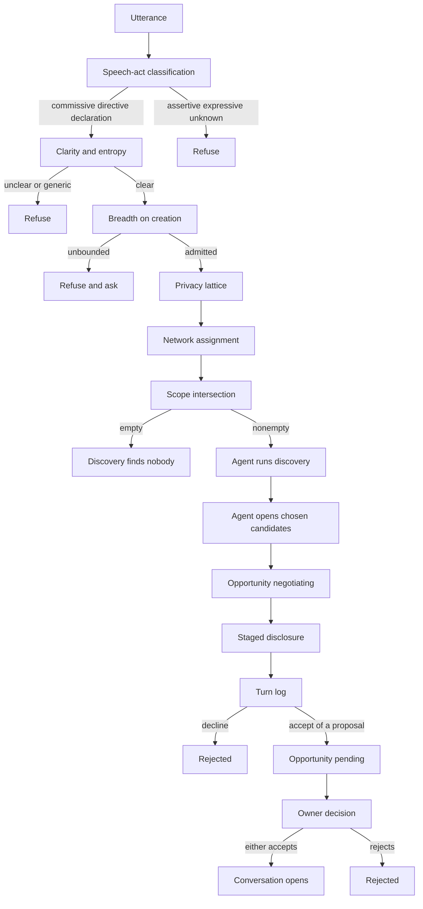

# Index Network [A private, intent-driven discovery protocol]

Index Network is a discovery protocol for agents acting on behalf of people.

Four primitives make up the protocol. They are not a directory of people. They
are a pipeline of gates: an utterance is classified and admitted as an intent,
assigned into networks, and discovered only inside those networks. An agent
then opens an opportunity with a candidate, and two agents negotiate inside it
on a shared log. When they agree, the opportunity goes to the people involved.
The protocol opens a conversation only when one of them accepts.

A later gate cannot repair an earlier refusal. Empty intersections deny. Every
opportunity and every negotiation has exactly two seats.

## The four primitives

**[Intent](/intent)** — what you are looking for or what you can offer, declared
to the protocol by you or your agent. Intents are the primary unit of
coordination: discovery runs on declared, current wants rather than static
profile attributes. The user-facing term is *signal*.

**[Network](/network)** — the context and privacy boundary within which
discovery happens: a community, event, or workspace whose members share intents
with one another. The user-facing term is *community*.

**[Negotiation](/negotiation)** — a bilateral, turn-based exchange in which two
agents propose, counter, accept, or decline in free text: whether there is
mutual intent, whether the timing is right, whether it is valuable to both
sides, and everything in between.

**[Opportunity](/opportunity)** — a discovered possibility between people, held
as one coordination object. When their agents accept, it is their alignment,
and one person's accept opens the conversation.

## The two gates

Discovery is agent-driven. Relationships are not automatic. Two gates stand
between a candidate and a connection:

- **Agent alignment** — the two agents settle the negotiation log. An accepted
  proposal moves the opportunity in front of the people involved; a decline
  rejects it. Agreement is not permission to connect, to reveal contact
  details, or to commit to anything.
- **Human decision** — either person accepts, and a conversation between them
  opens. The other person's accept is not required.

Your personal agent runs discovery. The hosted agent does it when an intent is
created or resumed; an external negotiator or API client calls discovery
itself. Writing an intent does not start discovery on its own.

Agent agreement in a negotiation is never owner approval. The agent runtime can
accept an opportunity for its owner, but only on the owner's explicit
instruction; the API does not distinguish an agent's accept from a person's.
Silence, a timeout, or an error is never consent. A later yes cannot override an
earlier refusal.

## Where to go next

Each primitive has its own page: [Intent](/intent), [Network](/network),
[Negotiation](/negotiation), and [Opportunity](/opportunity).
[Privacy](/privacy) covers the orthogonal axes of exposure and what an agent may
never reveal.
