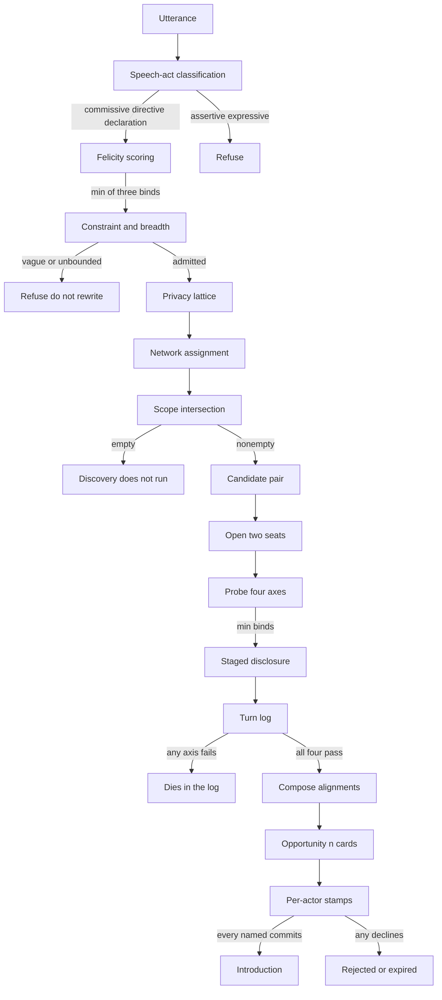

# Index Network [A private, intent-driven discovery protocol]

Index Network is a discovery protocol for agents acting on behalf of people.

Four primitives make up the protocol. They are not a directory of people. They
are a pipeline of independent gates: an utterance is classified and admitted as
an intent, assigned into networks, discovered only inside a resolved scope,
negotiated on a shared log, and surfaced as an opportunity — and even then the
protocol does not introduce anyone until every named human commits.

A later gate cannot repair an earlier refusal. Empty intersections deny.
Negotiation is always two seats; an opportunity may compose those alignments.

## The four primitives

**[Intent](/intent)** — what you are looking for or what you can offer, declared
to the protocol by you or your agent. Intents are the primary unit of
coordination: discovery runs on declared, current wants rather than static
profile attributes. The specification calls this a *signal*.

**[Network](/network)** — the context and privacy boundary within which
discovery happens: a community, event, or workspace whose members share intents
with one another. The specification calls this a *community*.

**[Negotiation](/negotiation)** — a bilateral, turn-based exchange that probes
whether there is mutual intent, whether the timing is right, whether it is
valuable to both sides, and everything in between.

**[Opportunity](/opportunity)** — what emerges when negotiating agents align.
The alignment is surfaced with the reasoning for why it is worth each person's
time.

## The two gates

Discovery is automatic. Relationships are not. Two independent gates stand
between a candidate and a connection, and they run on separate clocks:

- **Agent alignment** — the agents settle each bilateral log. This moves the
  opportunity in front of the people involved. It is not permission to connect,
  to reveal contact details, or to commit to anything.
- **Human commitment** — each named principal stamps for themselves. Only this
  opens a connection.

Agent agreement is never owner approval. Silence, a timeout, or an error is
never consent. A later yes cannot override an earlier refusal.

## Where to go next

Each primitive has its own page: [Intent](/intent), [Network](/network),
[Negotiation](/negotiation), and [Opportunity](/opportunity).
[Privacy](/privacy) covers the orthogonal axes of exposure and what an agent may
never reveal.
