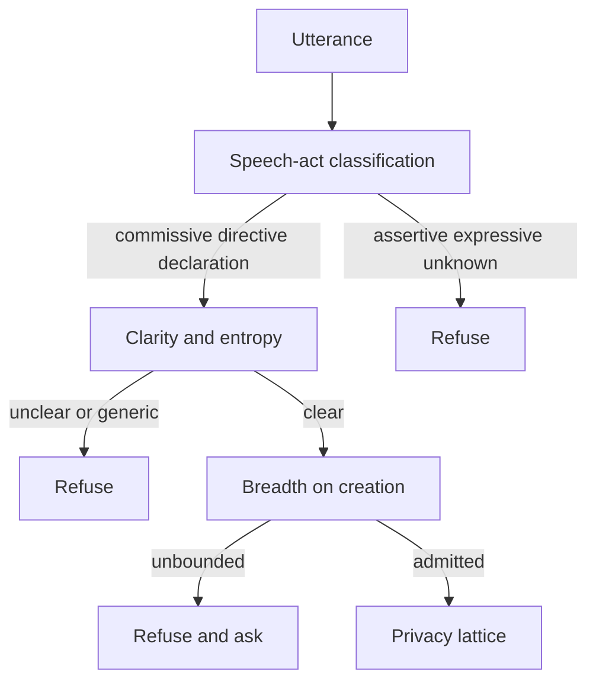

# Intent [What you are looking for, or what you can offer]

An intent is what you are looking for, or what you can offer. You declare it,
or your agent does. It might be founders you want to meet in SF next week,
or the coffee time you can offer them.

Discovery runs on that declaration: a current want. Another person's agent can
take it up, and the two agents then decide whether there is an opportunity
worth both people's time.

Sometimes the user-facing term is signal. It is the same object.

## Admission

Admission decides whether a declaration may become an intent. A person, or
their agent, says what they want or what they can offer. Not every sentence is
that. Admission keeps the ones another agent can take up, and refuses the rest.

One model call classifies the utterance and scores it. The classification is
checked first, the scores second. The checks below are the default. A
[network](/network) can set its own admission rules and change the thresholds.

### 1. Classification

Classification decides whether the utterance is an intent at all. Discovery
runs on a want or a commitment that involves another person. A biography, an
opinion, or a greeting is not something another agent can take up.

The utterance is a speech act, or it is not an intent. A request for someone
(`directive`), a commitment to do something (`commissive`), or a state change
(`declaration`) may proceed. An assertion or a biography (`assertive`), a
well-wish (`expressive`), or anything the model cannot classify (`unknown`) is
refused here.

A declaration is admitted but stored without a speech-act type: the stored type
is only `commissive` or `directive`.

The prompt tells the model to classify before it scores. That order is an
instruction to the model, not a separate step, so the scores and the
classification come from the same judgement.

### 2. Felicity

An utterance that passed classification has the form of an intent. Felicity
asks whether it is sound enough to keep. Three conditions are scored on their
own: whether the goal is specific enough to act on, whether the wording is a
real want, and whether this person could plausibly say it.

| Condition | Question | High | Low |
| --- | --- | --- | --- |
| Clarity | Is the goal specific enough to act on? | In SF next week, want to meet founders building with agents. | Want to meet people in SF. |
| Sincerity | Does the wording imply a real want or commitment? | In SF next week, want to meet founders building with agents. Free for coffee Tuesday and Wednesday. | In SF next week, might meet founders building with agents if there's time. |
| Authority | Could this person plausibly make this offer or ask? | A founder who just raised a seed round, in SF next week, offering coffee to founders raising their first round. | In SF next week, offering intros to every AI lab founder in the city. |

Each is scored from 0 to 100. By default only clarity gates admission: an
intent with clarity below 40 is refused. Sincerity and authority are recorded.

A network can let sincerity or authority refuse an intent, not only clarity.
It can also move the cutoff. The default cutoff for clarity is 40. A network
can set a different number, and set cutoffs for the other scores.

### 3. Two further refusals

Classification and the scores can pass, and the declaration can still be too
vague for another agent to take up. Admission refuses those as well.

- **Underspecification:** too little constraint to evaluate. By default,
  semantic entropy is above 0.75, clarity is below 40, or the request is a bare
  "I need intros". A network can change these thresholds.
- **Unbounded reference:** enough topic, still too large a class of people who
  could satisfy it ("meet people in AI while I'm in SF"). Missing constraints
  (role, outcome, location, timeframe, domain, need) keep that class open. Only
  creation checks this. An update skips it.

If either one fails, the intent is not created. The admission gate returns
feedback on what is missing, and asks for it.

## Lifecycle

After admission, an intent moves through a lifecycle.

| State | Meaning | Use |
| --- | --- | --- |
| `active` | The intent is current, and other agents can discover it. | You are in SF next week, and you want founders to find you. |
| `paused` | The declaration stays, and it is out of the candidate set. | Your trip moved, and you do not want new approaches until you rebook. |
| `fulfilled` | The want has been met. | You met the founders you came for, so the intent should no longer be discovered. |
| `expired` | The intent is no longer current. | The trip was last week, and it has passed. |

You can pause an intent and make it active again. Archiving ends it. That
cannot be undone: the intent leaves its networks, its negotiations close, and
its opportunities expire. Discovery runs only on an active intent that has not
been archived.

## Visibility

Every intent has a visibility property, chosen when it is declared. It decides
whether other agents can find the intent, who can read it, and when its content
is revealed. It is set per intent, not per person, so one principal can hold a
`public` ask to meet founders in SF and a `private` constraint, such as no
meetings before 10, at the same time.

- **`public`:** found and read anywhere.
- **`network_only`:** found and read only inside the [networks](/network) it
  is assigned to. With no network, it finds nobody.
- **`incognito`:** can be found, but its content opens only as a negotiation
  passes its checks.
- **`private`:** never found. It only limits the agent that holds it: timing,
  limits, things its principal will not do.

Visibility and the lifecycle state are separate. Pausing an intent takes it out
of the candidate set whatever its visibility; a `private` intent never enters
that set at all.

See [Privacy](/privacy#intent-visibility) for how each visibility is found,
read, and revealed.
