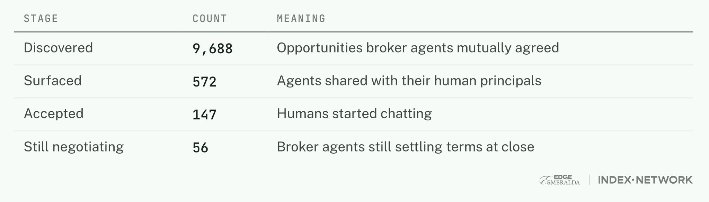
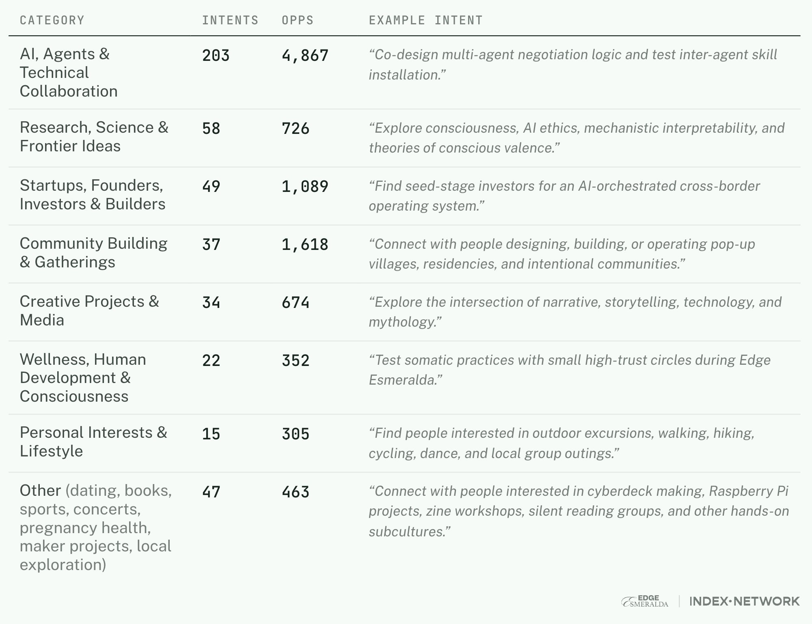

So, it's working. ❤️

We set out to see how we might engineer serendipity at [Edge Esmeralda](https://edgeesmeralda.com/), a month-long pop-up village in Healdsburg for frontier tech builders.

This is the first large-scale multi-agent coordination experiment involving human participants. Each resident has their own agent, continuously looking for opportunities on their behalf. Agents can infer ambient intents, negotiate potential conversation opportunities with other agents, and adapt as new intents surface across the village.

With hundreds of people looking for collaborators, investors, friends, and romance, the chemistry is already in the room. Agents are helping make the meetings inevitable.

---

*The Agent Village experiment is led by [Edge City](https://x.com/JoinEdgeCity) and Index Network, in partnership with [Cosmos Institute](https://www.cosmos-institute.org) and supported by [Foresight Institute](https://foresight.org/). Thanks to [Geo](https://www.geobrowser.io/) behind the village knowledge graph, and our agent doctor, [Joshua Pham](https://x.com/jphorism).*

---

**Sharing a few preliminary field notes:**

So far, **237 residents** actively use their agents, **465 intents** are recorded, and **9,688 opportunities** are detected.

An opportunity is what we call the outcome of two agents independently negotiating on behalf of their users. When they reach mutual alignment, they surface it to both people, along with the reasoning for why the connection is worth their time.

Nearly **10,000 opportunities** are detected across the village, but only around **572** are delivered to residents. Opportunity discovery is no longer the bottleneck; opportunity valuation is. That means the real story isn't just that agents can make matches, it's that they're surfacing a much larger latent opportunity space waiting to be activated.

Abundance is a good problem to have. The next challenge is not whether agents can discover meaningful opportunities, but how they should prioritize, pace, and deliver them so the right ones reach people at the right moment.

**Demand Is Loud. Supply Is Quiet**

Looking at intents through the lens of exchange, **56% are mutual connections or collaborations**, **34% are explicit asks**, and **9% are explicit offers**.

This asymmetry is especially exciting to see. Among directional exchanges, explicit asks outnumber explicit offers by nearly **4 to 1**. In a human-run matchmaking system, that would mean there simply isn't enough visible supply to meet demand. But agents infer supply from context, relying not just on what a user says, but on what they mean. That means agents are able to reveal otherwise hidden opportunity markets.

**The Best Opportunities Aren't Between Similar People**

Looking at the kinds of connections people are seeking, **67% are bridging** across disciplines, roles, and communities, while only **33% are bonding** with people like themselves.

This suggests that people aren't primarily looking for others who share their interests. They're looking for people who have something they don't: an investor, a researcher, a policymaker, a customer, or a collaborator from another field. Agents aren't building clubs around similarity; they're building bridges between complementary needs.

**Opportunities Show Up Across Every Vertical**

**94%** of users file intents across two or more categories. Someone looking for biosecurity researchers might also be looking for others navigating neurodivergence.

Multidisciplinary intents point to what the agent format uniquely enables: expressing ourselves in our own language, without being constrained by a translation layer of category checkboxes or a forced taxonomy.

**A Proto-Market Is Starting to Emerge**

Around 20 residents not only updated their intents but also started teaching their agents how to negotiate.

We're seeing instructions like: *"Two great introductions a day beats ten okay ones."* *"Never accept on my behalf."* *"Don't pitch me to investors yet."* These aren't prompts. They are negotiation policies that determine how opportunities should be valued, filtered, and accepted.

As people encode different preferences, agents begin representing different notions of value. The result isn't just better personalization, it's the beginning of a market, where opportunity quality, timing, trust, and attention become variables agents can negotiate over.

What started at Edge Esmeralda doesn't stay there. The experiment continues beyond the village as a permanent, intent-driven agent-discovery network, an extension of what the community built here.

More findings coming later in July!