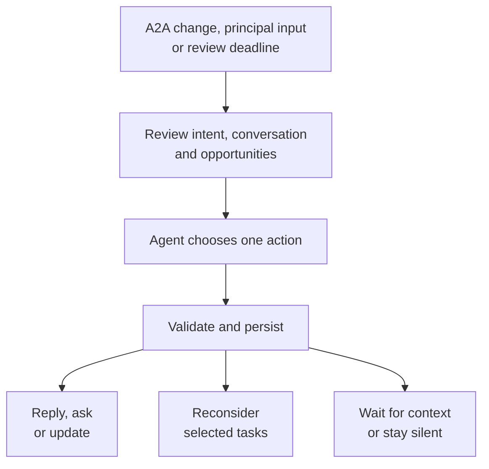
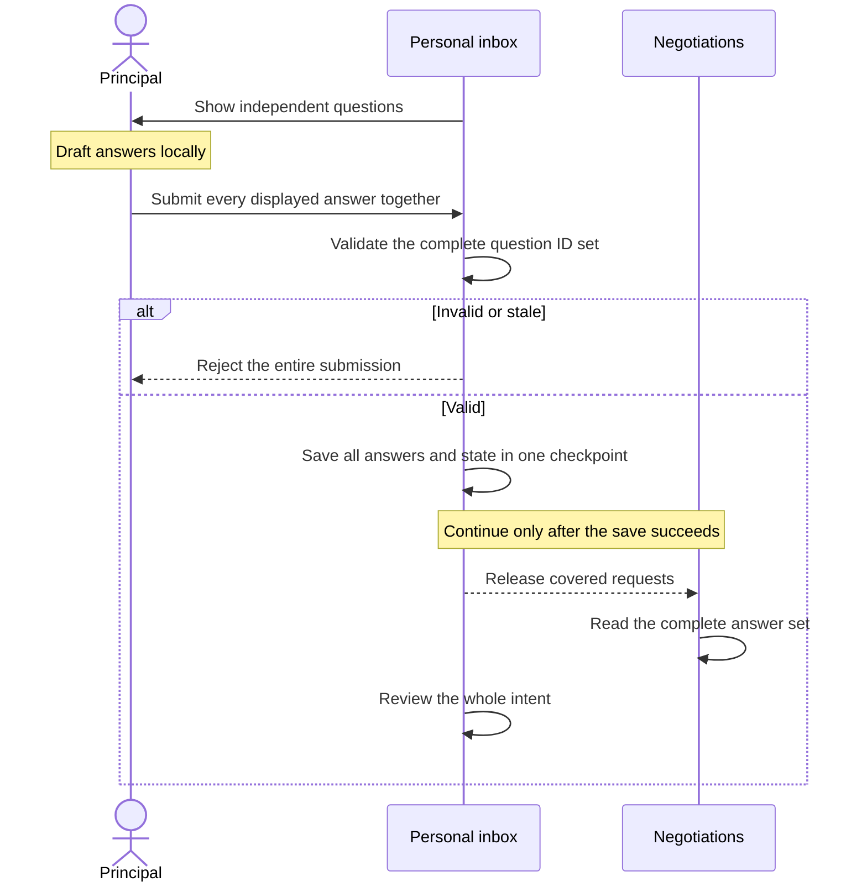
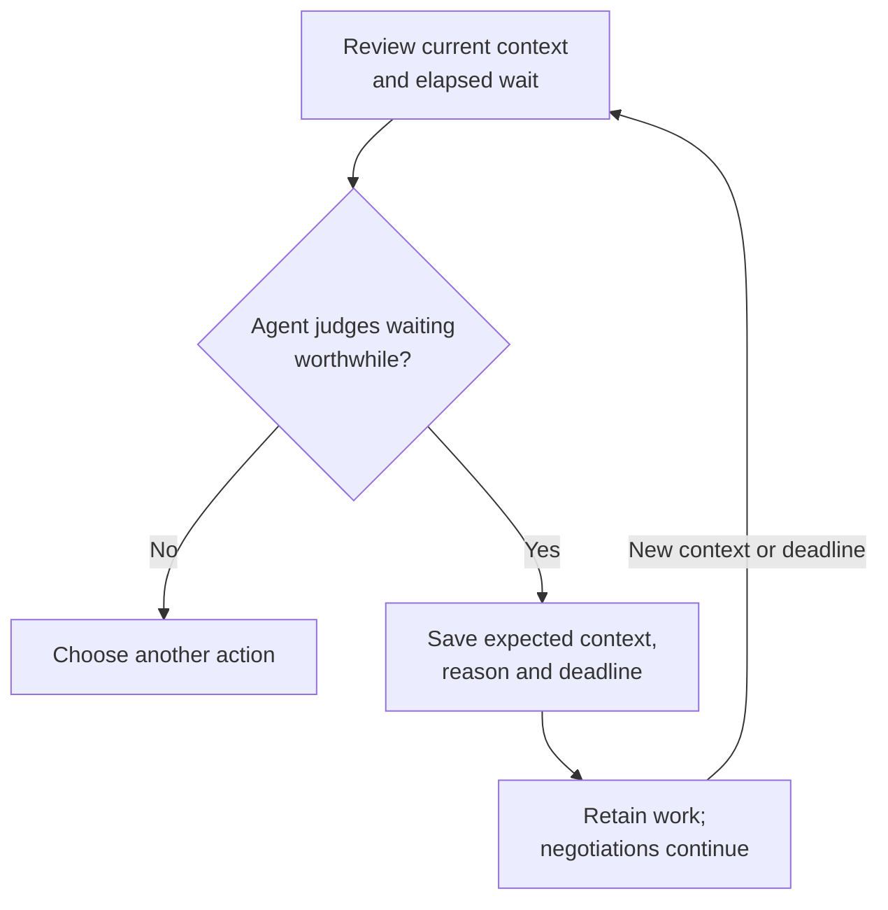

# Personal agent communication spec

Proposed changes to `packages/agent`. Keep `NegotiationAgent`, `PrincipalInbox`,
the model loop, and `PrincipalStore`; replace the existing behavior in place.
See [the design](agent-communication.design.md) for rationale and examples.

## 1. Review flow

The agent decides what is useful. The runtime validates IDs and freshness,
persists the decision, and delivers its effects. Counts never select an action.



Keep one `review_principal_inbox` tool and one committed decision per review:

| Action | Effect |
|---|---|
| `reply` | Answer direct messages, then end this review. A subsequent review assesses their effect on the intent. |
| `ask` | Author 1–3 independent questions when no batch is displayed, including clarifications without an A2A request. |
| `reconsider` | Select opportunities for reevaluation, with or without queued questions. |
| `update` | Publish a concise update about selected outcomes, even while a batch is open. |
| `wait_for_context` | Retain pending work and schedule an agent-chosen reconsideration deadline. |
| `stay_silent` | Dismiss selected outcomes without publishing. Preserve requests and displayed questions; schedule no deferral. |

`update` and `stay_silent` select outcomes by `opportunityIds`; unselected
outcomes survive. An empty selection can leave an open batch undisturbed.

## 2. Questions and answers

Replace the singular public contract; export `PrincipalAnswer`:

```ts
interface PrincipalAnswer { questionId: string; text: string }

get pending(): readonly PrincipalQuestion[];
answer(answers: readonly PrincipalAnswer[]): Promise<readonly PrincipalMessage[] | null>;
message(text: string): Promise<PrincipalMessage | null>;
```

`pending` is empty when no batch is shown. `queuedQuestions` counts requests
outside the displayed groups. Invalid input returns `null`; persistence failures
reject. Nonempty direct messages remain allowed while a batch is open.

`ask` receives `questions: [{ question, options, scope, opportunityIds, requestIds }]`:

- Ask one fact or coherent decision per question, with 2–4 suggested options.
  Group duplicate intent-wide facts; defer dependent follow-ups. One question
  is a valid batch. A multi-term offer can still be one approval decision.
- Use `intent` or `match` scope. Match permission concerns exactly one
  opportunity; an intent-wide clarification can have no opportunity references.
  All IDs belong to this principal and intent. Each request appears in at most
  one group, with its opportunity included in that question’s references.
- The model owns wording, equivalence, and independence. A2A requests are input,
  not text to forward verbatim. `requestIds: []` needs no synthetic A2A wait.
- Assign fresh question IDs. Save all questions and transcript entries before
  display; attach covered requests through `attachedTo`. IDs, wording, options,
  scope, and references stay fixed. Later arrivals remain queued.



Require exactly one nonempty answer per displayed ID; reject missing, extra,
duplicate, retired, or stale IDs before mutation. Derive scope and references
from stored questions. In one `PrincipalStore.save(state, messages)`, save full
answer text as separate scoped entries, add their IDs to `pendingPrincipalInputIds`,
clear the batch and covered requests, and increment principal context once.
Invalidate the old inbox review; preserve unshown requests and outcomes.

Drafts save nothing. Failed persistence releases nothing and retains existing
shutdown handling. An uncertain submission is reconciled against pending state
and history before resubmission. Immutable question IDs identify the batch;
no separate batch ID or incremental answer API is needed.

## 3. Instructions and opportunity reconsideration

Shared identity: **“You are {{principal_name}}’s personal agent.”** The principal
ID identifies the human. Act when facts and authority suffice; ask only for
input that could change the next move; communicate worthwhile outcomes.

| Instruction | Required interpretation |
|---|---|
| Read the complete input. | Preserve raw text, source IDs, conditions, uncertainty, and additional explicit instructions. A question’s scope does not hide a separate broader instruction in its answer. |
| Keep permission scoped. | A brief “yes” applies to its question. Authority covers the stated action, opportunity, terms, and conditions; reassess material changes. Existing standing authority can suffice. |
| Separate terms, authority, and execution. | Rename `acceptedCommitments` to `agreements` throughout context, its backing collection, read tool, and examples. Retain all observed agreements, including authority gaps. A2A agreement alone proves neither consent nor subsequent execution. |
| Reconcile meaning. | A clear correction or revocation controls within scope. A later general preference does not automatically revoke a specific approval; a stale summary cannot erase it. Clarify only ambiguity affecting the next action. Preserve executed actions. |
| Stay grounded. | Do not invent personal facts, grant authority from agent notes, or disclose private H2A deliberation. Resolve historical relative dates from their original context, not today. |

`reconsider` takes `opportunityIds`, an internal evidence-grounded `message`,
`releaseRequestIds`, and `retireQuestionIds`. Persist existing per-opportunity
`reviewNote`s and selected releases/retirements before notifying tasks:

- A target need not have a request. Preserve passive tasks’ notes through restart
  until an actual permitted review. Respect turn ownership and valid input waits;
  do not reopen stopped or settled work. A note is not a completed external action.
- Released requests must belong to selected opportunities. Releasing a displayed
  request requires explicitly retiring its question. Detach and retain other
  linked requests; reconsideration alone does not retire valid questions.
- An H2A-authored question can be retired without a request. Empty opportunity
  targets are valid only to retire an intent-wide question with no references;
  reject a decision with neither a target nor a retirement.

Direct messages are saved as `user` entries, never synthetic batch answers.
Reply and end that review, then assess all relevant opportunities. Corrections
can retire obsolete questions; actual cancellation removes the canceled match’s
requests and retires any question whose references would change. Old submissions
fail atomically; callers retain drafts for unchanged IDs and refresh the set.

A2A reads full principal context and review notes before acting, keeps one
focused input request and the submission limit, and uses explicit capabilities.
Add `report_obstacle({ reason })` for a non-input blocker: persist the obstacle,
end the local turn without settlement, and await relevant context. Reject it
after a submission attempt; uncertain writes retain their failure handling.
Ordinary prose is neither a valid completed turn nor a principal notification.

## 4. Waiting and durable review



Current `schedule(2s)` is a fixed window for nearby A2A inputs to accumulate.
Replace it with event-triggered review and an explicit agent decision to wait.

`wait_for_context` requires `expectedContext`, `reason`, and a finite future
`reconsiderAt`. Persist `deferredReview` with those fields and `startedAt`;
keep the original start when extending the same deferral. A non-waiting decision
ends that episode. Deadlines guarantee review, not a forced human interruption.

Every review receives current time from the injected clock, principal history
and pending input IDs, the displayed batch, requests/outcomes and their ages,
observed agreements, and available confirmed action results. Include individual
opportunities’ counterpart intents, available fit evidence, terms, open issues,
allowed actions, blockers, and last-change times; activity start, recent changes,
and the current or expired waiting decision complete the context.

Derive counts from observed statuses: ready/executing, principal-blocked,
awaiting counterparty, locally blocked, completed/stopped, or unknown. Suspended
promises are not independent work; passive agents have no inferred ETA. Initial
bursts may justify waiting; later urgent requests may justify acting. Neither
counts nor batch size impose a threshold. Use existing evidence without a new
summary model, consent ledger, or domain taxonomy.

| Runtime responsibility | Contract |
|---|---|
| Deliver reviews. | Replace the fixed two-second delay with coalesced events and one in-flight review. Wake on principal input, requests/outcomes, meaningful observations/activity, cancellation, or deadline. Ignore unchanged duplicates and token activity. |
| Review every principal input. | Save new user/answer IDs in `pendingPrincipalInputIds` with the input. They trigger review even with empty request/outcome queues. Replying does not consume them; a fresh non-reply decision consumes only its snapshot IDs, including when choosing a durable wait. History remains intact. |
| Protect freshness. | Use an inbox review revision separately from A2A `contextVersion`. Discard stale decisions; invalidate affected negotiation decisions without restarting unrelated tasks. New context never extends a deadline automatically. |
| Restore faithfully. | Persist questions, review notes, waiting, and observation ages. Restore an unexpired deadline when context is unchanged; otherwise review immediately with the previous expectation. Stop live timers on shutdown; retain state and never restore a model call as executing. |
| Avoid spinning. | Pending requests alone do not retrigger a committed wait. Wake on new context or deadline; remove superseded timer/flag paths. |

## 5. Implementation scope

| Location in `packages/agent` | Change |
|---|---|
| `src/negotiation/principal.inbox.ts` | Authored batches, atomic answers, direct messages, opportunity reconsideration, review actions and scheduling. |
| `src/negotiation/negotiation.agent.ts` | Public API, task notes/wakes, agreement observations, stale-turn protection, obstacle capability. |
| `src/negotiation/principal.state.ts` | Persist `questions[]`, pending input IDs, deferred review, activity/obstacles, and existing match review notes through `PrincipalStore`. |
| `src/prompts/agent.prompt.ts` | Align shared, H2A, and A2A instructions and review context with this contract. |
| `src/index.ts`, README, examples | Export changed public types and update all documented callers. |

Implement state/API and checkpoint ordering, then task reconsideration,
scheduling, and final prompts. Keep generic `Agent.ask_user`, protocol
transitions, infrastructure, and application layouts outside this change.

`PrincipalStore` requires exclusive ownership of each principal/intent session.
The host’s expiring lease prevents competing owners and permits recovery after
a crash; concurrent negotiations run within that session. Lease mechanics stay
in the host and do not govern the agent’s context-waiting decision.

These are breaking API/checkpoint changes; replace old paths without adapters,
dual reads, or a retry framework. Coordinate existing session handling and
updates to `packages/agent-tui/src/negotiation.tui.ts`,
`services/api/src/services/personal-agent.service.ts`, and
`services/api/src/adapters/agent-session.database.adapter.ts` before product
implementation. Do not claim repository readiness with broken callers or
discard host-owned session data without a plan. Follow repository worktree,
version, lockfile, and PR requirements for the agreed implementation scope.

## 6. Acceptance checks

| Case | Expected result |
|---|---|
| Duplicate facts and dependent decisions | Shared facts can be grouped; dependent questions wait; match permissions remain separate. H2A can ask without a queued request. |
| Batch submission | Drafts do nothing. Invalid ID sets change nothing. Complete answers use one checkpoint before covered waits release; unknown answers establish uncertainty. |
| Arrivals, corrections, cancellation | Arrivals preserve the batch; obsolete questions retire explicitly. Unrelated questions, drafts, requests, and outcomes survive. |
| New instruction without queued work | Whole-intent review still runs, selects affected opportunities, and survives restart before processing. Passive targets retain notes for their permitted turn. |
| Waiting and freshness | New context or the restored deadline wakes review. Extensions retain elapsed time. Counts do not force waiting; stale decisions and failed saves produce no effects. |
| Outcomes and obstacles | Only selected outcomes are handled; updates can coexist with a batch. An obstacle creates no settlement, success claim, or automatic write replay. |
| Maya: conditional answer | “Aggregates are enough if I can name the product. I want first author.” Preserve the product condition and authorship objective across relevant opportunities, without inferring offer approval. |
| Maya: Leo | Aggregates/named product are acceptable; authorship is still open and Leo is awaiting them. Do not re-ask the known fact, forward a premature approval question, or submit out of turn. |
| Maya: Priya | Recognize her earlier scoped intro approval despite “pending consent.” Reassess the later “don’t spend my week on advisory-only people” instruction without automatic revocation. No queued ask is required; clarify material ambiguity only. |
| Maya: Sam and dates | Keep the advisory-only opportunity rejected. Preserve the example’s 13 September 2026 context; missing message timestamps do not justify guessing or shifting “next Tuesday” on replay. |
| Maya variations | Remove approval → no inferred permission. Explicit cancellation → revoked authority, not proof of cancellation. Confirmed intro → preserve execution. Changed product condition → reassess. A2A agreement alone → retain the authority gap. Scoped “yes” plus an explicit broader instruction → interpret each at its own scope. |

For implementation, run existing `typecheck`, `test`, and `build` scripts from
`packages/agent`; update affected existing expectations. Use existing scenarios
or temporary checks, not new persistent test files. Evaluate semantic cases
with a model and report that evidence separately from structural checks. The
existing single-step inbox failure on an invalid model decision remains a known
limitation. This document specifies proposed behavior; it does not claim these
checks already pass.

## Review notes

- **Better accumulator?** Review how nearby inputs are collected before H2A
  review, especially arrivals during an active review.
- **Wake patterns:** distinguish inbox review from resuming a negotiation;
  decide which arrivals invalidate an in-flight review versus queue a follow-up.
