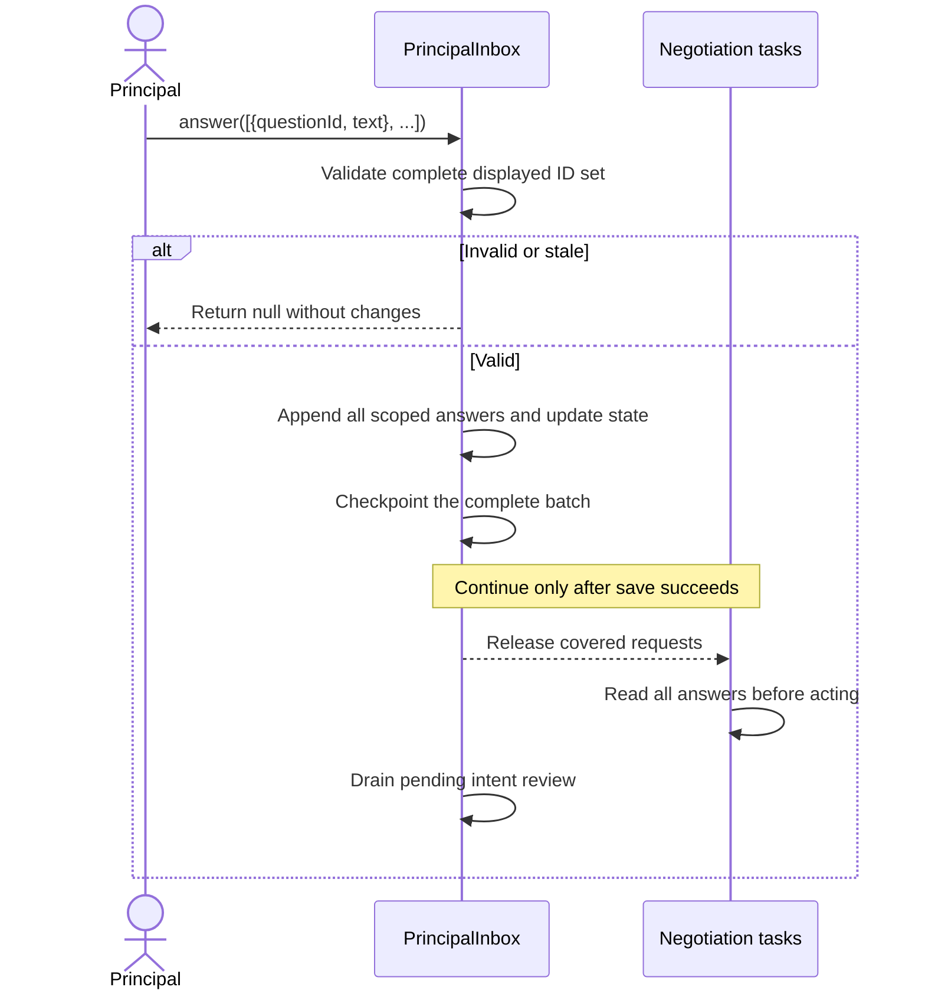
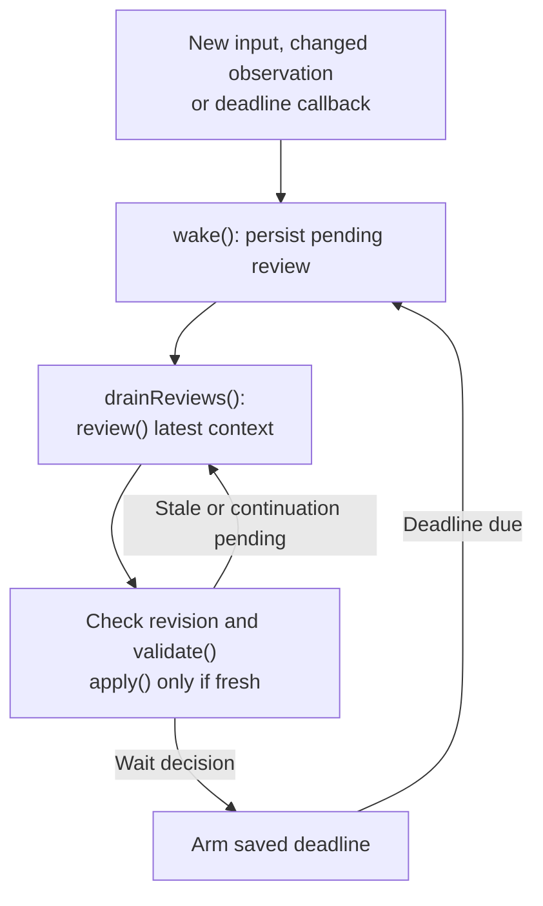

# Personal agent communication spec

Proposed implementation in `packages/agent`. The [design](agent-communication.design.md)
contains rationale and examples. Replace existing behavior in place.

## 1. Public API

Change `NegotiationAgent` and `PrincipalInbox` together:

```ts
export interface PrincipalAnswer {
  questionId: string;
  text: string;
}

get pending(): readonly PrincipalQuestion[];
answer(answers: readonly PrincipalAnswer[]): Promise<readonly PrincipalMessage[] | null>;
message(text: string): Promise<PrincipalMessage | null>;
```

- `pending` returns `[]` when no batch is displayed.
- `answer` accepts the complete displayed batch. Invalid input returns `null`;
  failed persistence rejects. Remove `answer(questionId, text)`.
- `message` accepts nonempty input while a batch is displayed.
- `queuedQuestions` counts requests not attached to displayed questions.
- Keep `PrincipalQuestion`, `PrincipalMessage`, and generic `Agent.ask_user`.

## 2. State

Persist through the existing `PrincipalStore.save(state, messages)` transaction.
Keep existing fields except those explicitly replaced below.

| Persisted field | Type / change |
|---|---|
| `InboxState.questions` | `PrincipalQuestion[]`; replaces singular `question`. |
| `InboxState.requests` | Existing serialized requests; retain `attachedTo`, add `createdAt`, remove `reviewed`. Never serialize `resolve`. |
| `InboxState.outcomes` | Existing outcomes plus `observedAt`. Extend `Outcome.result` with `{ obstacle: string }`, distinct from protocol results and errors. |
| `InboxState.incomingMessageIds` | Existing direct-message reply queue. |
| `InboxState.pendingPrincipalInputIds` | `string[]`; user/answer entries still requiring review of the whole intent. Replying does not clear these. |
| `InboxState.reviewPending` | `boolean`; saved wake or required continuation not yet handled. |
| `InboxState.deferredReview` | `DeferredReview \| null`. |
| `PrincipalState.startedAt` | Session activity timestamp. |
| `PrincipalState.matches[]` | Retain `record`, `reviewNote`, and `reported`; add `stopped: boolean`, `lastChangedAt`, and optional `obstacle: string`. Preserve local stops across restart. |

```ts
interface DeferredReview {
  startedAt: string;
  expectedContext: string;
  reason: string;
  reconsiderAt: string;
}
```

| Runtime field | Responsibility |
|---|---|
| `PrincipalInbox.reviewRevision` | Increment when review context changes. Capture at review start; reject stale decisions before mutation. |
| `PrincipalInbox.running` | One active review loop. |
| `PrincipalInbox.timer` | Timer for the saved deadline; no fixed collection timer. |
| `reviewController` / `stopped` | Existing shutdown controls; do not abort for every arrival. |
| `NegotiationAgent.contextVersion` | Existing protection against A2A actions based on stale principal context. |
| `MatchTask.notified` / `running` | Existing per-task wake coalescing and execution ownership. |
| `NegotiationAgent.agreements` | Rename `commitments` and prompt field `acceptedCommitments`. Rebuild from observed records; retain agreements with unknown authority. |

Timers, promises, and executing status are runtime-only. Derive activity counts
from records, input waits, obstacles, and actual execution.
Use ISO 8601 timestamp strings from the injected clock; duplicate observations
must not reset creation times.

## 3. Functions to change

Paths below are relative to `packages/agent/src`.
`PrincipalInbox` lives in `negotiation/principal.inbox.ts`; `NegotiationAgent`
in `negotiation/negotiation.agent.ts`; saved state in `negotiation/principal.state.ts`.

| Function | Required behavior |
|---|---|
| `PrincipalInbox.request(match, question)` | Enqueue one scoped request with creation time; call `wake()`; retain the answer wait. |
| `PrincipalInbox.outcome(match, result)` | Record a new outcome/obstacle with observation time; call `wake()` only for changed input. |
| `PrincipalInbox.message(text)` | Append a user entry, enqueue both reply and intent review, invalidate principal context, then await `wake()`. |
| `PrincipalInbox.answer(answers)` | Validate all IDs/text, save all answers together, then release covered waits. See [answer submission](#5-atomic-answer-submission). |
| `PrincipalInbox.cancel(opportunityId)` | Remove that task’s requests; retire affected questions; keep other requests/drafts valid; wake on the actual cancellation. |
| `PrincipalInbox.wake(): Promise<void>` — new | Mark `reviewPending`, advance the review revision, checkpoint, then request `drainReviews()`. Replaces `schedule(delay)` and `immediate`. |
| `PrincipalInbox.drainReviews(): Promise<void>` — new | Own one review loop. Consume pending work serially; recheck pending work before becoming idle. |
| `PrincipalInbox.review()` | Capture durable context/revision; invoke the model once; discard stale results; validate and apply one decision. |
| `PrincipalInbox.validate(decision, snapshot)` | Validate action arguments, IDs, scopes, current batch, and future deadlines. Semantic relevance remains the model’s job. |
| `PrincipalInbox.apply(decision, snapshot)` | Apply the [decision contract](#4-review-tool-contract), checkpoint before effects, and acknowledge only input included in the snapshot. |
| `PrincipalInbox.hasWork()` | Check unhandled principal input, outcomes, or queued requests when no batch is displayed. Use for continuation after `reply/update/reconsider`, not polling. |
| `PrincipalInbox.snapshot() / restore() / resume() / stop()` | Save/restore state; resume pending work or the deadline; stop timers/calls without erasing resumable state. |
| `NegotiationAgent.receive(event) / drain(task) / run(task)` | Notify only the affected task; reread its record; obey turn ownership and valid input waits. |
| `NegotiationAgent.remember(record)` | Detect changed observations, update agreements/activity, and request inbox review. Unchanged reads do not wake it. |
| `NegotiationAgent.reconsider(opportunityIds, note): Promise<void>` — new internal callback | Attach task notes, checkpoint them with the inbox mutation, then notify selected tasks. Called by `apply(reconsider)`; do not checkpoint the same decision twice. |
| `NegotiationAgent.checkpoint()` | Keep state and transcript writes atomic and serialized. No effects may depend on unsaved input. |
| `NegotiationAgent.tools(task, turn)` | Add `report_obstacle({ reason })`. End that local turn without settlement; reject after a submission attempt; resume only on relevant context. |

Update `buildAgentSystemPrompt`, `buildNegotiationSystemPrompt`,
`buildNegotiationTurnPrompt`, and `buildPrincipalInboxPrompt` in
`prompts/agent.prompt.ts`, plus their instruction constants. Update exports,
README, and affected examples.

## 4. Review tool contract

Keep one `review_principal_inbox` tool. Replace the old `Decision` shape:

```ts
interface QuestionDraft {
  question: string;
  options: string[];                 // 2–4
  scope: "intent" | "match";
  opportunityIds: string[];
  requestIds: string[];              // [] for an H2A-authored clarification
}

type Decision =
  | { action: "reply"; message: string }
  | { action: "ask"; questions: QuestionDraft[] } // 1–3
  | { action: "update"; opportunityIds: string[]; message: string }
  | { action: "stay_silent"; opportunityIds: string[] }
  | { action: "wait_for_context"; expectedContext: string;
      reason: string; reconsiderAt: string }
  | { action: "reconsider"; opportunityIds: string[]; message: string;
      releaseRequestIds: string[]; retireQuestionIds: string[] };
```

| Decision | State change / effect |
|---|---|
| `reply` | Save the reply; clear handled `incomingMessageIds`. Leave intent-review IDs pending and run the next review. |
| `ask` | Require no displayed batch. Assign fresh IDs; save questions and transcript entries; attach covered requests; notify the principal after save. |
| `update` | Save a concise message and remove only selected outcomes. An open question batch is allowed. |
| `stay_silent` | Remove only selected outcomes; retain requests/questions. Empty outcome selection is valid. Finish review of current context without a timer. |
| `wait_for_context` | Retain work; save a future deadline and its reason/expectation. Preserve `startedAt` when extending the same deferral; arm the timer after save. |
| `reconsider` | Retire/release only explicit IDs; keep other linked requests. Invoke the owner callback to save task notes and notify selected tasks after persistence. |

For `ask`, requests must exist, belong to this intent, appear in one group at
most, and have their opportunity referenced. Only equivalent intent-wide facts
share a question across matches; match questions reference exactly one match.
An intent clarification may reference none. Defer dependent questions.

For `reconsider`, released requests belong to selected opportunities. Retire a
displayed question before releasing its request; detaching it does not answer
other linked requests. Empty targets are allowed only when retiring an
intent-wide question without references. Reject a no-op decision.

A fresh non-reply decision acknowledges its snapshot’s principal-input IDs.
After `reply/update/reconsider`, set `reviewPending` from `hasWork()`.
`ask/wait_for_context/stay_silent` finish review of current context. New arrivals
always remain pending. Non-waiting decisions end the saved deferral.

## 5. Atomic answer submission



Require a displayed batch and exactly one nonempty answer per ID. Reject missing, extra,
duplicate, retired, or stale IDs before mutation. Derive scopes/references from
saved questions. Append full answer text and `pendingPrincipalInputIds`; clear
the batch and covered requests; increment principal context once. Use the same
pending/revision/checkpoint ordering as `wake()`, with one checkpoint.

Later requests and unselected outcomes survive. Drafts do nothing; failed saves
release nothing and retain existing shutdown behavior. Reconcile uncertain
submissions against saved history before retrying. Question IDs, wording,
options, scopes, and references are immutable until answered or retired.
Callers retain drafts for unchanged IDs after retirement.

## 6. Wake flow



| Trigger | Inbox review | Negotiation tasks |
|---|---|---|
| Principal message / complete answer batch | Required even with empty queues. | Release covered answer waits only after the complete save. |
| New request/outcome, changed terms, turn ownership, blocker, or local activity | Review the changed observation. | A counterparty turn notifies its task; actual execution still obeys turn ownership/input waits. |
| Deadline | Review with prior expectation and elapsed time. | No blanket resumption. |
| `reconsider` | Continue if inbox work remains. | Persist notes and notify selected targets; passive tasks keep notes until a permitted turn. |

`wake()` returns after persistence/scheduling, not after the model finishes.
If a review is running, accumulate inputs and leave one follow-up pending.
Compare the revision before applying a result; stale decisions have no effects.
Do not repeatedly abort calls. Wait for the latest context checkpoint before
starting its review. Coalesce signals, never messages or requests.

On `resume()`, reconcile records first: `reviewPending`, unprocessed principal
input, changed context, or an expired deadline requires immediate review.
Otherwise restore the saved deadline. Keep review notes through restart.
Duplicates, token/progress events, and review bookkeeping do not create wakes.
Unchanged queues after a wait or silence do not retrigger review.

Current `schedule(2s)` collects nearby A2A inputs with a fixed delay. Remove that
delay; the model decides whether waiting is valuable and selects the deadline.
Counts are observations, not thresholds. A deadline guarantees reconsideration,
not a forced question. Remove superseded scheduling/`reviewed` flag paths.

## 7. Prompt input and required behavior

`buildPrincipalInboxPrompt` receives: current time; full principal history and
pending IDs; questions, requests, outcomes and ages; observed agreements;
confirmed action results; per-opportunity intent, fit evidence, terms, open
issues, turn ownership, blockers and last-change times; derived activity counts;
session start; recent changes; and the current/expired deferral.
Do not infer counterparty activity/ETA or restore a model call as executing.

| Rule / acceptance case | Required result |
|---|---|
| Identity | “You are {{principal_name}}’s personal agent.” The principal ID identifies the human. |
| Independent questions | Group the same intent fact; defer dependent follow-ups. One coherent offer can contain several terms. H2A may author questions without A2A requests. |
| Full answers | Preserve source IDs, conditions, uncertainty, and explicit additional instructions. “Yes” stays scoped; “I want first author” can add an objective without approving an offer. |
| Authority | Separate agreed terms, principal authorization, and execution. Standing authority can suffice; A2A acceptance alone is not consent. Reassess changed terms. |
| Corrections | Explicit revocation controls within scope. A broad later preference does not automatically revoke an earlier specific approval. Clarify only material ambiguity. |
| Maya / Leo | Preserve the named-product condition and authorship objective; authorship remains open. Reuse answered facts and respect whose turn it is. |
| Maya / Priya / Sam | Recognize Priya’s prior approval despite a stale summary; reassess the advisory-only priority without a queued ask. Preserve Sam’s rejection and confirmed executed actions. |
| Dates and privacy | Use original temporal evidence for historical dates. Do not invent facts or expose private H2A deliberation to counterparties. |
| Persistence and wakes | Reject partial/stale batches; preserve later arrivals; recover saved wakes/deadlines/notes; retain all inputs during coalescing; release no work after a failed save. |
| Obstacles and failures | An obstacle is not settlement. Keep the submission limit and existing uncertain-write handling; ordinary prose does not complete a turn or notify the user. |

Evaluate Maya variations: missing approval, explicit cancellation, confirmed
introduction, changed product condition, an agreement without authority, and a
scoped answer containing a separate broader instruction.

## 8. Integration, verification, review notes

API/checkpoint changes are breaking. Update these callers together and coordinate
existing session handling before implementation:

- `packages/agent-tui/src/negotiation.tui.ts`
- `services/api/src/services/personal-agent.service.ts`
- `services/api/src/adapters/agent-session.database.adapter.ts`

No compatibility path, new consent store, protocol transition change, or retry
framework. `PrincipalStore` requires one owner per principal/intent; the host
lease enforces that ownership, independently of wakes.

Use the repository worktree/version/PR workflow. Run existing `typecheck`,
`test`, and `build` scripts from `packages/agent` and update affected existing
expectations. Use existing scenarios or temporary checks; do not add persistent
test files. Report model evaluation separately from structural checks. Invalid
single-step inbox decisions retain the existing session-failure limitation.

- **Better accumulator?** Review collection of nearby inputs and arrivals during review.
- **Wake filtering:** review repeated stale results during sustained A2A bursts;
  the baseline requires the latest revision before committing a decision.
