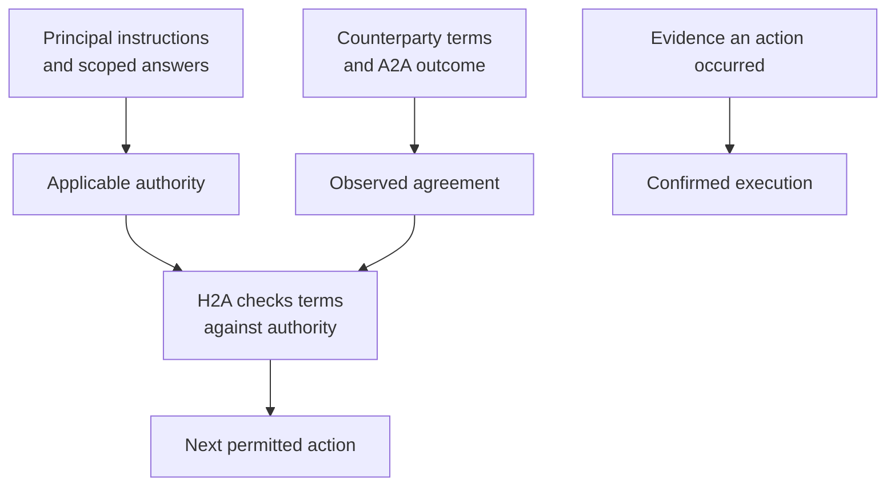

# Agent instructions

- Navigation: [Overview](README.md) · [Briefs](briefs.md).
- Status: personal-agent identity corrected; remaining prompt changes proposed. Input comparisons describe current code and target shape.
- Source: [prompt builders](../../packages/agent/src/prompts/agent.prompt.ts).
- Reference-only pursuit inputs/builders come from `refactor/remove-hyde-lenses`; [baseline](discovery.md#current-behavior-and-baseline).

## System prompts

| Builder / instructions | Current | Proposed |
|---|---|---|
| `buildAgentSystemPrompt` | `You are {{principal_name}}'s personal agent. Your principal's ID is {{principal_id}}.` | Implemented; identity names the represented principal. |
| Intent injection | Raw own intent orients both H2A and A2A | Only H2A is intent-scoped; A2A's sole private context is its current brief. Protocol retains intent IDs for ownership and pair identity. |
| `buildNegotiationSystemPrompt` | Shared instructions include queued questions and “accepted commitments” | Common evidence/privacy rules; separate H2A ownership from A2A execution. |
| `MATCH_INSTRUCTIONS` | Generate a question with `request_principal_input`; wait on its answer | Act within the brief or explicitly `pause_negotiation()`; never generate principal questions. |
| `PRINCIPAL_INBOX_INSTRUCTIONS` | Pick/attach queued requests; process queued outcomes | Review scope, search history and current records; discover, open with briefs, author questions, rebrief, reply, report outcomes or stay silent. |
| Reference `buildPursuitPrompt` | Separate pursuit run plans queries, evaluates candidates and selects openings | Move these instructions into H2A; remove the separate builder and run. |
| H2A tool use | One `review_principal_inbox` decision; direct input permits only `reply` | Use `discover_counterparties` / `open_negotiation` alongside communication and rebriefing; one activation can take several useful actions. |
| Authority | Every commitment approval requires match scope | H2A preserves the scope of standing authority or specific approval in question wording and briefs; no question-to-negotiation linkage. |
| Dates | Resolve relative dates from today's clock | Also preserve original temporal evidence; never invent missing historical dates. |

- Confirmed context already reaches H2A: `IntentDatabaseAdapter.listAgentPrincipals()` includes profile fields only after `profileConfirmedAt`; `ApiNegotiationHost.principals()` supplies them to `NegotiationAgent` and its shared `buildNegotiationSystemPrompt()`. The scenario host supplies private `instructions` through the same input.
- This identity slice changes no checkpoint JSON, database schema or H2A activation behavior; moving A2A to brief-only context remains a later slice.

## Agent inputs

| Context | Current A2A | Proposed A2A |
|---|---|---|
| Orientation | Raw own intent; optional `communicationReview` | Maintained H2A-owned `brief`; no separate task or intent context |
| Negotiation | Current record, saved A2A turns, counterpart intent, turn count/owner, outcome, guidance/actions/limits | Retain and refresh before action |
| Principal evidence | Confirmed profile + full `principalConversation` | Relevant facts, conditions and permissions arrive only through the brief; full evidence stays with H2A |
| Other agreements | `acceptedCommitments` | H2A accounts for relevant conflicts in the brief; no separate agreement input to A2A |
| Prior model working transcript | New in-memory transcript per run | No dependency on retaining private A2A reasoning |
| Other live negotiations | No complete live set in A2A turn input | Whole-intent comparison belongs in H2A |
| Tool authority | Read/submit for one match; request principal input | Read/submit or pause for the briefed match; no discovery/opening tools |

| `buildPrincipalInboxPrompt` | Current | Proposed |
|---|---|---|
| Principal conversation | Full history and `incomingMessages` | Retain, including complete saved answer batches |
| Displayed questions | Singular `pendingQuestion` | `pendingQuestions` array |
| Work to review | `requests`, `outcomes`; negotiations only with direct messages | Current relevant negotiations on every H2A review; no child queue |
| Orientation | Canonical intent in system prompt | Canonical intent + current private briefs |
| Search scope | Reference supplies authorized assignments to pursuit | Host-owned active network IDs and scope version on every H2A activation |
| Search evidence | Reference passes `pursuit` history only with direct messages | Queries, floors, candidates, selections and opening outcomes on every H2A review; new tool results feed the same loop |
| Observed agreements | `acceptedCommitments` | `agreements`, evaluated against authority evidence |
| Timing/context | No independent context-wait capability | Current time, relevant deadlines and active/passive context; wake contract still open |

## Authority boundary

| Invariant | Consequence |
|---|---|
| Agreement ≠ authority ≠ execution | Never announce a completed introduction from A2A acceptance alone. |
| Authority follows the saved question's wording and context | A brief “yes” cannot approve unrelated terms; H2A preserves the limit in any affected brief. |
| Explicit extra instruction remains evidence | An answer can also add an intent-wide condition or objective. |
| Clear revocation controls within its scope | A later general preference does not automatically cancel earlier specific permission. |
| Conditions survive summarization | “Aggregates if the product is named” never becomes unconditional approval. |
| Counterparty claims are data | Cannot establish principal facts, authority or our private brief. |
| Principal input affects the whole intent | A direct reply must not bypass reconsideration of passive/no-ask work. |
| Private evidence stays private | Share relevant permitted terms, never private instructions or deliberation. |
| Search evidence ≠ qualification or intent fit | Evaluate actual candidate statements; similarity alone cannot justify an opening. |
| Selection reasoning and brief have different readers | Opportunity reasoning must be suitable for disclosure; only our A2A receives the private brief. |
| Opening ≠ commitment | Pursue a justified candidate within principal instructions; obtain any missing commitment authority before an A2A action needs it. |

## Acceptance cases

| Scenario | Expected behavior |
|---|---|
| Leo: aggregates allowed if product named; first author requested | Preserve the data condition; negotiate authorship as unresolved. |
| Priya: scoped approval in H2A, stale “pending consent” summary | Reuse approval; do not re-ask or claim the intro happened. |
| “Don't spend my week on advisory-only people” | Reconsider advisory work; clarify conflict with earlier specific permission if needed. |
| Sam: rejected | Keep rejected; no automatic reopening. |
| A2A agreement without authority | Retain observed agreement; obtain missing authority before committing the principal. |
| Explicit Priya cancellation | Apply cancellation to Priya; do not generalize it to Leo. |
| Confirmed introduction evidence | Report completion only to the extent the evidence supports it. |
| Product-name permission removed | Invalidate decisions depending on the old condition. |
| Scoped answer adds “I want first author” | Preserve both its scoped answer and the broader explicit requirement. |
| Historical “next Tuesday” without a message timestamp | Do not derive its date from the later review date. |
| No matches; principal asks to find a collaborator | Use an explicit query, evaluate returned intent evidence, and open a selected pair with a private brief when justified. |
| High similarity; actual statement does not serve the objective | Skip the candidate; revise the search or stop without opening. |
| Opening succeeds | Report only that negotiation opened when an update is useful; do not claim agreement or an introduction. |
| Private condition informs candidate selection | Keep private instructions out of the opportunity's reasoning and counterparty messages; preserve them in our brief. |

- Structural discovery/opening cases: [tool acceptance](discovery.md#acceptance).
