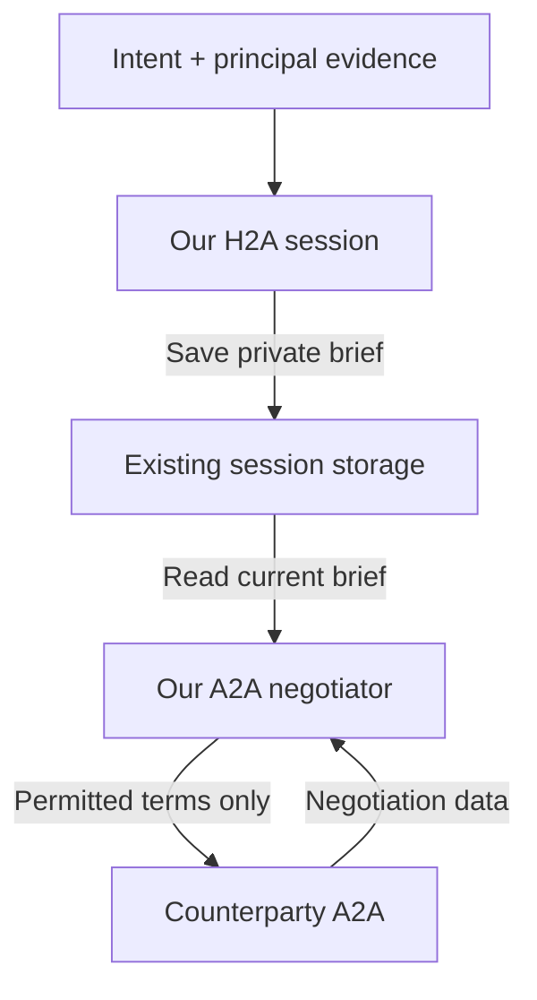
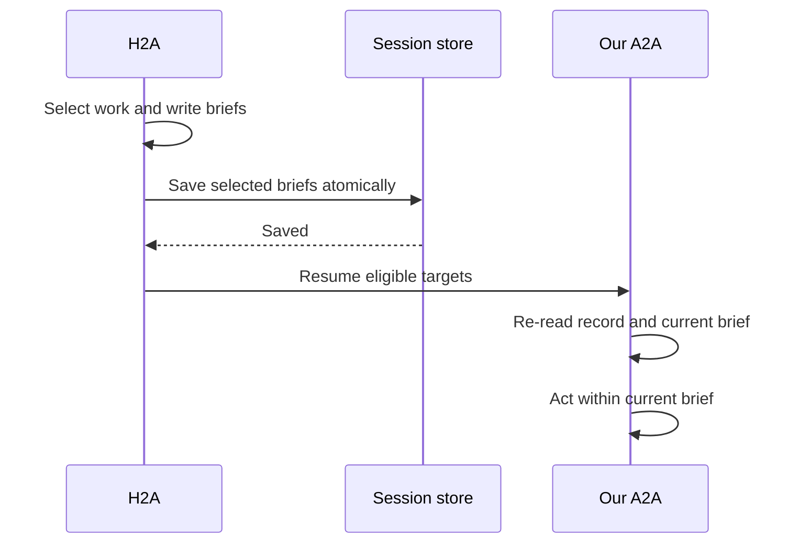

# Briefs

- Navigation: [Overview](README.md) · [Implementation map](spec.md).
- Accepted: intent-scoped H2A exclusively writes and updates our A2A brief when it has useful evidence.
- A2A receives the brief as its only private principal context; protocol records retain intent IDs for ownership and pair identity.

## Ownership

| Content | Rule | Reason |
|---|---|---|
| Objective | Preserve the principal's actual goal | Avoid drifting into a generic intro. |
| Facts and conditions | Use confirmed evidence; retain qualifications | Summaries cannot create facts. |
| Authority | State applicable permission and its scope | One opportunity's approval cannot authorize another. |
| Current focus | Identify the selected counterpart's next unresolved issue | Orient initial and resumed A2A work. |
| Source evidence | H2A keeps full principal history and writes the relevant evidence into the brief | A2A receives no raw principal profile, H2A history, answers or other agreements. |
| A2A orientation | Use the current brief, negotiation record/transcript and protocol rules | No separate task or raw intent input; the brief supplies objectives, facts and authority. |

## Handoff

- Initial outgoing work: H2A supplies `brief` to [`open_negotiation`](discovery.md#opening-and-brief-ordering); persist it before our first A2A run.
- Existing or counterparty-opened work: H2A selects the observed opportunity and uses `reconsider()` below; a received record is insufficient to start an unbriefed negotiation.
- Keep selection `reasoning` suitable for disclosure separate from the private brief.

- Proposed method for existing opportunities: `reconsider(updates: readonly { opportunityId: string; brief: string }[])`.
- Save failure → no dependent resume.
- Reuse saved/runtime `reviewNote` as `brief`; replace turn input `communicationReview` in place.
- Retain the brief across ordinary turns; no H2A call or brief reset after each read.
- Keep per-opportunity briefs in turn inputs; never mutate a shared system prompt.
- New principal input invalidates stale work; older briefs cannot override newer instructions.
- No initial brief → wait for H2A delegation; never synthesize one in A2A or wake H2A to obtain it.
- Current protocol eligibility still applies; a brief cannot reopen completed negotiations.
- Keep briefs and private deliberation out of counterparty messages.
- Questions belong only to H2A, with no question-to-negotiation linkage; answers affect A2A through an H2A-authored brief update.

## Example: Leo

| Brief statement | Source / limit |
|---|---|
| Pursue co-authorship within six weeks. | Principal's intent |
| Aggregates are acceptable only if the product can be named. | Principal's conditional answer |
| Maya wants first authorship; agreement remains unresolved. | Desired term, not an agreed term |
| Address authorship on the next permitted turn; preserve the data condition. | H2A's negotiation focus |
