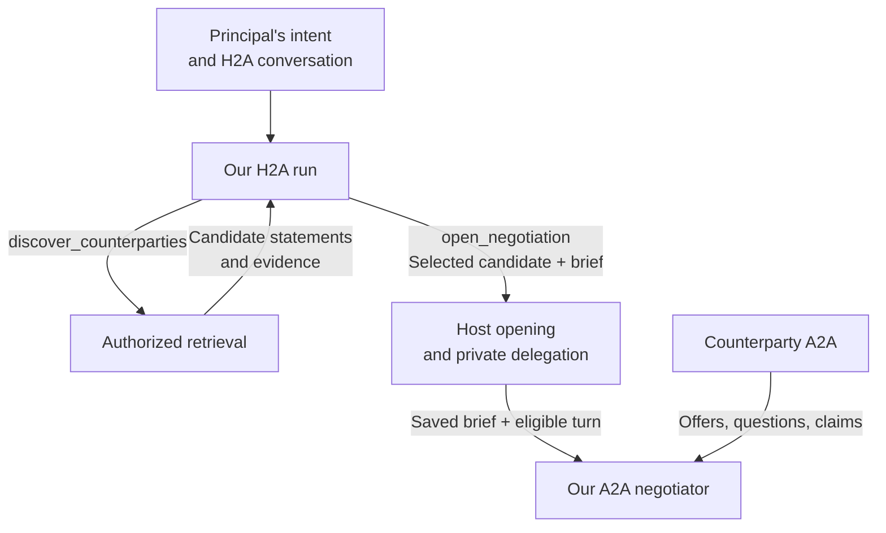
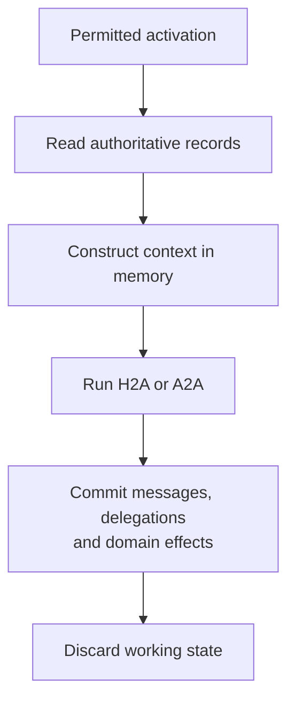
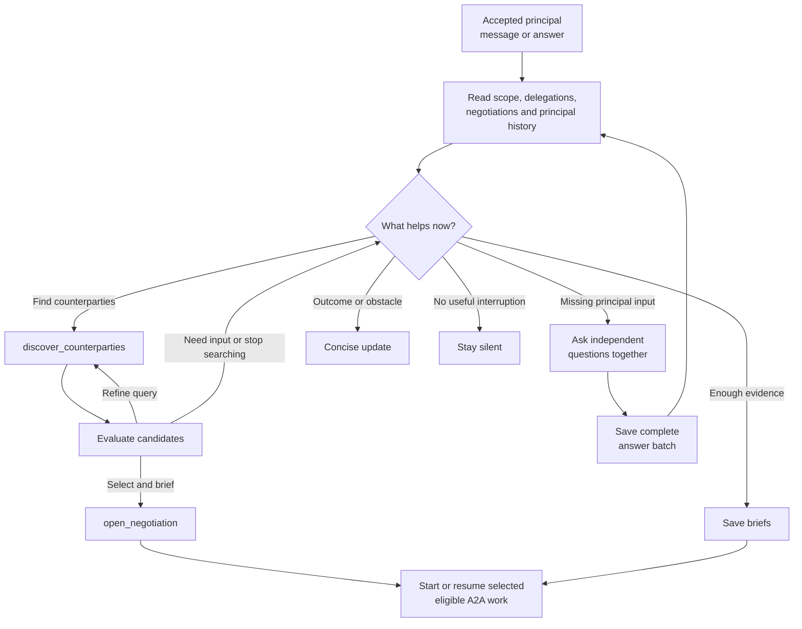

# Design

- Navigation: [Overview](README.md) · [Implementation map](spec.md).
- Accepted ownership and activation below; further wake sources remain deferred.

## Domain ownership

| Decision | Reason |
|---|---|
| H2A owns discovery and opening | The principal's intent, answers and current negotiations inform whom to pursue. |
| Retrieval returns candidates | H2A evaluates actual statements and decides whether to search again or open; no lens/HyDE planning pipeline remains. |
| Host enforces search scope and protocol opening | Model selection cannot grant membership, ownership or execution authority. |
| Intent-scoped H2A owns questions and briefs | Decides whether input is needed, independently of A2A stalls; questions have no negotiation linkage. |
| A2A's only private context is its brief | H2A supplies objectives, facts and authority; no separate task, raw intent or principal history enters A2A. |
| Counterparty text remains negotiation data | Cannot rewrite our brief or establish principal consent. |
| H2A pulls current negotiations | Removes accumulated requests, answer promises and child wakeups. |
| Runtimes reconstruct context from durable records | Removes mutable session snapshots and writes on ordinary reads or execution changes. |

## Runtime reconstruction

- H2A reconstructs from intent/profile, messages, issued/answered/retired questions, current private delegations and live negotiations; accepted user input remains its only activation source.
- A2A reconstructs from the latest H2A-authored brief, negotiation record/transcript and protocol rules; it never regenerates its own brief from principal history.
- Persist a brief only when H2A issues or changes the delegation. Record question retirement explicitly so reconstruction preserves the exact pending batch.
- Commit each output before dependent work; a run that produces no output performs no effect write.
- Searches, candidate lists, task maps, cached observations and model working transcripts remain in memory; a later H2A activation searches again when useful.
- Remove `agent_sessions`, `PrincipalState` snapshots and their revision counter. A read, pause or in-memory scheduling change writes no agent checkpoint.
- Interruption loses unfinished computation; the next permitted activation reassesses committed evidence and reconciles uncertain effects. Reconstruction never invokes the model to recreate a past decision.
- Keep effect deduplication, exclusive execution and stale-context rejection as host guarantees; choose their replacement and the durable output layout in the [implementation map](spec.md#open-storage-and-coordination-decisions).

## H2A review

- Actions may coexist: one H2A review can search, open selected negotiations, reply, rebrief other work and ask questions.
- One H2A tool loop owns these decisions; replace the reference branch's separate pursuit run and the current one-step, reply-only review restriction.
- Search results create no negotiation; only an explicit `open_negotiation` selection crosses that boundary.
- Review the whole intent, including passive negotiations and agreements.
- Active/passive counts inform agent judgment; no count threshold chooses the action.
- A2A pause, arrival, outcome and persistence callbacks never trigger this review.
- Start/resume only selected eligible work with a saved brief; re-read current terms and turn ownership.

## Scope contracts

| Scope | Decision |
|---|---|
| [Discovery and opening](discovery.md) | Reuse explicit-query retrieval and protocol opening; put both tools under H2A and require an initial private brief. |
| [Briefs](briefs.md) | Replace raw intent as A2A orientation with H2A-owned private briefs. |
| [Negotiations](negotiations.md) | Explicit local pause; reuse existing outcomes, turn ownership and history. |
| [Question batches](question-batches.md) | Save all answers before reconsideration or resumption. |
| [Wake patterns](wake-patterns.md) | Accepted user input activates H2A; further wake sources and deadline delivery remain deferred. |
| [Agent instructions](agent-instructions.md) | Separate agreement, authority and confirmed execution. |

## Boundaries

- In scope: `packages/agent`, API host tool/activation wiring, affected TUI consumers and replacement of private session checkpoints with durable output records.
- Implementation baseline: the reference branch removes lenses, HyDE artifacts and automatic pipeline selection/opening; carry that work forward once.
- Outside scope: application layouts, macOS, unrelated infrastructure changes and protocol transitions.
- No new accumulator, consent ledger or generic event-sourcing framework. Remove `agent_sessions` through a migration after its durable outputs and host guarantees have replacements.
- Retain protocol intent IDs for ownership and pair identity; this does not supply A2A with separate intent context.
