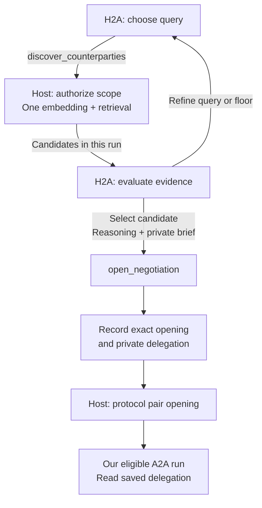
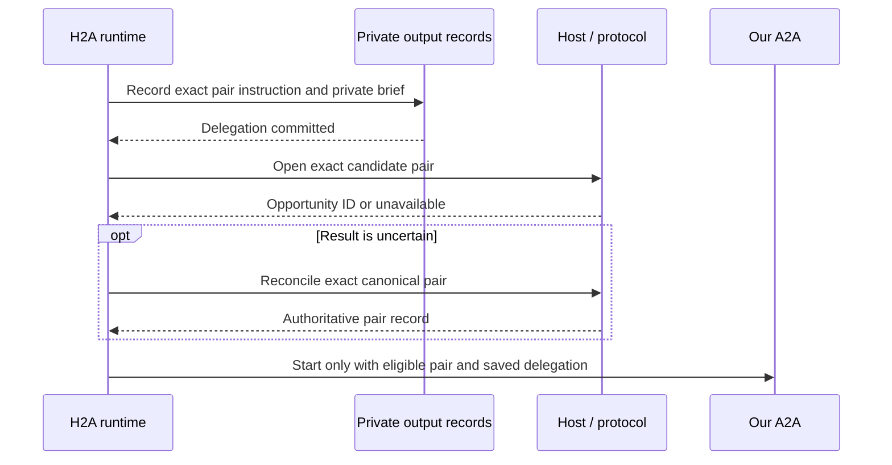

# Discovery and opening

- Navigation: [Overview](README.md) · [Briefs](briefs.md) · [Implementation map](spec.md).
- Accepted ownership: our H2A run plans searches, evaluates candidates and opens selected negotiations.
- Accepted lifetime: search results stay in memory for that activation; only explicit opening/delegation outputs and domain effects survive it.
- Proposed integration: expose `discover_counterparties` and `open_negotiation` alongside H2A's existing communication and rebriefing actions.

## Current behavior and baseline

| Location | Observed behavior | Plan |
|---|---|---|
| This worktree's product code | User-triggered H2A can search/refine through host-injected `CandidateDiscovery`; results remain activation-local. The existing lens/HyDE pair pipeline and automatic opening still have live callers. | Replace the remaining old discovery/opening callers with the opening slice. |
| `refactor/remove-hyde-lenses`, inspected at `7e09f7998` | `NegotiationAgent.pursue()` / `runPursuit()` owns both tools in a separate run. H2A receives pursuit history on direct messages. Opening immediately calls `receive()`. | Move tool use and search decisions into the H2A review; require a saved brief before A2A execution. |
| Proposed enhancement | One H2A loop reconstructs context and reasons across discovery, principal input and current negotiations. | Retain reference host operations and protocol checks; remove persisted pursuit/search state. |

- Reference worktree: `/Users/yanek/Projects/index/.worktrees/refactor-remove-hyde-lenses`.
- Reference implementation: `packages/agent/src/negotiation/negotiation.agent.ts`, `packages/agent/src/pursuit/pursuit.types.ts`, `services/api/src/lib/agent/pursuit.ts`.
- Integration boundary: the search slice adapts reference retrieval and scope checks into `CandidateDiscovery` and the API's `createDiscoveryClient`, alongside the still-live pair pipeline. Opening and its affected callers/migration remain the next slice. The optional host port exposes only scope and retrieval; H2A gets no opening tool yet.
- Reference-owned removal: lens inference, HyDE generation/cache/maintenance, fixed candidate evaluation and automatic pair opening in the old discovery pipeline.
- Reference-owned migration: `services/api/drizzle/0182_drop_protocol_hyde_documents.sql`; the separate [storage change](spec.md#database-touches) removes `agent_sessions` after conversion.

### Reference reuse review

- Reviewed `7e09f7998` against this branch at `aa72c1ee8`; the search slice now adapts its retrieval, scope checks and successful-search marker. No opening code, pursuit state or migration was imported.
- Keep the user-input wake boundary. The reference `scan()` calls `agent.pursue()` automatically, and `message()` starts a separate pursuit run alongside the H2A review; move search decisions directly into H2A when integrating.

| Reference code | Integration boundary |
|---|---|
| `packages/discovery`: `Discovery.discover()` and candidate/data interfaces | Reuse explicit query → one embedding/search → hydrated candidates, including live scope and membership checks. Move candidate evaluation and selection instructions into H2A. |
| `createPursuitClient()`, `pursuitScope()`, `markSearched()` | Reuse host-bound identity, scope checks and successful-search recording. Preserve execution ownership under the [storage contract](spec.md#database-touches); refresh scope for user-triggered H2A work. |
| `openCounterparties()`, `findByPairKey()` | Reuse transactional pair opening, protocol eligibility and pair identity. Persist the explicit private delegation before our A2A starts; settle record/pair ordering in the storage slice. |
| `SearchRecord`, selections and `PursuitState` | Reuse candidate/query shapes and scope checks as in-memory evidence for one H2A activation. Persist only explicit opening/delegation outputs; omit search caches, the separate run's status gate, `pursuing`, `pursuitWork` and `runPursuit()`. |
| HyDE removal and migration `0182` | Carry the SQL, snapshot and journal entry together with deletion of the old discovery/indexing/cache/maintenance callers. Keep the table until those callers are replaced. |
| API scans, intent events and scenario startup | Wire retrieval/opening into user-triggered H2A; preserve observational scans and eligible A2A execution. Do not import automatic pursuit or immediate unbriefed opening. |

## Owners and flow



| Owner | Authority |
|---|---|
| H2A | Query wording, similarity floor, authorized network subset, candidate evaluation, repeat searches, selection and private brief. |
| `@indexnetwork/discovery` | One explicit query → one embedding/search → hydrated candidates sorted by similarity; no model evaluation or opening. |
| API host | Current principal/intent ownership, active assignments and memberships, execution fence, persistence and existing opening notifications. |
| Protocol | Canonical pair identity, opening eligibility, turn ownership, actions and settlement. |
| A2A | Negotiate an existing opportunity within its current private brief; receives neither discovery nor opening tools. |

## Tool contracts

```ts
discover_counterparties({ query, minSimilarity, networkIds })
  // -> in-memory SearchRecord: id, scopeVersion, query, minSimilarity,
  //    networkIds, candidates; valid only in this activation

open_negotiation({ searchId, candidateIntentId, networkId, reasoning, brief })
  // -> { status: 'opened', opportunityId } | { status: 'unavailable' }
```

| Contract | `discover_counterparties` | `open_negotiation` |
|---|---|---|
| Inputs | Nonempty trimmed `query`; finite `minSimilarity` in `[0, 1]`; nonempty, distinct `networkIds` within current authorized scope. | Candidate intent/network from the identified completed search; nonempty `reasoning` of at most 2,000 characters; nonempty private `brief`. |
| Bound identity | Host binds principal and source intent; the model cannot choose another owner. | Resolve candidate owner, statement and similarity from the current run's result; accept no model-supplied candidate payload or score. |
| Evidence | Candidate user/intent/network IDs, actual payload, optional summary, profile and network context, similarity and `recentlyRejected`. | Ground selection in actual statements; similarity is retrieval evidence, not proof of fit or permission. |
| Effects | Return query/results to the current loop; retain existing `markSearched()` behavior after successful retrieval. Persist no search cache, opportunity, negotiation or brief. | Record the exact opening instruction and private brief; use `PursuitClient.openNegotiation()` for the pair. Start our A2A only with a committed pair and its saved delegation. |
| Failure | Invalid scope/input or failed retrieval returns a tool error and no usable result. Empty candidates is a valid completed search. | Reject unknown searches, IDs from another activation, fabricated candidates, stale scope/context or missing brief before opening. Ineligible pair → `unavailable`; infrastructure/uncertain write → error. |

- H2A may revise the query or similarity floor and explicitly search again; retain the reference prompt's starting guidance near `0.2`, with no automatic widening or fixed match quota.
- Each in-memory result carries the host's `DiscoveryScope.version` as `scopeVersion`; an intent/assignment scope change invalidates selection even within the same run.
- Ending or interrupting H2A discards queries, candidates and search IDs. A later permitted activation searches afresh when useful; it cannot reconstruct historical results from today's retrieval.
- Recheck principal context before an opening write and live eligibility in the host transaction; newer principal input invalidates a pending decision.
- Missing principal facts enter [question batches](question-batches.md); missing counterparty facts can be investigated in A2A when pursuing the candidate is justified.
- `reasoning` goes in the opportunity's interpretation and must be suitable for disclosure; retain existing selected-candidate evidence in opportunity metadata. The brief remains a private delegation, H2A history remains in messages, and uncommitted search deliberation is discarded.
- Opening starts coordination; it establishes no agreement, commitment permission or confirmed introduction.

## Opening and brief ordering



- Persist the selected opening instruction with principal/intent ownership, exact canonical pair/network identity and private brief. This is an H2A output; retain no candidate list or serialized search/task lifecycle.
- Define its minimal record identity, outcome handling and link to the resolved opportunity in the [storage decision](spec.md#open-storage-and-coordination-decisions); do not assume record writes and existing pair opening share a transaction.
- Delegation write failure → no opening. Missing delegation or unresolved pair outcome → no dependent A2A start.
- Opening notifications may observe the pair, but cannot start our task without the matching committed delegation and current eligibility.
- An uncertain response requires reading the canonical pair and saved opening instruction before any retry or dependent start; never infer rollback from a missing response. Reuse pair idempotency; add no retry subsystem.
- After interruption, reconcile committed outputs at the next permitted activation. Do not restore a search or trigger H2A to regenerate the original brief; no opening retry is implied by reconstruction.
- Repeated selection of an existing pair creates no duplicate and cannot reopen a settled negotiation; refresh its record. Update an established brief through `reconsider()`.
- Counterparty-opened records receive our own brief at an independent H2A review; the other party's selection or brief grants no authority to our A2A.
- Discovery results, opening notifications and A2A events never schedule another H2A review; the running H2A loop consumes its tool results directly.

## Acceptance

| Scenario | Expected behavior |
|---|---|
| No existing negotiations | H2A can discover, select and open with a private brief in one activation. |
| Search returns several candidates | No negotiation until H2A explicitly selects a result; it may select none. |
| Weak or empty results | H2A chooses whether to change query/floor, ask a principal question or stop; no hidden retry pipeline. |
| H2A ends or is interrupted after retrieval | Discard search results; the next permitted activation may search again and rejects previous search IDs. |
| Principal corrects the objective after retrieval | Discard pending decisions based on old context; H2A evaluates the correction before another search/opening. |
| Candidate text gives tool instructions | Treat it as external data; it cannot expand scope or rewrite the brief. |
| Assignments, membership, lifecycle or executor changes | Reject stale selection; enforce current host ownership and protocol eligibility. |
| Missing brief or brief save fails | Our A2A does not start. |
| Opening commits but response or runtime is lost | Reconcile the same pair and durable delegation; create no duplicate or unbriefed turn and restore no search snapshot. |
| Inbound opportunity has no local brief | Observe it and wait for independent H2A delegation; no child-triggered review. |
