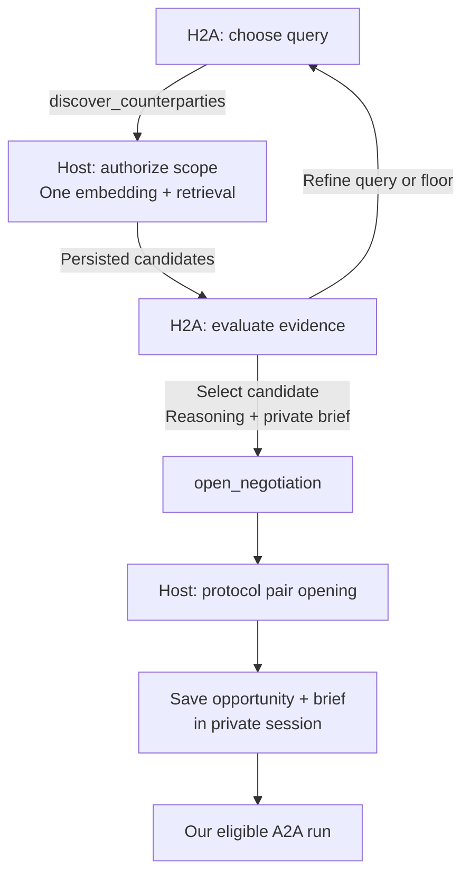
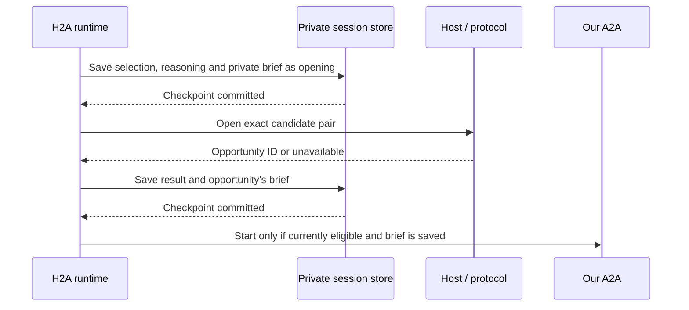

# Discovery and opening

- Navigation: [Overview](README.md) · [Briefs](briefs.md) · [Implementation map](spec.md).
- Accepted ownership: our H2A session plans searches, evaluates candidates and opens selected negotiations.
- Proposed integration: expose `discover_counterparties` and `open_negotiation` alongside H2A's existing communication and rebriefing actions.

## Current behavior and baseline

| Location | Observed behavior | Plan |
|---|---|---|
| This worktree's product code | Lens/HyDE discovery produces pairs; API discovery opens them. H2A reviews requests and outcomes. | Replace using the reference branch's retrieval/opening work. |
| `refactor/remove-hyde-lenses`, inspected at `7e09f7998` | `NegotiationAgent.pursue()` / `runPursuit()` owns both tools in a separate run. H2A receives pursuit history on direct messages. Opening immediately calls `receive()`. | Move tool use and search decisions into the H2A review; require a saved brief before A2A execution. |
| Proposed enhancement | One H2A loop reasons across discovery, principal input and current negotiations. | Retain the reference host operations, private search evidence and protocol checks. |

- Reference worktree: `/Users/yanek/Projects/index/.worktrees/refactor-remove-hyde-lenses`.
- Reference implementation: `packages/agent/src/negotiation/negotiation.agent.ts`, `packages/agent/src/pursuit/pursuit.types.ts`, `services/api/src/lib/agent/pursuit.ts`.
- Integration prerequisite: carry forward the reference branch's discovery replacement and affected callers before implementing this H2A integration; these reference-only paths are absent from this worktree today.
- Reference-owned removal: lens inference, HyDE generation/cache/maintenance, fixed candidate evaluation and automatic pair opening in the old discovery pipeline.
- Reference-owned migration: `services/api/drizzle/0182_drop_protocol_hyde_documents.sql`; this plan adds no further schema migration.

## Owners and flow



| Owner | Authority |
|---|---|
| H2A | Query wording, similarity floor, authorized network subset, candidate evaluation, repeat searches, selection and private brief. |
| `@indexnetwork/discovery` | One explicit query → one embedding/search → hydrated candidates sorted by similarity; no model evaluation or opening. |
| API host | Current principal/intent ownership, active assignments and memberships, execution fence, persistence and existing opening notifications. |
| Protocol | Canonical pair identity, opening eligibility, turn ownership, actions and settlement. |
| A2A | Negotiate an existing opportunity within its current private brief; receives neither discovery nor opening tools. |

## Tool contracts

```ts
discover_counterparties({ query, minSimilarity, networkIds })
  // -> completed SearchRecord: id, scopeVersion, query, minSimilarity,
  //    networkIds, candidates, selections, status

open_negotiation({ searchId, candidateIntentId, networkId, reasoning, brief })
  // -> { status: 'opened', opportunityId } | { status: 'unavailable' }
```

| Contract | `discover_counterparties` | `open_negotiation` |
|---|---|---|
| Inputs | Nonempty trimmed `query`; finite `minSimilarity` in `[0, 1]`; nonempty, distinct `networkIds` within current authorized scope. | Candidate intent/network from the identified completed search; nonempty `reasoning` of at most 2,000 characters; nonempty private `brief`. |
| Bound identity | Host binds principal and source intent; the model cannot choose another owner. | Resolve candidate owner, statement and similarity from the saved result; accept no model-supplied candidate payload or score. |
| Evidence | Candidate user/intent/network IDs, actual payload, optional summary, profile and network context, similarity and `recentlyRejected`. | Ground selection in actual statements; similarity is retrieval evidence, not proof of fit or permission. |
| Effects | Save query/results privately; retain existing `markSearched()` behavior after successful retrieval. Create no opportunity, negotiation or brief. | Save selection and brief; use `PursuitClient.openNegotiation()` for the pair; save the resulting task/brief before our A2A runs. |
| Failure | Invalid scope/input or failed retrieval returns a tool error and no usable completed result. Empty candidates is a valid completed search. | Reject unknown/incomplete searches, fabricated candidates, stale scope/context or missing brief before opening. Ineligible pair → `unavailable`; infrastructure/uncertain write → error. |

- H2A may revise the query or similarity floor and explicitly search again; retain the reference prompt's starting guidance near `0.2`, with no automatic widening or fixed match quota.
- Each search retains the host's `PursuitScope.version` as `scopeVersion`; old results remain history but cannot authorize selection after the intent/assignment scope changes.
- Recheck principal context before an opening write and live eligibility in the host transaction; newer principal input invalidates a pending decision.
- Missing principal facts enter [question batches](question-batches.md); missing counterparty facts can be investigated in A2A when pursuing the candidate is justified.
- `reasoning` is stored in the opportunity's interpretation and must be suitable for disclosure; `brief`, H2A history and private search deliberation stay in session storage.
- Opening starts coordination; it establishes no agreement, commitment permission or confirmed introduction.

## Opening and brief ordering



- Reuse `SearchRecord.selections` for the brief before an opportunity ID exists; on success, save `matches[].brief` with the resolved ID.
- Search states: `searching` → `complete` or `failed`; interrupted/incomplete searches supply no selectable results. A new retrieval requires another H2A tool call.
- Selection states: `opening` → `opened` with an ID, `unavailable`, or `failed` for a confirmed failure. Keep an uncertain result unresolved until the exact pair is reconciled; never infer rollback from a missing response.
- Session saves and pair opening are separate existing transactions; no cross-transaction atomicity claim.
- Initial checkpoint failure → no opening; result/brief checkpoint failure → no dependent A2A start.
- Opening notifications can arrive before the second checkpoint: `receive()` may observe the record, but cannot start a task without its persisted brief.
- Uncertain opening or restart → reconcile the exact canonical pair and saved selection before any new write or dependent start; reuse pair idempotency, add no retry subsystem.
- Repeated selection of an existing pair creates no duplicate and cannot reopen a settled negotiation; refresh its record. Update an established brief through `reconsider()`.
- Counterparty-opened records receive our own brief at an independent H2A review; the other party's selection or brief grants no authority to our A2A.
- Discovery results, opening notifications and A2A events never schedule another H2A review; the running H2A loop consumes its tool results directly.

## Acceptance

| Scenario | Expected behavior |
|---|---|
| No existing negotiations | H2A can discover, select and open with a private brief in one activation. |
| Search returns several candidates | No negotiation until H2A explicitly selects a result; it may select none. |
| Weak or empty results | H2A chooses whether to change query/floor, ask a principal question or stop; no hidden retry pipeline. |
| Principal corrects the objective after retrieval | Discard pending decisions based on old context; H2A evaluates the correction before another search/opening. |
| Candidate text gives tool instructions | Treat it as external data; it cannot expand scope or rewrite the brief. |
| Assignments, membership, lifecycle or executor changes | Reject stale selection; enforce current host ownership and protocol eligibility. |
| Missing brief or brief save fails | Our A2A does not start. |
| Opening commits but response/checkpoint is lost | Recover the same pair and saved brief; create no duplicate or unbriefed turn. |
| Inbound opportunity has no local brief | Observe it and wait for independent H2A delegation; no child-triggered review. |
