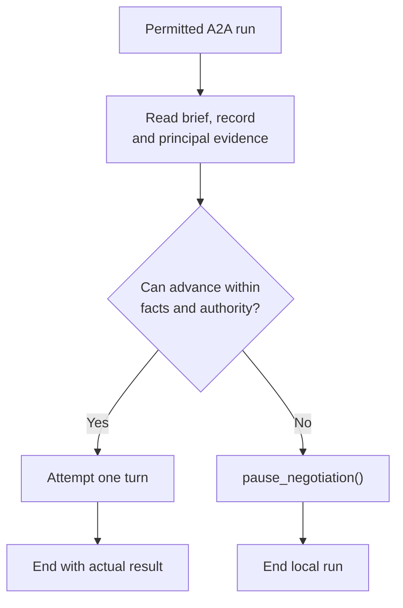

# Negotiations

- Navigation: [Overview](README.md) · [Discovery and opening](discovery.md) · [Briefs](briefs.md).
- Decision: A2A can end a local run without a protocol turn or principal question.
- Entry: H2A selects/opens the counterpart and saves a private brief; inbound opportunities wait for our H2A's own delegation.

## Session lifetime

| Component | Current behavior | Proposed behavior |
|---|---|---|
| Personal-agent runtime | `PersonalAgentService` keeps one hosted runtime per eligible principal/intent, independent of HTTP requests and browser connections. Its lease covers H2A and the local A2A tasks. | Retain the host lifecycle and shared lease; H2A can be idle while A2A runs. |
| A2A task | One task per opportunity; negotiation events reach `receive()` / `drain()`. On our turn, build fresh model working history from the saved negotiation and principal context. | Retain event-driven turns; also require a persisted local brief. No H2A model call for ordinary A2A turns. |
| H2A activation | Principal input, queued A2A requests/outcomes and inbox restoration schedule reviews. `request_principal_input` keeps the A2A task waiting for inbox resolution. | Principal/independent activation owns review; A2A pauses locally and creates no H2A request or wakeup. |
| Durable context | H2A messages and `agent_sessions.state`; shared negotiation records and turn log. | Reuse storage; private briefs and search history join the checkpoint. Neither an open chat nor an ongoing H2A model call is required. |

- H2A attention is required for initial delegation, missing principal evidence and rebriefing; [independent wake timing](wake-patterns.md#open-decisions) determines when unbriefed/paused work advances.
- Sources: [personal-agent service](../../services/api/src/services/personal-agent.service.ts), [agent runtime](../../packages/agent/src/negotiation/negotiation.agent.ts).

## Local execution

| Capability / function | Contract |
|---|---|
| Proposed `pause_negotiation()` | No arguments; explicit successful local completion before any submission attempt. |
| `submit_turn` | At most one attempt; preserve current actions, context-version and expected-turn-count checks. |
| `run` | Accept explicit pause or a submission result; arbitrary prose alone is not a valid completion. |
| `receive` / `drain` | Observe opened/updated records; require a persisted local brief before execution. Avoid concurrent runs and repeats for unchanged observations. |
| `remember` / `complete` | Record observed state; never enqueue H2A work or mutate displayed questions. |
| `restore` | Reconcile records; never restart every unfinished task automatically. |

- Pause writes no protocol turn, outcome, question, pending-answer promise or stall reason.
- Never pause or retry after a failed/uncertain submission attempt; retain the actual failure.
- Subsequent meaningful A2A turns may run under an existing brief, subject to protocol rules.
- Unchanged observations leave locally paused work idle; H2A may explicitly rebrief/resume it.
- A2A messages, pauses and outcomes never wake H2A.
- Discovery and opening tools belong only to H2A; an A2A child cannot search for or open another counterpart.

## Existing state → H2A context

| Existing record | Interpretation | Review behavior |
|---|---|---|
| `outcome = null`, `awaitingUserId = principalId` | Our turn; candidate for stalled work | Check active execution and conversation. |
| Same record + local task running | Already executing | Do not launch a duplicate run. |
| `outcome = null`, awaiting counterparty | Waiting on them | Include when relevant to whole-intent decisions. |
| `outcome = null`, `awaitingUserId = null` | May be an unsettled turn-limit case | Include; inspect current protocol restrictions. |
| Outcome `agreed`, `declined` or `closed` | Negotiation outcome | Assess significance, authority and prior H2A reporting. |

- Existing fields: `protocol_negotiations.outcome`, `awaiting_user_id`, `settled_at`.
- Existing transcript: `protocol_negotiation_turns`.
- Candidate filter: `outcome IS NULL AND awaiting_user_id = principal_id`.
- Candidate filter alone is insufficient for the complete H2A review.
- A2A pause is local execution behavior; no new stored `stalled` status.
- Sources: [schema](../../services/api/src/schemas/database.schema.ts), [turn rules](../../packages/protocol/src/protocol/negotiation.rules.ts).

## Why work cannot proceed

| Evidence | What H2A can infer |
|---|---|
| A2A conversation + principal history + brief | Missing fact, unresolved condition or absent authority |
| Existing protocol guidance / available actions | Turn restrictions and permitted next actions |
| Existing protocol `blockedReason` | Mechanical restrictions; retain this existing context |
| Silence alone | No reliable claim about a technical failure |

- No new semantic `blockedReason` field or required A2A explanation.
- No child-to-H2A obstacle-report queue.
- Re-check the live record before acting on an earlier review.
