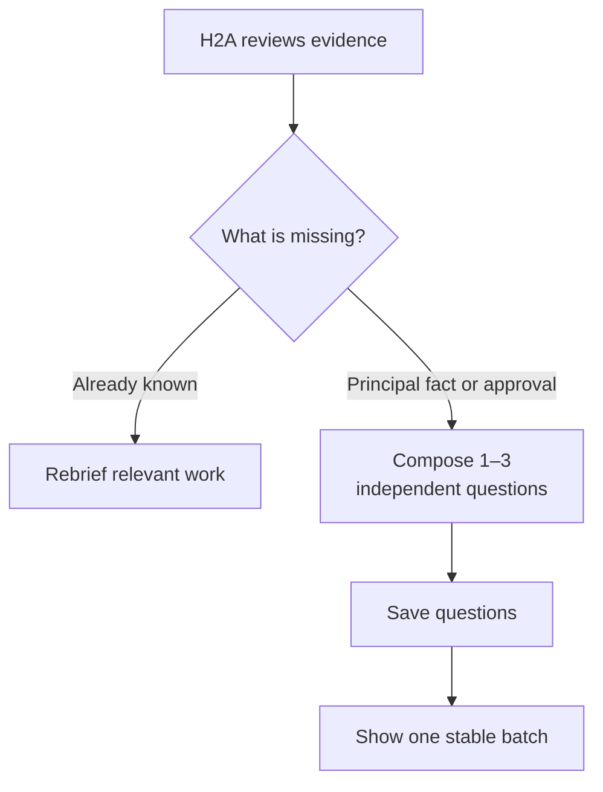

# Question batches

- Navigation: [Overview](README.md) · [Agent instructions](agent-instructions.md).
- Decision: H2A authors independent questions; the principal submits one complete answer batch.
- Ownership: questions belong to the intent-scoped H2A conversation, with no negotiation references or A2A answer waits.

## Ask



| Rule | Contract |
|---|---|
| Batch size | 1–3 useful questions; never fill a quota. |
| Options | 2–4 concise suggestions per question; custom text remains available. |
| Ownership | H2A may ask before or after negotiations exist; no opportunity IDs or match-scoped question metadata. |
| Permission scope | Preserve the specific terms and limits in the question and answer wording; H2A carries applicable authority into briefs. |
| Independence | Separate unrelated decisions; defer follow-ups that depend on another answer. |
| Coherent offer | Several terms may form one approval for one opportunity. |
| Stability | IDs, wording and options stay fixed until answered or retired by H2A. |
| Reconstruction | Record issued questions with batch membership; derive pending questions by excluding answered and explicitly retired IDs. No saved pending-question array. |
| Later A2A arrivals | Do not append to, replace or retire displayed questions. |

## Answer

```mermaid
sequenceDiagram
    participant P as Principal
    participant H as H2A
    participant S as Question and answer records
    P->>H: Submit complete answer array
    H->>S: Validate current batch and insert all answers
    Note over S: Re-read issued, answered and retired IDs atomically
    S-->>H: Answers committed; pending batch derives empty
    H->>H: Reconstruct context and interpret whole batch
    Note over H: Save selected briefs before A2A resumes
```

```ts
export interface PrincipalAnswer { questionId: string; text: string }
get pending(): readonly PrincipalQuestion[];
answer(answers: readonly PrincipalAnswer[]): Promise<readonly PrincipalMessage[] | null>;
message(text: string): Promise<PrincipalMessage | null>;
```

| Submission / event | Required behavior |
|---|---|
| Exact current IDs; one nonempty answer each | Save together with the context of the exact displayed questions. |
| Missing, extra, duplicate, empty, stale or retired ID | Return `null`; save nothing and resume nothing. |
| Save failure | Reject; publish no dependent effect and resume nothing. |
| Uncertain client result / retry | Reconcile saved batch/history; never create duplicate answers or resumes. |
| Draft answer | No persistence or negotiation effects. |
| “I don't know” | Save explicit uncertainty; do not immediately repeat the same question. |
| Direct message during a batch | Save as `user`; interpret in H2A, never assign it arbitrarily to a question. |
| Explicit correction makes a question obsolete | H2A records retirement of that exact ID; retain unrelated questions/drafts and reject obsolete submissions. |
| Runtime is discarded and context rebuilt | Recover exact wording, options and remaining IDs from records; answered or retired questions stay absent without a model call. |

- Preserve full answer text, including conditions, uncertainty and additional instructions.
- Validate the complete current batch and insert its answers in one host transaction under concurrency control; there is no checkpoint or separate pending array to clear. [Storage guarantees](spec.md#database-touches)
- Reconstruction must use explicit issuance/answer/retirement records; do not infer retirement or silently assign a direct message to a question with another model call.
- After save: reconsider the whole intent, even with no waiting negotiation; H2A may use the answers to revise discovery, select a counterpart or rebrief existing work.
- Questions need no negotiation or search candidate; H2A decides whether to ask from its intent context.
- Resume selected eligible work only after H2A saves its updated briefs; A2A receives no raw answers.
- New terms/turn ownership can invalidate an intended resume; refresh before acting.
- Remove request attachments and release-all answer promises; retain canonical H2A history.
- Keep `PrincipalQuestion`, `PrincipalMessage` and generic `Agent.ask_user`.
