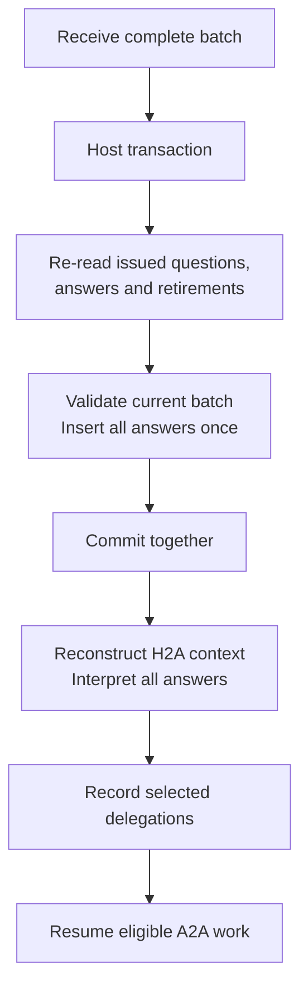

# Implementation map

- Navigation: [Overview](README.md) · [Design](design.md).
- Accepted: [runtime reconstruction](design.md#runtime-reconstruction) replaces session checkpoints; resolve the storage and coordination decisions below before that implementation slice.
- Activation: accepted user input only; further [wake-policy decisions](wake-patterns.md#open-decisions) remain deferred.
- Agent paths below: relative to `packages/agent/src`; change existing behavior in place.
- Baseline: [reference branch and integration boundary](discovery.md#current-behavior-and-baseline); reference-only symbols below do not exist in this worktree yet.

## Implementation order

- Follow [TODO.md](TODO.md) one small slice at a time; inspect the code and discuss or revise details during implementation.
- Choose minimal durable output records, conversion and host coordination before removing checkpoint storage; do not invent additional wake sources to recover an interrupted run.

## Functions

| Location | Change | Contract |
|---|---|---|
| `negotiation/negotiation.agent.ts`: reference `pursue`, `runPursuit` | Move search/open tool handlers into H2A's tool set; remove the separate model run and its lifecycle. | [Discovery and opening](discovery.md) |
| `negotiation/principal.inbox.ts`: `review`, `validate`, `apply` | Replace `maxSteps: 1`, one-decision and reply-only restrictions with H2A tool use; consume search/open results and current negotiations, then apply questions, briefs and messages. | [Discovery and opening](discovery.md), [design](design.md) |
| `pursuit/pursuit.types.ts`: reference `CandidateQuery`, `PursuitClient`, `SearchRecord` | Reuse query/candidate/host contracts; keep scope versions and results within one activation. Remove persisted search history and its lifecycle. | [Tool contracts](discovery.md#tool-contracts) |
| `negotiation/negotiation.agent.ts`: `tools`, `run` | Replace `request_principal_input` with explicit `pause_negotiation()`. | [Negotiations](negotiations.md) |
| `receive`, `drain`, `remember`, `complete` | Observe records without H2A scheduling or question mutation; start only with a persisted local brief and current eligibility. | [Negotiations](negotiations.md) |
| Proposed `reconsider(updates)` | Save selected opportunity/brief pairs, invalidate stale context, resume eligible targets. | [Briefs](briefs.md) |
| `checkpoint`, `restore`; `negotiation/principal.state.ts`: `PrincipalState`, `PrincipalStore` | Remove snapshot/save contracts. Read records to construct fresh context; write explicit outputs through host operations and reconcile uncertain effects. | [Reconstruction](design.md#runtime-reconstruction), [opening order](discovery.md#opening-and-brief-ordering) |
| `message`, `answer`, `pending` | Allow direct messages during a batch; expose questions and accept answers as arrays. | [Question batches](question-batches.md) |
| `cancel`, `snapshot`, `restore` | Remove inbox snapshots; derive pending questions from durable question/answer/retirement records. Only H2A retires obsolete questions. | [Question batches](question-batches.md) |
| `prompts/agent.prompt.ts` | Fold reference `buildPursuitPrompt` instructions into H2A; update identity, H2A/A2A instructions and inputs. Delete the unused builder. | [Agent instructions](agent-instructions.md) |
| `index.ts`, README, examples | Export `PrincipalAnswer` and agreed host operations; remove checkpoint-only exports and update all callers. | [Question batches](question-batches.md), [integration](#integration) |

## State changes

| Existing / reference | Durable source | Reconstructed or ephemeral context |
|---|---|---|
| `PrincipalState` / `agent_sessions.state` | Explicit outputs and existing domain records | Construct H2A/A2A context on demand; no saved runtime snapshot |
| `PrincipalState.pursuit` / `SearchRecord` | Only the selected opening instruction and existing opportunity evidence survive a run | Query, candidates, `scopeVersion` and search IDs stay in memory; no cross-activation search history |
| Saved match `record` and `commitments` | Protocol negotiations and turns | Read current negotiations and derive factual `agreements`; assess authority separately |
| `InboxState.question` | Issued questions, complete answer batches and explicit retirements | Derive `PrincipalQuestion[]`; preserve wording, IDs, options and batch membership |
| Match `reviewNote` / turn `communicationReview` | H2A-authored private delegation | Load current `brief` for each A2A run; persist only issuance or a meaningful update |
| A2A raw intent, principal profile/history and other commitments | Principal evidence remains available to H2A | Remove separate A2A inputs; H2A supplies applicable objectives, evidence and authority through the brief |
| Question `scope` / `matches` | Question and answer wording retain permission limits | Remove question-to-negotiation linkage |
| H2A messages / `incomingMessageIds` | Canonical messages, including accepted input | Rebuild history at activation; current input scheduling remains in memory |
| Task maps, cached observations, model transcripts and context version | No runtime snapshot | Rebuild or discard with the run; host effect guards remain required |

- Durable output records need stable identity and ordering; they must not mirror `PrincipalState` under another table or JSON field.
- No saved “processed input” snapshot: after interruption, committed input remains in history for the next permitted review. Exact continuation of an unfinished model/tool loop is not promised.

## Delete

- Reference `runPursuit`, its separate `Agent.run()`, `pursuing` / `pursuitWork` lifecycle and direct-message pursuit restart; route callers into H2A activation.
- Reference `buildPursuitPrompt` after moving its decision instructions into H2A; no parallel discovery agent or done/failed gate blocking later H2A searches.
- A2A request/outcome queues, `InputRequest`, queue-only `Outcome`, request IDs/attachments and `reviewed`.
- `waitFor`, `request`, `outcome`, `queuedQuestions` and dead queue-only callers.
- Completed in the [first slice](TODO.md#first-slice-prevent-a2a-from-waking-h2a): `schedule(delay)`, its timer, `immediate`, queue-based `hasWork()`, request `reviewed` and automatic inbox `resume()` scheduling; the unused generic timer-driven `Inbox` and its exports are also deleted.
- Previous proposed accumulator fields: `reviewPending`, `deferredReview`, persisted stall reasons and obstacle queues.
- Separate A2A task/intent orientation and direct principal-context inputs; retain protocol intent IDs and execution guards.
- `PrincipalState`, `InboxState` snapshot serialization, `PrincipalStore.load/save/close`, `MemoryPrincipalStore` and checkpoint-only callers/exports after replacing their host responsibilities.
- `agent_sessions`, its revision counter, heartbeat/lease implementation and persisted search/task copies after data conversion and replacement of required execution guards.

## Database touches

- Schema/DDL: remove `agent_sessions` through a migration; any minimal schema support for durable outputs depends on the storage decision below. The earlier no-schema-change constraint is superseded. The reference branch separately drops `protocol_hyde_documents`.
- Data conversion: extract required question status, usable delegation evidence and unresolved opening identity before dropping checkpoints; discard search caches and runtime snapshots. Preserve canonical messages and protocol records; add no runtime dual-read path.
- Access: replace `PrincipalStore` with record reads and explicit output writes; retain `NegotiationClient` and reference `PursuitClient` responsibilities. The host owns SQL, retrieval and concurrency control.
- Store private delegations and explicit question retirements as domain outputs. Do not move the checkpoint blob into `conversation_metadata`, add a generic event journal, or create an A2A session table.
- Resolve H2A history through the existing agent DM and intent-tagged messages; removing session linkage must preserve that read path.
- Table names below are SQL names; columns list the relevant reads/writes, with ordinary IDs/timestamps supplied by existing helpers.

| SQL table | Existing columns | Read / write and contract |
|---|---|---|
| `agent_sessions` | All columns, including `state`, `revision`, `conversation_id`, `lease_token`, `lease_expires_at` | Remove the table and callers after conversion and host guard replacement; no per-activation checkpoint writes. |
| `messages` | `conversation_id`, `session_id`, `sender_id`, `role`, `parts`, `metadata`, `created_at` | Preserve canonical H2A history and full text; retain intent/message identity, exact questions and batch membership, removing negotiation linkage from new questions. Save each complete answer batch atomically. |
| `conversation_sessions` / `conversations` | Session: `conversation_id`, `started_at`, `last_message_at`; conversation: `last_message_at`, `updated_at` | Existing message helper assigns the timeline session and updates activity within the message transaction; these are independent of the removed runtime checkpoints. |
| `protocol_intents` | `user_id`, `payload`, `summary`, `embedding`, `status`, `archived_at`, `updated_at`, `first_discovery_succeeded_at` | Read real intent embeddings, statements and lifecycle; retain reference `markSearched()` updating `first_discovery_succeeded_at` after a successful search. No query embedding/artifact is stored here. |
| `protocol_intent_networks` | `intent_id`, `network_id`, `created_at` | Read assignments and their contribution to the scope version; tools do not change assignments. |
| `protocol_network_members` | `user_id`, `network_id`, `deleted_at`, `updated_at` | Read current memberships and their revision for scope/eligibility checks. |
| `protocol_networks` | `title`, `prompt`, `permissions`, `deleted_at` | Read authorized network context and live-network eligibility. |
| `users` | `name`, `intro`, `location` | Read candidate profile identity through the existing profile builder. |
| `protocol_agents` | `owner_id`, `type`, `handle_negotiations`, `deleted_at` | Retain existing hosted/external executor checks; tools do not change executor configuration. |
| `protocol_opportunities` | `actors`, `status`, `updated_at`; opening also writes `detection`, `interpretation`, `context`, `confidence`, `metadata` | Read recent rejections; insert the selected opportunity through `openCounterparties()`. Shareable reasoning goes in `interpretation`, retrieval evidence in `metadata`; private briefs stay out. |
| `protocol_negotiations` | `pair_key`, `opportunity_id`, `initiator_user_id`, `initiator_intent_id`, `responder_user_id`, `responder_intent_id`, `awaiting_user_id`, `outcome`, `settled_at`, `updated_at` | Read current negotiations; insert the pair in the same transaction as its opportunity. Reuse existing turn/settlement writes and pair uniqueness; pause adds no status. |
| `protocol_negotiation_turns` | `negotiation_id`, `turn_index`, `seat_user_id`, `action`, `message` | Read the transcript; existing `submitTurn()` inserts actual A2A turns. Opening, pause, briefs and principal questions create no synthetic turn. |

- Validate and insert answers under host concurrency control; the derived pending batch changes only after commit. Rollback → no partial answers, notifications or dependent resumes.
- Opening requires a durable delegation tied to the exact pair before our A2A starts; use [opening and brief ordering](discovery.md#opening-and-brief-ordering). Do not assume separate record and pair writes are atomic.
- Publish messages/pending-batch notifications only after commit; duplicate requests must not publish the same effect again.
- Sources: [domain schema](../../services/api/src/schemas/database.schema.ts), [conversation schema](../../services/api/src/schemas/conversation.schema.ts), [session adapter](../../services/api/src/adapters/agent-session.database.adapter.ts), [opening adapter](../../services/api/src/adapters/negotiation.database.adapter.ts).

## Open storage and coordination decisions

| Decision before implementation | Required result |
|---|---|
| Minimal output record layout | Persist principal/intent ownership, exact delegated target and brief, stable question/batch identity and explicit retirements. Define authoritative ordering and reads; keep private outputs out of counterparty records. |
| Opening persistence boundary | Preserve only the exact opening instruction, private brief and evidence needed to reconcile an uncertain effect. Define the record/pair transaction boundary; do not persist the search cache or a task lifecycle. |
| Host execution ownership and duplicate delivery | Replace the session lease without competing executors or duplicate effects. Define how repeated notifications leave unchanged paused work idle across reconstruction; turn-count checks alone do not protect H2A writes. |
| Stale-context rejection | Before committing an effect, reject decisions superseded by principal input, delegation changes, scope/executor changes or negotiation turns. Do not reintroduce a revisioned agent snapshot. |
| One-time conversion | Preserve exact current questions, principal history and unresolved effects. Decide which old review notes contain usable delegation evidence; never manufacture authority from a transient note. |

- Keep these decisions open until the storage slice; this design does not select a new coordination service or prescribe a general replay framework.

## Integration

| Decision | Requirement |
|---|---|
| Breaking API/storage change | Replace `pursue()` and checkpoint interfaces in all callers; require the opening brief and update batch APIs with their record operations. Convert required durable evidence before deleting `agent_sessions`; historical search caches are no longer retained. |
| Generic `Agent.ask_user` | Keep unchanged. |
| Protocol transitions | Reuse `decideNegotiationOpening`, `pairKeyOf`, `openCounterparties` and current turn/settlement rules; this H2A integration changes no public protocol behavior. |
| Release | Bump touched packages under repository SemVer rules, sync `bun.lock` and target `dev` when implementing; carry reference breaking-change releases with that baseline. |

- Consumers: `packages/agent-tui/src/negotiation.tui.ts`, reference `negotiation.lab.ts`, and agent README examples; replace `MemoryPrincipalStore` with in-memory records implementing the same host operations, plus synthetic retrieval/opening.
- Host: `services/api/src/services/personal-agent.service.ts`; construct context per accepted activation and replace dependence on a permanently restored principal session.
- Storage: replace `services/api/src/adapters/agent-session.database.adapter.ts` checkpoint operations; retain reference `pursuitScope()` / `markSearched()` responsibilities and canonical message helpers. Update lease callers in `agent.database.adapter.ts` and `negotiation.database.adapter.ts`, plus session-dependent CLI tools.
- Composition: `services/api/src/lib/agent/negotiation.host.ts`; replace `agent.pursue()` in `scan()`, keeping negotiation notifications observational for H2A.
- Tool operations: reference `services/api/src/lib/agent/pursuit.ts`: keep `createPursuitClient()` and host/protocol enforcement; persist private delegation outputs separately from shareable opportunity evidence.
- Intent activation: reference `services/api/src/lib/intent/indexing.ts`: preserve scope/readiness data, but defer `requestIntentPursuit()` / `intent.pursuit` as H2A activation sources under the accepted user-only policy; no lens/HyDE work returns.
- No compatibility APIs or new retry framework; preserve explicit malformed-decision and uncertain-write failures.

## Verification for implementation

| Check | Coverage |
|---|---|
| Existing agent `typecheck`, `test`, `build` scripts | Changed interfaces and behavior |
| API `typecheck`; agent-TUI `check` and `build` after agent build | H2A tools, activation, batch API and durable record operations |
| Existing scenarios or temporary checks | [Discovery/opening acceptance](discovery.md#acceptance), reconstruction without checkpoint writes, exact questions/retirements, atomic batches, scoped authority, pause, restart, duplicate effects and stale decisions |
| [Model acceptance cases](agent-instructions.md#acceptance-cases) | Instruction behavior; report separately from structural checks |
| Root lint; `check:lockfile-versions` after implementation version bumps | Repository boundaries and workspace versions; run protocol `architecture:check` if its boundaries change |

- Add no persistent test files without an explicit request.
