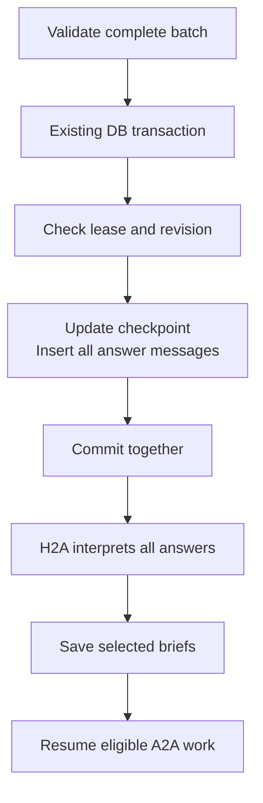

# Implementation map

- Navigation: [Overview](README.md) · [Design](design.md).
- Status: proposed; resolve [wake-policy decisions](wake-patterns.md#open-decisions) before end-to-end implementation.
- Agent paths below: relative to `packages/agent/src`; change existing behavior in place.
- Baseline: [reference branch and integration boundary](discovery.md#current-behavior-and-baseline); reference-only symbols below do not exist in this worktree yet.

## Implementation order

- Follow [TODO.md](TODO.md) one small slice at a time; inspect the code and discuss or revise details during implementation.
- Resolve saved-state handling before changing checkpoint shape; resolve wake/deadline/recovery policy before the dependent slices.

## Functions

| Location | Change | Contract |
|---|---|---|
| `negotiation/negotiation.agent.ts`: reference `pursue`, `runPursuit` | Move search/open tool handlers into H2A's tool set; remove the separate model run and its lifecycle. | [Discovery and opening](discovery.md) |
| `negotiation/principal.inbox.ts`: `review`, `validate`, `apply` | Replace `maxSteps: 1`, one-decision and reply-only restrictions with H2A tool use; consume search/open results and current negotiations, then apply questions, briefs and messages. | [Discovery and opening](discovery.md), [design](design.md) |
| `pursuit/pursuit.types.ts`: reference `CandidateQuery`, `PursuitClient`, `SearchRecord` | Reuse query/candidate/host contracts; add each search's scope version and each opening selection's private brief. | [Tool contracts](discovery.md#tool-contracts) |
| `negotiation/negotiation.agent.ts`: `tools`, `run` | Replace `request_principal_input` with explicit `pause_negotiation()`. | [Negotiations](negotiations.md) |
| `receive`, `drain`, `remember`, `complete` | Observe records without H2A scheduling or question mutation; start only with a persisted local brief and current eligibility. | [Negotiations](negotiations.md) |
| Proposed `reconsider(updates)` | Save selected opportunity/brief pairs, invalidate stale context, resume eligible targets. | [Briefs](briefs.md) |
| `checkpoint`, `restore` | Persist search/opening evidence, briefs and H2A state; reconcile uncertain openings without a second pursuit loop or blanket reruns. | [Opening order](discovery.md#opening-and-brief-ordering), [wake patterns](wake-patterns.md) |
| `message`, `answer`, `pending` | Allow direct messages during a batch; expose questions and accept answers as arrays. | [Question batches](question-batches.md) |
| `cancel`, `snapshot`, `restore` | Preserve history and stable questions; only H2A retires obsolete questions. | [Question batches](question-batches.md) |
| `prompts/agent.prompt.ts` | Fold reference `buildPursuitPrompt` instructions into H2A; update identity, H2A/A2A instructions and inputs. Delete the unused builder. | [Agent instructions](agent-instructions.md) |
| `index.ts`, README, examples | Export `PrincipalAnswer`; update callers and terminology. | [Question batches](question-batches.md) |

## State changes

| Existing | Proposed | Owner |
|---|---|---|
| Reference `PrincipalState.pursuit` | Retain private searches, selections and summary; remove separate pursuit-run status as a scheduling gate | H2A |
| Reference `SearchRecord` / selections | `scopeVersion` per search; initial `brief` on the opening selection before the opportunity ID exists | H2A |
| Negotiation records and saved turns | Reuse through existing client/host interfaces | Protocol / host |
| `InboxState.question` | `questions: PrincipalQuestion[]` | H2A |
| Runtime/saved match `reviewNote` | Maintained `brief: string`, retained after reading | H2A writes; A2A reads |
| Turn input `communicationReview` | `brief` | Prompt builder |
| A2A raw intent, principal profile/history and other commitments | Remove separate context inputs; H2A writes relevant objectives, evidence and authority into `brief` | H2A |
| H2A question `scope` / `matches` | Remove question-to-negotiation linkage; preserve permission limits in question wording and H2A interpretation | H2A |
| `commitments` / `acceptedCommitments` | Factual `agreements`; authority evaluated separately | Personal agent |
| H2A messages and incoming-message IDs | Retain | H2A |
| Task execution guards / context version | Retain; pause ends one run | Runtime |

## Delete

- Reference `runPursuit`, its separate `Agent.run()`, `pursuing` / `pursuitWork` lifecycle and direct-message pursuit restart; route callers into H2A activation.
- Reference `buildPursuitPrompt` after moving its decision instructions into H2A; no parallel discovery agent or done/failed gate blocking later H2A searches.
- A2A request/outcome queues, `InputRequest`, queue-only `Outcome`, request IDs/attachments and `reviewed`.
- `waitFor`, `request`, `outcome`, `queuedQuestions` and dead queue-only callers.
- Completed in the [first slice](TODO.md#first-slice-prevent-a2a-from-waking-h2a): `schedule(delay)`, its timer, `immediate`, queue-based `hasWork()`, request `reviewed` and automatic inbox `resume()` scheduling; the unused generic timer-driven `Inbox` and its exports are also deleted.
- Previous proposed accumulator fields: `reviewPending`, `deferredReview`, persisted stall reasons and obstacle queues.
- Separate A2A task/intent orientation and direct principal-context inputs; retain protocol intent IDs and execution guards.

## Database touches

- H2A integration schema/DDL: **no new tables, columns, indexes or enum values**; the reference branch separately drops `protocol_hyde_documents`.
- Data contract: change existing checkpoint JSON; this still requires a saved-session rollout decision.
- Access: `packages/agent` uses `PrincipalStore`, `NegotiationClient` and reference `PursuitClient`; the host owns SQL and retrieval dependencies.
- `scopeVersion`, `brief`, search selections and question arrays are JSON fields inside `agent_sessions.state`, not SQL columns.
- Keep one `agent_sessions` row per principal/intent; A2A uses its existing `protocol_negotiations` record and private `matches[]` brief, with no separate task or A2A session table.
- Table names below are SQL names; columns list the relevant reads/writes, with ordinary IDs/timestamps supplied by existing helpers.

| SQL table | Existing columns | Read / write and contract |
|---|---|---|
| `agent_sessions` | `state` | Read/update private checkpoint: retain `pursuit.searches` and selections; add scope versions and initial briefs. Replace `inbox.question` with `inbox.questions`, `matches[].reviewNote` with `brief`; remove child queues and separate pursuit-run status. |
| `agent_sessions` | `user_id`, `intent_id`, `conversation_id`, `revision`, `updated_at`, `lease_token`, `lease_expires_at` | Retain session identity, revision-checked saves and lease lifecycle; no wake/deadline columns. |
| `messages` | `conversation_id`, `session_id`, `sender_id`, `role`, `parts`, `metadata`, `created_at` | Preserve canonical H2A history and full text in `parts`; retain intent and `principalMessage` identity in `metadata`, removing negotiation linkage from new questions. Save all batch answers with the checkpoint. |
| `conversation_sessions` / `conversations` | Session: `conversation_id`, `started_at`, `last_message_at`; conversation: `last_message_at`, `updated_at` | Existing message helper assigns the session and updates activity within the checkpoint transaction. |
| `protocol_intents` | `user_id`, `payload`, `summary`, `embedding`, `status`, `archived_at`, `updated_at`, `first_discovery_succeeded_at` | Read real intent embeddings, statements and lifecycle; retain reference `markSearched()` updating `first_discovery_succeeded_at` after a successful search. No query embedding/artifact is stored here. |
| `protocol_intent_networks` | `intent_id`, `network_id`, `created_at` | Read assignments and their contribution to the scope version; tools do not change assignments. |
| `protocol_network_members` | `user_id`, `network_id`, `deleted_at`, `updated_at` | Read current memberships and their revision for scope/eligibility checks. |
| `protocol_networks` | `title`, `prompt`, `permissions`, `deleted_at` | Read authorized network context and live-network eligibility. |
| `users` | `name`, `intro`, `location` | Read candidate profile identity through the existing profile builder. |
| `protocol_agents` | `owner_id`, `type`, `handle_negotiations`, `deleted_at` | Retain existing hosted/external executor checks; tools do not change executor configuration. |
| `protocol_opportunities` | `actors`, `status`, `updated_at`; opening also writes `detection`, `interpretation`, `context`, `confidence`, `metadata` | Read recent rejections; insert the selected opportunity through `openCounterparties()`. Shareable reasoning goes in `interpretation`, retrieval evidence in `metadata`; private briefs stay out. |
| `protocol_negotiations` | `pair_key`, `opportunity_id`, `initiator_user_id`, `initiator_intent_id`, `responder_user_id`, `responder_intent_id`, `awaiting_user_id`, `outcome`, `settled_at`, `updated_at` | Read current negotiations; insert the pair in the same transaction as its opportunity. Reuse existing turn/settlement writes and pair uniqueness; pause adds no status. |
| `protocol_negotiation_turns` | `negotiation_id`, `turn_index`, `seat_user_id`, `action`, `message` | Read the transcript; existing `submitTurn()` inserts actual A2A turns. Opening, pause, briefs and principal questions create no synthetic turn. |

- Rollback → no partial answers, cleared batch, notifications or dependent resumes.
- Opening has separate checkpoint/pair transactions; use [opening and brief ordering](discovery.md#opening-and-brief-ordering), including reconciliation after an uncertain write.
- Publish messages/pending-batch notifications only after commit; update the adapter's singular question tracking.
- Before rollout: decide conversion of existing checkpoint JSON; preserve H2A history and displayed questions; add no runtime dual-read path.
- Sources: [domain schema](../../services/api/src/schemas/database.schema.ts), [conversation schema](../../services/api/src/schemas/conversation.schema.ts), [session adapter](../../services/api/src/adapters/agent-session.database.adapter.ts), [opening adapter](../../services/api/src/adapters/negotiation.database.adapter.ts).

## Integration

| Decision | Requirement |
|---|---|
| Breaking API/checkpoint change | Replace the separate `pursue()` entry point in all callers; require the opening brief; update batch APIs and saved-state shape together. Decide conversion before implementation; preserve principal history, displayed questions and prior search/opening evidence. |
| Generic `Agent.ask_user` | Keep unchanged. |
| Protocol transitions | Reuse `decideNegotiationOpening`, `pairKeyOf`, `openCounterparties` and current turn/settlement rules; this H2A integration changes no public protocol behavior. |
| Release | Bump touched packages under repository SemVer rules, sync `bun.lock` and target `dev` when implementing; carry reference breaking-change releases with that baseline. |

- Consumers: `packages/agent-tui/src/negotiation.tui.ts`, reference `negotiation.lab.ts`, and agent README examples; drive the same H2A tools with synthetic retrieval/opening in the scenario host.
- Host: `services/api/src/services/personal-agent.service.ts`; accepted activations enter H2A after refreshing scope and current records.
- Storage: `services/api/src/adapters/agent-session.database.adapter.ts`; retain reference `pursuitScope()` / `markSearched()` and update singular question tracking.
- Composition: `services/api/src/lib/agent/negotiation.host.ts`; replace `agent.pursue()` in `scan()`, keeping negotiation notifications observational for H2A.
- Tool operations: reference `services/api/src/lib/agent/pursuit.ts`: keep `createPursuitClient()` and its host/protocol enforcement; the private brief stays in the agent checkpoint.
- Intent activation: reference `services/api/src/lib/intent/indexing.ts`: reuse post-commit `requestIntentPursuit()` / `intent.pursuit` events; no lens/HyDE work returns.
- No compatibility APIs or new retry framework; preserve explicit malformed-decision and uncertain-write failures.

## Verification for implementation

| Check | Coverage |
|---|---|
| Existing agent `typecheck`, `test`, `build` scripts | Changed interfaces and behavior |
| API `typecheck`; agent-TUI `check` and `build` after agent build | H2A tools, activation, batch API and checkpoint integration |
| Existing scenarios or temporary checks | [Discovery/opening acceptance](discovery.md#acceptance), atomic batches, scoped authority, pause, restart, stale decisions, repeated review |
| [Model acceptance cases](agent-instructions.md#acceptance-cases) | Instruction behavior; report separately from structural checks |
| Root lint; `check:lockfile-versions` after implementation version bumps | Repository boundaries and workspace versions; run protocol `architecture:check` if its boundaries change |

- Add no persistent test files without an explicit request.
