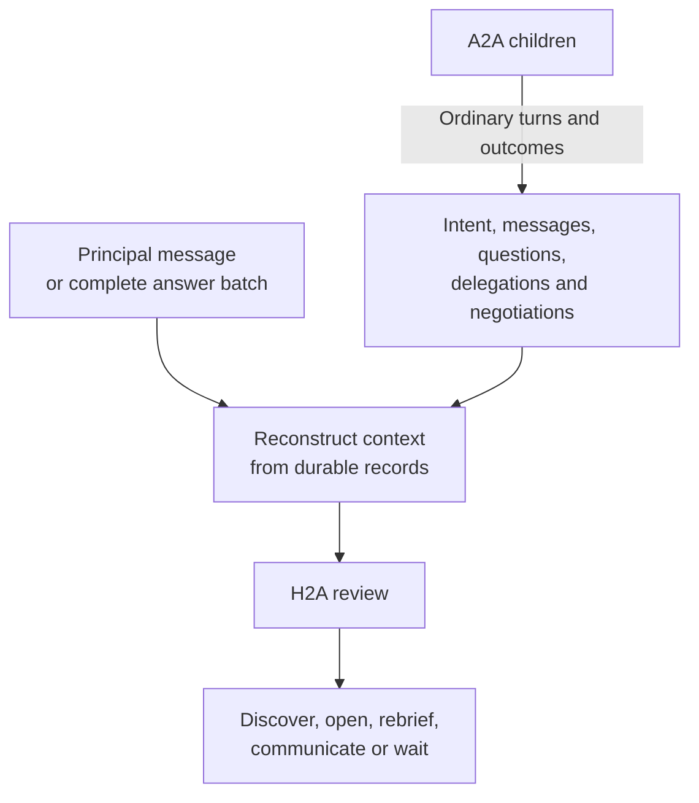

# Wake patterns

- Navigation: [Overview](README.md) · [Negotiations](negotiations.md).
- Accepted: only an accepted principal message or complete answer batch activates H2A; A2A children never wake it.
- Accepted recovery: reconstruct committed context at the next permitted activation; loading records or losing a runtime creates no wake.
- Deferred: intent/assignment readiness, recurring wakes, deadline delivery and automatic recovery. Earlier proposals below do not authorize additional triggers.

## Control flow

- The record store does not trigger H2A.
- Direct principal messages and complete answer submissions enter H2A; child events do not.
- Reference `requestIntentPursuit()` publishes `intent.pursuit` after intent creation/update, resume or completed assignment work; its proposed routing to H2A remains deferred under the user-only policy.
- A shared host `scan()` may refresh scope and negotiation observations; receiving `negotiation.opened` / `negotiation.changed` must not activate H2A through that scan.
- One H2A run consumes discovery/opening tool results directly; persistence or tool-completion callbacks never schedule another review.
- Review the whole intent from current records; no saved task map limits which negotiations H2A sees.
- Waiting or interruption discards working context; committed messages and effects survive. The next accepted user input starts a fresh review, including earlier input whose computation was interrupted.

## Agent judgment vs runtime guarantees

| Agent decides | Runtime guarantees |
|---|---|
| Whether available context supports action | Reconstruct current authorized scope, records and principal evidence; supply search results only within the current activation. |
| Whether to search, refine a query or open a candidate | Run each explicit tool call; keep search results in memory and persist actual opening/delegation outputs and domain effects. No automatic selection/opening or separate pursuit loop. |
| Whether waiting is more useful | No fixed count threshold or wait-for-all barrier. |
| Which active/passive negotiations matter | Include waiting-on-us, waiting-on-them and relevant outcomes. |
| Which deadline constrains the next decision | Preserve actual deadline evidence; independent delivery still to decide. |
| Whether an outcome merits attention | Consult existing H2A history to avoid repetition. |

## Remove / retain

| Mechanism | Decision | Reason |
|---|---|---|
| Reference `pursue()` / `runPursuit()` scheduling | Replace with user-triggered H2A tool use | Search and opening belong to the run that interprets principal input. |
| Post-commit `intent.pursuit` event | Defer as an H2A entry point | Current scope can be read without introducing another activation source. |
| A2A request/outcome accumulator | Remove | Current negotiation records supply review context. |
| `schedule(2s)` / child completion callbacks | Remove as H2A triggers | Neither defines a meaningful context boundary. |
| Earlier `reviewPending` / `deferredReview` proposal | Superseded | Do not add its storage/timers by default. |
| Existing session lease/checkpoint | Remove with host guard replacement | Ownership and duplicate-effect protection remain required; their mechanism is a [storage-slice decision](spec.md#open-storage-and-coordination-decisions), independent of wakes. |
| H2A history and pending batch | Retain records; derive pending questions | Stable questions and evidence of prior communication survive without a runtime snapshot. |

## Open decisions

| Decision needed | Acceptance condition |
|---|---|
| Recurring independent wake source and frequency | Paused work, new candidates and inbound opportunities eventually receive H2A attention even without another principal message or intent change. |
| Deadline behavior | Wake in time to decide; define missed-deadline behavior after downtime. |
| “Wait for context” capability | Agent expresses the decision without a child event waking H2A. |
| Automatic recovery timing | Any future recovery activation must reconstruct records and reconcile uncertain effects; no blanket A2A restart. Until accepted, the next user input is the H2A recovery point. |
| Inbound first briefing | An opportunity opened by the counterparty receives our H2A-authored brief within the chosen independent timing policy. Outgoing openings already require their brief. |

- Unbriefed/stalled work and unreported outcomes can wait for the next user message under the accepted policy; autonomous liveness without user input remains deferred.
