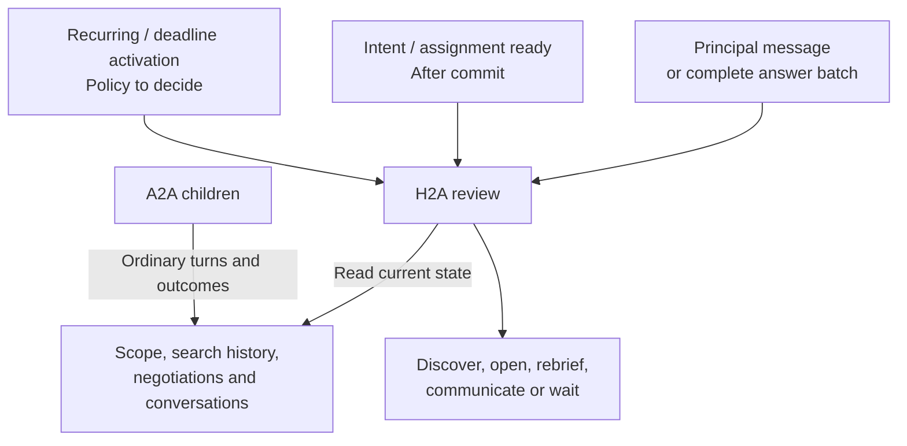

# Wake patterns

- Navigation: [Overview](README.md) · [Negotiations](negotiations.md).
- Accepted: H2A wakes independently of its A2A children.
- Proposed integration: route the reference branch's post-commit intent/assignment readiness into H2A, replacing its separate pursuit activation.
- Required: deadlines.
- Open: recurring independent wakes, recovery timing and deadline delivery.

## Control flow

- The record store does not trigger H2A.
- Direct principal messages and complete answer submissions enter H2A; child events do not.
- Reference `requestIntentPursuit()` publishes `intent.pursuit` after intent creation/update, resume or completed assignment work; preserve post-commit readiness when routing it to H2A.
- A shared host `scan()` may refresh scope and negotiation observations; receiving `negotiation.opened` / `negotiation.changed` must not activate H2A through that scan.
- One H2A run consumes discovery/opening tool results directly; checkpoint or tool-completion callbacks never schedule another review.
- Initial match bursts and later arrivals follow the same record-review model; independent review includes records beyond the saved task map.
- Waiting ends the current H2A review; future activation belongs to the independent policy.

## Agent judgment vs runtime guarantees

| Agent decides | Runtime guarantees |
|---|---|
| Whether available context supports action | Supply current authorized scope, search evidence, records and principal evidence. |
| Whether to search, refine a query or open a candidate | Run each explicit tool call and persist its actual result; no automatic selection/opening or separate pursuit loop. |
| Whether waiting is more useful | No fixed count threshold or wait-for-all barrier. |
| Which active/passive negotiations matter | Include waiting-on-us, waiting-on-them and relevant outcomes. |
| Which deadline constrains the next decision | Preserve actual deadline evidence; independent delivery still to decide. |
| Whether an outcome merits attention | Consult existing H2A history to avoid repetition. |

## Remove / retain

| Mechanism | Decision | Reason |
|---|---|---|
| Reference `pursue()` / `runPursuit()` scheduling | Replace with H2A activation | Search and opening belong to the same session that interprets principal input. |
| Post-commit `intent.pursuit` event | Retain as an H2A entry point | Intent/assignment readiness supplies authorized scope without waiting for an A2A child. |
| A2A request/outcome accumulator | Remove | Current negotiation records supply review context. |
| `schedule(2s)` / child completion callbacks | Remove as H2A triggers | Neither defines a meaningful context boundary. |
| Earlier `reviewPending` / `deferredReview` proposal | Superseded | Do not add its storage/timers by default. |
| Existing host lease | Retain ownership semantics | Prevent concurrent owners; does not schedule a review. |
| H2A history and pending batch | Retain | Stable questions and evidence of prior communication. |

## Open decisions

| Decision needed | Acceptance condition |
|---|---|
| Recurring independent wake source and frequency | Paused work, new candidates and inbound opportunities eventually receive H2A attention even without another principal message or intent change. |
| Deadline behavior | Wake in time to decide; define missed-deadline behavior after downtime. |
| “Wait for context” capability | Agent expresses the decision without a child event waking H2A. |
| Startup / recovery | Restore history and reconcile uncertain openings; no blanket A2A restart or restore-driven H2A review. Define the next independent activation after downtime. |
| Inbound first briefing | An opportunity opened by the counterparty receives our H2A-authored brief within the chosen independent timing policy. Outgoing openings already require their brief. |

- Earlier review note, “Better accumulator?”: superseded by this pull-based proposal.
- End-to-end liveness remains unresolved until these wake decisions are made.
