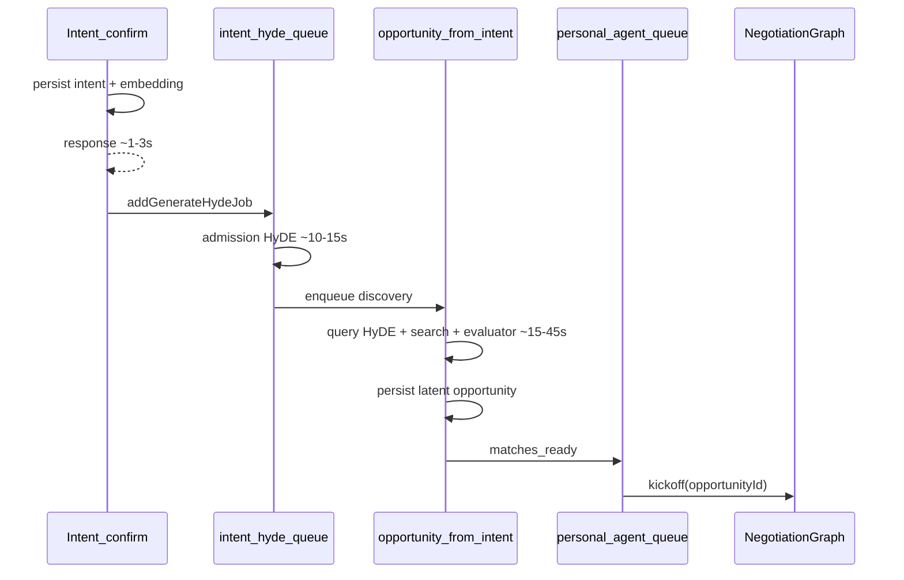
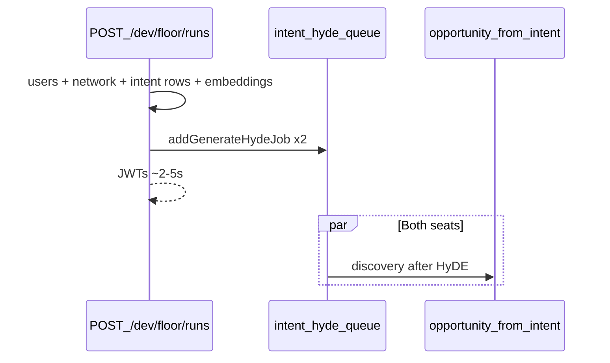

# Floor Lab: Two-Intent Discovery and Opportunity Model

Design spec for the dev Floor lab (`/dev/floor`, `POST /api/dev/floor/runs`) and the simplified discovery/opportunity path it motivates. Companion implementation: PR for `feat/floor-lab` (hot-seat UI + start endpoint). Reference prototype: [`docs/plans/2026-08-19-negotiator-floor.reference.jsx`](../plans/2026-08-19-negotiator-floor.reference.jsx).

## Problem

1. **Startup latency** — Floor lab start blocks ~33s because it runs **synchronous admission HyDE** (`runGenerateHydeSync`) twice (one per seat). Production admits intents asynchronously and returns in ~1–3s.
2. **Wrong dedup surface** — The opportunity stack assumes discovery may mint many rows for the same people over time. Floor lab always has **exactly two intents in one private network**. Most persist-time dedup, merge, and feed dedup solves a problem we do not have in this scenario.
3. **Opportunity lifecycle mismatch** — Today discovery **persists** `latent` opportunity rows; PersonalAgent kickoff requires an existing `opportunityId`. For a fixed two-intent lab, we want a **canonical pair** and creation at **negotiation open**, not a growing set of latent matches.

## Goals

| Goal | Measure |
|------|---------|
| Fast lab start | `POST /api/dev/floor/runs` returns in **&lt;5s** (DB + intent embedding + JWT) |
| Real stack | Same queues, HyDE, discovery graph, PersonalAgent, NegotiationGraph as production |
| One pair per run | Two fresh users, one network, two intents — at most **one** bilateral negotiation worth surfacing |
| Simple idempotency | **Exists or create** at open time; no semantic merge across rediscoveries |

## Non-goals

- Replacing production discovery for multi-member networks, introducers, or enrichment triggers
- Removing negotiation, reflect, or `needs_principal` flows
- Implementing checklist negotiations ([`2026-08-19-checklist-negotiations.md`](../plans/2026-08-19-checklist-negotiations.md)) in this slice

## Current production timeline (reference)

Floor lab today **collapses** admission HyDE into the HTTP handler (33s). Stages after discovery are unchanged.

## Target architecture

### Phase 1 — Async admission (immediate; small code change)

**Change:** In [`floor-lab.service.ts`](../../services/api/src/services/floor-lab.service.ts), replace `intentQueue.runGenerateHydeSync` with `intentQueue.addGenerateHydeJob` (same as [`intent.graph.execute.ts`](../../packages/protocol/src/internal/intents/graph/intent.graph.execute.ts) confirm path). Parallelize seat admit + JWT mint with `Promise.all`.

**Do not** skip admission HyDE entirely — discovery still requires indexed intent HyDE documents ([`opportunity.graph.ts`](../../packages/protocol/src/internal/opportunities/opportunity.graph.ts): both intents must have HyDE for semantic matching).

**UI:** `/dev/floor` already polls `intent-cycle`; show waiting/indexing until discovery completes (~30–90s to first negotiation row).

**Race:** Discovery for seat A may run before seat B's HyDE finishes. Acceptable for lab; UI stays in "waiting" until both paths complete or one scan finds the other.

### Phase 2 — Pair-scoped opportunity at kickoff (design target; larger refactor)

**Principle:** For a **canonical two-intent pair** `(intentA, intentB)` in one network:

1. Discovery produces a **match candidate** (counterparty intent id + score), not necessarily a persisted `latent` row.
2. PersonalAgent kickoff calls **`openPair(intentA, intentB)`** (new port or adapter method).
3. Inside one transaction:
   - Normalize pair key `(min(intentId), max(intentId))` or `(userA, userB, networkId)`
   - If active opportunity or negotiation exists → **resume or conflict**
   - Else **INSERT opportunity** with both intents on actors + `openNegotiationTask`
4. Status at birth: `negotiating` (or `pending` per product choice), not `latent`.

Reuse existing atomic machinery:

- `openNegotiationTask` pair-global advisory lock ([`opportunity-status-lifecycle.md`](opportunity-status-lifecycle.md))
- `persistIntentScopedOpportunityIfNetworkEligible` pattern, narrowed to pair-exists check

**PersonalAgent change:** Kickoff act carries `counterpartyIntentId` (and network) when opportunity row does not exist yet; graph creates-on-open instead of requiring pre-stored `opportunityId`.

### Phase 3 — Floor lab shortcut (optional)

In the two-person private network only:

- Skip evaluator LLM when exactly one counterparty intent exists
- Skip `mergeStrategyCandidates` multi-strategy merge (single retrieval path)
- Deterministic pairing after vector similarity threshold

Keeps production code paths; gates shortcuts on `network.metadata.floorLab === true`.

## What becomes unnecessary (for two-intent / create-at-kickoff)

These solve **repeat discovery minting the same humans**. Not needed when pair is canonical and opportunity is born at open:

| Layer | Module / concept | Verdict |
|-------|------------------|---------|
| Persist | `enrichOrCreate` ([`opportunity.enricher.ts`](../../packages/protocol/src/internal/opportunities/opportunity.enricher.ts)) | Remove for pair path |
| Persist | `suppressDiscoveryDuplicate`, `DEDUP_WINDOW_MS` (30d) | Replace with open-time exists check |
| Persist | `suppressOwnedIntentDuplicate`, `crossIntentPairAllowedCount` | One pair per two intents |
| Persist | Latent create + upgrade/reactivate at discovery | No latent rows |
| Persist | Newborn stamping at discovery | Not needed |
| Retrieval | `mergeStrategyCandidates` multi-strategy boost | Optional; single candidate in lab |
| Retrieval | Evaluator fan-out (80 candidates) | Optional skip in lab |
| Feed | `deduplicateByPerson`, digest suppression for latent re-show | One row per counterpart |
| Status | `latent` as discovery birth status | Born at `negotiating` |

## What stays

| Component | Why |
|-----------|-----|
| Intent admission HyDE (`addGenerateHydeJob`) | Indexes signals for vector search |
| `opportunity-from-intent` queue | Async discovery scan |
| Query HyDE in discovery graph | Separate retrieval pass (`sourceType: query`) |
| `matches_ready` → PersonalAgent | Agent chooses kickoff, strategy, briefs |
| NegotiationGraph + reflect | A2A turns, `needs_principal`, round settlement |
| `openNegotiationTask` atomic claim | Idempotent open / race handling |
| Human `accepted` on `pending` | Unchanged product gate |
| Queue debounce / same-intent lock | Prevents duplicate discovery jobs |

## API / UI contract (unchanged)

- `POST /api/dev/floor/runs` — two seats, returns `runId`, `networkId`, seat JWTs
- `GET /api/conversations/negotiations/intent-cycle` — poll per seat
- `POST /api/chat/web/stream` — answer `needs_principal` as seat

## Verification

| Check | Command / action |
|-------|------------------|
| Start latency | `POST /api/dev/floor/runs` &lt; 5s after Phase 1 |
| Admission | API logs: `addGenerateHydeJob` enqueued, not `runGenerateHydeSync` |
| Discovery | `intent_discovery_progress` → `succeeded` for both intents |
| Match | intent-cycle shows negotiation within ~90s (local, OpenRouter up) |
| Idempotency (Phase 2) | Second kickoff for same pair resumes or errors, no duplicate opp |

## Implementation order

1. **Phase 1** — async `addGenerateHydeJob` + parallel seats (floor-lab service only)
2. **Phase 2** — protocol/host `openPair` + PA kickoff without pre-persisted `opportunityId` (feature-flagged)
3. **Phase 3** — lab-only evaluator/merge shortcuts behind `floorLab` network metadata

## Open questions

1. **Phase 2 scope** — Floor lab only first, or generalize to all two-party discovery?
2. **Candidate representation** — Store match candidates without opportunity rows (new table) vs. lightweight `draft` row deleted if never opened?
3. **Cross-intent production** — Production still needs cross-intent-pair rules when one user has multiple active intents; do not delete enricher globally until pair-at-kickoff is default everywhere.

## Archive: carbon copy before removal

The modules listed in **What becomes unnecessary** remain in production until Phase 2 lands. Before any deletion from `indexnetwork/index`, a **frozen snapshot** lives in [`indexnetwork/recycle`](https://github.com/indexnetwork/recycle) under `opportunity-discovery-dedup-merge/`.

That archive records:

- **Why we needed it** — discovery could run many times and mint multiple opportunity rows for the same people/intents; enricher merge, 30-day persist dedup, feed dedup, and cross-intent-pair rules prevented duplicate latent rows and noisy resurfacing.
- **Why we used it** — production still persists `latent` opportunities at discovery time; PersonalAgent kickoff requires a pre-existing `opportunityId` ([`2026-08-23-personal-agent-and-negotiation-graphs.md`](../plans/2026-08-23-personal-agent-and-negotiation-graphs.md)).
- **Why we remove it (for the pair path)** — Floor lab and the create-at-kickoff model have a canonical two-intent pair; idempotency is `exists or create` at `openNegotiationTask`, not semantic merge across rediscoveries.
- **When to restore** — Multi-member networks, multiple active intents per user, introducer flows, enrichment/maintenance rediscovery, or any product that persists opportunities before kickoff and needs cross-run dedup.

Each archive directory includes `SOURCE_COMMIT.txt` (exact `indexnetwork/index` SHA) and the copied source + tests.

## Related docs

- [Personal agent + negotiation graphs](../plans/2026-08-23-personal-agent-and-negotiation-graphs.md) — `matches_ready`, kickoff, no auto-open at discovery
- [Opportunity status lifecycle](opportunity-status-lifecycle.md) — atomic open, intent-scoped dedup
- [Discovery positioning](discovery-positioning.md) — product framing
- [Recycle archive](https://github.com/indexnetwork/recycle/tree/main/opportunity-discovery-dedup-merge) — frozen dedup/merge implementation
