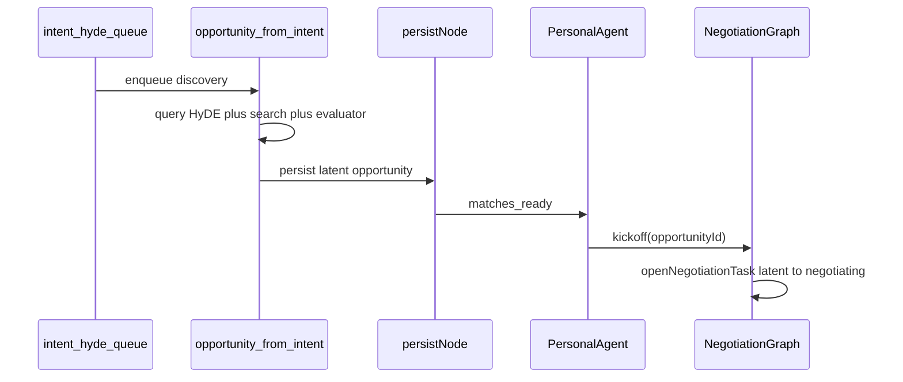
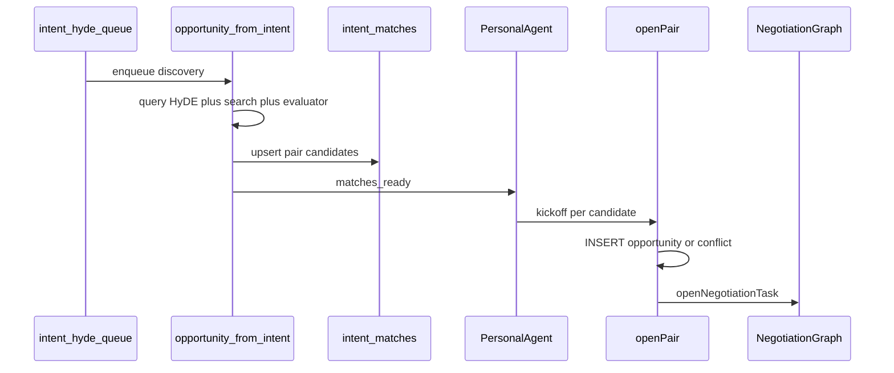

# Production: Create Opportunity at Kickoff

Design spec for intent-triggered background discovery (`opportunity-from-intent`). Discovery finds counterparties and wakes PersonalAgent; the opportunity row is born when kickoff opens a negotiation, keyed by the exact intent pair. Idempotency is **exists or create**, not semantic merge across rediscoveries.

This is **production**, not Floor lab. It does not replace PR [#1535](https://github.com/indexnetwork/index/pull/1535) (Floor-lab two-intent discovery doc).

## Problem

Production today:

1. **Discovery persists `latent` rows** — [`persistNode`](../../packages/protocol/src/internal/opportunities/opportunity.graph.persist-node.ts) runs after evaluator ranking and writes opportunities with `initialStatus: 'latent'` from [`buildIntentDiscoveryTrigger`](../../services/api/src/queues/opportunity/discovery-trigger.builders.ts).
2. **`matches_ready` wakes PersonalAgent on persisted rows** — [`matchesReadyNode`](../../packages/protocol/src/internal/opportunities/opportunity.graph.matches-ready.ts) emits only when `state.opportunities.length > 0`.
3. **Kickoff requires an existing `opportunityId`** — [`runKickoff`](../../packages/protocol/src/internal/agents/personal-agent/agent.graph.ts) calls `negotiations.invoke({ opportunityId, ... })`; NegotiationGraph open has no create variant.

Persist-time enricher, 30-day dedup, intent-scoped atomic insert, and latent birth exist because discovery could run many times and mint multiple opportunity rows for the same people. For **intent-triggered bilateral discovery** the pair is canonical: one `(sourceIntent, counterpartyIntent)` should map to at most one live negotiation worth surfacing. Creating the row at open time makes most of that stack unnecessary on this path.

## Scope

| In scope | Out of scope |
|---|---|
| `opportunity-from-intent` queue ([`from-intent.queue.ts`](../../services/api/src/queues/opportunity/from-intent.queue.ts)) | Floor lab, hot-seat UI, async HyDE in lab services |
| Gate on **this caller** (from-intent trigger), not `discoverySource === 'intent'` alone (prep sets that for other invokes too) | Introducer, enrichment, manual, chat/MCP discover paths |
| Candidate store + `openPair` at kickoff | Deleting `opportunity.enricher.ts` or feed `deduplicateByPerson` globally |
| PersonalAgent + host adapter changes | NegotiationGraph redesign beyond receiving an id created at kickoff |
| Lab-only evaluator / merge shortcuts | |

## Non-goals

- Replacing production discovery for multi-member networks, introducers, or enrichment triggers
- Removing negotiation, reflect, or `needs_principal` flows
- A second design doc for Floor lab

## Current production timeline (reference)

Status at birth on this path: **`latent`**. Kickoff promotes to **`negotiating`** via [`openNegotiationTask`](../../services/api/src/adapters/conversation.database.adapter.ts).

## Target architecture

HyDE admission, vector search, evaluator, and `matches_ready` → PersonalAgent stay. **Persist of opportunity rows at discovery does not.**

## Locked decisions

### 1. Create at kickoff, not at discovery

For the from-intent path, [`persistNode`](../../packages/protocol/src/internal/opportunities/opportunity.graph.persist-node.ts) **upserts candidates** and does **not** call:

- `persistOpportunities` / `enrichOrCreate`
- `suppressDiscoveryDuplicate` / `suppressOwnedIntentDuplicate`
- newborn stamping (`stampEligibleNewbornOpportunities`)
- `persistIntentScopedOpportunityIfNetworkEligible`

Drop `options: { initialStatus: 'latent' }` from [`buildIntentDiscoveryTrigger`](../../services/api/src/queues/opportunity/discovery-trigger.builders.ts) for this path (no latent birth).

### 2. Candidate store (`intent_matches`)

- Small **Postgres table**, not a new opportunity status and not Redis.
- Must survive until kickoff: PA retries, `MAX_MATCHES` cap leftovers, later `user_message` turns.
- Unique key: `(source_intent_id, counterparty_intent_id)` (order-normalized pair).
- Rediscovery **replaces** the row (score, reasoning, evidence). No semantic merge.
- [`matchesReadyNode`](../../packages/protocol/src/internal/opportunities/opportunity.graph.matches-ready.ts) wakes PA when **candidates** exist, not when `state.opportunities` is non-empty.

Suggested columns (implementation detail): source intent, counterparty intent, network id, evaluator score/reasoning, evidence payload, discovered-at timestamp.

### 3. Pair identity and `openPair`

- Canonical key: the two intent ids (min/max normalized).
- Host method **`openPair`** beside [`openNegotiationTask`](../../services/api/src/adapters/conversation.database.adapter.ts), same pair-global advisory lock pattern as today.
- One transaction:
  - **No opportunity for pair** → INSERT opportunity (status **`negotiating`**, both intents on actors) + `openNegotiationTask`.
  - **Opportunity exists** → resume through existing `openNegotiationTask` (`created` / `existing` / `raced`).
  - **Concurrent insert** → conflict / resume, not enricher merge.

Bidirectional discovery (A finds B and B finds A) is **one pair**; both kickoffs share one opportunity via `openPair`.

### 4. Keep retrieval as-is

`mergeStrategyCandidates` and the evaluator stay. They are search quality, not persist-time duplicate minting.

### 5. PersonalAgent contract

| Piece | Change |
|---|---|
| [`PersonalAgentMatch`](../../packages/protocol/src/internal/agents/personal-agent/agent.types.ts) | Add `counterpartyIntentId`. `opportunityId` set only after `openPair`. |
| [`readMatches`](../../services/api/src/lib/negotiation/negotiation-graph.ts) / [`readSignalMatches`](../../services/api/src/lib/agent/negotiator-verdict.host.ts) | Unopened **candidates** ∪ existing **opportunities** for the signal. |
| Kickoff eligibility | Candidates are kickoff-eligible. |
| Verdict eligibility | Candidates are **not** verdict-eligible; `ACTIONABLE_VERDICT_STATUSES` stays `pending` / `negotiating` / `stalled`. |
| [`runKickoff`](../../packages/protocol/src/internal/agents/personal-agent/agent.graph.ts) | For each target without `opportunityId`: `openPair` → `negotiations.invoke({ opportunityId, brief, intentId, round })`. |

NegotiationGraph unchanged: open input remains `{ opportunityId, brief, intentId, round }`.

### 6. Protocol release

When implemented: **protocol major bump** + [`CHANGELOG.md`](../../packages/protocol/CHANGELOG.md) noting from-intent no longer persists opportunities at discovery and `PersonalAgentMatch` shape change.

## Product consequences (intentional)

- **Radar** today lists `latent` and `pending`. This path has **no Radar card** until agents finish and the row reaches `pending`. During A2A the primary surface is the PersonalAgent DM.
- **Human accept without negotiation** on a discovery `latent` row goes away for this path only (no latent row exists pre-kickoff).
- Introducer / enrichment / manual paths unchanged; they still persist before kickoff where they do today.

## What becomes unnecessary on this path

Modules **remain in the repo** for other discovery roots until those paths migrate.

| Layer | Module / concept | Verdict (from-intent path) |
|---|---|---|
| Persist | `enrichOrCreate` | Skip — no row at discovery |
| Persist | `suppressDiscoveryDuplicate`, `DEDUP_WINDOW_MS` | Replace with open-time exists check |
| Persist | `suppressOwnedIntentDuplicate`, cross-intent-pair counters | One pair per two intents |
| Persist | Latent create + upgrade/reactivate at discovery | No latent rows |
| Persist | Newborn stamping at discovery | Not needed |
| Feed | `deduplicateByPerson` for latent re-show | Unaffected until feed reads candidates (candidates are not feed rows) |

## What stays

| Component | Why |
|---|---|
| Intent admission HyDE (`addGenerateHydeJob`) | Indexes signals for vector search |
| `opportunity-from-intent` queue | Async discovery scan |
| Query HyDE in discovery graph | Separate retrieval pass |
| `matches_ready` → PersonalAgent | Agent chooses kickoff, strategy, briefs |
| NegotiationGraph + reflect | A2A turns, `needs_principal`, round settlement |
| `openNegotiationTask` atomic claim | Idempotent open / race handling |
| Human `accepted` on `pending` | Unchanged product gate |
| Queue debounce / same-intent lock | Prevents duplicate discovery jobs |

## Verification (when implemented)

| Check | Action |
|---|---|
| No latent insert from from-intent | Discovery job completes with candidate rows only |
| `matches_ready` | PA wakes with candidates, no opportunity id required |
| Kickoff | `openPair` creates `negotiating` row + task; second concurrent open resumes or conflicts |
| Bidirectional pair | Two discovery runs, one opportunity |
| Other roots | Introducer/enrichment still persist latent/pending as today |
| Protocol | `bun run architecture:check` in `packages/protocol`; focused PA e2e |

## Archive

Frozen dedup/merge snapshot for restore reference: [indexnetwork/recycle — opportunity-discovery-dedup-merge](https://github.com/indexnetwork/recycle/tree/main/opportunity-discovery-dedup-merge). Do not delete modules from `indexnetwork/index` until create-at-kickoff is default for every discovery root that needs it, not only from-intent.

## Related docs

- [Opportunity status lifecycle](opportunity-status-lifecycle.md) — atomic open, status enum, `latent` → `negotiating`
- [Personal agent + negotiation graphs](../plans/2026-08-23-personal-agent-and-negotiation-graphs.md) — `matches_ready`, kickoff, no auto-open at discovery
- [Discovery positioning](discovery-positioning.md) — product framing
