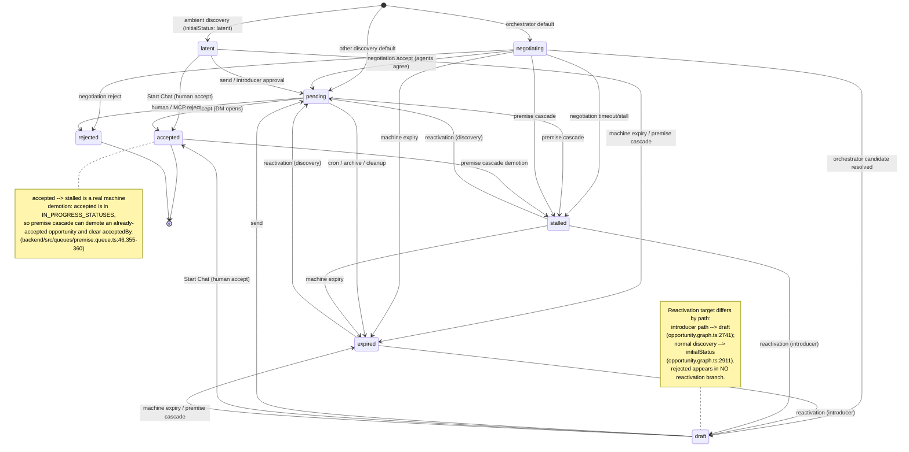
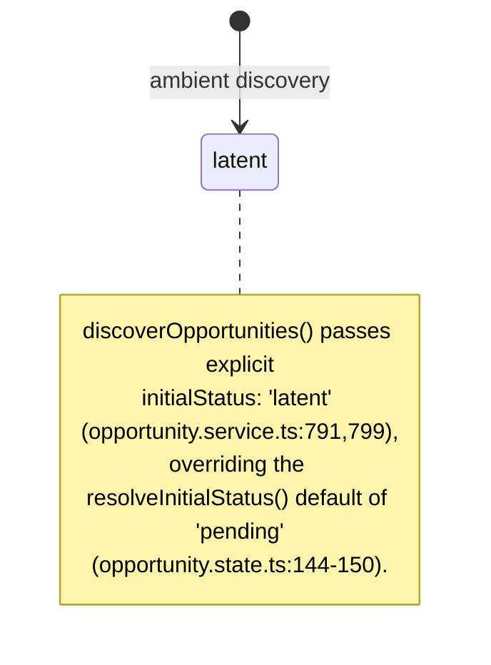
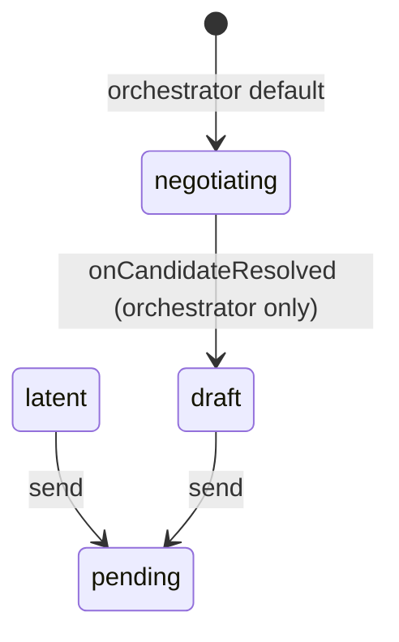
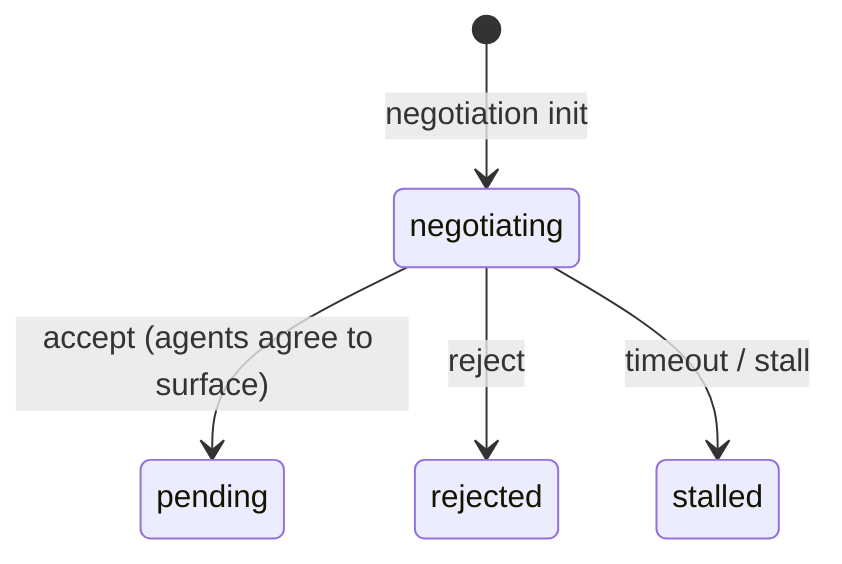
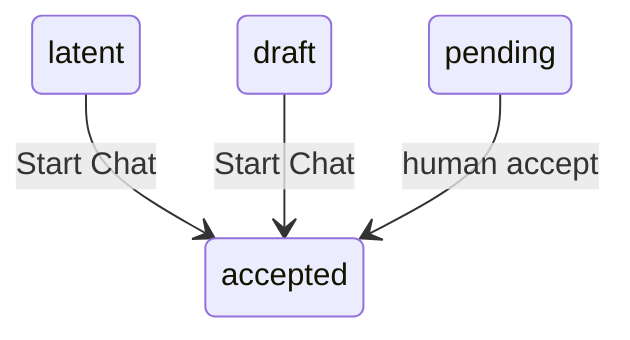
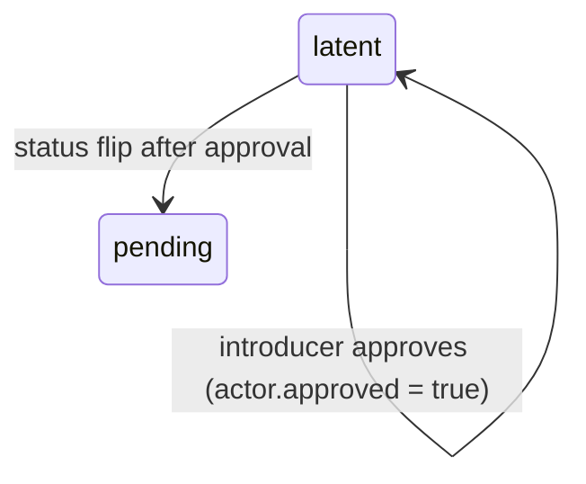
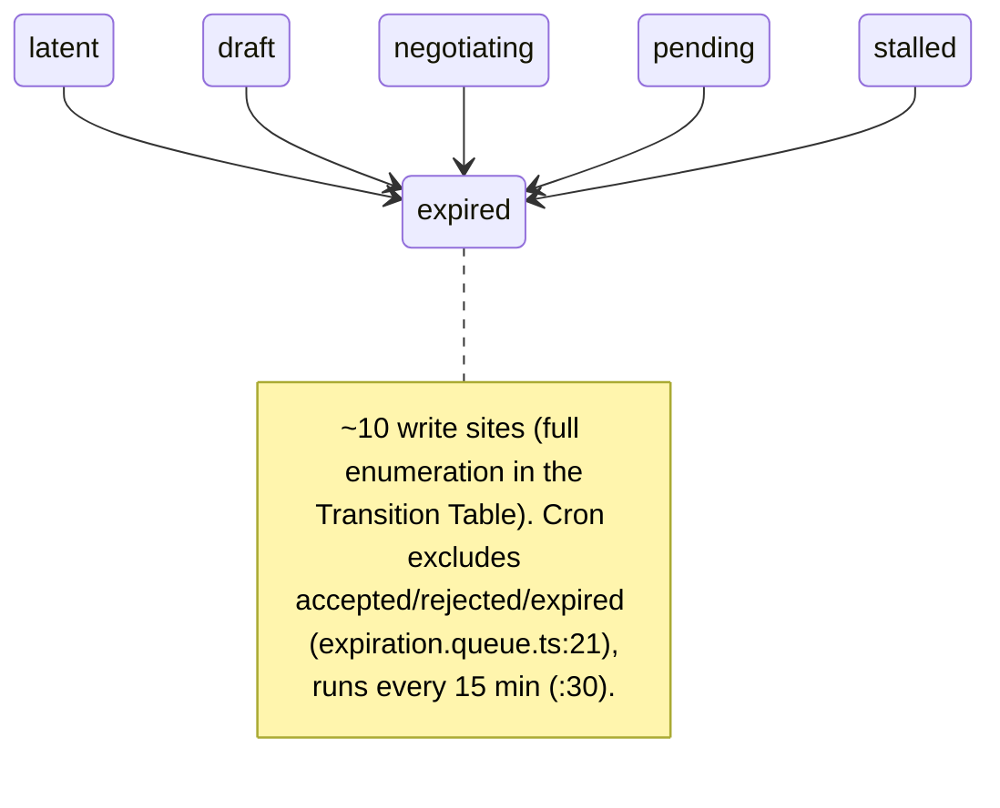
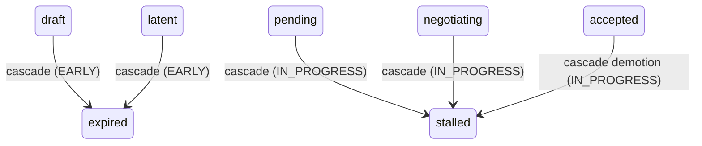

# Opportunity Status Lifecycle

This is an authoritative, code-traceable reference for the *existing* opportunity status lifecycle in Index Network. It documents the 8-value status enum, the parallel per-actor JSONB state machine, the 7 distinct flows, and every status write site with `file:line` citations. It describes behavior as it exists in code — it is a reference, not a redesign.

> Citations resolve at commit `bc94ae699a` (`dev`). Lifecycle logic is **split across five layers** — backend service, protocol opportunity graph, protocol negotiation graph, BullMQ queues, and read filters — each of which writes or interprets status. That split-brain topology is the dominant drift risk and the reason this reference is worth maintaining.

## 1. Two parallel state machines

The lifecycle is **not the enum alone**. Two independent state machines run in parallel.

### 1.1 The status enum (global lifecycle)

`opportunityStatusEnum` (`backend/src/schemas/database.schema.ts:11`) defines the only DB-level allowed values:

```
latent | draft | negotiating | pending | stalled | accepted | rejected | expired
```

The protocol-side type mirror is `OpportunityStatus` (`packages/protocol/src/shared/interfaces/database.interface.ts:482`). The `opportunities` table stores it in the `status` column, which **defaults to `pending`** (`backend/src/schemas/database.schema.ts:446`).

### 1.2 The actor JSONB axis (per-participant lifecycle)

`opportunities.actors` is a JSONB array of `OpportunityActor` (`backend/src/schemas/database.schema.ts:402-418`). Two of its fields are **per-participant lifecycle markers — not statuses**:

| Field | Meaning | Notes |
|---|---|---|
| `approved?: boolean` | Introducer-only approval gate | `false` until explicit approval, `true` after (`:409-410`) |
| `actedAt?: string` | ISO stamp set the first time an actor advances state | Used to block that same actor from a later `accept` — the self-accept guard (`:411-418`) |

A third column, `acceptedBy` (nullable user ref, `:447`), is set **only** on a human accept (`backend/src/adapters/database.adapter.ts:5181-5182`) and cleared to null on non-`accepted` writes that pass through `updateOpportunityStatus()` / `stampOpportunityActorAction()` (`:5183-5184`); the bulk-expiry helpers leave it untouched (see the §4.2 caveat).

**Why this matters:** approval and "having acted" are actor-local. They gate visibility/actionability and enforce the self-accept guard **independently of `opportunities.status`** — some transitions stage through actor-local JSONB before/alongside the status change (introducer approval, send, accept). Treat this axis as a separate state machine from the enum.

## 2. Master diagram

All 8 statuses and every transition. Odd edges are annotated — see the notes below the diagram.



**Reading the diagram:**

- **Three creation entry points** map to `resolveInitialStatus()` (`packages/protocol/src/opportunity/opportunity.state.ts:144-150`): explicit `initialStatus` wins (ambient discovery forces `latent`), else `orchestrator → negotiating`, else `pending`.
- **The accept ambiguity** (detailed in Flow C and Flow D): negotiation `accept` writes status `pending` — *not* `accepted`. Only a human opening a DM writes `accepted`.
- **`rejected` is terminal in practice** — MCP-blocked as a source and absent from every reactivation branch. (Caveat: the REST `PATCH /opportunities/:id/status` endpoint applies no source-status guard — `backend/src/controllers/opportunity.controller.ts:222-231`, `backend/src/services/opportunity.service.ts:459-508` — so it is an unguarded escape hatch; see §7.)
- **`expired` / `stalled` look terminal but are reactivatable** by discovery dedup. The reactivation target depends on the path (see the `draft` note): introducer → `draft`, discovery → `initialStatus`.
- **Machine paths are the hidden surface:** cron, premise cascade, intent archival, member removal, and enrichment replacement all write `expired`/`stalled` without going through the service/graph "flow" entry points. The full set of write sites is enumerated in the Transition Table.

## 3. Flows

Each flow is a focused view of the master diagram with the precise triggers and write sites. Flows A–D are below; E–G and Reactivation follow.

### 3.A Ambient / background discovery — creates `latent`



Background discovery forces `latent`. `OpportunityService.discoverOpportunities()` sets explicit `initialStatus: 'latent'` (`backend/src/services/opportunity.service.ts:789-799`, at `:791` and `:799`), so `resolveInitialStatus()` yields `latent` instead of the ambient default `pending`. The persist node resolves status (`packages/protocol/src/opportunity/opportunity.graph.ts:2565`) and inserts via the adapter (`backend/src/adapters/database.adapter.ts:5001-5010`).

### 3.B Chat / orchestrator draft + send



The orchestrator default is `negotiating` (`opportunity.state.ts:149`). The hook `onCandidateResolved` flips accepted candidates `negotiating → draft` (`opportunity.graph.ts:2092-2120`, write at `:2120`), only for `trigger === 'orchestrator'`; the frontend keys cards off `status === 'draft'`, so the flip happens before the draft-ready card is emitted. **Send is a separate mutation** — MCP `update_opportunity({status:'pending'})` routes to `sendNode` (`opportunity.graph.ts:3360-3402`), which allows **only** `latent | draft` (`:3376`) and stamps `pending` via `stampOpportunityActorAction()` (`:3399-3402`). Allowed sender roles: `introducer`, `peer`, and `patient`/`party` only when there is no introducer (`:3387-3391`).

### 3.C Negotiation — the accept ambiguity



Init writes `negotiating` (`negotiation.graph.ts:102-105`). Finalize maps the last turn (`negotiation.graph.ts:364-369`): `accept → pending`, `reject → rejected`, anything else → `stalled`. The agent polling path repeats the identical mapping (`backend/src/services/negotiation-polling.service.ts:400-402`), as do two background timeout workers that finalize a timed-out negotiation (`backend/src/queues/negotiations/timeout.queue.ts:254` and `claim-timeout.queue.ts:294`).

> **The word "accepted" has three distinct meanings — do not conflate them:**
>
> 1. The negotiation **`accept` action** writes status **`pending`** (`negotiation.graph.ts:364-369`) — *not* `accepted`.
> 2. The negotiation **trace outcome string** is the literal `"accepted"` (`negotiation.graph.ts:374-383`; polling `negotiation-polling.service.ts:394-396`).
> 3. The **status `accepted`** is written only by a human opening a DM (Flow D).
>
> Negotiation accept means "agents agree this is worth surfacing"; a human still has to accept it.

### 3.D Human accept (`→ accepted`) — creates/resolves a DM



Every `accepted` write is a **compound transition** (order matters): self-accept guard → resolve/create DM → write `accepted` + set `acceptedBy` → sibling-accept + contact upserts. Three code paths all write status `accepted` after resolving a DM first:

- **REST** `updateOpportunityStatus()` (`backend/src/services/opportunity.service.ts:459-508`): self-accept guard (`:477-480`), DM resolve before flip (`:489`), accepted write (`:501-504`), sibling accept + contact upserts (`:517-540`).
- **`startChat()`** (`opportunity.service.ts:632-732`): already-accepted idempotent branch (`:644-674`), allowed source `pending | draft | latent` (`:676-682`), self-accept guard (`:691-693`), DM resolve (`:705-714`), accepted write (`:728-732`).
- **Graph `updateNode()`** (`opportunity.graph.ts:3239-3312`): allows only `accepted | rejected | expired` (`:3251-3252`), self-accept guard (`:3269-3277`), DM resolve (`:3280-3285`), accepted write (`:3287-3293`); `rejected`/`expired` use plain `updateOpportunityStatus()` (`:3294-3300`).

The **self-accept guard** (an actor cannot accept an opportunity it has already acted on — enforced via `actor.actedAt`) is duplicated across all three sites; the adapter `stampOpportunityActorAction()` itself trusts the caller, so any new accept path that calls the adapter directly bypasses the guard.

### 3.E Introducer approval — actor state, then status



`approveIntroduction()` (`backend/src/services/opportunity.service.ts:563-604`) requires the caller be the `introducer` actor, flips `approved` via `updateOpportunityActorApproval(..., true)` (`:587`) — **status stays `latent`** during this write (the adapter touches only `actors` + `updatedAt`, `backend/src/adapters/database.adapter.ts:5211-5213`) — then calls `updateOpportunityStatus(id, 'pending', userId)` (`:594`). Visibility/actionability live in `packages/protocol/src/opportunity/opportunity.utils.ts`: `canUserSeeOpportunity()` (`:123-143`) is a role+status ACL that does **not** read `approved`; `isActionableForViewer()` (`:164-192`) reads `introducer.approved` (`:174`) — the introducer is actionable only while `latent && !approved`, non-introducers on `latent` when there is no introducer or it is approved, and on `pending`. **`negotiating` (and the other internal/terminal statuses) is never actionable** here — Rule 5 of `isActionableForViewer` (`:188-191`; the doc-comment at `:156` lists `negotiating` among the non-actionable) — and it is excluded from the home feed default (`feed.graph.ts:57`). This was a historical drift point (precedent `3acc3d7db3`, "allow actions on negotiating status").

### 3.F Expiry / archive (→ `expired`)



`→ expired` is written from ~10 sites: graph `deleteNode()` (`opportunity.graph.ts:3320-3347`, write `:3341`); service terminal flip (`opportunity.service.ts:507-508`); cron `expireStale()` (`backend/src/queues/opportunity/expiration.queue.ts:12`, excludes `accepted/rejected/expired` `:21`, every 15 min `:30`); adapter `expireStaleOpportunities()` (`database.adapter.ts:5440-5450`); atomic enrichment replacement `createOpportunityAndExpireIds()` (`database.adapter.ts:5298-5303`); premise cascade early-stage (`premise.queue.ts:357-358`); intent archival `expireOpportunitiesByIntent()` (`database.adapter.ts:5406-5423`) plus the legacy `expireOpportunitiesByIntentActor()` (`database.adapter.ts:354-361`, write `:355-356`); network member removal (`database.adapter.ts:5426-5438`); and the manual CLI script (`backend/src/cli/expire-opportunities.ts:18-36`, write `:22`). Cron-expirable source statuses: `latent, draft, negotiating, pending, stalled`. The exhaustive per-site table is in the Transition Table section below.

### 3.G Premise cascade — machine demotion (incl. `accepted → stalled`)



`IN_PROGRESS_STATUSES = ['pending','negotiating','accepted']` (`backend/src/queues/premise.queue.ts:46`); `EARLY_STATUSES = ['draft','latent']` (`:49`); the union is typed (misleadingly) `NonTerminalStatus` (`:53`). `handlePremiseCascade()` (`:338-360`) fetches those five statuses (`defaultGetUserOpportunities()` `:295-308`) and maps `EARLY → expired` (`:357-358`), everything else → `stalled` (`:359`), writing via the adapter (`:318` → `database.adapter.ts:5172-5188`, which clears `acceptedBy`). Because `accepted ∈ IN_PROGRESS_STATUSES`, an already-accepted opportunity is demoted to `stalled` — a real, counterintuitive edge (⚠️ on the master diagram).

### Reactivation — two different targets

_Shown as annotations on the master diagram (no dedicated diagram); documented here in prose and in the Transition Table._

`expired`/`stalled` opportunities are **reactivatable** by discovery dedup, to two different targets. Dedup skips only `draft` (`DEDUP_SKIP_STATUSES`, `opportunity.graph.ts:2588-2591`). On the **introducer path**, `expired|stalled → draft` (`:2735-2741`, write `:2741`; `expired` requires the same introducer, `stalled` reactivates regardless of age), plus a stale `latent → draft` upgrade (`:2785`). On the **normal discovery path**, `expired|stalled → initialStatus` (`:2907-2911`, write `:2911`), plus a `latent → initialStatus` upgrade when `initialStatus !== 'latent'` (`:2956-2958`). `rejected` appears in **no** reactivation branch — it is terminal at the dedup layer too.

## 4. Transition / write-site table

Every status write. Trigger flow letters map to §3. "Actor JSONB" rows are the parallel axis (§1.2), not status writes.

### 4.1 Status transitions

| From | To | Trigger / flow | Write site (`file:line`) |
|---|---|---|---|
| _(new)_ | `latent` | Ambient discovery (A) | `opportunity.service.ts:791,799` → persist `opportunity.graph.ts:2565` → `database.adapter.ts:5001-5010` |
| _(new)_ | `negotiating` | Orchestrator default (B) | `opportunity.state.ts:149` → persist insert `database.adapter.ts:5001-5010` |
| _(pre-negotiation)_ | `negotiating` | Negotiation init (C) | `negotiation.graph.ts:102-105` (write `:103`, via `updateOpportunityStatus`) |
| _(new)_ | `pending` | Discovery default; DB column default | `opportunity.state.ts:149`; `database.schema.ts:446` / adapter fallback `:5010` |
| `negotiating` | `draft` | Orchestrator candidate resolved (B) | `opportunity.graph.ts:2120` |
| `negotiating` | `pending` | Negotiation **accept** — agents agree (C) | `negotiation.graph.ts:364-369`; polling `negotiation-polling.service.ts:400-402` |
| `negotiating` | `rejected` | Negotiation reject (C) | `negotiation.graph.ts:364-369`; polling `:400-402` |
| `negotiating` | `stalled` | Negotiation timeout/stall (C) | `negotiation.graph.ts:364-369`; polling `:400-402` |
| `negotiating` | `pending` / `rejected` / `stalled` | Negotiation **timeout** finalize (C) | `backend/src/queues/negotiations/timeout.queue.ts:254`; `backend/src/queues/negotiations/claim-timeout.queue.ts:294` |
| `latent` / `draft` | `pending` | Send (B) | `opportunity.graph.ts:3399-3402` |
| `latent` | `pending` | Introducer approval (E) | `opportunity.service.ts:594` |
| `latent` / `draft` / `pending` | `accepted` | Human **accept** / Start Chat (D) | REST `opportunity.service.ts:501-504`; `startChat :728-732`; `updateNode opportunity.graph.ts:3287-3293` |
| `pending` | `rejected` | Human / MCP reject (D) | `updateNode opportunity.graph.ts:3294-3300`; service terminal `opportunity.service.ts:507-508` |
| `draft` / `latent` | `expired` | Premise cascade — EARLY (G) | `premise.queue.ts:357-358` → `database.adapter.ts:5172-5188` |
| `pending` / `negotiating` | `stalled` | Premise cascade — IN_PROGRESS (G) | `premise.queue.ts:359` |
| `accepted` | `stalled` ⚠️ | Premise cascade — IN_PROGRESS (G); **clears `acceptedBy`** (writes via `updateOpportunityStatus`) | `premise.queue.ts:359` → `database.adapter.ts:5172-5188` |
| any non-terminal | `expired` | Graph delete (F) | `opportunity.graph.ts:3341` |
| any | `expired` | Service terminal flip (F) | `opportunity.service.ts:507-508` |
| `latent`/`draft`/`negotiating`/`pending`/`stalled` | `expired` | Cron `expireStale` — excl. accepted/rejected/expired (F) | `expiration.queue.ts:12,21,30` → `database.adapter.ts:5440-5450` |
| _(replaced ids)_ | `expired` | Enrichment replacement (F) | `database.adapter.ts:5298-5303` (`opportunity.persist.ts:68-72,78-80`) |
| _(intent archived)_ | `expired` | Intent archival (F) | `database.adapter.ts:5406-5423`; legacy `:354-361` (write `:355-356`) |
| _(member removed)_ | `expired` | Network member removal (F) | `database.adapter.ts:5426-5438` |
| _(manual)_ | `expired` | CLI script (F) | `expire-opportunities.ts:22` |
| `expired` / `stalled` | `draft` | Reactivation — introducer (same introducer for `expired`) | `opportunity.graph.ts:2741` |
| `negotiating` | `draft` | Reactivation — stale/orphaned introducer | `opportunity.graph.ts:2773` |
| `latent` | `draft` | Reactivation — introducer upgrade | `opportunity.graph.ts:2785` |
| `expired` / `stalled` | `initialStatus` | Reactivation — discovery | `opportunity.graph.ts:2911` |
| `negotiating` | `initialStatus` | Reactivation — stale/orphaned discovery | `opportunity.graph.ts:2946` |
| `latent` | `initialStatus` | Reactivation — discovery upgrade (`initialStatus !== 'latent'`) | `opportunity.graph.ts:2956-2958` |

### 4.2 Actor JSONB axis (parallel; not status)

| Field | Transition | Trigger | Write site (`file:line`) |
|---|---|---|---|
| `approved` | `false → true` | Introducer approval | `updateOpportunityActorApproval` `database.adapter.ts:5194-5213` |
| `actedAt` | unset → ISO | First actor action (send/accept) | `stampOpportunityActorAction` `database.adapter.ts:5224-5258` |
| `acceptedBy` | `null → userId` | Human accept | `database.adapter.ts:5181-5182` |
| `acceptedBy` | `→ null` | Non-`accepted` write **via `updateOpportunityStatus()` / `stampOpportunityActorAction()`** | `database.adapter.ts:5183-5184` |

> **`acceptedBy` caveat:** the **bulk expiry helpers** (`expireStaleOpportunities`, `expireOpportunitiesByIntent`, `expireOpportunitiesForRemovedMember`, `createOpportunityAndExpireIds`, and legacy `expireOpportunitiesByIntentActor`) set only `status` + `updatedAt` — they do **not** clear `acceptedBy`. So an `accepted` opportunity later expired via member removal or intent archival keeps a dangling `acceptedBy`. Only `updateOpportunityStatus()` / `stampOpportunityActorAction()` clear it (`:5183-5184`).

## 5. Adapter write classification

Which adapter method touches `status`, the `actors` JSONB, and `acceptedBy`.

| Adapter method | `file:line` | status | actors | acceptedBy |
|---|---|---|---|---|
| `createOpportunity()` | `database.adapter.ts:5001-5010` | sets (`?? 'pending'`) | sets | no |
| `updateOpportunityStatus()` | `:5172-5188` | sets | no | set on `accepted`, else null |
| `updateOpportunityActorApproval()` | `:5194-5213` | **no** (status unchanged) | sets `approved` | no |
| `stampOpportunityActorAction()` | `:5224-5258` | sets | sets `actedAt` if absent | set on `accepted`, else null |
| `createOpportunityAndExpireIds()` | `:5265-5305` | inserts + `expired` on ids | sets on insert | untouched |
| `expireStaleOpportunities()` | `:5440-5450` | `expired` | no | untouched |
| `expireOpportunitiesByIntent()` | `:5406-5423` | `expired` | no | untouched |
| `expireOpportunitiesByIntentActor()` (legacy) | `:354-361` | `expired` | no | untouched |
| `expireOpportunitiesForRemovedMember()` | `:5426-5438` | `expired` | no | untouched |

## 6. Read-side projections — the canonical 8 narrowed per surface

| Surface | Coverage | Shown / hidden | `file:line` |
|---|---|---|---|
| Protocol `OpportunityStatus` | 8/8 | canonical | `packages/protocol/src/shared/interfaces/database.interface.ts:482` |
| MCP `update_opportunity` target | 4/8 | target `pending/accepted/rejected/expired`; blocks source `accepted/rejected/expired/negotiating` | `opportunity.tools.ts:2047-2048`, `186-191`, guard `:2075` |
| MCP `list_opportunities` | 3/8 | `draft/pending/latent` (`latent` introducer-only) | `opportunity.tools.ts:1472,1518` |
| Backend user default list | 5/8 | `latent/negotiating/pending/stalled/accepted`; hides `draft/rejected/expired` | `opportunity.service.ts:31` |
| Backend network default list | 4/8 | `negotiating/pending/stalled/accepted`; hides `latent/draft/rejected/expired` | `opportunity.service.ts:41` |
| Home feed | 2/8 + filters | `latent/pending` then ACL/actionability | `feed.graph.ts:57,194` |
| Frontend `OpportunityListItem.status` | 6/8 | omits `negotiating/stalled` | `frontend/src/services/opportunities.ts:24` |
| Frontend `OpportunityStatus` | 5/8 | omits `draft/negotiating/stalled` | `frontend/src/services/opportunities.ts:87` |
| CLI documented filters | 4/8 | documents/colors `pending/accepted/rejected/expired` only | `packages/cli/src/output/formatters.ts:405` |

## 7. Inconsistencies & drift risks

1. **Frontend unions disagree with the enum and each other.** `OpportunityListItem.status` (`frontend/src/services/opportunities.ts:24`, 6/8) omits `negotiating/stalled`; `OpportunityStatus` (`:87`, 5/8) also drops `draft`. A backend response carrying `negotiating`/`stalled` matches neither type.
2. **CLI documents/colors 4 of 8.** `statusColor()` (`packages/cli/src/output/formatters.ts:405`) colors only `pending/accepted/rejected/expired`; `latent/draft/negotiating/stalled` render uncolored and undocumented.
3. **"accepted" has three meanings.** Status `accepted` (human DM), the negotiation **trace string** `"accepted"` (`negotiation.graph.ts:374-383`), and the negotiation **`accept` action** that actually writes `pending` (`:364-369`).
4. **`accepted → stalled` premise demotion.** `accepted ∈ IN_PROGRESS_STATUSES` (`premise.queue.ts:46`) → demoted to `stalled` with `acceptedBy` cleared (`:359` → `database.adapter.ts:5183-5184`). Documented as a real edge; flagged as possibly-undesired.
5. **Misleading `NonTerminalStatus`.** The premise union (`premise.queue.ts:53`) includes `accepted`, which is treated as terminal nearly everywhere else (MCP source-block, cron exclusion, no reactivation).
6. **Reactivation target differs by path.** Introducer → `draft` (`opportunity.graph.ts:2741`) vs discovery → `initialStatus` (`:2911`); `expired` requires the same introducer on the introducer path but not on discovery — an asymmetric guard.
7. **MCP target/source asymmetry; REST has no source guard.** `update_opportunity` accepts `expired/rejected` as a *target* (`opportunity.tools.ts:2047-2048`) but blocks them as a *source* (`:186-191`, guard `:2075`) — a one-way valve. The REST `PATCH /opportunities/:id/status` endpoint, by contrast, applies **no** source-status guard (`opportunity.controller.ts:222-231`, `opportunity.service.ts:459-508` — only a self-accept check), so `rejected`/`expired` are **not** truly terminal at the REST layer.
8. **Self-accept guard duplicated across 3 sites; adapter trusts caller.** `updateNode` (`opportunity.graph.ts:3269-3277`) + service (`opportunity.service.ts:477-480,691-693`); `stampOpportunityActorAction()` does not enforce it, so a new accept path calling the adapter directly bypasses the guard.
9. **DB column default `pending` is mostly dead.** `database.schema.ts:446` / adapter fallback `:5010`; `resolveInitialStatus()` almost always supplies an explicit status, so the default only applies on a raw insert with no status — a latent footgun.
10. **Autonomous MCP discovery inherits the interactive `draft` lifecycle.** `discover_opportunities` sets `runDiscoveryOrchestrator = !!context.sessionId || !!context.isMcp` (`opportunity.tools.ts:1090`), so *every* MCP-initiated discovery runs the `orchestrator` trigger → persists `negotiating` → `onCandidateResolved` flips accepted candidates to `draft` (`opportunity.graph.ts:2120`). For interactive MCP callers (CLI, Claude plugin) this is correct — the client streams/presents the draft-ready cards. But an **autonomous agent** that discovers over MCP with no interactive consumer and no subsequent `send` (e.g. the AgentVillage digest cron) lands its opportunities in `draft` permanently — surfaced by MCP `list_opportunities` (`:1472`) but hidden from the web feed and default lists (`opportunity.service.ts:31,41`, `feed.graph.ts:57`). Contrast the main product's *autonomous* discovery, which runs `isMcp:false` (`profile-run.queue.ts:172`) → ambient → `latent`. The keying is on `isMcp`, which conflates "interactive MCP" with "autonomous MCP". Today only AgentVillage is affected; the day a main-product autonomous agent uses the MCP discover tool (or AgentVillage opps need to appear in the feed), the proper fix is an explicit interactive/background signal on the discover tool rather than `!!context.isMcp`. (Investigated 2026-06-13; left unfixed as AgentVillage-specific and non-breaking.)
