# Single-Path Opportunities

Design spec to collapse opportunity creation to **one path** — intent-triggered bilateral discovery with create-at-kickoff — and **delete every other creation path and trace** of removed features. Companion implementation: Floor lab (`feat/floor-lab`) and follow-up production PRs.

Related: [Floor Lab two-intent discovery](floor-lab-two-intent-discovery.md) (when merged), [opportunity status lifecycle](opportunity-status-lifecycle.md).

## Problem

Today the product has **six ways** an `opportunities` row can be created. Only one is the core bilateral-intent model Floor lab exercises:

| # | Path | Trigger | Entry point |
|---|------|---------|-------------|
| 1 | **Intent discovery** | User confirms intent → HyDE → queue | `from-intent.queue.ts` → OpportunityGraph `create` → `persistNode` |
| 2 | **Maintenance / rediscovery** | Intent created/archived, feed-health | `triggerMaintenance` → MaintenanceGraph → re-enqueue discovery |
| 3 | **Manual curator** | Network owner POSTs a match | `POST /networks/:networkId/opportunities` |
| 4 | **Introduction** | Chat/agent introduces two people | `createIntroduction` (`create_introduction` mode) |
| 5 | **Enrichment discovery** | Premise/context changes | Non-HyDE graph legs; folded into maintenance |
| 6 | **`discover_opportunities` tool** | Inline agent discovery | Removed from tool surface; references remain |

Path **#1** persists `latent` opportunities at discovery time, then PersonalAgent kickoff opens negotiation. That forces persist-time dedup (enricher, 30d window, same-intent-pair suppress, feed dedup, newborn stamping) for a problem that disappears if we **create the row only at kickoff**.

Paths **#2–#6** add blast radius, dead code, and lifecycle complexity (`latent`, `draft`, `introducer` actors, `send`, `connector-flow` radar) without serving the two-intent model.

## Goals

| Goal | Measure |
|------|---------|
| One creation path | Only intent confirm → HyDE → `from-intent` → candidates → PA kickoff INSERTs opportunities |
| Create at open | Opportunity born in `createAndOpenPair` transaction with status `negotiating` |
| Zero trace | Grep gate: zero hits for banned tokens in `packages/protocol/src`, `services/api/src`, `apps/web/src`, `docs/` |
| No legacy | No dual-read, no preserved enum values, no recycle archive — delete and migrate data |
| Pair idempotency | `pairKey = (networkId, min(intentA, intentB), max(intentA, intentB))` + advisory lock |

## Non-goals

- Multi-path convergence behind feature flags
- Preserving introducer, manual, or enrichment rows for read-only history
- Archive copies of deleted modules to `indexnetwork/recycle`

## Policy

- **No legacy.** Break old data shapes; migrate forward or delete rows.
- **No dead code.** Delete files, tests, docs, CLI scripts — do not deprecate.
- **Definition of done:** CI grep gate passes (see §Verification).

## Target architecture

```mermaid
flowchart LR
  confirm[Intent confirm] --> hyde[HyDE queue]
  hyde --> fromIntent[from-intent queue]
  fromIntent --> eval[Evaluator]
  eval --> candidates[Match candidates]
  candidates --> paKickoff[PA kickoff]
  paKickoff --> createOpen["createAndOpenPair (txn)"]
  createOpen --> negotiate[NegotiationGraph]
  negotiate --> accepted[Human accepted]
```



**Discovery never INSERTs `opportunities` rows.** Evaluator output lands in `discovery_match_candidates`. PersonalAgent kickoff calls `createOpportunityAndOpenNegotiation` atomically: advisory lock on `pairKey` → check active pair → INSERT opportunity → `openNegotiationTask` → mark candidate `opened`.

### Pair identity

```
pairKey = (networkId, min(intentA, intentB), max(intentA, intentB))
```

Unique partial index on active rows. Parallel kickoff attempts return `existing` or `raced`, never a second row.

### Opportunity lifecycle (after)

| Status | When |
|--------|------|
| `negotiating` | Born at kickoff |
| `pending` | Post-negotiation human gate (if still used) |
| `accepted` / `rejected` / `expired` / `stalled` | Unchanged terminal semantics |

**Removed statuses:** `latent`, `draft` — opportunities do not exist before kickoff.

**Removed actor role:** `introducer` — bilateral `party` actors only (plus negotiation roles `agent` / `patient` / `peer`).

**Removed detection sources:** `manual`, `enrichment`, `introducer_discovery`.

**Removed discovery sources:** `premise-similarity`, `context-similarity`, `context-to-intent` — HyDE `query` only.

## What gets deleted

### Creation paths (#2–#6)

| Path | Delete |
|------|--------|
| Maintenance (#2) | `MaintenanceGraph` module, `triggerMaintenance`, intent event hooks |
| Manual curator (#3) | `POST /networks/:networkId/opportunities`, `createManualOpportunity` |
| Introduction (#4) | `createIntroduction`, `approveIntroduction`, intro graph modes, persist branch, introducer UI |
| Enrichment (#5) | Non-HyDE discovery legs, `opportunity.enricher.ts`, enrichment detection source |
| discover tool (#6) | Stale docs, MCP/UI/test references (`discover_opportunities`, `get_discovery_run`, `cancel_discovery_run`) |

### Lifecycle and radar traces

| Remove | Notes |
|--------|-------|
| `send` operation mode, `sendOpportunity` | No latent → pending promote |
| `approve_introduction` | Introducer approval gate |
| `connector-flow` radar category | Radar is connection-only |
| Introducer branches in `opportunity.utils`, radar graph, notifications | Zero introducer logic |

### Discovery dedup (obsolete after create-at-kickoff)

| Module | Action |
|--------|--------|
| `opportunity.enricher.ts` | Delete |
| `opportunity.graph.persist-node.ts` `suppress*` helpers | Delete |
| `opportunity.newborn-stamping.ts` | Delete |
| `DEDUP_WINDOW_MS` persist dedup | Delete |
| Feed dedup for multi-latent rows | Simplify or delete |

### Docs to delete (not edit)

- `docs/handoffs/refactor-discover-opportunities-rename.md`
- `docs/specs/2026-05-12-discover-opportunities-rename-design.md`
- `docs/rollout/background-only-discovery-release-1.md` (if only about removed paths)
- `docs/superpowers/specs/2026-07-29-background-only-discovery-design.md` (if superseded)

Rewrite `docs/domain/opportunities.md` Discovery Triggers to intent-only.

## Data migration

Single Drizzle migration in the purge PR:

1. `DELETE` opportunities with `introducer` actors, `latent`/`draft` status, or `detection.source` in (`manual`, `enrichment`, `introducer_discovery`)
2. Alter `opportunity_status` enum: drop `latent`, `draft`
3. Alter actor role constraint: drop `introducer`
4. Drop `approved` on `opportunity_actors` if present

## Implementation phases

### Phase 0 — Trace audit

Ripgrep banned tokens; every hit is a delete or rewrite target (~320 files today):

```
createManualOpportunity | createIntroduction | approveIntroduction | approve_introduction
create_introduction | triggerMaintenance | MaintenanceGraph | maintenanceGraph
discover_opportunities | get_discovery_run | cancel_discovery_run
introducer_discovery | connector-flow | sendOpportunity | sendOpportunityLifecycle
role === 'introducer' | role: 'introducer' | viewerRole.*introducer
premise-similarity | context-similarity | context-to-intent
detection.*manual | source: 'manual' | source: 'enrichment'
from-enrichment | from-introducer | rediscovery
```

### Phase 1 — Purge (#2–#6) + DB migration + protocol major

Key files: `opportunity.controller.ts`, `opportunity.service.ts`, `opportunity.graph.modes.ts`, `opportunity.graph.persist-node.ts`, `opportunity.lifecycle.ts`, `opportunity.utils.ts`, `radar/radar.graph.ts`, `packages/protocol/src/internal/maintenance/`, `main.ts`, `intent.event.ts`, web `OpportunityCardInChat.tsx`, `useOpportunityActions.tsx`, notification services, CLI seeds.

### Phase 2 — Match candidates

- New table `discovery_match_candidates` (`pairKey`, evaluator fields, `status`: `pending` | `opened` | `superseded` | `expired`)
- `emitCandidatesNode` replaces `persistNode` for sole `operationMode: create`
- `matches_ready` when `candidates.length > 0`
- `from-intent` queue tests: zero `createOpportunity` calls

### Phase 3 — createAndOpenPair at PA kickoff

- Protocol port `createOpportunityAndOpenNegotiation`
- Extend `PersonalAgentMatch` with `candidateId?`
- `readSignalMatches`: union pending candidates + open opportunities
- Kickoff: candidate → create-and-open → `negotiations.invoke`

### Phase 4 — Delete remaining dedup

Delete persist dedup helpers and newborn stamping outright.

### Phase 5 — Grep gate (CI)

```bash
rg -n '<banned-pattern>' packages/protocol/src services/api/src apps/web/src docs \
  --glob '!CHANGELOG.md' && exit 1 || exit 0
```

### Phase 6 — Floor lab alignment

1. Async HyDE (`addGenerateHydeJob`, parallel seats) — may already ship on `feat/floor-lab`
2. Wire floor lab to production candidate → kickoff path after Phase 3

## PR sequence

| PR | Content | Deploy |
|----|---------|--------|
| **A** | Phase 0–1: full purge + migration + protocol major | With B–C |
| **B** | Phase 2: candidates table + emit node | With A–C |
| **C** | Phase 3: create-and-open + PA kickoff | With A–B |
| **D** | Phase 4–6: dedup delete + grep gate + floor lab | After soak |

## Breaking changes

- Data migration deletes/updates introducer, latent, draft, manual, enrichment rows
- Removed REST route, graph modes, actor roles, status enum values, MCP tool references
- Background discovery no longer creates feed-visible cards before kickoff
- Protocol major bump: removed `MaintenanceGraphFactory`, `createIntroduction`, etc.

## Verification

| Check | Pass condition |
|-------|----------------|
| Grep gate | Zero hits for all banned tokens |
| Discovery trigger | Only intent confirm → `from-intent` |
| Queue handler | 0 opportunity INSERTs; N candidate rows |
| PA kickoff | Candidate-only `matches_ready` → one opp + one task |
| Concurrency | Parallel kickoff → one row (`existing`/`raced`) |
| File names | No `*introducer*`, `*maintenance*`, `*rediscovery*` in src/tests (unless unrelated domain) |

## Open questions

- **`pending` after negotiation:** Audit whether `update_opportunity` `pending` transition is still needed post-negotiation or can be renamed/narrowed in the same program.
- **Edge-city skill docs:** `packages/edge-city/agentvillage/skills/` references to `discover_opportunities` — purge in this program or follow-up PR.
