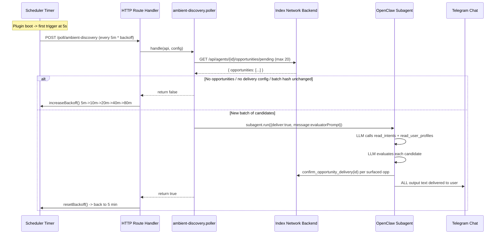
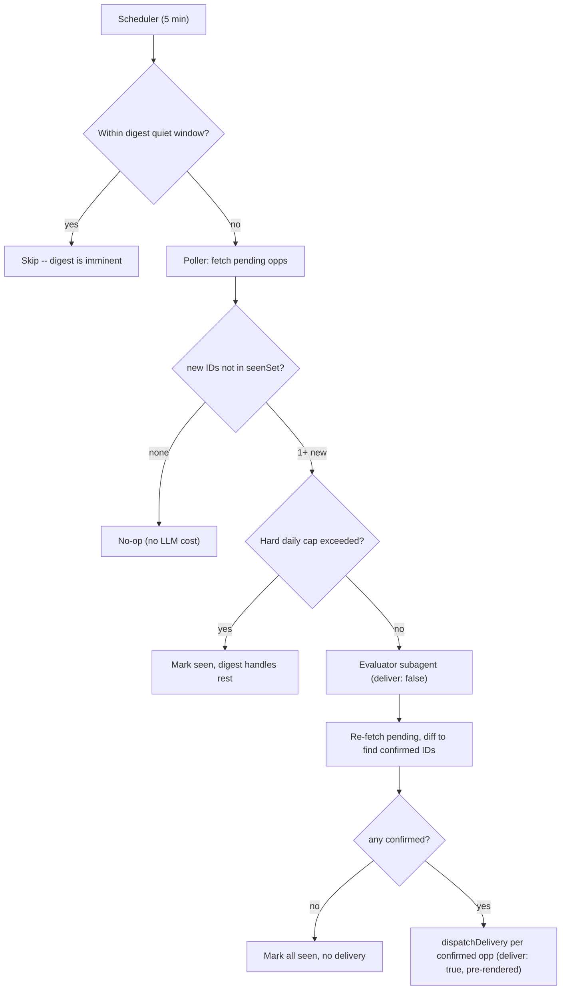

# Reduce Ambient Discovery Message Spam

## Current status (how it works today)



**Timing**: Base interval 5 min. Backoff doubles on `false` return (5m->10m->...->80m max). Resets to 5 min after successful dispatch.

**Key files**:
- Scheduler: [`ambient-discovery.scheduler.ts`](../../packages/openclaw-plugin/src/polling/ambient-discovery/ambient-discovery.scheduler.ts) -- timer loop, backoff logic
- Poller: [`ambient-discovery.poller.ts`](../../packages/openclaw-plugin/src/polling/ambient-discovery/ambient-discovery.poller.ts) -- fetches pending opps, dedup via batch hash, launches subagent
- Prompt: [`opportunity-evaluator.prompt.ts`](../../packages/openclaw-plugin/src/polling/ambient-discovery/opportunity-evaluator.prompt.ts) -- LLM instructions for evaluating candidates
- Route registration: [`index.ts`](../../packages/openclaw-plugin/src/index.ts) (lines 175-201) -- wires scheduler result to backoff/reset
- Backend filter: [`opportunity-delivery.service.ts`](../../backend/src/services/opportunity-delivery.service.ts) (lines 290-353) -- SQL query for pending candidates, LIMIT 20, dedup via `opportunity_deliveries` ledger
- Config: [`openclaw.plugin.json`](../../packages/openclaw-plugin/openclaw.plugin.json) -- plugin config schema
- Delivery dispatcher: [`delivery.dispatcher.ts`](../../packages/openclaw-plugin/src/lib/delivery/delivery.dispatcher.ts) -- builds session key, dispatches pre-rendered cards via `deliver: true`
- Delivery prompt: [`delivery.prompt.ts`](../../packages/openclaw-plugin/src/lib/delivery/delivery.prompt.ts) -- simple relay prompt: "deliver faithfully, don't add commentary"
- Digest scheduler: [`daily-digest.scheduler.ts`](../../packages/openclaw-plugin/src/polling/daily-digest/daily-digest.scheduler.ts) -- `msUntilNextDigest()`, daily timer

**Deduplication layers**:
1. Backend: `opportunity_deliveries` table prevents re-delivering the same opportunity at the same status
2. Poller: `lastOpportunityBatchHash` skips subagent if the set of opportunity IDs hasn't changed
3. Subagent: `idempotencyKey` per `agentId:date:batchHash` prevents duplicate subagent runs

**What the LLM is told**: Evaluate candidates against user's intents/profile. Call `confirm_opportunity_delivery` for winners. Format as bold headline + summary for Telegram. "If no opportunity passes the bar: produce absolutely no output and call no tools."

**What actually happens**: The LLM narrates its entire evaluation process (which candidates it rejected and why), and `deliver: true` sends all of that text straight to Telegram. After a successful dispatch, backoff resets to 5 min, so the next poll fires quickly, finds a slightly changed batch, and the cycle repeats.

## Problem diagnosis

The plugin sent **6 messages in ~10 minutes** (18:16-18:24). Most of them are the LLM "thinking out loud" about why candidates were rejected.

Root causes:

1. **Agent runs on every poll, not just new opportunities**: The batch hash dedup only catches "exact same set of IDs." If one new opp appears, the entire batch (up to 20) is re-evaluated from scratch, re-triggering LLM reasoning about already-seen candidates.

2. **No separation between evaluation and delivery**: The subagent both evaluates AND delivers in one step with `deliver: true`. There's no system gate between the agent's decision and the user's notification.

3. **Backoff logic is inverted**: Successful dispatch resets to 5 min (aggressive). Benign no-ops increase backoff (relaxed). Exactly backwards.

4. **The LLM ignores the "no output" instruction**: The prompt says "produce absolutely no output" for rejections, but the model narrates its reasoning. With `deliver: true`, all of it goes to Telegram.

## Proposed architecture: agent-driven notification with separate delivery



### Layer 1 -- Poller (cheap, no LLM)

Replace batch hash with a **`seenOpportunityIds` set**, persisted to a file so it survives restarts.

- Maintain `Set<string>` of all IDs the poller has fetched (reset daily)
- `newOpps = fetched.filter(id => !seenSet.has(id))`
- If empty: no-op, no LLM cost
- If non-empty: pass to agent with context
- After agent runs (or cap blocks): add all IDs to seen set and persist to file
- On startup: load seen set from file (if same date)

### Layer 2 -- Agent evaluates silently (deliver: false)

The evaluator subagent runs with **`deliver: false`**. Its verbose text output (reasoning, rejections, etc.) never reaches the user.

The agent's job:
1. Call `read_intents` and `read_user_profiles` to ground itself
2. Evaluate each new opportunity against the user's profile and intents
3. For each opportunity worth surfacing: call `confirm_opportunity_delivery`
4. For everything else: do nothing

The agent also receives **decision context** so it can make timing decisions:
- **Deliveries so far today**: how many notifications already sent today
- **Time since last notification**: minutes since the last ambient delivery
- **Time of day**: so it can avoid notifying at odd hours
- **Total pending count**: how many opportunities are waiting

The prompt tells the agent:

> You are the user's notification gatekeeper. You run silently -- your text output is NOT delivered to the user.
>
> You decide:
> 1. **Whether** any of these new opportunities are worth notifying the user right now
> 2. For each one you approve: call `confirm_opportunity_delivery` with its opportunityId
>
> Consider:
> - Is this genuinely valuable, or noise?
> - Have you already notified recently? Is this urgent enough to interrupt again?
> - Would this be better left for the daily digest?
> - Is it a reasonable time to notify?
>
> Call `confirm_opportunity_delivery` ONLY for opportunities worth an immediate notification.
> Everything else will appear in the user's daily digest.

### Layer 3 -- Separate delivery (deliver: true, pre-rendered)

After the evaluator subagent completes (`await subagent.run()` resolves):

1. Re-fetch `/api/agents/{id}/opportunities/pending`
2. Compare: IDs that were in `newOpps` but are no longer pending = confirmed by the evaluator
3. For each confirmed opportunity, dispatch via `dispatchDelivery()` using the **pre-rendered card data** already in memory from the initial fetch

`dispatchDelivery` already exists in `delivery.dispatcher.ts`. It uses `deliveryPrompt` ("Relay faithfully, don't add commentary") with `deliver: true`. The delivery subagent gets pre-authored content, not open-ended evaluation -- so there's no risk of verbose narration.

**Why this is safe**: Even if the evaluator LLM goes rogue and produces paragraphs of text, that text never reaches the user because `deliver: false`. Only the pre-rendered cards from the Index Network backend reach the user.

### Layer 4 -- System safety net (hard cap only)

The only system-level gate is a **hard daily cap** (configurable, default **5**).

- Tracked in the poller, persisted alongside seen IDs
- If cap exceeded: mark IDs as seen, skip agent entirely, digest handles them
- No cooldown timer, no system-level throttling -- timing is the agent's job

### Daily digest -- independent, with quiet window

The daily digest is a **separate, independent evaluation** of the day's overall important opportunities. It does NOT depend on what ambient already delivered.

- The digest evaluates ALL pending opportunities, not just undelivered ones
- It presents the day's highlights as an overview summary
- Ambient discovery pauses during a **quiet window** around digest time (configurable, e.g., 30 min before and after)
- This prevents the user getting an ambient notification right before/after a digest

The ambient scheduler checks if the current time falls within the quiet window. If so, it skips the poll entirely.

## Implementation

### 1. Replace batch hash with seen-IDs set in `ambient-discovery.poller.ts`

```typescript
let seenOpportunityIds = new Set<string>();
let seenDateStr: string | null = null;
let deliveriesToday = 0;
let lastDeliveryTimestamp: number | null = null;

// In handle():
const today = new Date().toISOString().slice(0, 10);
if (seenDateStr !== today) {
  seenOpportunityIds = new Set();
  deliveriesToday = 0;
  seenDateStr = today;
}

const allIds = body.opportunities.map(o => o.opportunityId);
const newOpps = body.opportunities.filter(o => !seenOpportunityIds.has(o.opportunityId));

if (newOpps.length === 0) {
  for (const id of allIds) seenOpportunityIds.add(id);
  return 'no_new';
}

// Hard daily cap -- safety net only
const maxDaily = parseInt(readConfig(api, 'ambientMaxDaily') || '5', 10);
if (deliveriesToday >= maxDaily) {
  for (const id of allIds) seenOpportunityIds.add(id);
  api.logger.info('Ambient discovery: daily cap reached, deferring to digest');
  return 'no_new';
}
```

### 2. Persist seen-IDs to file

Store `{ date, seenIds, deliveriesToday, lastDeliveryTimestamp }` in a JSON file. Load on startup. Implementation detail (file location, write strategy) left to implementer.

### 3. Two-step evaluate + deliver

```typescript
// Step 1: Evaluator runs silently
await api.runtime.subagent.run({
  sessionKey,
  idempotencyKey: `index:eval:opportunity-batch:${config.agentId}:${dateStr}:${evalHash}`,
  message: opportunityEvaluatorPrompt(newOpps, decisionContext),
  deliver: false,  // <-- verbose text never reaches user
  model,
});

// Step 2: Re-fetch to find what the evaluator confirmed
const afterRes = await fetch(pendingUrl, { headers, signal });
const afterBody = await afterRes.json();
const stillPendingIds = new Set(afterBody.opportunities.map(o => o.opportunityId));
const confirmedOpps = newOpps.filter(o => !stillPendingIds.has(o.opportunityId));

// Step 3: Deliver confirmed ones using pre-rendered cards
for (const opp of confirmedOpps) {
  await dispatchDelivery(api, {
    rendered: { headline: opp.headline, body: opp.personalizedSummary },
    idempotencyKey: `index:delivery:ambient:${opp.opportunityId}`,
  });
}

// Update state
for (const id of allIds) seenOpportunityIds.add(id);
if (confirmedOpps.length > 0) {
  deliveriesToday += confirmedOpps.length;
  lastDeliveryTimestamp = Date.now();
}
```

### 4. Decision context for the evaluator prompt

```typescript
opportunityEvaluatorPrompt(newOpps, {
  deliveriesToday,
  minutesSinceLastDelivery: lastDeliveryTimestamp
    ? Math.round((Date.now() - lastDeliveryTimestamp) / 60_000)
    : null,
  totalPendingCount: body.opportunities.length,
  currentTime: new Date().toLocaleTimeString(),
});
```

### 5. Redesign the evaluator prompt

In `opportunity-evaluator.prompt.ts`:

- Agent role: "You are the user's notification gatekeeper. You run silently."
- Provide decision context (deliveries today, time since last, time of day, etc.)
- Agent calls `confirm_opportunity_delivery` for winners -- that's the only signal
- No output formatting needed (deliver: false means text is discarded)

### 6. Change `handle()` return type

Return `'no_new' | 'dispatched' | 'error'` instead of boolean.

### 7. Fix backoff in route handler

- `'error'` -> `increaseBackoff`
- `'dispatched'` or `'no_new'` -> leave interval as-is (no reset to 5 min)

### 8. Digest quiet window

In the ambient scheduler or poller, skip the poll if current time is within `digestQuietMinutes` (default 30) of the configured `digestTime`:

```typescript
function isInDigestQuietWindow(digestTime: string, quietMinutes: number): boolean {
  const now = new Date();
  const [h, m] = digestTime.split(':').map(Number);
  const digestMinuteOfDay = h * 60 + m;
  const nowMinuteOfDay = now.getHours() * 60 + now.getMinutes();
  const diff = Math.abs(nowMinuteOfDay - digestMinuteOfDay);
  return Math.min(diff, 1440 - diff) <= quietMinutes;
}
```

### 9. Make daily digest independent

In `daily-digest.poller.ts` / `digest-evaluator.prompt.ts`:

- The digest should show the day's overall important stuff regardless of what ambient already delivered
- Prompt the digest agent to produce a summary of the day's highlights, including opportunities that were already notified via ambient
- This means the digest does NOT filter by `opportunity_deliveries` -- it re-evaluates all pending opportunities from scratch

### 10. Add config to `openclaw.plugin.json`

- `ambientMaxDaily` (default `"5"`) -- hard daily cap, safety net only

## Files to change

- `packages/openclaw-plugin/src/polling/ambient-discovery/ambient-discovery.poller.ts` -- seen-IDs set (persisted), daily cap, two-step evaluate+deliver, new return type
- `packages/openclaw-plugin/src/polling/ambient-discovery/opportunity-evaluator.prompt.ts` -- full redesign: silent gatekeeper with decision context
- `packages/openclaw-plugin/src/index.ts` -- fix backoff for new return type, pass digest config to ambient scheduler
- `packages/openclaw-plugin/src/polling/ambient-discovery/ambient-discovery.scheduler.ts` -- add digest quiet window check
- `packages/openclaw-plugin/src/polling/daily-digest/daily-digest.poller.ts` -- make digest independent of delivery ledger
- `packages/openclaw-plugin/src/polling/daily-digest/digest-evaluator.prompt.ts` -- redesign as day's highlights summary
- `packages/openclaw-plugin/openclaw.plugin.json` -- add `ambientMaxDaily`
- `packages/openclaw-plugin/src/tests/opportunity-batch.spec.ts` -- update tests for new behavior
