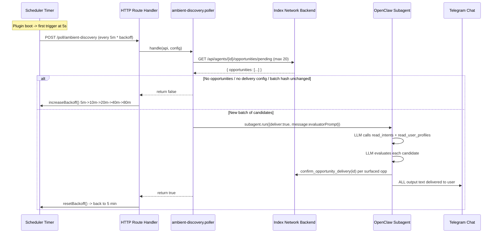
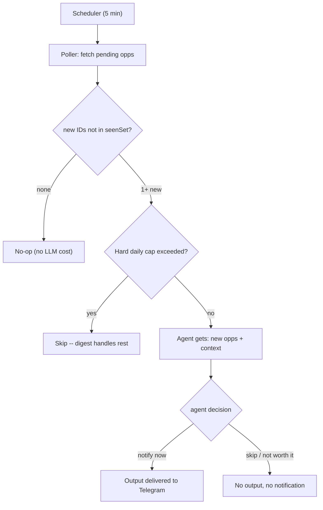

# Reduce Ambient Discovery Message Spam

## Current status (how it works today)



**Timing**: Base interval 5 min. Backoff doubles on `false` return (5m->10m->...->80m max). Resets to 5 min after successful dispatch.

**Key files**:
- Scheduler: [`ambient-discovery.scheduler.ts`](../../packages/openclaw-plugin/src/polling/ambient-discovery/ambient-discovery.scheduler.ts) -- timer loop, backoff logic
- Poller: [`ambient-discovery.poller.ts`](../../packages/openclaw-plugin/src/polling/ambient-discovery/ambient-discovery.poller.ts) -- fetches pending opps, dedup via batch hash, launches subagent
- Prompt: [`opportunity-evaluator.prompt.ts`](../../packages/openclaw-plugin/src/polling/ambient-discovery/opportunity-evaluator.prompt.ts) -- LLM instructions for evaluating candidates
- Route registration: [`index.ts`](../../packages/openclaw-plugin/src/index.ts) (lines 175-201) -- wires scheduler result to backoff/reset
- Backend filter: [`opportunity-delivery.service.ts`](../../backend/src/services/opportunity-delivery.service.ts) (lines 290-353) -- SQL query for pending candidates, LIMIT 20, dedup via `opportunity_deliveries` ledger
- Config: [`openclaw.plugin.json`](../../packages/openclaw-plugin/openclaw.plugin.json) -- plugin config schema

**Deduplication layers**:
1. Backend: `opportunity_deliveries` table prevents re-delivering the same opportunity at the same status
2. Poller: `lastOpportunityBatchHash` skips subagent if the set of opportunity IDs hasn't changed
3. Subagent: `idempotencyKey` per `agentId:date:batchHash` prevents duplicate subagent runs

**What the LLM is told**: Evaluate candidates against user's intents/profile. Call `confirm_opportunity_delivery` for winners. Format as bold headline + summary for Telegram. "If no opportunity passes the bar: produce absolutely no output and call no tools."

**What actually happens**: The LLM narrates its entire evaluation process (which candidates it rejected and why), and `deliver: true` sends all of that text straight to Telegram. After a successful dispatch, backoff resets to 5 min, so the next poll fires quickly, finds a slightly changed batch, and the cycle repeats.

## Problem diagnosis

The plugin sent **6 messages in ~10 minutes** (18:16-18:24). Most of them are the LLM "thinking out loud" about why candidates were rejected.

Root causes:

1. **Agent runs on every poll, not just new opportunities**: The batch hash dedup only catches "exact same set of IDs." If one new opp appears, the entire batch (up to 20) is re-evaluated from scratch, re-triggering LLM reasoning about already-seen candidates.

2. **No separation between evaluation and delivery**: The subagent both evaluates AND delivers in one step with `deliver: true`. There's no system gate between the agent's decision and the user's notification.

3. **Backoff logic is inverted**: Successful dispatch resets to 5 min (aggressive). Benign no-ops increase backoff (relaxed). Exactly backwards.

4. **The LLM ignores the "no output" instruction**: The prompt says "produce absolutely no output" for rejections, but the model narrates its reasoning. With `deliver: true`, all of it goes to Telegram.

## Proposed architecture: agent-driven notification



### Layer 1 -- Poller (cheap, no LLM)

Replace batch hash with a **`seenOpportunityIds` set**. Each opportunity is seen by the agent exactly once.

- Maintain `Set<string>` of all IDs the poller has fetched (reset daily)
- `newOpps = fetched.filter(id => !seenSet.has(id))`
- If empty: no-op, no LLM cost
- If non-empty: pass to agent with context
- After agent runs (or cap blocks): add all IDs to seen set

### Layer 2 -- Agent (full decision authority)

The agent receives not just the new opportunities, but **decision context** so it can make an informed call:

- **New opportunities** to evaluate (only the unseen ones)
- **Deliveries so far today**: how many notifications already sent today
- **Time since last notification**: minutes since the last ambient delivery
- **Time of day**: so it can avoid notifying at odd hours
- **Total pending count**: how many opportunities are waiting (gives a sense of volume)

The prompt tells the agent:

> You are the user's notification gatekeeper. Your output goes directly to their messaging app.
>
> You decide:
> 1. **Whether** any of these new opportunities are worth a notification right now
> 2. **How** to present them (concise, Telegram-friendly)
>
> Consider:
> - Is this genuinely valuable, or noise?
> - Have you already notified recently? If so, is this urgent enough to interrupt again?
> - Would this be better batched into the daily digest?
> - Is it a reasonable time to notify?
>
> If you decide to notify: call `confirm_opportunity_delivery` for each surfaced opportunity, then output the message.
> If you decide NOT to notify: produce exactly zero tokens of output. No explanation, no reasoning, nothing.

This means the agent can:
- Surface a perfect match immediately even if one was sent 10 minutes ago
- Hold back a "decent but not urgent" match because the user was already notified recently
- Batch 3 new opportunities into one message instead of sending 3 separate notifications
- Decide "it's 2am, this can wait" based on the time context

### Layer 3 -- System safety net (hard cap only)

The only system-level gate is a **hard daily cap** (configurable, default 10). This is a safety net, not a policy -- it only fires if the agent is being unreasonably chatty.

- Tracked in the poller: `deliveriesToday` counter, resets when the date changes
- If cap exceeded: skip the agent entirely, add IDs to seen set (digest will handle them)
- No cooldown timer, no system-level throttling -- that's the agent's job

## Implementation

### 1. Replace batch hash with seen-IDs set in `ambient-discovery.poller.ts`

```typescript
let seenOpportunityIds = new Set<string>();
let seenDateStr: string | null = null;
let deliveriesToday = 0;
let lastDeliveryTimestamp: number | null = null;

// In handle():
const today = new Date().toISOString().slice(0, 10);
if (seenDateStr !== today) {
  seenOpportunityIds = new Set();
  deliveriesToday = 0;
  seenDateStr = today;
}

const allIds = body.opportunities.map(o => o.opportunityId);
const newOpps = body.opportunities.filter(o => !seenOpportunityIds.has(o.opportunityId));

if (newOpps.length === 0) {
  for (const id of allIds) seenOpportunityIds.add(id);
  return 'no_new';
}

// Hard daily cap -- safety net only
const maxDaily = parseInt(readConfig(api, 'ambientMaxDaily') || '10', 10);
if (deliveriesToday >= maxDaily) {
  for (const id of allIds) seenOpportunityIds.add(id);
  api.logger.info('Ambient discovery: daily cap reached, deferring to digest');
  return 'no_new';
}
```

### 2. Pass decision context to the agent

Build the evaluator prompt with context the agent needs to make timing decisions:

```typescript
opportunityEvaluatorPrompt(newOpps, {
  deliveriesToday,
  minutesSinceLastDelivery: lastDeliveryTimestamp
    ? Math.round((Date.now() - lastDeliveryTimestamp) / 60_000)
    : null,
  totalPendingCount: body.opportunities.length,
  currentTime: new Date().toLocaleTimeString(),
});
```

After successful dispatch: `deliveriesToday++`, `lastDeliveryTimestamp = Date.now()`.

### 3. Redesign the evaluator prompt

In `opportunity-evaluator.prompt.ts`:

- Give the agent its role: "You are the user's notification gatekeeper"
- Provide decision context (deliveries today, time since last, etc.)
- Let it decide whether to notify, not just what to notify
- Keep the hard rule: "If you decide not to notify: produce exactly zero tokens"
- Keep the `confirm_opportunity_delivery` call requirement for winners

### 4. Change `handle()` return type

Return `'no_new' | 'dispatched' | 'error'` instead of boolean.

### 5. Fix backoff in route handler

- `'error'` -> `increaseBackoff`
- `'dispatched'` or `'no_new'` -> leave interval as-is (no reset to 5 min)

### 6. Add config to `openclaw.plugin.json`

- `ambientMaxDaily` (default `"10"`) -- hard daily cap, safety net only

## Files to change

- `packages/openclaw-plugin/src/polling/ambient-discovery/ambient-discovery.poller.ts` -- seen-IDs set, daily cap, context passing, new return type
- `packages/openclaw-plugin/src/polling/ambient-discovery/opportunity-evaluator.prompt.ts` -- full redesign: agent as gatekeeper with decision context
- `packages/openclaw-plugin/src/index.ts` -- fix backoff for new return type
- `packages/openclaw-plugin/src/polling/ambient-discovery/ambient-discovery.scheduler.ts` -- minor: remove `resetBackoff` export if unused
- `packages/openclaw-plugin/openclaw.plugin.json` -- add `ambientMaxDaily`
- `packages/openclaw-plugin/src/tests/opportunity-batch.spec.ts` -- update tests for new behavior
