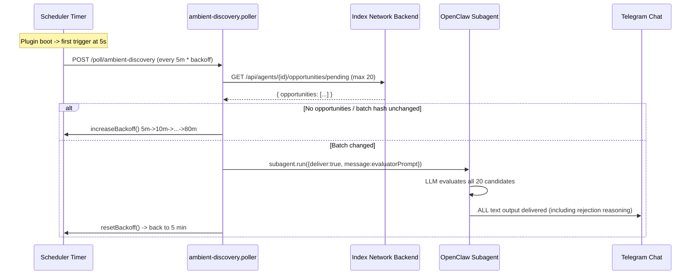
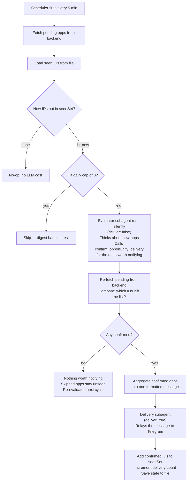

# Reduce Ambient Discovery Message Spam

## Current status (how it works today)



**Problem**: 6 messages in 10 minutes. Most are the LLM narrating its rejection reasoning. Batch hash dedup is too coarse (one new opp re-evaluates all 20). Backoff resets to 5 min after sending. No daily cap.

**Key files**:
- [`ambient-discovery.scheduler.ts`](../../packages/openclaw-plugin/src/polling/ambient-discovery/ambient-discovery.scheduler.ts) -- timer, backoff
- [`ambient-discovery.poller.ts`](../../packages/openclaw-plugin/src/polling/ambient-discovery/ambient-discovery.poller.ts) -- fetch, dedup, launch subagent
- [`opportunity-evaluator.prompt.ts`](../../packages/openclaw-plugin/src/polling/ambient-discovery/opportunity-evaluator.prompt.ts) -- LLM instructions
- [`index.ts`](../../packages/openclaw-plugin/src/index.ts) (lines 175-201) -- route handler, backoff wiring
- [`delivery.dispatcher.ts`](../../packages/openclaw-plugin/src/lib/delivery/delivery.dispatcher.ts) -- dispatches pre-rendered cards
- [`openclaw.plugin.json`](../../packages/openclaw-plugin/openclaw.plugin.json) -- plugin config schema

## Proposed flow



### Step by step

**1. Scheduler fires every 5 minutes.**

Same as today. On plugin startup, first trigger after 5 seconds.

**2. Fetch pending opportunities from the backend.**

`GET /api/agents/{id}/opportunities/pending` with `x-api-key`. Returns up to 20 opportunities with pre-rendered card data (headline, personalizedSummary, suggestedAction).

**3. Load seen IDs from file.**

Read a persisted JSON file containing the set of opportunity IDs already processed. If the stored date doesn't match today, reset to empty (fresh day). This survives gateway restarts.

**4. Diff: find new opportunities.**

`newOpps = fetched.filter(id => !seenSet.has(id))`. If everything was already seen, do nothing -- no LLM call, zero cost.

**5. Check daily cap.**

If 3 evaluator dispatches have already happened today, skip. The new opportunities stay unseen (they'll be picked up by the daily digest or re-evaluated tomorrow).

**6. Evaluator subagent runs silently (`deliver: false`).**

The evaluator's text output is discarded -- it never reaches the user. The LLM can think as verbosely as it wants.

The evaluator receives:
- The new opportunities (only the ones not in the seen set)
- Decision context: deliveries today, minutes since last delivery, current time, total pending count

The evaluator's job:
- Call `read_intents` and `read_user_profiles` to understand the user
- Think about each new opportunity: is it genuinely valuable? Is this a good time to notify?
- For each opportunity worth notifying about: call `confirm_opportunity_delivery` with its ID
- For everything else: do nothing (they stay unseen and get re-evaluated next cycle)

**7. Re-fetch pending to detect the evaluator's decisions.**

After the evaluator completes, fetch `/opportunities/pending` again. Compare against the new opportunities: any IDs that were in `newOpps` but are no longer in the pending list were confirmed by the evaluator. This is how the poller discovers which opportunities the agent approved.

**8. If any were confirmed: aggregate into one message.**

Take the confirmed opportunities and format them into a single message using the pre-rendered card data from step 2 (headline, personalizedSummary, suggestedAction). Example:

> **Darlin Alberto — Brooklyn, AI & product** is a local technologist specializing in applied AI and B2B SaaS, based right in Brooklyn.
> → Connect with Darlin on Index Network.
>
> **Zoe Weinberg — Agentic tech investor at ex/ante** is a VC focused on agentic technology and human agency in digital systems.
> → Connect with Zoe to discuss agentic tech.

**9. Delivery subagent sends to Telegram (`deliver: true`).**

The aggregated message is dispatched via `dispatchDelivery()`, which wraps it in the "relay faithfully, don't add commentary" prompt and sends it through a delivery subagent. The user receives exactly one Telegram notification for this batch.

**10. Persist state to file.**

- Add confirmed IDs to `seenOpportunityIds` (they won't be re-evaluated)
- Skipped IDs are NOT added to the seen set (they get another chance next cycle)
- Increment `deliveriesToday`
- Update `lastDeliveryTimestamp`
- Write everything to the JSON file

### What happens to skipped opportunities

When the evaluator decides an opportunity isn't worth notifying about right now, it simply doesn't call `confirm_opportunity_delivery` for it. That opportunity:
- Stays in the backend's pending list
- Stays outside the `seenOpportunityIds` set
- Gets re-evaluated next cycle with fresh context (different time of day, different delivery count)
- Eventually shows up in the daily digest if it's never confirmed

This means the agent can defer an opportunity because of timing ("I already notified twice today, this can wait") and reconsider it later when conditions change.

## Implementation

### 1. Seen-IDs set with file persistence

In `ambient-discovery.poller.ts`:

```typescript
let seenOpportunityIds = new Set<string>();
let seenDateStr: string | null = null;
let deliveriesToday = 0;
let lastDeliveryTimestamp: number | null = null;

const today = new Date().toISOString().slice(0, 10);
if (seenDateStr !== today) {
  seenOpportunityIds = new Set();
  deliveriesToday = 0;
  lastDeliveryTimestamp = null;
  seenDateStr = today;
}

const newOpps = body.opportunities.filter(o => !seenOpportunityIds.has(o.opportunityId));
if (newOpps.length === 0) return 'no_new';

const maxDaily = parseInt(readConfig(api, 'ambientMaxDaily') || '3', 10);
if (deliveriesToday >= maxDaily) return 'no_new';
```

File persistence: store `{ date, seenIds, deliveriesToday, lastDeliveryTimestamp }` in a JSON file. Load on startup. File location left to implementer.

### 2. Silent evaluator subagent

```typescript
await api.runtime.subagent.run({
  sessionKey,
  idempotencyKey: `index:eval:ambient:${config.agentId}:${dateStr}:${evalHash}`,
  message: opportunityEvaluatorPrompt(newOpps, {
    deliveriesToday,
    minutesSinceLastDelivery: lastDeliveryTimestamp
      ? Math.round((Date.now() - lastDeliveryTimestamp) / 60_000)
      : null,
    totalPendingCount: body.opportunities.length,
    currentTime: new Date().toLocaleTimeString(),
  }),
  deliver: false,
  model,
});
```

### 3. Re-fetch and diff

```typescript
const afterRes = await fetch(pendingUrl, { headers, signal });
const afterBody = await afterRes.json();
const stillPendingIds = new Set(afterBody.opportunities.map(o => o.opportunityId));
const confirmedOpps = newOpps.filter(o => !stillPendingIds.has(o.opportunityId));
```

### 4. Aggregated delivery

```typescript
if (confirmedOpps.length > 0) {
  const aggregatedBody = confirmedOpps
    .map(o => `**${o.headline}**\n${o.personalizedSummary}\n→ ${o.suggestedAction}`)
    .join('\n\n');

  await dispatchDelivery(api, {
    rendered: {
      headline: confirmedOpps.length === 1
        ? confirmedOpps[0].headline
        : `${confirmedOpps.length} new connections`,
      body: aggregatedBody,
    },
    idempotencyKey: `index:delivery:ambient:${config.agentId}:${dateStr}:${evalHash}`,
  });

  for (const opp of confirmedOpps) seenOpportunityIds.add(opp.opportunityId);
  deliveriesToday++;
  lastDeliveryTimestamp = Date.now();
  // persist to file
}
```

### 5. Redesign the evaluator prompt

The evaluator runs silently. Its prompt should:
- Explain its role: "You evaluate opportunities silently. Your text output is discarded."
- Provide decision context (deliveries today, time since last, time of day, total pending)
- Instruct: "Call `confirm_opportunity_delivery` for each opportunity worth an immediate notification. Everything you don't confirm stays pending and will be re-evaluated later or included in the daily digest."
- List allowed opportunity IDs (injection hardening)

### 6. Change `handle()` return type

Return `'no_new' | 'dispatched' | 'error'` instead of boolean.

### 7. Fix backoff in route handler

In `index.ts`:
- `'error'` → `increaseBackoff`
- `'dispatched'` or `'no_new'` → leave interval as-is (don't reset to 5 min)

### 8. Add config to `openclaw.plugin.json`

- `ambientMaxDaily` (default `"3"`) -- hard daily cap

## Files to change

| File | What changes |
|------|-------------|
| `packages/openclaw-plugin/src/polling/ambient-discovery/ambient-discovery.poller.ts` | Seen-IDs set (persisted), daily cap, two-step evaluate+deliver, re-fetch diff, new return type |
| `packages/openclaw-plugin/src/polling/ambient-discovery/opportunity-evaluator.prompt.ts` | Redesign: silent evaluator with decision context |
| `packages/openclaw-plugin/src/index.ts` | Fix backoff for new return type |
| `packages/openclaw-plugin/openclaw.plugin.json` | Add `ambientMaxDaily` |
| `packages/openclaw-plugin/src/tests/opportunity-batch.spec.ts` | Update tests |
