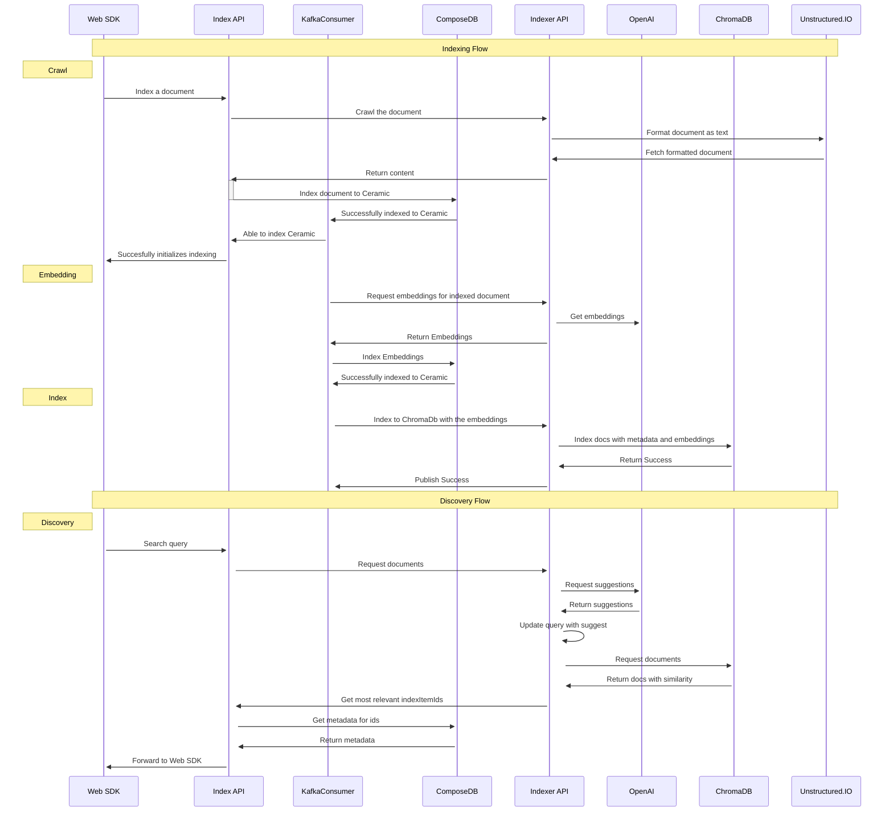

<h1 align="center">
    <a href="https://index.network/#gh-light-mode-only">
    
    </a>
    <a href="https://index.network/#gh-dark-mode-only">
    
    </a>
</h1>
<p align="center">
  <i align="center">Indexer</i>
</p>

# Indexer

This documentation outlines the usage of the API endpoints for a NestJS application featuring two main controllers: Indexer Controller and Chat Controller. Each controller is responsible for handling specific operations within the application, with a total of 8 endpoints described below.

- [Indexer](#indexer)
  - [Usage](#usage)
    - [Dependencies](#dependencies)
    - [Build](#build)
  - [Architecture](#architecture)
  - [A. Indexer Controller](#a-indexer-controller)
    - [1. Crawl Document Content](#1-crawl-document-content)
    - [2. Extract Document Embeddings](#2-extract-document-embeddings)
    - [3. Add Document to Database](#3-add-document-to-database)
    - [4. Update Document Metadata or Content](#4-update-document-metadata-or-content)
    - [5. Delete Index](#5-delete-index)
    - [6. Delete Index Item](#6-delete-index-item)
  - [B. Chat Controller](#b-chat-controller)
    - [7. Generate Content for Question](#7-generate-content-for-question)
  - [C. Query Controller](#c-query-controller)
    - [1. Query Endpoint](#1-query-endpoint)
    - [2. Search Endpoint](#2-search-endpoint)
    - [3. Autocomplete Endpoint](#3-autocomplete-endpoint)

## Usage

Start NestJs application with the correct access with your environment.

### Dependencies

1. Node>=21.x.x
1. yarn>=0.5.x


### Build
```sh
yarn build
yarn start:dev
```

## Architecture




## A. Indexer Controller
The Indexer Controller is designed for crawling, embedding extraction, and indexing operations. Below are the details of its endpoints:

### 1. Crawl Document Content

- **Method**: `POST`
- **Endpoint**: /indexer/crawl
- **Description**: Crawls the document content from a given URL using Unstructured.io API.
- **Body Parameters**:
    - `url (string)`: The URL of the document to crawl.
- **Response**: Returns a key-value pair of 'content' (string) representing the textual content of the document.


- **Example Usage**

  - curl request:

  ```sh
  curl -X POST http://localhost:3012/indexer/crawl \
      -H "Content-Type: application/json" \
      -H 'X-API-KEY: your_api_key_here' \
      -d '{"url": "https://example.com"}'
  ```

  - Python request:

  ```python
  url = 'http://localhost:3012/indexer/crawl'
  payload = {'url': 'https://example.com'}
  response = requests.post(url, json=payload)
  print(response.text)

  # { "content" : "This is a sample content...." }
  ```

### 2. Extract Document Embeddings

- **Method**: `POST`
- **Endpoint**: /indexer/embeddings
- **Description**: Extracts embeddings for the given document using OpenAI embeddings.
- **Body Parameters**:
    - `content (string)`: The textual content of the document. 
- **Response**: Returns a list of floats representing the embedding vector.

- **Example Usage**
  - curl request

  ```sh
  curl -X POST http://localhost:3012/indexer/embeddings \
      -H "Content-Type: application/json" \
      -H 'X-API-KEY: your_api_key_here' \
      -d '{"content": "Document content goes here"}'
  ```

  - Python request:

  ```python
  import requests

  url = 'http://localhost:3012/indexer/embeddings'
  payload = {'content': 'Document content goes here'}
  response = requests.post(url, json=payload)
  print(response.text)

  # { "embedding" : [0.0012, 0.21, ... ] }

  ```

### 3. Add Document to Database

- **Method**: `POST`
- **Endpoint**: /indexer/index
- **Description**: Adds a document to the ChromaDB database with the appropriate metadata and content.
- **Body Parameters**: An object containing the following keys:
    - `indexId (string)`: The id string of the Index
    - `indexTitle (string)`: The title of the index
    - `indexCreatedAt (date)`: The create timestamp of index
    - `indexUpdatedAt (date)`: The last update timestamp of index
    - `indexDeletedAt (date)`: The delete timestamp of index
    - `indexOwnerDID (string)`: The owner key of the index
    - `webPageId (string)`: The id string of the webpage
    - `webPageTitle (string)`: The title of the web page
    - `webPageUrl (string)`: The url of the web page
    - `webPageCreatedAt (date)`: The create timestamp of web page
    - `webPageContent (string)`: The string of content of web page
    - `webPageUpdatedAt (date)`: The last update timestamp of index
    - `webPageDeletedAt (date)`: The delete timestamp of index
    - `vector (number[])`: The embedding of the WebPageContent
- **Response**: Returns a success or error message.
- **Example Usage**

  - curl request:

  ```sh
  curl -X POST http://localhost:3012/indexer/index \
      -H "Content-Type: application/json" \
      -H 'X-API-KEY: your_api_key_here' \
      -d '{"indexId": "1", "indexTitle": "Title", ...}'
  ```
  - Python request:

  ```python
  import requests

  url = 'http://localhost:3012/indexer/index'
  payload = {
    'indexId': '1',
    'indexTitle': 'Title',
    # Add other fields as necessary
  }
  response = requests.post(url, json=payload)
  print(response.text)

  # 200, { "message": "Index item IndexItemID_0 succesfully upddated" }
  ```


### 4. Update Document Metadata or Content

- **Method**: `PUT`
- **Endpoint**: /indexer/index
- **Description**: Updates the given document metadata or content with the given sublist of keys and their updated values.
- **Body Parameters**: An object containing a subset of keys from the document model and their new values.
- **Response**: Returns a success or error message.

- **Example Usage**

  - curl request:

  ```sh
  curl -X PUT http://localhost:3012/indexer/index \
      -H "Content-Type: application/json" \
      -d '{"indexId": "1", "indexTitle": "Updated Title"}'
  ```
  - Python request:

  ```python
  import requests

  url = 'http://localhost:3012/indexer/index'
  payload = {'indexId': '1', 'indexTitle': 'Updated Title'}
  response = requests.put(url, json=payload)
  print(response.text)

  # 200, { "message": "Index item IndexItemID_0 succesfully upddated" }
  ```


### 5. Delete Index

- **Method**: `DELETE`
- **Endpoint**: /indexer/index
- **Description**: Deletes the given index items from the "indexId".
- **Body Parameters**: An object with the key indexId.
    - `indexId (string)`: The id string of the Index

- **Response**: Returns a success or error message.

- **Example Usage**

  - curl request:

  ```sh
  curl -X DELETE http://localhost:3012/indexer/index \
      -H "Content-Type: application/json" \
      -d '{"indexId": "1"}'
  ```
  - Python request:

  ```python
  import requests

  url = 'http://localhost:3012/indexer/index'
  payload = {'indexId': '1'}
  response = requests.delete(url, json=payload)
  print(response.text)

  # 200, { "message": "Index IndexID_0 wirh IndexItemIDS [ 'IndexItemID_3', 'IndexItemID_5' ]  succesfully deleted" }
  ```


### 6. Delete Index Item

- **Method**: `DELETE`
- **Endpoint**: ``/indexer/item``
- **Description**: Deletes the given index item from the "indexId" and "indexItemId".
- **Body Parameters**: An object with the keys indexId and indexItemId.
    - `indexId (string)`: The id string of the Index
    - `indexItemId (string)`: The id string of the IndexItem

- **Response**: Returns a success or error message.

- **Example Usage**
  - curl request:

  ```sh
  curl -X DELETE http://localhost:3012/indexer/item \
      -H "Content-Type: application/json" \
      -d '{"indexId": "1", "indexItemId": "2"}'
  ```
  - Python request:

  ```python
  import requests

  url = 'http://localhost:3012/indexer/item'
  payload = {'indexId': '1', 'indexItemId': '2'}
  response = requests.delete(url, json=payload)
  print(response)

  # 200, { "message": "Index item IndexItemID_0 succesfully deleted" }
  ```


## B. Chat Controller

The Chat Controller handles operations related to generating content based on a given input and querying the database.

### 7. Generate Content for Question

- **Method**: `POST`
- **Endpoint**: ``/chat/stream``
- **Description**: For a given "question" and "chat_history", generates content for the question.
- **Body Parameters**: An object containing 
  * `question (string)`: The string of last chat input
  
  * `chat_history (string)`: The list of input objects from both user and agent with message role and content
  
  * `indexIds (string[])`: The list of id strings to ask


- **Response**: Returns "answer" text and "source" which are the list of "webPageId".
- **Example Usage**
  - curl request:

  ```sh
  curl -X POST http://localhost:3012/chat/stream \
      -H "Content-Type: application/json" \
      -d '{"question": "What is AI?", "chat_history": "...", "index_id": "1", "model_type": "...", "chain_type": "..."}'
  ```
  - Python request:

  ```python
  import requests

  url = 'http://localhost:3012/chat/stream'
  payload = {
    'question': 'What is AI?',
    'chat_history': '...',
    'index_id': '1',
    'model_type': '...',
    'chain_type': '...'
  }
  response = requests.post(url, json=payload)
  print(response.text)

  # {
  #   "content": "AI is the current trend....",
  #   "sources": [ "webPageId_9", "webPageId_20", ... ]
  # }
  ```


## C. Query Controller


Below, you will find detailed descriptions and usage instructions for our three main endpoints: query, search, and autocomplete.


### 1. Query Endpoint


- **Method**: ``POST``
- **URL**: ``discovery/query``
- **Description**: Returns a list of item results for user searches within specified index(es) using a given query string. It also supports [metadata filtering](https://docs.trychroma.com/usage-guide#using-where-filters) through ChromaDB .
- **Body Parameters**: An object containing
  - ``query (string)``: The query string to search.

  - ``indexIds (string[])``: Array of index IDs to search within.
  - ``page (int)``: The page number of results to return.
  - ``limit (int)``: The number of results per page.
  - ``filters (Object)``: Filters to apply on the search results (ChromaFilter).
  - ``sort (int)``: The field to sort the results by.
  - ``desc (int)``: Boolean indicating whether the sorting should be in descending order.

- **Response**: Returns  "items" which are the list of "webPageId".
- **Example Usage**
  - curl request:

  ```sh
  curl -X POST http://localhost:3012/discovery/query \
      -H "Content-Type: application/json" \
      -d '{ "query": "string", "indexIds": ["string"], "page": 0, "limit": 0, "filters": { "indexCreatedAt": { "$gte": "2024-02-28T11:08:59.353Z" }, "sort": "string", "desc": true }'
  ```
  - Python request:

  ```python
  import requests

  url = 'http://localhost:3012/discovery/query'
  payload = {
    "query": "string",
    "indexIds": ["string"],
    "page": 0,
    "limit": 0,
    "filters": {
        "indexCreatedAt": {
          "$gte": "2024-02-28T11:08:59.353Z"
        }
    },
    "sort": "string",
    "desc": true
  }
  response = requests.post(url, json=payload)
  print(response.text)
  ```


### 2. Search Endpoint


- **Method**: ``POST``
- **URL**: ``discovery/{db}/search/{indexIds}``
- **Description**: Performs a search using embeddings in ChromaDB. This endpoint is similar to the query endpoint but focuses on embedding-based searches and will support multiple embedding models in the future.
- **Body Parameters**: An object containing

  - ``embedding``: The embedding to search.
 
  - ``model``: The embedding model, eg. `text-embedding-ada-002`.

  - ``indexIds``: Array of index IDs to search within.

  - ``page``: The page number of results to return.

  - ``limit``: The number of results per page.

  - ``filters``: Filters to apply on the search results (ChromaFilter).

  - ``sort``: The field to sort the results by.

  - ``desc``: Boolean indicating whether the sorting should be in descending order.
- **Response**: Returns  "items" which are the list of "webPageId".
- **Example Usage**
  - curl request:

  ```sh
  curl -X POST http://localhost:3012/discovery/search \
      -H "Content-Type: application/json" \
      -H 'X-API-KEY: your_api_key_here' \
      -d '{ "embedding": [0.1, 0.2, ....], "indexIds": ["string"], "page": 0, "limit": 0, "filters": "ChromaFilter", "sort": "string", "desc": true }'
  ```
  - Python request:

  ```python
  import requests

  url = 'http://localhost:3012/discovery/search'
  payload = {
    "embedding": [0.1, 0.2, ...],
    "indexIds": ["string"],
    "page": 0,
    "limit": 0,
    "filters": "ChromaFilter",
    "sort": "string",
    "desc": true
  }
  response = requests.post(url, json=payload)
  print(response.text)

  # 200, { "items": [
  #   { "webPageItemId": "sknfljdfd", "similarity": 0.92 },
  #   { "webPageItemId": "mcdafşdş", "similarity": 0.81 },
  #   ......
  # ] }
  ```


### 3. Autocomplete Endpoint

- **Method**: ``POST``
- **URL**: ``discovery/autocomplete``
- **Description**: Expands the given query via the openai.chat.completions endpoint to increase the specificity of the semantic content. It utilizes the content of the given index documents to provide autocomplete suggestions.
- **Body Parameters**:
    - `indexIds`: Array of index IDs to search within for autocomplete suggestions.
    - `query`: The initial query string for which to provide autocomplete suggestions.
    - `n`: The number of autocomplete suggestions to return.
- **Response**: Returns "answer" text and "source" which are the list of "webPageId".
- **Example Usage**
  - curl request:

  ```sh
  curl -X POST http://localhost:3012/discovery/autocomplete \
      -H "Content-Type: application/json" \
      -H 'X-API-KEY: your_api_key_here' \
      -d '{ "indexIds": ["string"], "query": "string", "n": 0 }'
  ```
  - Python request:

  ```python
  import requests

  url = 'http://localhost:3012/discovery/autocomplete'
  payload = {
    "indexIds": ["string"],
    "query": "string",
    "n": 0
  }
  response = requests.post(url, json=payload)
  print(response.text)


  # 200, { "items": [
  #   { "webPageItemId": "sknfljdfd", "similarity": 0.92 },
  #   { "webPageItemId": "mcdafşdş", "similarity": 0.81 },
  #   ......
  # ] 
  ```
