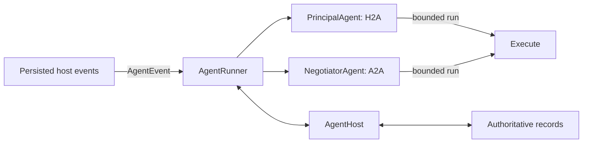
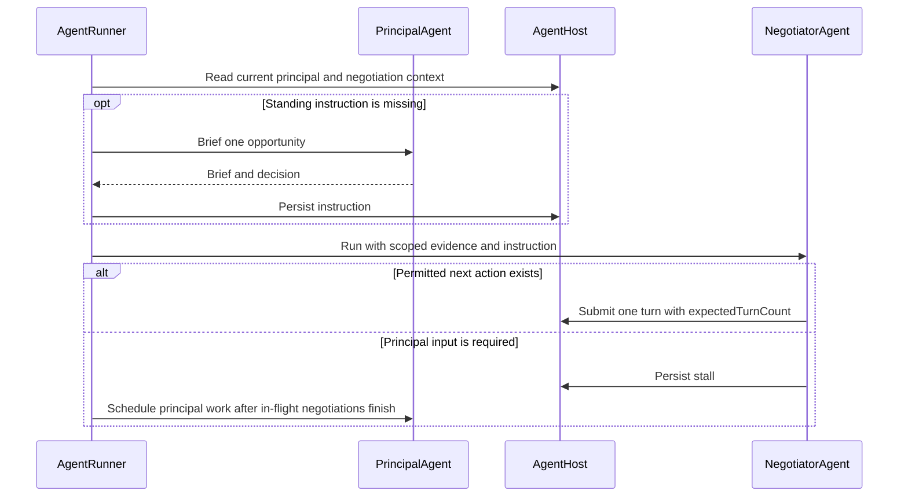

# `@indexnetwork/agent`

- Principal-scoped runtime for human-to-agent (H2A) reasoning and agent-to-agent (A2A) negotiation.
- `AgentRunner` owns scheduling for both reasoning layers.
- Host integrations own authenticated domain access, event delivery, persistence, credentials, and process lifecycle.
- The API is the reference integration.
- The remaining macOS and Hermes work is specified in [docs/mac-hermes-migration.md](docs/mac-hermes-migration.md).

## Ownership and flow



| Boundary | Ownership |
|---|---|
| `PrincipalAgent` | Interpret principal intent, confirmed profile facts, private conversation, and open negotiations; produce notes, questions, briefs, decisions, and discovery actions. |
| `NegotiatorAgent` | Evaluate one negotiation against the standing brief and decision; submit one permitted turn or publish a stall. |
| `AgentRunner` | Reconstruct current context, coordinate both agents, coalesce wakes, hold stalled negotiations, and prevent duplicate in-process work. |
| `AgentHost` | Return current authorized records and durably persist principal messages, opportunities, and negotiation turns. |
| `Execute` | Run one complete, bounded reasoning/tool loop directly or through a native executor. |
| Host integration | Supply credentials, normalize persisted events, reconcile after connection, supervise the process, and enforce cross-process ownership. |

### Domain rules

- Use `intent` throughout the agent domain; `AbortSignal` and `abortSignal` refer only to cancellation.
- Reserve `seat` for one side of the two-party negotiation protocol.
- Treat hosted and external agents as deployment modes of the same principal role; both may perform H2A and A2A work.
- Treat `PrincipalAgent` and `NegotiatorAgent` as reasoning layers of one agent identity, not separately deployed agents.
- Keep `NegotiateContext.role` fixed as `initiator` or `responder` for the negotiation lifetime.
- Allow only the original responder to submit `accept`; the host remains authoritative for final protocol validation.

### Negotiation flow



- A persisted standing instruction lets a counterparty turn go directly to `NegotiatorAgent`.
- A missing instruction triggers one-opportunity `PrincipalAgent.brief()` work rather than a whole-intent wake.
- The runner may start an authorized negotiation after its instruction is persisted while the rest of the principal wake continues.
- Private principal evidence remains scoped to reasoning and must not appear in counterpart messages.

## Build and imports

- Run package checks from the repository root:

```bash
bun run --cwd packages/agent check
```

- Import only from the package root:

```ts
import {
  AgentRunner,
  createExecute,
  OpenRouterClient,
  type AgentEvent,
  type AgentHost,
  type Execute,
} from "@indexnetwork/agent";
```

- The private ESM package emits `dist/index.js` and NodeNext-compatible TypeScript declarations.
- The runtime requires global `fetch`, `crypto.randomUUID`, and `AbortSignal.any`, `timeout`, and `throwIfAborted`.
- The package has no runtime dependencies and does not read environment variables.

## Reasoning execution

### Direct OpenRouter execution

- Supply credentials from the host configuration or secret manager:

```ts
const execute = createExecute(new OpenRouterClient({ apiKey }));
```

- Construction performs no I/O.
- Each reasoning request uses the host's billed API credential; never embed it in a browser bundle or source control.
- Default ordered models: `google/gemini-3.7-flash`, `google/gemini-3.8-flash`, and `anthropic/claude-haiku-4.5`.
- `models` replaces the defaults with one to three nonblank IDs.
- `timeout` replaces the 120,000-millisecond deadline for one request and its response body.
- The client adds no retry; OpenRouter owns provider and model failover.
- `TypeSafeClient` remains available for explicit evaluations and comparisons; it is not used by `AgentRunner`.

### Negotiation evidence

- One bounded negotiation run judges principal facts, explicit requirement contradictions, and unresolved ask-before boundaries.
- Tool handlers enforce protocol actions, the standing decision, responder-only acceptance, and one result.
- A successful `submit_turn` or `stall` tool ends the run immediately; invalid calls return feedback within the three-step budget.
- The negotiator receives the current intent, confirmed profile, scoped H2A conversation, standing brief, counterpart intent, and complete ordered A2A turns.
- Explicit principal evidence may supply a fact omitted from the brief.
- Agent summaries cannot establish principal facts or permission.
- Entries scoped to other opportunities and unconfirmed profile fields are excluded.
- Each source field appears once in the prepared prompt.
- Both agents receive `turnCount`, `maxTurns`, and `remainingTurns`; turn pressure never overrides evidence or approval requirements.

## Integrate `AgentRunner`

- Supply one `AgentHost` and one event subscription for a principal.
- Treat `Subscribe` and `runAgent` below as integration-local declarations, not package exports.
- Attach event delivery before initial reconciliation so changes can arrive while reconciliation reads.

```ts
import {
  AgentRunner,
  type AgentEvent,
  type AgentHost,
  type Execute,
} from "@indexnetwork/agent";

type Subscribe = (
  callbacks: {
    onEvent: (event: AgentEvent) => void;
    onReconnect: () => Promise<void>;
  },
  abortSignal: AbortSignal,
) => Promise<() => void>;

export async function runAgent(
  host: AgentHost,
  execute: Execute,
  subscribe: Subscribe,
  shutdown: AbortSignal,
): Promise<void> {
  shutdown.throwIfAborted();
  const runner = new AgentRunner({
    host,
    execute,
    log: (line) => console.log(line),
    onError: (error) => console.error("Agent work failed", error),
  });
  const stop = () => runner.stop();
  let unsubscribe: (() => void) | undefined;
  shutdown.addEventListener("abort", stop, { once: true });

  try {
    unsubscribe = await subscribe({
      onEvent: (event) => runner.handle(event),
      onReconnect: () => runner.reconcile(),
    }, shutdown);
    shutdown.throwIfAborted();
    await runner.reconcile();

    await new Promise<void>((resolve) => {
      if (shutdown.aborted) resolve();
      else shutdown.addEventListener("abort", () => resolve(), { once: true });
    });
  } finally {
    runner.stop();
    shutdown.removeEventListener("abort", stop);
    unsubscribe?.();
  }
}
```

- Observe the launcher promise and the promise returned by `onReconnect`.
- Clean up a partially opened subscription when startup fails.
- Account for events missed while disconnected; connection alone does not guarantee gap-free delivery.
- `stop()` requests cancellation and clears pending work without draining active host I/O or rolling back persisted effects.
- Tear down database and HTTP resources only when the host decides active operations can no longer use them.

## Implement `AgentHost`

- Scope one `AgentHost` to one principal for the entire runner lifetime.
- Revalidate current ownership and authorization on every operation.
- Return a record or reject for individual reads; do not fabricate missing context.
- Preserve genuine empty lists and conversations as valid results.

| Operation | Host obligation |
|---|---|
| `getProfile()` | Return the current profile and confirmation state; only confirmed fields become model facts. |
| `getIntent(intentId)` | Return the current intent and lifecycle status; only `ACTIVE` intents receive new reasoning. |
| `listIntents()` | Return the principal's intents; the runner selects active IDs. |
| `getConversation(intentId)` | Return the conversation ID and raw messages in oldest-first order, including agent bookkeeping. |
| `listNegotiations()` | Return the principal's open negotiation summaries. |
| `getNegotiation(opportunityId)` | Return current status, turn owner, ordered turns, counterparty data, permissions, and limits. |
| `findCounterparties(intentId, query, limit)` | Perform authorized retrieval and return scores with person, intent, and network identifiers. |
| `createOpportunities(intentId, picks)` | Create or resolve selected opportunities and return authoritative IDs. |
| `appendMessages(intentId, messages)` | Durably append the batch in order before resolving; subsequent reads must observe it. |
| `submitTurn(opportunityId, turn)` | Atomically validate `expectedTurnCount`, ownership, eligibility, and protocol permissions before persisting. |

- Context-read, conversation-publication, and turn-submission failures reject through the caller or `onError`.
- The runner does not retry those failures or convert them into fabricated stalls.
- Discovery and opportunity-creation handler failures become ordinary tool feedback inside the bounded run.

### Conversation persistence

- `appendMessages` receives structured `PrincipalMessage` entries.
- `getConversation` returns raw `ConversationMessage` records.
- Store text in text parts, for example `parts: [{ kind: "text", text: entry.text }]`.
- Store the structured fields under `metadata.principalMessage` and the related intent ID in metadata.
- Preserve unprefixed text and use `principalMessage.kind` for `brief`, `decision`, `stall`, and `progress` bookkeeping.
- Attribute runner entries to the agent; retain principal authorship for user input and answers.
- Preserve message IDs, timestamps, question IDs, wire scopes, and match references.
- Preserve `kind: "expire"` with its original `questionId`; retirement is not an answer.
- Treat persisted scope `match` as an opportunity reference.
- Persist an instruction before scheduling the negotiation it authorizes.
- Do not report persistence success from an in-memory fallback.

## Forward persisted events

- Persist each source change before calling `runner.handle(event)`.
- Send routing IDs rather than context snapshots.

| Event | Runner behavior |
|---|---|
| `principal.input` | Release the intent's in-memory negotiation holds and request a principal wake. |
| `intent.created` | Request a wake using the new persisted intent. |
| `intent.updated` | Request a wake after a content edit; filter internal bookkeeping updates. |
| `intent.lifecycle` | Request the normal wake path, which rereads status and skips inactive intents. |
| `agent.wake` | Request fresh reasoning without human input or releasing negotiation holds. |
| `negotiation.turn` | Request only the affected negotiation using fresh permissions and its standing instruction. |

- `handle()` returns after scheduling or coalescing, before reasoning or persistence completes.
- One wake runs per intent with at most one coalesced follow-up.
- Duplicate notifications for an in-flight opportunity are dropped.
- Different intents and opportunities may run concurrently.
- Event acknowledgment must not treat `handle()` as a durable queue or completed job.
- `onWake(intentId, active)` reports when an intent starts and stops being reasoned about, so a host can show work that ends silently. A coalesced follow-up stays active rather than reporting idle between the two runs.

## H2A replies and manual wakes

- `PrincipalAgent` uses `note_principal` for unaddressed human input, including greetings and status questions.
- Plain model text outside a tool call is not persisted.
- Host-result notes are context, not principal replies or authorization.
- Wakes with no unaddressed input or useful work may remain silent.
- Call `runner.wake(intentId)` only for an explicit request for fresh H2A reasoning without a new message or answer.
- `wake()` returns immediately, writes no conversation entry by itself, releases no negotiation hold, and reports background failures through `onError`.

## Reconciliation and runtime state

- The first `reconcile()` silently adopts existing active intents and recovers eligible turn-zero negotiations.
- Later reconciliations remove missing or inactive IDs and wake newly active intents.
- Persisted unresolved stalls remain held until principal input or a valid standing decision releases them.
- Reconciliation does not replay missed principal input, recover every later turn, or reconstruct a durable job queue.
- Concurrent reconciliation calls serialize their reads.
- A reconciliation promise resolves after its reads, membership update, and recovery scheduling; background reasoning may still be running.
- Reconciliation failures reject without rolling back already completed membership changes or scheduling.

| State | Owner and lifetime |
|---|---|
| Active intent membership, active and pending wakes | `AgentRunner` memory for one process. |
| In-flight negotiations, holds, pending principal work | `AgentRunner` memory for one process. |
| Conversation, questions, briefs, decisions, and stalls | Durable host records. |
| Negotiation turns, outcomes, permissions, and turn limits | Authoritative host records. |
| Missed-event replay, acknowledgments, and cross-process ownership | Host integration. |

- Do not run competing runners for one principal and treat their in-memory maps as mutual exclusion.
- `expectedTurnCount` guards final submission from stale turns; it does not make reasoning or conversation writes exactly once.
- Runtime scheduling state disappears on shutdown; host records remain authoritative for restart recovery.

## Native `Execute`

- External executors must consume the supplied `instructions`, `prompt`, and tools without adding a second agent policy.
- Enforce `maxSteps`: 8 for `wake`, 1 for `brief`, and 3 for `negotiate`.
- Count one step as a model response followed by its requested tool calls.
- Await tool calls sequentially in response order.
- End the whole run after a successful tool with `terminal: true`; skip remaining calls and later model responses.
- End on a response without tool calls or when `maxSteps` is spent.
- Return unknown tools, invalid JSON, and ordinary handler failures as tool feedback within the remaining budget.
- Pass string results unchanged; JSON-encode other values and use `null` for no value.
- Reject on model failure or observed cancellation; do not turn cancellation into tool feedback.
- Return `Promise<void>`; agent-owned handlers retain the domain result.
- Use `principalId`, `intentId`, `operation`, and optional `opportunityId` as work metadata.
- Keep H2A and A2A native sessions separate.
- Keep native session and checkpoint management outside this package.

## Integrations

- `services/api` supplies one `AgentRunner` per hosted principal, in-process `AgentHost` operations, Redis event delivery, persistence, and authorization.
- `apps/mac` remains an API client and does not embed this package.
- `packages/hermes-plugin` must supply authenticated REST host operations, normalized events, and a Hermes-native `Execute` implementation.
- Follow [docs/mac-hermes-migration.md](docs/mac-hermes-migration.md) for the remaining consumer migration and acceptance scenarios.
