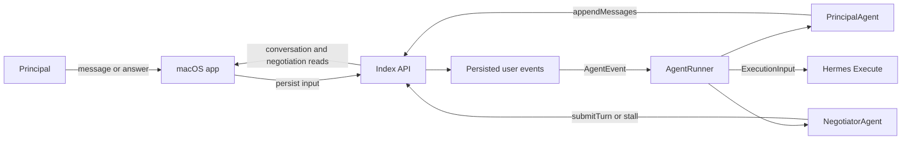
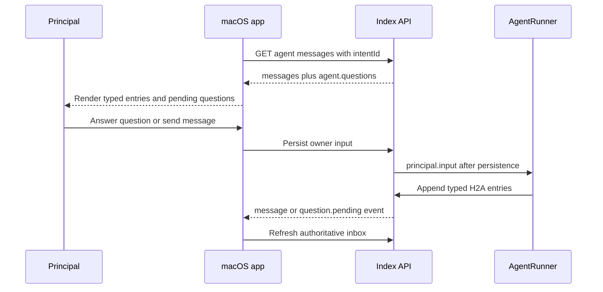
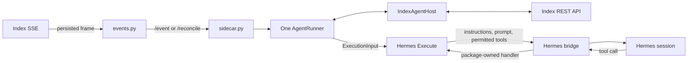

# macOS and Hermes migration

- Package architecture, host contracts, and lifecycle wiring: [../README.md](../README.md).

## Domain ownership and target flow

| Owner | Responsibility |
|---|---|
| `@indexnetwork/agent` | Principal and negotiation reasoning, scheduling, stall holds, reconciliation, context assembly, and tool policy. |
| Index API | Authoritative profiles, intents, H2A conversations, opportunities, negotiations, executor fencing, and hosted event delivery. |
| Hermes plugin | Session-authenticated REST host, SSE transport, process supervision, and native Hermes implementation of `Execute`. |
| macOS app | API client and renderer for persisted H2A/A2A state; no runner, model client, or agent state. |



## Accepted decisions

- Use the API migration as the reference host integration.
- Keep one `AgentRunner` per principal; do not create one runner per intent or opportunity.
- Keep transport, authentication, persistence, and process supervision outside `@indexnetwork/agent`.
- Keep macOS as an API client; do not add `@indexnetwork/agent`, model credentials, or local agent state to the app.
- Replace Hermes's old `NegotiationAgent` path in place; do not add compatibility exports to `@indexnetwork/agent`.
- Preserve Hermes-native model execution through the whole-run `Execute` contract.
- Treat Index H2A conversations and negotiations as authoritative; Hermes session history is model history, not agent state.
- Stop reading old Hermes JSON checkpoints. Leave existing files untouched and inert; do not add a data migration or automatic deletion.
- Require a successful terminal tool to end a Hermes reasoning run immediately.
- Require the API executor fence on every Hermes H2A write and negotiation turn.
- No database schema or data migration is required.

## API reference migration

### Current behavior

| Concern | Previous `agentv2` integration | Current `@indexnetwork/agent` integration |
|---|---|---|
| Composition | `new HostedAgent(new ModelClient(...))` | `new HostedAgent(createExecute(new OpenRouterClient(...)))` |
| Reasoning entry points | `runWake()` and `runNegotiate()` | One principal-scoped `AgentRunner` |
| Scheduling owner | `HostedAgent` maintained `waking`, `again`, `working`, `stalled`, and `unread` collections | `AgentRunner` owns coalescing, in-flight work, holds, and follow-up principal work |
| Host contract | `HostedIndex implements Index` from `@indexnetwork/client` | `HostedIndex implements AgentHost` from `@indexnetwork/agent` |
| Event handling | API interpreted events and called v2 functions | API converts persisted frames to `AgentEvent`; runner rereads authoritative records |
| Startup recovery | Redis pending-frame replay | Redis replay plus `runner.reconcile()` for active membership, unresolved stalls, and eligible turn-zero work |
| Executor change | Per-run selected-agent checks | `agent.configuration` invalidates the owner binding; the old runner stops before replacement |
| Shutdown | One host abort signal | `stop()` on every principal runner, then transport shutdown |
| Persistence | Conversation-backed v2 briefs/stalls plus host-owned negotiations | Typed conversation entries plus host-owned negotiations; no private fallback |

### Reference files

| File | Reusable pattern |
|---|---|
| `services/api/src/lib/agent/hosted.agent.ts` | Keep transport and principal routing thin; create, reconcile, handle, and stop runners. |
| `services/api/src/lib/agent/hosted.index.ts` | Convert infrastructure records into `AgentHost` records and enforce current authorization on writes. |
| `services/api/src/main.ts` | Construct the host-supplied `Execute` implementation and inject it into the runtime. |
| `packages/agent/src/runner/agent.runner.ts` | Own all scheduling policy; integrations must not duplicate it. |
| `packages/agent/src/runner/agent.host.ts` | Authoritative host read/write contract. |
| `packages/agent/src/agents/shared/reasoning/reasoning.execution.ts` | Whole-run native execution contract for Hermes. |

### Preserved invariants

- Persist a source change before forwarding its event.
- Read profile, intent, conversation, negotiation, and protocol permissions again for each run.
- Publish a brief and decision before scheduling the negotiation they authorize.
- Submit a turn with the observed `expectedTurnCount`.
- Reject failed or unauthorized reads and writes; do not replace them with empty records or local success.
- Let `handle()` return after scheduling; event delivery does not imply reasoning completion.
- Keep transport replay and acknowledgment guarantees outside the runner.
- Keep private H2A evidence out of A2A messages.

## macOS migration

### Current boundary

- `apps/mac` imports neither `agentv2` nor `@indexnetwork/agent`.
- `apps/mac/api/client.mjs` reads hosted and external-agent state through the same API routes.
- `apps/mac/src/ui/mainview/core.jsx` reads pending questions from `response.agent.questions`.
- `apps/mac/src/ui/mainview/core.jsx` currently detects bookkeeping with `Brief: `, `Decision: `, `Progress: `, and `Stall: ` text prefixes.
- The new runner stores bookkeeping in `metadata.principalMessage.kind` and stores unprefixed text.

### Proposed flow



### Required changes

| File | Change |
|---|---|
| `apps/mac/src/ui/mainview/core.jsx` | Classify agent entries by `metadata.principalMessage.kind`; remove prefix parsing and prefix stripping. |
| `apps/mac/src/ui/mainview/conversation.jsx` | No structural change expected; verify its existing note, progress, decision, stall, answered-question, and pending-question presentations receive the typed view models. |
| `apps/mac/api/client.mjs` | No change expected; keep the existing conversation, answer, opportunity, and negotiation routes. |
| `apps/mac/Sources/NativeAPIRequestBridge.swift` | No change expected; verify the existing agent-message and answer allowlist/body validation during integration. |

### Conversation mapping

| `principalMessage.kind` | macOS view model | Visible behavior |
|---|---|---|
| `user` | `user` | Principal-authored chat line. |
| `answer` | `answer-history` | Answer attached to its historical question. |
| `message` | `note` | Principal-agent reply. |
| `question` still in `agent.questions` | Pending question card | Options and custom answer remain actionable. |
| `question` absent from `agent.questions` | `question-history` | Historical, non-actionable question. |
| `brief` | `brief` | Opportunity instruction in the existing bookkeeping presentation. |
| `decision` | `decision` | Standing opportunity decision in the existing decision group. |
| `stall` | `negotiation-log` | Missing-input explanation in the existing negotiation-log group. |
| `progress` | `progress` | Discovery/reach-out progress line. |
| `expire` | omitted | Retires a pending question; never shown as a new agent message. |

### macOS invariants

- Use `agent.questions` as the only pending-question queue.
- Use the question ID returned by the API when submitting an answer.
- Treat stale question answers as ordinary persisted owner messages, matching API behavior.
- Refresh on both `message` and `question.pending`; retain polling as the existing reconnect backstop.
- Keep A2A turns in the negotiation view; do not merge them into the private H2A conversation.
- Do not infer hosted versus Hermes behavior from message text; `agent.status` names the selected runtime.

### macOS acceptance

| Scenario | Expected behavior |
|---|---|
| Hosted principal agent writes a note | Note appears once with no bookkeeping prefix. |
| Hosted principal agent asks a question | One actionable card appears from `agent.questions`. |
| Principal answers one of several questions | Named question leaves the queue; answer stays in history; other cards remain. |
| Principal agent expires a covered question | Card disappears; no withdrawal/expire line appears as chat. |
| Runner writes brief, decision, stall, and progress entries | Each uses its existing bookkeeping presentation rather than an agent-note bubble. |
| Hermes is selected | The same API-backed conversation and question UI works without a macOS code path for Hermes. |
| A2A negotiation advances | Negotiation window shows ordered turns; private brief and principal answers remain private. |

### macOS verification

```bash
bunx eslint --config apps/mac/eslint.config.mjs \
  apps/mac/api/client.mjs \
  apps/mac/src/ui/mainview/core.jsx \
  apps/mac/src/ui/mainview/conversation.jsx

cd apps/mac
./build.sh
```

- Run the API against the disposable local database.
- Exercise the acceptance table once with the hosted runtime and once with Hermes selected.
- Inspect the native request bridge for rejected routes or request-body validation failures.
- Confirm the app contains no `agentv2`, `@indexnetwork/agent`, or model credential reference.

## Hermes migration

### Replaced Hermes behavior

- The old runtime imported `NegotiationAgent`, `NegotiationHost`, `NegotiationUser`, `RunResult`, `Speaker`, `PrincipalState`, and `PrincipalStore`, which the rebuilt package removed.
- It owned one agent and checkpoint store per intent, debounced intent events, and replayed owner input through `/message` or `/answer`.
- Its speaker exposed a fixed tool set and step limits instead of the package-supplied tools and `maxSteps`.
- Local JSON acted as agent state even though the current runner reconstructs state from Index.

### Implemented Hermes flow



### Runtime replacement

| File | Change |
|---|---|
| `packages/hermes-plugin/runtime/src/main.ts` | Replace per-intent `NegotiationAgent` instances with one principal-scoped `AgentRunner`; expose `/event`, `/reconcile`, optional manual `/wake`, `/tool`, and `/shutdown`. |
| `packages/hermes-plugin/runtime/src/client.ts` | Implement `AgentHost` over the existing session-authenticated REST transport. Keep the executor ID on fenced writes. |
| `packages/hermes-plugin/runtime/src/store.ts` | Delete; no replacement checkpoint abstraction. |
| `packages/hermes-plugin/events.py` | Preserve stream order and forward normalized `AgentEvent` values. Remove input replay, intent debounce, and the private reconciliation loop. |
| `packages/hermes-plugin/sidecar.py` | Add `event()` and `reconcile()` control calls; stop passing `INDEX_STATE_DIR`; keep process supervision and explicit manual wake support. |
| `packages/hermes-plugin/speaker.py` | Implement the supplied whole-run execution budget and permitted tools for `wake`, `brief`, and `negotiate`. |
| `packages/hermes-plugin/bridge.py` | No structural change expected; verify its generic `/speak` pass-through and response path preserve the expanded execution payload. |
| `packages/hermes-plugin/README.md` | Replace checkpoint and old-speaker descriptions with the runner, authoritative-host, and native-`Execute` flow. |
| `packages/hermes-plugin/CHANGELOG.md` | Record the breaking runtime replacement and ignored legacy checkpoint files. |
| `packages/hermes-plugin/runtime/dist/negotiator.js` | Rebuild from source; never edit directly. |

### `AgentHost` REST mapping

| `AgentHost` operation | REST operation | Conversion and authority |
|---|---|---|
| `getProfile()` | `GET /api/auth/me` | Map profile fields and treat either `onboarding.profileConfirmedAt` or the legacy `onboarding.completedAt` marker as `profileConfirmed`. |
| `getIntent(intentId)` | `GET /api/intents/:id` | Map `payload` to `statement`; derive `ARCHIVED` from `archivedAt`; reject foreign or missing records. |
| `listIntents()` | `POST /api/intents/list` with `{ limit: 100 }` | Map every lifecycle state; runner selects active intents. |
| `findCounterparties(intentId, query, limit)` | `POST /api/intents/:id/discover` | Pass the package-supplied limit; preserve score and network IDs. |
| `createOpportunities(intentId, picks)` | `POST /api/intents/:id/opportunities` | Return authoritative opportunity IDs. |
| `getConversation(intentId)` | `GET /api/conversations/agent/messages?intentId=` | Return raw oldest-first API messages; do not flatten them into `PrincipalMessage`. |
| `appendMessages(intentId, messages)` | `POST /api/conversations/agent/h2a?executorId=` | Send the exact structured entries and await durable API success. |
| `listNegotiations()` | `GET /api/negotiations?state=open` | Return complete open summaries, including counterparty and turn-count fields. |
| `getNegotiation(opportunityId)` | `GET /api/opportunities/:id/negotiation` | Preserve ordered turns, timestamps, protocol actions, limits, and blocked reason. |
| `submitTurn(opportunityId, turn)` | `POST /api/opportunities/:id/negotiation/turns?executorId=` | Send `expectedTurnCount`; return the authoritative post-write record. |

### Event mapping

| API frame | Runner action |
|---|---|
| `connected` | Await `runner.reconcile()` after the stream is attached. Repeat on reconnect. |
| `principal.input` | `runner.handle({ type: "principal.input", intentId })`; never replay text directly. |
| `intent.created` | Forward the same normalized type and `intentId`. |
| `intent.updated` | Forward the same normalized type and `intentId`. |
| `intent.lifecycle` | Forward the same normalized type and `intentId`; runner rereads status. |
| `negotiation.turn` | Forward `intentId` and `opportunityId`. |
| `agent.configuration` | Re-read the selected executor; stop or replace the sidecar before forwarding later work. |
| `negotiation.changed`, `negotiation.settled`, `opportunity.new`, `question.pending`, `message`, `agent.status` | Ignore for runner scheduling. |

### Event delivery requirements

- Attach the SSE stream before initial reconciliation.
- Use the selected executor ID as the API event consumer so reconnects resume that executor's offset.
- Preserve frame order into the sidecar; do not collapse different event types into one intent wake.
- Let `AgentRunner` coalesce wake work and exclude duplicate in-flight negotiation work.
- Treat `/event` success as accepted scheduling, not completed reasoning.
- Await `/reconcile`; report failure and reconnect rather than claiming recovery.
- Keep `/wake` only for the existing explicit dashboard start action; ordinary events use `/event`.
- Stop the runner before terminating the child process or replacing its executor binding.

### Native `Execute` contract

| Input or behavior | Hermes obligation |
|---|---|
| `instructions` | Supply as the ephemeral system prompt without adding a second negotiation policy. |
| `prompt` | Supply unchanged as the run input. |
| `operation` | Use `wake` and `brief` in the intent's think session; use `negotiate` in the opportunity session. |
| `tools` | Expose only the supplied names; use their supplied descriptions and JSON Schemas; route calls to their package-owned handlers. |
| `maxSteps` | Enforce the package value as model-response steps: 8 for wake, 1 for brief, 3 for negotiate. Verify Hermes iteration semantics before mapping the number. |
| Tool order | Await calls sequentially in returned order. |
| Tool result | Return strings unchanged; JSON-encode other values; use `null` for no value. |
| Invalid tool or arguments | Return tool feedback within the remaining step budget. |
| Handler failure | Return ordinary error feedback; propagate observed cancellation. |
| Successful `terminal: true` tool | End the whole run immediately; skip remaining calls and any later model response. |
| No tool calls | End the run. |
| Model failure | Reject the `Execute` promise; do not fabricate a stall or retry outside Hermes policy. |
| Return value | Resolve `Promise<void>`; package handlers retain the domain result. |

### Native bridge payload

| Field | Source |
|---|---|
| `callId` | One ID per `Execute` invocation. |
| `operation`, `principalId`, `intentId`, `opportunityId` | `ExecutionInput` work metadata. |
| `instructions`, `prompt`, `maxSteps` | `ExecutionInput` reasoning payload. |
| `tools[]` | `name`, `description`, `parameters`, and `terminal` from the permitted tool list. |

- Keep the executable handler map inside the Bun sidecar, keyed by `callId` and tool name.
- Return explicit tool success/error and terminal status across `/tool`; do not infer terminal behavior from a tool name.
- Remove the call map in a `finally` block after success, failure, or cancellation.
- Inspect the installed Hermes runtime before implementation and use its supported immediate-stop primitive for terminal success.
- Block cutover if Hermes cannot stop after a successful terminal tool; continuing would reintroduce unused calls and duplicate-action risk.

### Session and persistence rules

- Reuse `{intentId}:think` for both principal `wake` and one-opportunity `brief` work.
- Reuse `{opportunityId}` for negotiation work.
- Keep think and negotiation transcripts separate.
- Keep Hermes session transcripts for operator visibility and native model continuity only.
- Reconstruct briefs, decisions, stalls, questions, and answers from the Index H2A transcript.
- Reconstruct negotiation authority and turn history from Index on every run.
- Ignore existing `$HERMES_HOME/index-network/negotiator/*.json` checkpoint files.
- Remove `INDEX_STATE_DIR`, `FilePrincipalStore`, delivery markers, and checkpoint flushes from the active runtime.
- Do not delete legacy files automatically.

### Hermes acceptance

| Scenario | Expected behavior |
|---|---|
| Plugin starts while selected | One runner starts, stream attaches, and initial reconciliation completes. |
| Existing unresolved stall | Reconciliation holds it; no duplicate question or turn is emitted. |
| New intent | Principal agent can discover counterparties, create opportunities, publish briefs, and start negotiations. |
| Missing principal fact | Negotiator stalls; principal agent asks through Index H2A; macOS and web show the question. |
| Principal answers | Persisted `principal.input` releases holds and reruns principal reasoning without direct `/answer` replay. |
| Counterpart takes a turn | Only the named negotiation is scheduled from `negotiation.turn`. |
| Intent text or lifecycle changes | Runner rereads current state and skips inactive work. |
| Executor selection changes | Old runner stops; fenced writes from it fail; the replacement starts only for the newly selected executor. |
| Successful `submit_turn` or `stall` | Hermes ends the run without an unused closing model call. |
| Sidecar restarts | Index records plus event replay/reconciliation recover work; no JSON checkpoint is required. |
| Stale turn races | API rejects the old `expectedTurnCount`; runtime reports the failure without inventing success. |

### Hermes verification

```bash
bun run --cwd packages/agent check
bun run --cwd packages/hermes-plugin typecheck:runtime
bun run --cwd packages/hermes-plugin build:runtime
python3 -m compileall -q packages/hermes-plugin
hermes plugins doctor packages/hermes-plugin --ci
bun run check:subtree-parity
```

- Inspect the rebuilt bundle for old export names and `INDEX_STATE_DIR`.
- Run the acceptance table against the disposable local API database.
- Observe one wake, one brief, and one negotiation Hermes session.
- Confirm the terminal-tool run count from Hermes logs.
- Compare the API transcript, macOS UI, and A2A negotiation record after each write.
- Bump `packages/hermes-plugin/package.json`, update its changelog, run `bun run sync:lockfile-versions`, and commit the rebuilt bundle before the PR.

## Cutover order

1. Land the macOS typed-entry mapping; it is independent of the Hermes runtime.
2. Implement and verify the Hermes REST `AgentHost`.
3. Implement Hermes native `Execute`, including exact step and terminal behavior.
4. Replace event routing and sidecar control routes with `AgentEvent` delivery and reconciliation.
5. Delete the old per-intent runtime and checkpoint store in the same change.
6. Rebuild the Hermes runtime bundle and update package documentation/version metadata.
7. Test hosted Index and Hermes through the same API-backed macOS H2A/A2A flows.
8. Remove `packages/agentv2` and remaining references only after API, Hermes, scripts, and documentation no longer depend on it.

## Completion checks

- `rg -n "agentv2|NegotiationAgent|PrincipalStore|PrincipalState|INDEX_STATE_DIR" apps/mac packages/hermes-plugin services/api` reports no active migration dependency.
- `rg -n "Brief: |Decision: |Progress: |Stall: " apps/mac/src` reports no bookkeeping parser.
- Hermes runtime typecheck and bundle build pass.
- macOS build passes.
- Hosted and Hermes runs produce the same persisted H2A and A2A shapes for the same scenario.
- No compatibility export, parallel scheduler, private persistence fallback, database migration, or model credential is added.
