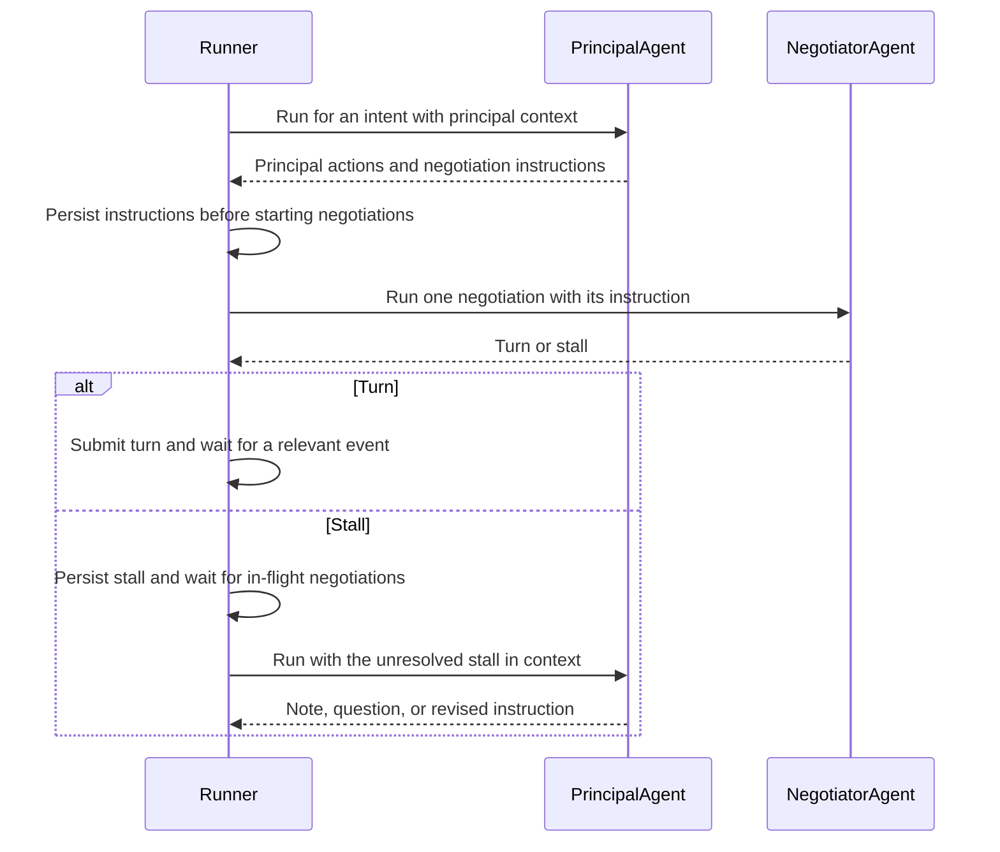
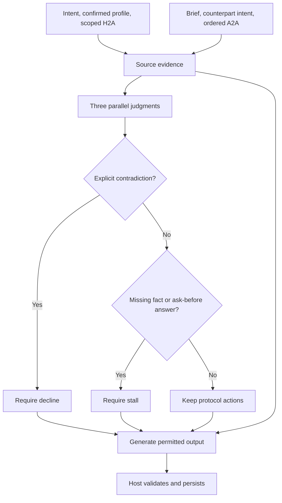
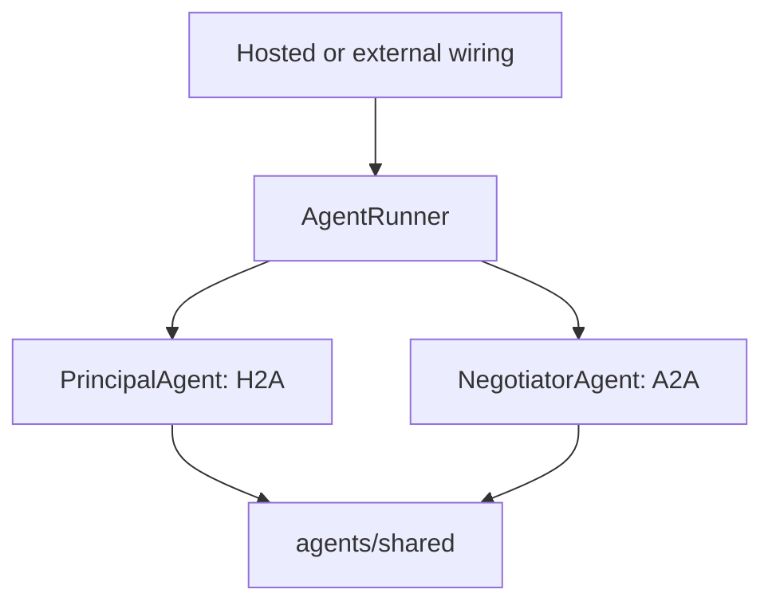

# `@indexnetwork/agent` rewrite plan

## Purpose

Rewrite `@indexnetwork/agentv2` into `@indexnetwork/agent` from the execution entry point down to the model loop. The package-local replacement is implemented without compatibility exports. Integrating it with the API, Hermes, and macOS, then deleting v2 and its references, remains Seref's responsibility outside this package.

This document records the finalized contracts and implemented source architecture. `AgentRunner` coordinates both reasoning layers; host integrations supply events, durable I/O, and reasoning execution. The shared implementation is complete; the external runner-consolidation section describes the migration still to be performed. See [standalone.md](standalone.md) for public-export wiring and host obligations, and [../TODO.md](../TODO.md) for package-local progress.

## Decisions already made

### Intents, never signals

`intent` is the only domain word in the new package.

Use `intent` in:

- public types, function names, parameters, state, and logs;
- prompts and model-tool descriptions;
- comments, errors, and documentation;
- runtime/event routing terminology.

Do not introduce `signal` as a domain alias, compatibility name, or explanatory synonym. The platform `AbortSignal` and `abortSignal` refer only to cancellation. External migration must update callers rather than retain old domain names.

### A seat is not an agent runtime

The existing API uses **seat** in a precise negotiation-protocol sense:

- a negotiation has two seats;
- each seat is the intent-owner side participating in that negotiation;
- a seat has turn authority and sees one side of the negotiation record.

A hosted implementation does not create a different kind of seat. `HostedAgent` is a runtime that acts for its principal's seat; an externally run implementation acts for the same kind of seat. Therefore, do **not** rename `HostedAgent` to `HostedSeat`, and do not call an external runtime an `ExternalSeat`.

In the new agent package, reserve **seat** for protocol-facing language only. Prefer **principal's side** or **intent's side** outside the protocol boundary if the exact protocol term is not needed.

### Hosted and external are deployment modes of the same role

v2's **external negotiator** is misleading. The selected external executor can read the principal's H2A conversation, wake an intent, search/open opportunities, persist questions and notes, and submit A2A turns. It is therefore not merely a negotiator.

Use **hosted agent** and **external agent** for the two execution modes. Both may run the H2A and A2A layers:

| Mode | Meaning |
|---|---|
| **hosted** | Index-operated execution through in-process host operations; the default when no external agent is selected. |
| **external** | Owner-selected execution outside the API process, using Index over HTTP. |

`PrincipalAgent` and `NegotiatorAgent` name reasoning layers, not deployment modes. The existing API class `HostedAgent` combines transport and scheduling; it is not another reasoning agent and must not become a separate implementation of either layer.

## Agent vocabulary by boundary

The rewrite separates owner-facing H2A work from counterpart-facing A2A work. `PrincipalAgent` and `NegotiatorAgent` are two constrained layers of the same agent: they share a principal and an intent, but have different goals, contexts, and counterparties. They must not be treated as separately deployed identities or conflated in names, prompts, or APIs.

### H2A: `PrincipalAgent` work

| Term | Definition | v2 source concept |
|---|---|---|
| **principal** | The person represented by the agent. Use `principal` for the H2A relationship; use `userId` only where an API/database identifier is required. | `user`, `owner`, `principal` |
| **principal agent** | The H2A layer of the agent: face the principal, clarify the intent, and authorize opportunity-level work. | `wake` and `briefIfMissing` |
| **intent run** | One event-driven reasoning pass over one intent. It may do nothing. | `wake` |
| **intent event** | A host-observed change that may cause an intent run. | event/wake trigger |
| **principal conversation** | The H2A conversation for one intent between the principal and `PrincipalAgent`. | `principalConversation` |
| **note** | A `PrincipalAgent` message explaining work it performed or why it needs input. | `note` action |
| **question** | A request for principal input, scoped to an intent or an opportunity. | `ask` action |
| **question retirement** | Removing an unanswered question because its answer can no longer affect work. | `expire` action |
| **opportunity discovery** | Searching for potential counterparties for an intent. | `discover` |
| **opportunity opening** | Creating opportunities from selected discovered counterparties. | `createOpportunities` |
| **negotiation instruction** | The instruction `PrincipalAgent` produces for `NegotiatorAgent` to work one opportunity: a brief and a decision, persisted before execution. | brief + decision |

`wake` is the agreed public intent-work verb: `PrincipalAgent.wake(context)` reasons over fresh context for its bound intent. The host forwards persisted changes through `AgentRunner.handle(event)` and explicit manual reasoning requests through `AgentRunner.wake(intentId)`. Both use the same private wake scheduler; a manual request is not principal input and does not release holds. `PrincipalAgent.brief(context)` handles one missing opportunity instruction without a whole-intent wake.

### A2A: `NegotiatorAgent` work

| Term | Definition | v2 source concept |
|---|---|---|
| **negotiator** | The A2A layer of the same agent: face the counterparty's agent and work one opportunity under the principal layer's instruction. | `negotiate` |
| **negotiation run** | One bounded execution of a negotiator for one opportunity. | `runNegotiate` |
| **initiator** | The seat that originally opened the negotiation. It makes the case for a connection and can never take an `accept` turn, including in later rounds. | `initiatorUserId`; stricter acceptance rule in this rewrite |
| **responder** | The other original seat. Only it can take an `accept` turn, subject to the current protocol permissions and standing instruction. | `responderUserId` |
| **opportunity** | The agent-facing unit of potential connection that has one negotiation record. | `Opportunity` |
| **counterparty** | The person and intent on the other side of an opportunity. | `counterparty` |
| **negotiation instruction** | The brief and decision the negotiator may rely on; its authority comes from `PrincipalAgent`. | brief + decision |
| **brief** | Concise context necessary to represent the principal in this opportunity. It does not repeat the entire principal conversation. | `brief` |
| **decision** | The principal layer's standing directive: `continue`, `accept`, `decline`, or `stop`. | `Decision` |
| **turn** | One A2A protocol action: `propose`, `counter`, `accept`, or `decline`. | `Turn` |
| **stall** | A negotiator result stating that the instruction lacks a necessary fact or authority to take a turn. It may suggest a principal question. | `Stall` |

- The runner supplies the negotiator with this intent's principal conversation and this negotiation's complete turns. Evaluation excludes entries scoped to other opportunities and internal bookkeeping. The negotiator cannot fetch host state, inspect sibling opportunities, discover counterparties, or schedule an intent run.

Initiator and responder are fixed roles within one `NegotiatorAgent` implementation, not separate agent classes. `NegotiateContext.role` is required; replying, countering, or proposing in a later round does not swap it. The runner supplies the original role from the authoritative opening record: before the first turn the awaiting seat is the initiator; afterward the first turn's author identifies it. Never infer the role from the latest turn.

The negotiator supplies role-specific instructions and removes `accept` from the initiator's model-visible actions and tool schema. Its turn handler also rejects actions outside that filtered set, so a direct or native executor cannot bypass the restriction by calling the handler with an invalid action. A principal-layer decision named `accept` remains an instruction, not permission for an initiator to take an A2A `accept` turn.

This deliberately tightens v2's behavior: the current protocol permits either seat to accept the other seat's latest proposal. Package-local enforcement is not network-wide enforcement. Seref owns aligning the protocol/API permission calculation and final turn validation; those implementations are outside this rewrite's package-local scope.

## Responsibility and execution

The responsibility hierarchy is **runner → principal agent → negotiator**. The principal layer supplies authority through its instruction; the runner owns scheduling and calls both layers. Neither agent calls or imports the runner, and the principal agent does not invoke the negotiator itself.



A counterparty turn can go straight from the runner to the negotiator when an instruction already stands. If none exists, the runner first requests a one-opportunity brief from the principal layer; that is not a full intent run. A returned stall is data, not a callback asking the runner to wake the principal layer.

The diagram shows logical ordering, not a requirement to wait for an entire principal run: v2 can start a negotiation as soon as that opportunity's instruction has been persisted. The two layers share their principal and intent, but the negotiator never receives the raw H2A transcript.

## Implemented rewrite layers

1. **Public contracts:** `wake` names intent work; `PrincipalAgent` and `NegotiatorAgent` are reasoning layers of the same identity. The package root explicitly exports the runner, agents, execution, and host contracts.
2. **Runner:** `src/runner/` owns normalized-event routing, coalescing, in-flight work, holds, reconciliation, fresh context loading, and read → reason → persist ordering. `agent.runner.ts` retains scheduling while focused peer modules handle execution, context assembly, conversation encoding, and the host contract.
3. **Host boundary:** `AgentHost` supplies only the consumed domain operations, including authoritative reads, conversation publication, discovery/opportunity opening, and optimistic turn submission. Host implementations do not reproduce the runner's orchestration.
4. **Principal reasoning:** `PrincipalAgent.wake()` handles one intent with fresh context; `brief()` supplies one missing opportunity instruction. Empty results are valid. Intra-run instruction updates use local opportunity copies so publication failure does not leave unpersisted instructions on caller-owned snapshots.
5. **Negotiation reasoning:** `NegotiatorAgent.negotiate()` evaluates scoped principal evidence and negotiation history through TypeSafe, then generates a permitted turn or stall from the same evidence under its instruction and fixed role. Only the original responder may accept.
6. **Shared execution:** the whole-run `Execute` boundary accepts agent-prepared instructions, prompts, and tools. `createExecute(model)` implements the direct loop; `OpenRouterClient` supplies configured model access. Native Hermes execution must implement the same boundary externally, not a single-completion imitation.
7. **Package delivery:** build/typecheck scripts emit ESM JavaScript and NodeNext-compatible declarations. [standalone.md](standalone.md) demonstrates lifecycle wiring through public exports without another scheduler or a bundled host implementation.

### Remaining integration work — Seref

- Reduce `HostedAgent` to API-specific wiring around `AgentRunner`.
- Migrate Hermes's older `@indexnetwork/agent` integration and rebuild its shipped runtime bundle; it does not currently call v2's standalone runner. Preserve native reasoning execution and explicitly decide how its local checkpoints are handled.
- Preserve API conversation/question delivery to macOS; it does not embed the runner.
- Align protocol/API validation with the original-responder-only acceptance rule.
- Update external-agent vocabulary, API build scripts, and dependencies; replace legacy imports rather than restoring compatibility exports.
- Delete `packages/agentv2` and its references only after the replacement is active. These integration and deletion tasks are not package-local TODOs.

## Scope boundaries

- Changes in this work are confined to `packages/agent`; no service, protocol, plugin, macOS, or v2 migration is claimed complete.
- This rewrite does not change the negotiation protocol's two-seat model.
- This package intentionally restricts `accept` to the original responder. It does not modify Index's protocol/API implementation; matching host enforcement belongs to Seref.
- This rewrite does not add periodic polling or clock-driven work.
- This rewrite does not add tests unless explicitly requested, consistent with repository policy.
- Standing briefs, decisions, and stalls retain v2's prefixed principal-conversation message representation; the host owns durable storage.

## Finalized package contracts

| Boundary | Contract |
|---|---|
| Runner lifetime | `new AgentRunner({ host, execute, decisions, now?, log?, onError? })`, scoped to one principal and performing no construction-time I/O. |
| Notifications | `handle(event): void` schedules/coalesces notifications referencing persisted records; it does not promise work completion or durable queuing. |
| Manual reasoning | `wake(intentId): void` requests a normal coalesced H2A wake without saving input, answering questions, or releasing holds. |
| Recovery | `reconcile(): Promise<void>` adopts/refreshes active membership and schedules eligible turn-zero work; its promise does not drain reasoning. |
| Shutdown | `stop(): void` permanently requests cooperative cancellation and drops pending work; no restart, drain, or rollback. |
| Principal reasoning | One `PrincipalAgent` instance per intent; fresh `profile`, `intent`, `conversation`, and `opportunities` on each `wake`, or one `opportunity` for `brief`. |
| Negotiation reasoning | `NegotiatorAgent.negotiate()` receives `profile`, `intent`, `conversation`, `brief`, ordered `turns`, fixed `role`, and one `opportunity`; uses the required `decisions` dependency to restrict the generated turn or stall. |
| Execution | `Execute` runs one bounded reasoning/tool loop and returns `Promise<void>`; tools collect domain outputs. Limits are 8/1/3 for wake/brief/negotiate. |
| Persistence | Durable host-owned conversations and negotiations, with v2's instruction/stall encoding. Memory is scheduling state, never a storage fallback. |


## Source architecture

`runner/` and `agents/` are the two top-level categories: execution coordination and reasoning. The runner belongs in the package; transport subscriptions and process startup belong in the host. Principal reasoning has its own capability directory, while the smaller negotiator remains a peer file and genuinely shared mechanics stay under `agents/shared/`.

### Implemented file tree

Generated `dist/` output is omitted.

```text
packages/agent/
├── TODO.md
├── docs/
│   ├── rewrite-plan.md
│   └── standalone.md
├── package.json
├── tsconfig.json
├── tsconfig.build.json
└── src/
    ├── index.ts
    ├── runner/
    │   ├── agent.runner.ts
    │   ├── agent.execution.ts
    │   ├── agent.host.ts
    │   ├── conversation.codec.ts
    │   └── runner.context.ts
    └── agents/
        ├── negotiator.agent.ts
        ├── negotiator.evaluator.ts
        ├── negotiator.instructions.ts
        ├── principal/
        │   ├── principal.agent.ts
        │   ├── principal.context.ts
        │   ├── principal.discovery.ts
        │   ├── principal.instructions.ts
        │   └── principal.tools.ts
        └── shared/
            ├── agent.context.ts
            ├── openrouter.client.ts
            ├── typesafe.client.ts
            └── reasoning/
                ├── reasoning.execution.ts
                ├── reasoning.instructions.ts
                ├── reasoning.loop.ts
                └── reasoning.tool.ts
```

`agent.runner.ts` remains the exported coordinator and owns process-local scheduling. Its peer runner files separate execution, fresh context assembly, conversation encoding, and host contracts without introducing alternate runners or lower-level barrels. Principal files are grouped by one reasoning capability; shared files still have actual consumers in both agent layers.

| Location | Responsibility |
|---|---|
| `runner/` | Receive events, schedule both agent layers, assemble fresh context, persist or submit results, and decide what runs next. No H2A/A2A reasoning policy or infrastructure implementation. |
| `agents/principal/` | H2A reasoning: face the principal, clarify the intent, ask questions, discover/open opportunities, and produce negotiation instructions. |
| `agents/negotiator.agent.ts` | A2A reasoning: face the other agent, work one negotiation under its instruction, and return a turn or stall. |
| `agents/negotiator.evaluator.ts` | Three independent TypeSafe evidence questions and their code-owned continue/decline/stall decision. |
| `agents/negotiator.instructions.ts` | Negotiation writing policy and fixed-role guidance within the evaluated permissions. |
| `agents/shared/` | Contracts and mechanics genuinely shared by the two reasoning layers. Keep domain contracts distinct from model utilities, including configured OpenRouter access. No runner policy, persistence, or host event subscriptions. |

### Inputs are not automatically state

Principal, intent, opportunity, and negotiation snapshots are inputs read from the host. They do not require a `*.state.ts` file simply because an agent consumes them. Each agent owns its input/output declarations; genuinely cross-agent records live in `agents/shared/agent.context.ts`. Actual scheduling state belongs to the runner. Standing instructions and stalls are reconstructed from the host's persisted conversation on each read, not kept in a separate store.

### Direct reasoning execution

- Generative execution uses `Execute`; negotiation evidence evaluation uses the required `decisions: Pick<TypeSafeClient, "evaluate">` dependency. Both are configured by the host and receive runner cancellation.

- `createExecute(model)` in `agents/shared/reasoning/reasoning.loop.ts` implements the whole-run `Execute` contract. The host supplies configured model access; agents and runner use `Execute` for generative runs. The direct loop and its `Model`, `ModelMessage`, `ToolCall`, and `ToolDefinition` contracts are exported through `src/index.ts`. Hermes supplies the whole-run contract outside this package.

`OpenRouterClient` in `agents/shared/openrouter.client.ts` implements `Model` and is exported alongside `OpenRouterClientOptions`. The host composes direct execution with `createExecute(new OpenRouterClient({ apiKey }))`. The API key is required explicitly; the client neither reads environment variables nor performs I/O during construction. Optional `models` replaces v2's ordered defaults (`google/gemini-3.7-flash`, `google/gemini-3.8-flash`, `anthropic/claude-haiku-4.5`) with one to three nonblank IDs. Optional `timeout` replaces the default 120,000-millisecond per-request deadline, which covers reading the response body and is combined with runner cancellation.

Requests use OpenRouter's chat-completions endpoint and require tool-capable provider routing when tools are present. The client preserves assistant text/tool calls and rejects network failures, HTTP errors, provider errors embedded in successful responses, invalid JSON, and missing messages. It does not retry; ordered model/provider failover remains OpenRouter's responsibility. Direct execution sends the agent-prepared context to OpenRouter and its selected providers using the host's billed API credential.

Every invocation owns a temporary transcript initialized with the agent-prepared `instructions` and `prompt`, passed through unchanged. Identity/operation metadata stays out of that transcript. Only tool definitions go to the model; handlers run locally, sequentially in the returned order, and are awaited before the next call. Independent runs can overlap without sharing transcript state.

One step is a model response plus all its requested tool calls. The loop honors the agent's 8/1/3 limits, stops early on a response without calls, and retains outputs recorded by handlers even when the budget ends. Strings pass through as feedback; other results are JSON-serialized, with null for no value. Empty argument text becomes `{}`, as in v2. Unknown tools, invalid JSON, and ordinary handler errors become tool feedback within the remaining budget; there is no automatic retry or schema validator.

Cancellation is checked before and after model/tool calls, and the model receives the same `abortSignal`. Observed cancellation rejects instead of becoming tool-error feedback, even when an awaited operation finishes without honoring cancellation. Model failures reject unchanged. Already-started effects are not rolled back, and execution does not promise interruption of a handler that is still running.

### Negotiation evidence evaluation

- **Implemented owner:** `agents/negotiator.evaluator.ts` asks three independent Choice questions in one `TypeSafeClient.evaluate()` request: principal facts supported by source evidence, explicit requirement contradictions, and unresolved applicable ask-before boundaries.
- **Inputs:** current intent, confirmed profile fields, intent-scoped H2A conversation, brief, counterparty intent, and all negotiation turns labeled `our_agent` or `counterparty_agent`. H2A entries retain their kinds, chronological order, and explicit `principal` or `principal_agent` speakers; entries scoped to other opportunities and brief/decision/stall/progress bookkeeping are excluded. Unconfirmed profile fields are omitted.
- **Source authority:** explicit principal words and confirmed profile facts can support an answer omitted from the brief. Later principal answers supersede stale summaries or profile details. Agent questions, summaries, earlier A2A claims, and counterpart assertions cannot establish principal facts or grant permission. Applicable boundaries remain in force when omitted from the brief; explicit principal answers can resolve them without a refreshed brief.
- **Decision:** use each Choice's selected label; retain its probabilities and confidence in the generation prompt. A known mismatch can be declined despite other missing input. Passing the checks does not establish counterpart fit.
- **Authority:** intersect the evaluated permission with the host's protocol actions, the standing decision, and responder-only acceptance. A required decline forbidden by the standing instruction rejects the run. Both the exposed tools and their handlers enforce the restriction.
- **Generation:** the existing `Execute` run receives the same scoped evidence as Jev and writes the required decline or stall explanation; after a continue result it chooses among the remaining protocol actions and may still identify a reason to stall. Private conversation and brief text are not disclosed to the counterpart. The 3-step generative budget is unchanged; evaluation is one preceding request.
- **Failure and persistence:** evaluation failure or cancellation rejects before generation. It is never persisted as a domain stall. Existing conversation and turn writes remain authoritative; no schema or stored metadata changes.
- **Breaking inputs:** hosts must supply `decisions` to `AgentRunner` and standalone `NegotiatorAgent`; direct `negotiate()` callers also supply `conversation` and speaker-labeled `turns`. The runner uses its existing reads. The TUI supplies `TypeSafeClient` from `TYPESAFE_API_KEY`; native executors use the same evidence and permitted tools.



| Scenario | Required behavior |
|---|---|
| Principal role or preference omitted from brief but explicit in source evidence | Retain protocol actions; the writer can answer from the same evidence. |
| Principal role or preference absent, partially answered, or only claimed by an agent | Offer only `stall`; generate the specific missing question. |
| Applicable ask-before instruction unresolved | Offer only `stall`; exploratory language cannot bypass it. |
| Boundary omitted from brief or supposedly resolved only by an agent | Offer only `stall` until explicit principal evidence resolves it. |
| Principal explicitly answers an applicable boundary; brief remains stale | Treat that boundary as resolved. |
| Explicit mismatch, including alongside another unknown | Offer only `submit_turn` with `decline`, subject to existing authority. |
| Counterpart mismatch in an earlier turn | Retain it unless a later explicit correction supersedes it. |
| No contradiction and principal facts/authority sufficient | Retain protocol-permitted actions; never expose `accept` to the initiator. |
| TypeSafe failure or observed cancellation | Reject without calling generative execution or publishing a stall. |

### Context reconstruction

The read path stays private to the runner subsystem in `runner/runner.context.ts`; it does not add public context-loading APIs.

- Shared intent reads load the current profile, intent, and conversation. Message text comes from text parts, while `metadata.principalMessage` supplies kinds, question fields, and the first opportunity reference.
- Agent-authored `Brief: `, `Decision: `, and `Stall: ` prefixes retain their exact meaning. The latest brief or stall replaces that field; a valid decision clears the old stall and answered marker. Principal input marks the applicable existing opportunity contexts answered but does not clear a stall. The stored `\n\nTo ask: ` suffix stays in the reconstructed stall reason.
- Wake context includes this intent's current opportunity records and standing context. A single-negotiation read instead retains one `BriefContext` and its authoritative `NegotiationDetail`, so orchestration can brief missing instructions and submit against the observed turn count without loading sibling opportunities. Both reads retain a separate private publication context containing authoritative match references and historical question text; these maps are not part of either agent's reasoning inputs.
- Preparing `NegotiateContext` carries profile, intent, conversation, brief, fixed role, one opportunity, and all A2A turns with agent authorship. It intersects host actions with the standing decision and responder-only acceptance rule. Evaluation filters the conversation before sending the same source evidence to Jev and generative execution; raw host records remain private to the runner.

Known inactive or ineligible work yields no executable context; rejected host reads still reject. Missing instructions or an empty permission intersection do not become fabricated stalls. These loaders do not invoke agents, schedule work, or persist anything. Public event routing, reconciliation, principal-wake and single-negotiation orchestration, and their connected scheduling loops are implemented below. Reconciliation retains active intent IDs, never context snapshots or cached authorization.

### Output publication

Private runner helpers convert principal actions and negotiator stalls into `PrincipalMessage` records and await the host's `appendMessages` operation. They do not start agent work, schedule negotiations, or submit A2A turns.

- Action batches retain their supplied order. Each message gets a UUID and an ISO timestamp at publication time, independent of the optional prompt clock. An empty batch does not call the host.
- Briefs and decisions use `kind: "message"` with the existing prefixes and opportunity references. Notes remain unscoped messages. Questions use their new message ID as `questionId`, retain their options, and translate opportunity scope back to wire scope `match`.
- Retirement writes a new `expire` entry referencing the original question ID. Its text is `Withdrawn: ` plus the recorded question text, or `a question that no longer matters.` when unavailable. It is not an answer.
- Stalls use `Stall: ` plus the reason and, when present, `\n\nTo ask: ` plus the suggested question. Counterparty references preserve the host's user ID and nullable name rather than the model-facing display label.

Publication uses the existing read context without additional host reads. Writes must finish before the helper resolves, and failures reject without retries or memory fallback. The helpers persist exactly the actions supplied: principal-wake orchestration publishes incremental instructions through `onBrief` before handing their negotiations to scheduling, then publishes only the remaining wake actions rather than writing those instructions again.

### Reconciliation

Public `reconcile(): Promise<void>` performs host-triggered startup or reconnection synchronization. Construction still performs no I/O, and the package does not subscribe, poll, or start a second scheduler.

- First refresh membership through `listIntents`, retaining only `ACTIVE` intent IDs. The first membership refresh adopts existing intents without blanket wakes, including when the list is empty. Later refreshes remove absent/inactive IDs and request normal coalesced wakes only for newly active IDs.
- Normal wake reads keep this membership current when live events reveal activation or inactivity. A read whose membership snapshot changed while it was in flight is revalidated against the host before applying it. Every confirmed wake observation replaces the ID set, even if unchanged, so an older list can detect it. This prevents stale reads in either direction from suppressing a later resumption; read failures still reject rather than being retried.
- After membership refresh, read `getProfile` and `listNegotiations` in parallel. Recover only known-active, turn-zero negotiations awaiting the principal through `scheduleNegotiation`. That path retains holds and in-flight exclusion, re-reads current eligibility and permissions, and briefs missing instructions. Later-turn recovery and replay of other missed events remain host responsibilities.
- Overlapping explicit calls serialize their reads and membership updates. Each caller resolves after its refresh and recovery scheduling, not after the scheduled reasoning finishes. A failed call rejects its caller without blocking a later explicitly requested call; there is no automatic failure retry.
- Preserve v2's two phases, not an atomic transaction: membership updates and newly-active wakes may already have taken effect when later recovery reads fail. Those effects are not rolled back. Reconciliation's own read failures reject its promise; failures in the background work it schedules use `onError`.
- After `stop()`, new calls reject without reads. Queued calls check cancellation before starting, and active refreshes check after reads and before scheduling. Already-started host I/O may finish, and completed effects are not undone.

### Event routing

Public `handle(event: AgentEvent): void` accepts notifications about information the principal-scoped host has already persisted. Events carry routing IDs, not conversation snapshots or lifecycle status. The method schedules or coalesces work and returns without waiting for reasoning or publication; returning is not a promise of completion or durable queuing. Background failures use the configured `onError`.

| Notification | Runner behavior |
|---|---|
| `principal.input` | Release existing in-memory negotiation holds for this intent, then request a normal coalesced wake. Do not erase persisted stalls or instructions, affect another intent's holds, or immediately retry every released negotiation. |
| `intent.created`, `intent.updated` | Request a normal coalesced wake using fresh persisted context. The host must filter metadata-only updates before forwarding `intent.updated`. |
| `intent.lifecycle` | Use the same wake path and read current status through `getIntent`. Only `ACTIVE` intents reach reasoning; paused, archived, and other inactive records skip it. |
| `negotiation.turn` | Schedule only the affected negotiation using its standing instruction and current permissions. A new stall may subsequently request principal work through normal aggregation. |

Lifecycle notifications do not abort already-running reasoning. Eligibility still comes from fresh host records, not reconciliation's ID-only membership; no semantic-change classifier is introduced. After `stop()`, all notifications are ignored before reads, scheduling, or hold release. The host owns event subscriptions and normalization and calls `reconcile()` for startup and reconnection recovery.

### Wake scheduling

Private `scheduleWake(intentId): void` starts background wake execution without waiting for reasoning or publication. It uses two intent-ID sets, one for active wakes and one for pending follow-ups; it does not cache context or own event subscriptions.

- Mark an intent active before invoking `runWake`, including before its first host reads. Starting the wake consumes that intent's pending principal-work markers, not its holds or conversation records. Any further requests while that wake is reading, reasoning, or publishing set one pending follow-up rather than interrupting it; merely queuing a follow-up does not consume the markers.
- Release the active slot when the run settles, then consume the pending request. Each follow-up uses the normal fresh-read path and skips reasoning if the intent is no longer active. Requests during a follow-up can likewise coalesce into its next wake. Different intents run independently.
- Report wake rejections through the configured `onError`, including cancellation as in v2. A failure does not strand the active slot or discard an explicitly pending request; without a pending request, there is no automatic retry.
- `stop()` clears pending wakes and pending principal-work markers and aborts the runner. Subsequent scheduling requests return without reads, and active runs cannot schedule a follow-up after stopping. Active I/O may still finish; stopping neither drains it nor rolls back its effects.

The scheduling entry point remains private. Host notifications enter through `handle`; wakes schedule negotiations directly, and newly stalled negotiations can request coalesced wakes. Host-triggered reconciliation reuses these same scheduling paths.

### Principal-wake execution

Private `runWake(intentId)` reads fresh eligible context and invokes the intent's cached `PrincipalAgent`. Its `onBrief` and `onOpened` callbacks call the runner's `scheduleNegotiation` directly; neither agent imports the runner or adds a second scheduler.

- `onBrief` awaits publication of each instruction batch before scheduling non-`stop` decisions. It does not wait for negotiation completion, so A2A work can overlap the rest of the principal wake.
- `onOpened` immediately hands off the opportunity IDs returned by the host without a decision. Each negotiation gets its own fresh read and missing-instruction briefing; new opportunities are not added to the already-running wake's inputs.
- After successful reasoning, publish only notes, questions, and retirements, in their collected order. Briefs and decisions were already published incrementally and are not appended again. Empty action lists are valid silence and make no write.
- Inactive intents skip reasoning. Read, execution, and publication failures reject; failed instruction publication prevents handoff of that batch and final publication, without rolling back earlier successful effects. Check cancellation around asynchronous phases, before publication, and before each handoff; already-started writes may finish.

The private execution path does not add a public wake method; construction still starts no work.

### Negotiation scheduling

Private `scheduleNegotiation(intentId, opportunityId, decision?)` coordinates one opportunity through the existing execution path. The optional decision controls hold release, not protocol permission; fresh host reads and the persisted instruction still determine whether and how the agent can act.

- Mark the opportunity in flight before any reads and retain its intent ID for completion bookkeeping. As in v2, duplicate requests while it is in flight are dropped, not queued for another turn. Different opportunities may overlap, even within the same intent.
- A successfully published stall holds the opportunity and marks it as needing principal work. An empty briefing creates the same transient scheduling hold and wake request without persisting a stall or invented instruction. Skips and execution/host failures create neither.
- A held negotiation ignores ordinary requests and `continue` decisions. An `accept` or `decline` scheduling decision releases its hold, subject to the execution path's current permissions. Successful turn submission clears that opportunity's hold and pending principal-work marker. A `principal.input` notification also releases existing holds for its intent without deleting persisted records or directly starting every negotiation.
- When any negotiation finishes, release its in-flight slot. Once that intent has no negotiations in flight, request a coalesced principal wake if newly pending principal work remains. Other intents do not delay it. Starting a wake consumes the markers but keeps holds and persisted history, so an already-covered stall alone does not cause repeated wakes.
- Background failures reach `onError` without retries or fabricated stalls. Completion after `stop()` releases active bookkeeping but cannot register new pending work or trigger a wake; already-started writes may finish.

### Single-negotiation execution

Private `runNegotiation(intentId, opportunityId)` connects the read, reasoning, and publication helpers; its scheduler controls when it executes.

- Read fresh eligible context and skip a standing `stop` decision, even if its brief is missing. Reuse one lazily created `PrincipalAgent` per intent; the instance retains identity and dependencies, not old context.
- If the brief or decision is missing, call `PrincipalAgent.brief()` for this opportunity only. Await publication before applying the returned instruction to local context or starting A2A reasoning; publication failure cannot authorize a turn.
- Empty briefing output returns a private `unbriefed` result. This is distinct from an ineligible skip and from a negotiator's persisted stall. The scheduler holds it and requests principal work when that intent's negotiations finish, without publishing a stall.
- Prepare the fixed-role, standing-decision, and protocol-filtered context, then invoke `NegotiatorAgent`. Await turn submission with the original observed `turnCount`, or await stall publication, before returning the result.
- Read, execution, publication, and submission failures reject unchanged; they do not trigger retries or become stalls. Cancellation is checked around asynchronous phases and supplied to both agents. Already-started writes may finish after `stop()`; there is no rollback or draining promise.

This method executes one selected negotiation and returns its outcome; the scheduling loop above owns in-flight exclusion, holds, and the decision to request principal work.

### In-memory execution by default

`AgentRunner` uses in-memory scheduling state. Redis, a database, or a filesystem is not required merely to coordinate agent work. Keep that bookkeeping private in `agent.runner.ts`; a few maps/sets do not warrant their own state hierarchy or storage abstraction.

| Concern | Ownership and lifetime |
|---|---|
| Known active intent IDs and initial adoption | Runner memory for reconciliation deltas, not a context or permissions cache. |
| Active intent runs and coalesced follow-up requests | Runner memory, per instance. |
| In-flight negotiations and bookkeeping for newly observed stalls | Runner memory, per instance; not the authoritative stall record. |
| Cancellation and temporary reasoning context | Memory for the bounded run; the execution implementation owns its temporary context. |
| Principal conversation, questions, standing instructions, and persisted stalls | Durable host records in real integrations. |
| Negotiation turns, outcomes, and authority to act | Index's authoritative records. |

In-memory execution does not mean silently replacing host storage. Persist an instruction before negotiating from it and publish questions/turns through the host so the macOS app and other clients can see them. A host failure must not fall back to a private in-memory copy that reports success.

Use one scheduling implementation for API, Hermes, and standalone wiring—not `InMemoryRunner`, `RedisRunner`, or hosted/external subclasses. Hermes-native sessions and existing local checkpoints are separate from runner bookkeeping; choosing this default does not make them disposable without an explicit migration decision.

The memory is process-local and disappears on shutdown. On restart, the host must reconcile persisted instructions, questions, negotiations, and available events and feed outstanding work back to the runner. Maps do not provide durable queued work or mutual exclusion across API replicas; any cross-process ownership/delivery guarantee belongs at the host boundary.

### Standalone documentation example

[standalone.md](standalone.md) shows public-export wiring for a supplied `AgentHost`, direct or native reasoning execution, event delivery, reconciliation, and cooperative shutdown. It includes no separate scheduler, fabricated Index client, or new package lifecycle API. The transport must handle startup failures, reconnection promises, unsubscription, and missed-event delivery; stopping does not imply draining active I/O.

The guide deliberately requires real host operations. An explicit in-memory host could simulate them for a sandbox, but it would not publish real negotiations or update the macOS app. No sandbox implementation or production storage fallback has been added.

### Dependency direction



- The runner imports agent operations and consumes their outputs. Returning a result is not a reverse dependency.
- Neither agent imports the runner or the other agent. The instruction is how authority crosses the reasoning layers.
- `agents/shared/` imports neither agent nor the runner.
- Host implementations provide domain I/O and authorization without implementing their own scheduling policy. Redis and Index/API HTTP clients stay outside this package; the configured OpenRouter model client is the explicit shared-execution exception.
- Root `src/index.ts` is the public export boundary. Do not add lower-level barrels or inheritance hierarchies without a concrete need.

## Runner consolidation: external migration

The shared runner is implemented. This section retains the integration analysis and responsibilities for Seref; it does not claim the external consumers have been migrated.

### Existing duplication

The comparison is between `packages/agentv2/runner/runner.ts` and `services/api/src/lib/agent/hosted.agent.ts`.

| Scheduling concern | Standalone runner | API `HostedAgent` |
|---|---|---|
| One intent run plus a coalesced follow-up | `startWake`, `waking`, `again` | `wake`, `waking`, `again` |
| One in-flight negotiation per opportunity | `startNegotiate`, `working` | `negotiate`, `working` |
| Hold stalled negotiations; release after principal input or accept/decline | `stalled` and event routing | `stalled` and `dispatch` |
| Gather newly unread stalls until negotiation work finishes | `takeTurn`, `unread`, `finish` | `takeTurn`, `unread`, `finish` |
| Run the reasoning and persist its effects | Shared v2 `runWake` / `runNegotiate` wrappers | The same wrappers |

The transport differs, but the scheduling rules do not need separate implementations. There are also differences to reconcile rather than blindly copy: the standalone runner adopts intents and recovers turn-zero work on connection, while the hosted runner loads intent eligibility per run and pre-checks settled/not-our-turn negotiations.

### One runner, supplied with events and host operations

The scheduling policy now lives in `runner/agent.runner.ts`. Integrations feed normalized intent/negotiation events instead of requiring an `Index.events()` method, supply context reads and writes through `AgentHost`, and supply reasoning through `Execute`. These contracts remain beside their consumers. There is no generic event bus, base class, or hosted/external mode flag.

After migration, the integrations use the same in-memory `AgentRunner`:

- **Hosted API:** reads Redis records, identifies the principal, and delivers each relevant event to that principal's runner. It supplies in-process operations using the existing `HostedIndex` boundary and API authorization checks.
- **Hermes:** supplies external events, authenticated HTTP operations, and Hermes-native reasoning execution. Its gateway supervises the process; the new runner owns scheduling instead of retaining a competing scheduler in the plugin.
- **Standalone example:** demonstrates public API wiring for events, host operations, reasoning execution, and shutdown. It is not another production integration or scheduler implementation.
- **macOS app:** remains a client of the API and an optional Hermes setup surface; it does not embed `AgentRunner`.

Today only v2's own `runner/start.ts` calls its standalone `startRunner`. The API uses v2's reasoning wrappers through `HostedAgent`; Hermes ships a bundled copy of the older `@indexnetwork/agent`. These are migration targets, not existing consumers of a common runner.

`HostedIndex.events()` currently always throws because the API consumes Redis directly. That is evidence for separating event delivery from data access, not for adding a fake subscription to make the standalone runner fit.

Use one runner instance per principal per process. The external executable needs one; the API owns a collection keyed by principal ID. An opportunity is shared by its two participants, so one global `working`/`stalled` map keyed only by opportunity ID must not mix their execution. Dispose runners when the hosting lifecycle ends; authorization must still be checked when work executes, not only when a runner is constructed.

### Responsibilities after extraction

| Shared runner | Hosted/API wiring | External wiring |
|---|---|---|
| In-memory event-to-work decisions; coalescing; stall handling; bounded run lifecycle; read → invoke → persist ordering; result routing | Redis discovery/read/ack/reconnect; principal routing; selected-agent and active-intent authorization; in-process I/O; process startup/shutdown | SSE subscription/reconnect; credential/client setup; HTTP I/O; Hermes-native execution where applicable; process startup/shutdown |

Keep context assembly and the execution sequence implemented once. Host implementations should provide infrastructure operations and boundary conversion, not two new copies of `runWake` / `runNegotiate` under different names. `HostedAgent` becomes thin wiring around the runner, not a subclass or an independently implemented scheduler.

### Behaviors to preserve or reconcile explicitly

- Principal input, intent creation, content edits, and resumption request intent work; a counterpart turn normally works only its negotiation.
- A missing instruction is produced by the principal layer's one-opportunity operation before negotiating.
- Persist an instruction before scheduling the negotiation it authorizes. Preserve v2's ability to start it while other principal work is still running.
- A genuine negotiator stall is persisted and routed to principal work after the relevant in-flight negotiations finish. A known stall is not repeatedly re-asked without new input.
- Known settled, inactive, or not-our-turn work is skipped using authoritative records. Denied or failed reads/writes reject through the caller or `onError`; they never become missing-fact stalls.
- Use the expected turn count when submitting a turn; host/protocol validation remains authoritative.
- Connection recovery is an explicit reconciliation step, not a reason to reason over every existing intent. Keep transport reconnect logic outside the runner, but reuse scheduling for recovered work.

### Delivery boundary, not a promise of durable execution

Today `HostedAgent.follow()` dispatches asynchronous work and immediately acknowledges the Redis record; it does not wait for the agent run to finish. Its in-flight and stall maps are process-local. Reusing a runner does not make work crash-safe or serialize one principal across API replicas. Preserve this distinction in the contract, and decide delivery/completion guarantees before changing acknowledgment or retry behavior. This plan does not silently add a queue, distributed locking, or exactly-once claims.

### v2 placement

| Existing area | Destination |
|---|---|
| Duplicated scheduling in both runners | `runner/agent.runner.ts` (`AgentRunner`) |
| Redis following, HTTP event subscription, process entry points | Host-specific wiring outside `@indexnetwork/agent` |
| `brief.ts` and `wake.ts` | `agents/principal/principal.agent.ts` and its focused principal modules |
| `negotiate.ts` | `agents/negotiator.agent.ts` |
| Shared model/tool-loop mechanics | `agents/shared/reasoning/` and `agents/shared/openrouter.client.ts` |
| Monolithic `types.ts` | Agent-owned input/output contracts, with only actual cross-agent contracts extracted |
| `host.ts` execution sequence | Shared runner orchestration with host-supplied I/O, retaining conversation-backed instruction and stall persistence |
