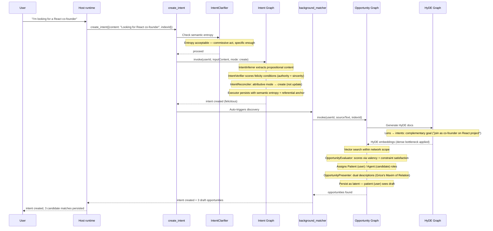
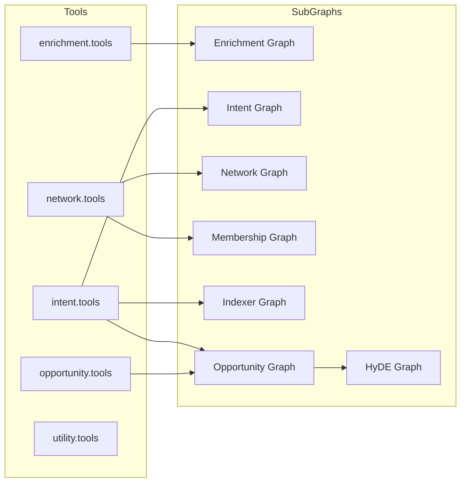

# Index Network Protocol

This package implements the Index Network protocol. Its supported consumer
import is the package root; source directories below are package-private.

`protocol/` contains portable contracts, `platform/` contains host ports only,
`capabilities/` contains named executable behavior, and `internal/` contains all
graphs, prompts, agents, retrieval, and implementation helpers. See
[`../docs/protocol-kernel.md`](../docs/protocol-kernel.md).

## Directory Structure

```
packages/protocol/src/
  protocol/         Stable, framework-free protocol concepts and deterministic rules
  capabilities/     Small host-facing entry points for supported behaviors
  platform/         Host-supplied port contracts, grouped by concern
  internal/         Graphs, prompts, agents, retrieval, tests, and implementation helpers
  index.ts           Curated package API only
```

The existing domain-first implementation tree now lives under `internal/`.
`Intents`, `Networks`, `Contexts`, `Opportunities`, `Agents`, and `Discovery`
are executable capability modules; consumers continue
to import only from the package root. `platform/`
defines TypeScript ports for a host to implement; it contains no adapter,
controller, web, database, queue, cache, or dependency-wiring implementation.
Those belong in the consuming host.

Hosts provide request-context storage with `setRequestContextStore()` and log
output with `setLoggerFactory()`. The package does not implement
`AsyncLocalStorage`, console logging, or any other host runtime adapter.


## Graphs

| Graph | File | Purpose |
|-------|------|---------|
| Intent | `internal/intents/graph/intent.graph.ts` | Clarify, infer, verify felicity conditions, reconcile, and persist intents |
| Opportunity | `internal/opportunities/opportunity.graph.ts` | HyDE-based discovery: search, evaluate (valency), rank, persist |
| HyDE | `internal/discovery/hyde.graph.ts` | Infer search lenses, generate hypothetical documents per lens/corpus, and embed them (cache-aware) |
| Network | `internal/networks/network.graph.ts` | Manage network CRUD |
| Network Membership | `internal/networks/membership.graph.ts` | Manage network member join/leave |
| Intent Indexer | `internal/networks/indexer.graph.ts` | Evaluate and assign/unassign intents to indexes |
| Radar | `internal/opportunities/radar/radar.graph.ts` | Build the radar view: flat presenter-card list, optionally intent-scoped |

## Agents

| Agent | File | Used By |
|-------|------|---------|
| Intent Clarifier | `internal/intents/verification/intent.clarifier.ts` | Intent tools — checks specificity (entropy threshold) before persisting |
| Intent Inferrer | `internal/intents/inference/intent.inferrer.ts` | Intent graph — extracts structured intents from free text |
| Intent Reconciler | `internal/intents/inference/intent.reconciler.ts` | Intent graph — determines create/update/expire action (Donnellan's distinction) |
| Intent Verifier | `internal/intents/verification/intent.verifier.ts` | Intent graph — classifies speech act type; scores felicity conditions and semantic entropy |
| Intent Indexer | `internal/intents/indexing/intent.indexer.ts` | Intent Network graph — scores intent-network fit as relevancy score |
| Network Recommender | `internal/networks/network.recommender.ts` | Network flows — ranks networks against a user's synthesized context |
| HyDE Generator | `internal/discovery/hyde.generator.ts` | HyDE graph — generates a hypothetical match document per lens, in the target corpus voice |
| HyDE Strategies | `internal/discovery/hyde.strategies.ts` | HyDE graph — lens type re-exports and per-corpus prompt templates |
| Lens Inferrer | `internal/discovery/lens.inferrer.ts` | HyDE graph — infers 1–N free-text search lenses targeting the intent corpus |
| Opportunity Evaluator | `internal/opportunities/opportunity.evaluator.ts` | Opportunity graph — scores matches; assigns valency role (Agent/Patient/Peer) |
| Opportunity Presenter | `internal/opportunities/opportunity.presenter.ts` | Home graph, opportunity tools — generates role-appropriate descriptions (Grice's Maxim of Relation) |

## Tools

Tools are registered in `internal/shared/agent/tool.registry.ts` and assembled per session by `internal/shared/agent/tool.factory.ts`.

| File | Tools |
|------|-------|
| `internal/enrichment/enrichment.tools.ts` | `research_profile` |
| `internal/intents/intent.tools.ts` | `read_intents`, `create_intent`, `update_intent`, `delete_intent`, `search_intents`, `create_intent_index`, `read_intent_indexes`, `delete_intent_index` |
| `internal/networks/network.tools.ts` | `read_networks`, `create_network`, `update_network`, `delete_network`, `read_network_memberships`, `create_network_membership`, `delete_network_membership` |
| `internal/opportunities/opportunity.tools.ts` | `list_opportunities`, `update_opportunity` |
| `internal/agents/agent.tools.ts` | `read_own_agent`, `register_agent`, `list_agents`, `update_agent`, `delete_agent`, `grant_agent_permission`, `revoke_agent_permission` |
| `internal/shared/agent/utility.tools.ts` | `scrape_url`¹, `read_docs` |

¹ REST-only: `scrape_url` is omitted from the MCP registry entirely
  (IND-596/597). MCP does not gate on web/CLI onboarding. On the MCP surface,
  agent administration follows the IND-599 split:
  registered agents get `read_own_agent` only; session humans get the owned
  admin tools but never `read_own_agent`; enrollment-capable keys are
  `register_agent`-only; unregistered keys fail closed.

## Core Concepts

The system models human collaboration through a linguistic and information-theoretic framework. Terminology follows Speech Act Theory (Searle), Hypothetical Document Embeddings (Gao et al.), Valency theory (Hanks), and Gricean pragmatics.

| Concept | Description |
|---------|-------------|
| **User** | Session-authenticated identity with many intents and network memberships. Presentation identity lives on `users`; semantic discovery uses intents and user contexts. |
| **Intent** | A **commissive** or **directive speech act** — what the user is seeking or offering. Modelled as a Specific Indefinite: a future state uniquely satisfiable by a matching candidate. Each intent carries a **semantic entropy** score (constraint density), a **referential anchor** (Donnellan referential/attributive mode), and **felicity condition** scores (preparatory/authority and sincerity). |
| **Index** | A community scoped to a purpose. Has members with roles, an optional prompt for LLM-based evaluation, and a join policy. Discovery is network-scoped — opportunities only arise between intents that share an index. |
| **Opportunity** | A **semantic intersection**: the point where a candidate's user context or intent satisfies the propositional content of a source intent. Scored by the Opportunity Evaluator using **valency** (argument-role fit) and **constraint satisfaction**. Presented with dual descriptions per **Grice's Maxim of Relation** — one framed for the source, one for the candidate. |
| **HyDE** | Hypothetical Document Embeddings. Lens-based: the `LensInferrer` derives 1–N free-text **lenses** (search perspectives, e.g. "SF-based early-stage investor"). The live search corpus is intents. The encoder acts as a dense bottleneck filtering hallucinated specifics and retaining the semantic signal. |
| **Felicity Conditions** | Scores evaluating whether an intent is valid: **preparatory condition** (does the user have the authority/skills for this act?) and **sincerity condition** (is the commitment genuine?). Intents that fail these are classified as *misfired* or *void*. |
| **Semantic Entropy** | Constraint density of an intent (0.0 = maximally constrained, 1.0 = trivially satisfiable). High-entropy intents ("I want a job") trigger an **elaboration loop** — a request for missing constraints before persistence. |
| **Semantic Governance** | The full pipeline that ensures only actionable, felicitous, sufficiently clear intents enter the graph. Referential breadth is retained as warning metadata for user-confirmed proposal approvals and explicit updates rather than acting as a universal write prohibition. Web proposal cards are emitted only after the host's injected `IntentProposalStore` durably binds their normalized text, optional network, and complete verifier output to the owner. Implemented by the Intent Verifier and Intent Clarifier agents. |
| **Valency Roles** | Derived from the argument structure of the source intent's goal verb (Hanks). The Opportunity Evaluator assigns: **Agent** (the one who can offer/do), **Patient** (the one who needs/seeks), or **Peer** (symmetric collaboration). These roles govern opportunity visibility and the notification cascade. |

## Opportunity Lifecycle and Role-Based Visibility

The package predicates are `canUserSeeOpportunity` and `isActionableForViewer` in `internal/opportunities/opportunity.utils.ts`; keep their source comments aligned with that reference when either changes.

## How a Tool Call Flows Through the System

A host runtime resolves a tool context and invokes a registered tool; the tool
invokes subgraphs and returns a serialized result.

### Example: "I'm looking for a React co-founder"



### Tool-to-Subgraph Mapping



## Business Logic Flows

### Intent Lifecycle

Handled by the **Intent Graph**:
1. **Clarification** (pre-graph): `IntentClarifier` checks semantic entropy — if the utterance is underspecified (high entropy, trivially satisfiable), it returns an elaboration request rather than persisting.
2. **Inference**: `IntentInferrer` extracts structured intents (propositional content) from free text. Can produce multiple intents from a single input.
3. **Semantic Verification**: `IntentVerifier` classifies the speech act type (commissive, directive, assertive) and scores felicity conditions — preparatory (authority) and sincerity. Assigns `felicitous`, `misfired`, or `void` status.
4. **Reconciliation**: For creation, `IntentReconciler` applies Donnellan's distinction — referential intents (user has a specific target in mind) update an existing record; attributive intents (any member of a class) create a new one if sufficiently different. Explicit updates bypass that create-versus-update choice and bind the single verified candidate to the supplied active owned intent ID.
5. **Persistence**: Executor writes the intent with `semanticEntropy`, `referentialAnchor`, `speechActType`, and `felicityScores` fields.

### HyDE Pipeline

Handled by the **HyDE Graph** and **Enrichment Graph**. The pipeline is **lens-based**: instead of hardcoded strategy names, the `LensInferrer` derives 1–N free-text lenses from the source text (and optional user context), each tagged with a target corpus that selects the generation template:
- **intents corpus**: Generates a complementary goal statement via meaning postulates — "If user A wants to invest, infer B wants funding" (the former *Reciprocal* strategy).
- The former *Neighborhood* (discourse-frame) strategy was retired with the move to lenses; lens labels carry the contextual specificity instead (including location awareness).
- The encoder acts as a **dense bottleneck** — hallucinated specifics (fake names, invented details) are filtered out; only the semantic relevance signal is preserved in the embedding.

### Opportunity Discovery

Handled by the **Opportunity Graph**:
1. **Prep**: Load user's indexed intents and HyDE documents.
2. **Scope**: Determine target indexes (single or all).
3. **Discovery**: HyDE-driven vector search within network scope, against candidate intents.
4. **Evaluation**: `OpportunityEvaluator` scores each candidate pair via **valency** (does the candidate fill the argument slot of the source's goal verb?) and **constraint satisfaction** (does the candidate's constitutive context match all extracted constraints?). Assigns role: Agent, Patient, or Peer.
5. **Presentation**: `OpportunityPresenter` generates two descriptions per Grice's Maxim of Relation — one from the source's frame, one from the candidate's frame.
6. **Persist**: Opportunities created as `latent` with actor roles. Role determines tier-0 visibility (see Opportunity Lifecycle above).

## Key Invariants

- **Network-scoped discovery**: Opportunities only arise between intents sharing an index
- **Specific Indefinites only**: Underspecified (high-entropy) intents do not enter the graph — they trigger elaboration
- **Felicity-gated persistence**: Only intents classified as `felicitous` are persisted as active
- **Dual synthesis**: Each opportunity has descriptions framed for both actors (Grice's Maxim of Relation)
- **Role-based visibility**: the actors on a pairing may read it
- **Encoding bottleneck**: HyDE hallucinations are never stored or shown — only their embeddings are used

## Shared Infrastructure

| File | Purpose |
|------|---------|
| `internal/shared/observability/protocol.logger.ts` | Protocol-layer logging with call-scoped tracing |
| `internal/shared/agent/model.config.ts` | Centralized model and OpenRouter configuration |
| `internal/shared/agent/model-signal.ts` | Abort-signal-aware model invocation helper |
| `internal/shared/agent/tool.runtime.ts` | Per-tool timeout/output-budget runtime and stable error envelopes |
| `internal/shared/assignment/network-assignment.policy.ts` | Threshold-based network-assignment scoring and scope resolution |
| `internal/shared/network/metadata.renderer.ts` | Renders network metadata into prompt context |
| `internal/opportunities/opportunity.presentation.ts` | Pure card text generation for opportunity display |
| `internal/opportunities/opportunity.enricher.ts` | Enrich opportunity records with presentation identity data |
| `internal/opportunities/opportunity.utils.ts` | Lens-corpus → actor-role derivation, opportunity visibility, radar composition helpers |
| `internal/opportunities/opportunity.evidence.ts` | Builds and merges per-candidate opportunity evidence |
| `internal/opportunities/radar/radar.health.ts` | Radar health metrics computation |
| `internal/opportunities/opportunity.labels.ts` | Opportunity status and role label constants |

## Data Model

This package is adapter-free and owns **no** schema — it accesses data only through the
interfaces in `platform/`. The canonical Drizzle schema lives in the backend at
`services/api/src/schemas/database.schema.ts`.

Core tables the protocol interfaces read/write:

- **Identity**: `users` (name/bio/location), `user_socials`
- **Intents & networks**: `intents`, `networks`, `network_members`, `intent_networks`
- **Opportunities & discovery**: `opportunities`, `hyde_documents`, `opportunity_discovery_runs`, `enrichment_tool_runs`, `questions`
- **Agents**: `agents`, `agent_transports`, `agent_permissions`, `apikey`

> Terminology note: "index" and "network" refer to the same concept. The product
> surface says *index*; the current schema and most tool names use **network**
> (`networks`, `network_members`, `intent_networks`).
